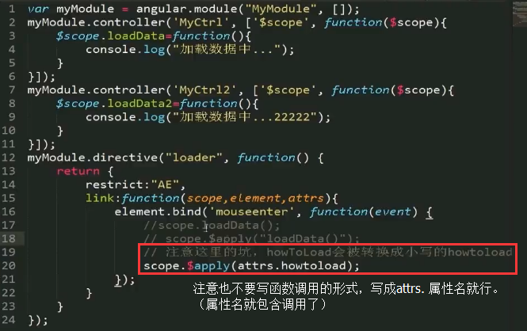
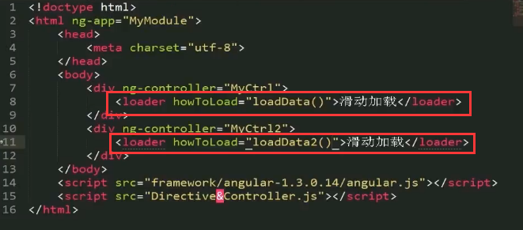
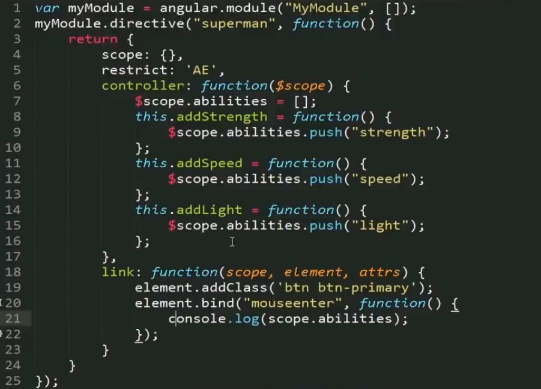
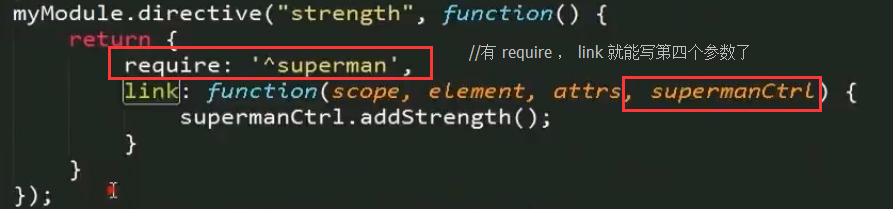
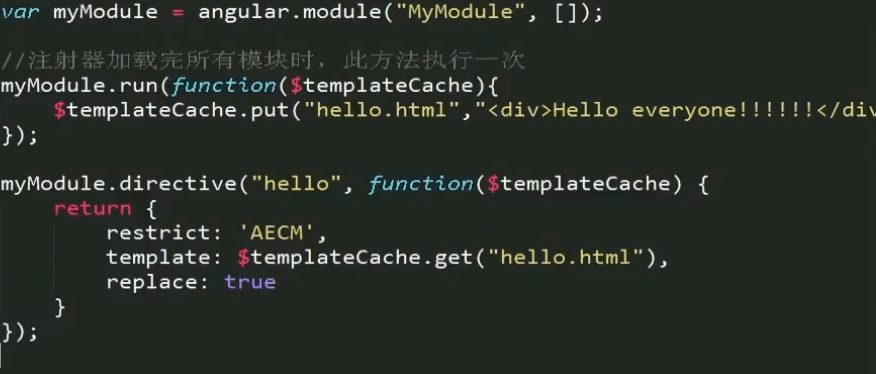

# 2017年


## 4月


### 11日

- 使用cnpm（不造为啥 直接用 npm 切国内淘宝镜像 有时候安装会报错）

```
npm install -g cnpm --registry=http://registry.npm.taobao.org
```

- 管理 node 版本的工具 ，首先安装 n 模块

```
npm install -g n
```

升级 node 到最新的稳定版

```
n stable
```

so easy 也可以跟版本号

```
n v0.10.26
```


 

### 10日

css中的兼容写法不要省略：
栗子：

```css
// 错误的（这种情况在 Ubuntu 的火狐浏览器下不生效，导致样式）
.box{
    box-sizing: border-box;
}


// 正确的
.box{
	-webkit-box-sizing: border-box;
    -moz-box-sizing: border-box;
    box-sizing: border-box;
}
```

- win10 使用技巧
	- 在记事本第一行打 .LOG 代码，会自动记录你的修改时间（然并卵，我用Git）
	- 系统托盘右键，显示“任务视图”按钮 ，任务视图 可以让你创建多个**虚拟桌面**，快捷键 Win + Alt + 左右键 可以快速切换（不过某个应用在 A 桌面打开的时候，在 B 桌面开启这个应用会回到 A 桌面，在不同桌面开不同的应用才是它的真正用途）
	- 在用户账户（通过运行--netplwiz 可以进入）中可以设置无密码登录
	- Alt Prt Scr，没错！就是比你之前的操作多出一个Alt键。这组快捷键可以将屏幕直接导出成图片，再麻烦的事也是一键搞定。（我可能用的假的win10）
	- 看你的win10吗是不是永久激活 win+R 开启运行 输入   slmgr.vbs -dlv  或者  slmgr.vbs -xpr  即可查看你的win10  是不是永久激活的。


### 8日


- 指令使用中的一个小**坑**






- 指令内部的 scope 叫做创建独立的作用域
- 指令内部的 controller 是给指令暴露出一组 public 方法，给外部调用的



- AngularJS 里内置了 Jquerylight 即简化版 Jquery ，是和我们所熟悉的 jquery 语法一模一样的 

- 指令的 controller 和 link 里放什么逻辑？
	- 如果指令 要暴露一些方法给外部调用，就写在 controller 里
	-  如果是用来处理指令内部的事物的（比如给元素绑定事件呀，绑定数据呀），这时候就写在 link 里

- 指令中的 require 表示该指令依赖于哪一个指令（下边的例子表示 strength 这个指令依赖于 superman 指令）



- 有 require 之后我们就可以在 link 函数里写第四个参数 即被依赖指令的 controller 写成 “指令名Ctrl” 的形式。 接下来我们就可以通过 指令名Ctrl.fn 来调用被依赖指令暴露出的方法了。


### 7日

AngularJS 指令（Directive）

自定义指令的配置项

1. restrict (匹配模式)：有 A E M C 四种，推荐使用 A 和 E 这两种模式(以 hello 指令为例)
	- E 作为元素名使用（element）
	- A 作为属性使用（attribute）
	- M 作为注释使用（comment）
		- 做注释的时候要注意 ： directive:hello 前后要各有一个空格，否则angular可能无法解析（这是一个小**坑**）。
	- C 作为类名使用（class）

```html
<hello></hello>
<div hello></div>
<div class="hello"></div>
<!-- directive:hello -->
<div></div>
```


2. template
	- template 可以写模板
	- templateUrl 可以引入独立的HTML文件,其中可以写大块的模板
	- templateCache 可以将模板缓存起来，让多个指令去使用它


3. replace 与 transclude
	- transclude 允许 指令内部嵌套（非常重要，使指令与指令嵌套的基础）


### 6日

- 啥是环境变量？
 
环境变量（environment variables）一般是指在操作系统中用来指定操作系统运行环境的一些参数，如：临时文件夹位置和系统文件夹位置等。

环境变量是在操作系统中一个具有特定名字的对象，它包含了一个或者多个应用程序所将使用到的信息。例如Windows和DOS操作系统中的path环境变量，当要求系统运行一个程序而没有告诉它程序所在的完整路径时，系统除了在当前目录下面寻找此程序外，还应到path中指定的路径去找。用户通过设置环境变量，来更好的运行进程。

- node-uuid 是啥？

- node n 命令是干嘛用的？

n 是管理node版本的 

[管理 node 版本，选择 nvm 还是 n？](http://web.jobbole.com/84249/)


### 5日

HTTP是一个**无状态协议**。

通俗的说就是，服务器因为每天要接待太多客户了，是个**健忘鬼**，你一挂电话，他就把你的东西全忘光了，把你的东西全丢掉了。你第二次还得再告诉服务器一遍。


## 3月


### 28日

- 测试玩


```javascript

// JavaScript把null、undefined、0、NaN和空字符串''视为false

Boolean(-1)
//true

Boolean(0)
//false

Boolean(null)
//false

Boolean(undefined)
//false

Boolean(NaN)
//false

Boolean("")
//false

Boolean('')
//false

typeof(null)
//"object"

typeof(undefined)
//"undefined"

typeof("")
//"string"

typeof(123)
//"number"

typeof(Date)
//"function"

typeof(window)
//"object"

typeof(elememt)
//"undefined"

typeof(qwe)
//"undefined"

typeof(typeof(qwe))
//"string"

typeof(typeof(123))
//"string"

typeof(typeof(NaN))
//"string"

typeof(NaN)
//"number"

0/0
//NaN

0/9
//0

123/0
//Infinity

1/0
//Infinity
```

### 27日

- dotdotdot.js  多行文本溢出解决方案。

```javascript
dot = require('../plugins/jquery.dotdotdot.min');
$('.info-item-desc,.image-list-title,.image-list-desc').dotdotdot({wrap: 'letter'});
```

- 浏览器通知
	- 原生
```javascript
if(window.Notification && Notification.permission !== "denied") {
    Notification.requestPermission(function(status) {
        var n = new Notification('通知标题', { body: '这里是通知内容！' }); 
    });
}
```
	- 插件 [iNotify.js](http://blog.csdn.net/zhanglong_longlong/article/details/52539302)

npm

```
$ npm install title-notify
```

bower

```
$ bower install inotify
```

**init**

```javascript
var iNotify = new iNotify().init()
//推荐下面写法
var iNotify = new iNotify({
    message: '有消息了。',//标题
    effect: 'flash', // flash | scroll 闪烁还是滚动
    //可选播放声音
    audio:{
        //可以使用数组传多种格式的声音文件
        file: ['msg.mp4','msg.mp3','msg.wav']
        //下面也是可以的哦
        //file: 'msg.mp4'
    },
    //标题闪烁，或者滚动速度
    interval: 1000,
    //可选，默认绿底白字的  Favicon
    updateFavicon:{
        // favicon 字体颜色
        textColor: "#fff",
        //背景颜色，设置背景颜色透明，将值设置为“transparent”
        backgroundColor: "#2F9A00" 
    },
    //可选chrome浏览器通知，默认不填写就是下面的内容
    notification:{
        title:"通知！",//设置标题
        icon:"",//设置图标 icon 默认为 Favicon
        body:'您来了一条新消息'//设置消息内容
    }
})
```


### 24日


- Windows 下的 cmd 中查看当前位置下的文件 用 dir  命令。


- const 声明创建一个只读的常量。这不意味着常量指向的值不可变，而是变量标识符的值只能赋值一次。

```javascript
// 注意: 常量在声明的时候可以使用大小写，但通常情况下会使用全部大写英文。 

// 定义常量MY_FAV并赋值7
const MY_FAV = 7;

// 在 Firefox 和 Chrome 这会失败但不会报错(在 Safari这个赋值会成功)
MY_FAV = 20;

// 输出 7
console.log("my favorite number is: " + MY_FAV);

// 尝试重新声明会报错 
const MY_FAV = 20;

//  MY_FAV 保留给上面的常量，这个操作会失败
var MY_FAV = 20; 

// MY_FAV 依旧为7
console.log("my favorite number is " + MY_FAV);

// 下面是一个语法错误
const A = 1; A = 2;

// 常量要求一个初始值
const FOO; // SyntaxError: missing = in const declaration

// 常量可以定义成对象
const MY_OBJECT = {"key": "value"};

// 重写对象和上面一样会失败
MY_OBJECT = {"OTHER_KEY": "value"};

// 对象属性并不在保护的范围内，下面这个声明会成功执行
MY_OBJECT.key = "otherValue";
```

- npm就是Node的软件包管理器
	- 在项目根目录执行 npm init 命令可以帮你创建 package.json 。注意**项目名不能包含大写字母**
	- 如果用 npm 安装模块的过程中报域名错误的话，请清空缓存 > npm cache clean 或重启计算机即可

- 特别注意：package.json是一个普通json文件，所以不能添加任何注释


- npm安装 gulp 时警告:npm WARN deprecated minimatch@2.0.10: Please update to minimatch 3.0.2 or higher to
	- 解决办法： (update不行)   直接重装 ：

```
npm install -g npm@3
```


### 23日

Gulp

- 全局安装

```
npm install --global gulp
```

- 作为项目的开发依赖（devDependencies）安装

```
npm install --save-dev gulp
```


### 22日

IPXX防护等级概念

- 防尘部分：0-6共7级
- 防水部分：0-8共9级

	例如： 
	- Xperia Z2的防护等级IP58  
	- 三星Galaxy S5的防护等级IP67


chrome 离线版下载

- 最新稳定版：http...网址...**?standalone=1**
- 最新测试版：http...网址...**?standalone=1&extra=betachannel**
- 最新开发版：http...网址...**?standalone=1&extra=devchannel**


JavaScript


#### 字符串

- 如果字符串内部既包含'又包含"怎么办？可以用转义字符\来标识，比如：

```javascript
'I\'m \"OK\"!';
```

- ASCII字符可以以\x##形式的十六进制表示

```javascript
'\x41'; // 完全等同于 'A'
```

- 还可以用\u####表示一个Unicode字符

```javascript
'\u4e2d\u6587'; // 完全等同于 '中文'
```

- 由于多行字符串用\n写起来比较费事，所以最新的ES6标准新增了一种多行字符串的表示方法，用反引号 ` ... ` 表示


```javascript
`这是一个
多行
字符串`;
```

- 如果有很多变量需要连接，用+号就比较麻烦。ES6新增了一种模板字符串，它会自动替换字符串中的变量

```javascript
var name = '小明';
var age = 20;
var message = `你好, ${name}, 你今年${age}岁了!`;
alert(message);
```

- **需要特别注意的是**: 字符串是不可变的，如果对字符串的某个索引赋值，不会有任何错误，但是，也没有任何效果

```javascript
var s = 'Test';
s[0] = 'X';
alert(s); // s仍然为'Test'
```

#### 数组

- 请注意，直接给Array的length赋一个新的值会导致Array大小的变化

```javascript
var arr = [1, 2, 3];
arr.length; // 3
arr.length = 6;
arr; // arr变为[1, 2, 3, undefined, undefined, undefined]
arr.length = 2;
arr; // arr变为[1, 2]
```

- 请注意，如果通过索引赋值时，索引超过了范围，同样会引起Array大小的变化

```javascript
var arr = [1, 2, 3];
arr[5] = 'x';
arr; // arr变为[1, 2, 3, undefined, undefined, 'x']
```

- indexOf()来搜索一个指定的元素的位置：

```javascript
var arr = [10, 20, '30', 'xyz'];
arr.indexOf(10); // 元素10的索引为0
arr.indexOf(20); // 元素20的索引为1
arr.indexOf(30); // 元素30没有找到，返回-1
arr.indexOf('30'); // 元素'30'的索引为2
```

- slice()就是对应String的substring()版本，它截取Array的部分元素，然后返回一个新的Array
	- slice()的起止参数包括开始索引，不包括结束索引
	- 如果不给slice()传递任何参数，它就会从头到尾截取所有元素。利用这一点，我们可以很容易地复制一个Array

```javascript
var arr = ['A', 'B', 'C', 'D', 'E', 'F', 'G'];
arr.slice(0, 3); // 从索引0开始，到索引3结束，但不包括索引3: ['A', 'B', 'C']
arr.slice(3); // 从索引3开始到结束: ['D', 'E', 'F', 'G']
var aCopy = arr.slice();
aCopy; // ['A', 'B', 'C', 'D', 'E', 'F', 'G']
aCopy === arr; // false
```

> 写一个判断数组是否相等的方法:

```javascript
var cmpare = function(arr1,arr2){
    if(arr1.length === arr2.length){
        for(var i = 0;i<arr1.length;i ++){
            if(arr1[i] === arr2[i]){
                if(i === (arr1.length - 1)){
                    return true;
                }
            }else{
                return false;
            }
        }
    }else{
        return false;
    }
}
```


- push() 向 Array 的末尾添加若干元素，pop() 则把 Array 的最后一个元素删除掉。如果要往 Array 的头部添加若干元素，使用 unshift() 方法，shift() 方法则把 Array 的第一个元素删掉。
- 添加时的返回值是数组的新长度，删除时的返回值被删除的元素。
- 空数组继续 pop/shift 不会报错，而是返回 undefined 。
- reverse()把整个Array的元素给掉个个，也就是反转
- sort()可以对当前Array进行排序，它会直接修改当前Array的元素位置，直接调用时，按照默认顺序排序
- splice()方法是修改Array的“万能方法”，它可以从指定的索引开始删除若干元素，然后再从该位置添加若干元素,返回删除的元素

```javascript
var arr = ['Microsoft', 'Apple', 'Yahoo', 'AOL', 'Excite', 'Oracle'];
// 从索引2开始删除3个元素,然后再添加两个元素:
arr.splice(2, 3, 'Google', 'Facebook'); // 返回删除的元素 ['Yahoo', 'AOL', 'Excite']
arr; // ['Microsoft', 'Apple', 'Google', 'Facebook', 'Oracle']
// 只删除,不添加:
arr.splice(2, 2); // ['Google', 'Facebook']
arr; // ['Microsoft', 'Apple', 'Oracle']
// 只添加,不删除:
arr.splice(2, 0, 'Google', 'Facebook'); // 返回[],因为没有删除任何元素
arr; // ['Microsoft', 'Apple', 'Google', 'Facebook', 'Oracle']
```

- concat()方法把当前的Array和另一个Array连接起来，并返回一个新的Array

```javascript
var arr = ['A', 'B', 'C'];
var added = arr.concat([1, 2, 3]);
added; // ['A', 'B', 'C', 1, 2, 3]
arr; // ['A', 'B', 'C']
```

- join()方法是一个非常实用的方法，它把当前Array的每个元素都用指定的字符串连接起来，然后返回连接后的字符串

#### 对象

- 最后一个键值对不需要在末尾加,，如果加了，有的浏览器（如低版本的IE）将报错

- 访问属性是通过.操作符完成的，但这要求属性名必须是一个有效的变量名。如果属性名包含特殊字符，就必须用''括起来

```javascript
var xiaohong = {
    name: '小红',
    'middle-school': 'No.1 Middle School'
};
xiaohong['middle-school']; // 'No.1 Middle School'
xiaohong['name']; // '小红'
xiaohong.name; // '小红'
```

> 这个例子中，xiaohong 的属性名 middle-school 不是一个有效的变量，就需要用''括起来。访问这个属性也无法使用.操作符，必须用['xxx']来访问（我们在编写JavaScript代码的时候，属性名尽量使用标准的变量名，这样就可以直接通过object.prop的形式访问一个属性了）

- JavaScript规定，访问不存在的属性不报错，而是返回undefined

- JavaScript的对象是动态类型，你可以自由地给一个对象添加或删除属性

```javascript
var xiaoming = {
    name: '小明'
};
xiaoming.age; // undefined
xiaoming.age = 18; // 新增一个age属性
xiaoming.age; // 18
delete xiaoming.age; // 删除age属性
xiaoming.age; // undefined
delete xiaoming['name']; // 删除name属性
xiaoming.name; // undefined
delete xiaoming.school; // 删除一个不存在的school属性也不会报错
```

- 如果我们要检测xiaoming是否拥有某一属性，可以用in操作符：

```javascript
var xiaoming = {
    name: '小明',
    birth: 1990,
    school: 'No.1 Middle School',
    height: 1.70,
    weight: 65,
    score: null
};
'name' in xiaoming; // true
'grade' in xiaoming; // false
```

> 不过要小心，如果in判断一个属性存在，这个属性不一定是xiaoming的，它可能是xiaoming继承得到的：

```javascript
'toString' in xiaoming; // true
```

- 因为toString定义在object对象中，而所有对象最终都会在原型链上指向object，所以xiaoming也拥有toString属性。

要判断一个属性是否是xiaoming自身拥有的，而不是继承得到的，可以用 **hasOwnProperty()** 方法：

```javascript
var xiaoming = {
    name: '小明'
};
xiaoming.hasOwnProperty('name'); // true
xiaoming.hasOwnProperty('toString'); // false
```


#### 判断

- 如果语句块只包含一条语句，那么可以省略{}

```javascript
var age = 20;
if (age >= 18)
    alert('adult');
else
    alert('teenager');
```

- 省略{}的危险之处在于，如果后来想添加一些语句，却忘了写{}，就改变了if...else...的语义，所以我们建议永远都要写上{}

- 如果if的条件判断语句结果不是true或 false 怎么办？例如 

```javascript
var s = '123';
if (s.length) { // 条件计算结果为3
    //
}
```
> JavaScript把null、undefined、0、NaN和空字符串''视为false，其他值一概视为true，因此上述代码条件判断的结果是true


#### 循环

- for循环的3个条件都是可以省略的，如果没有退出循环的判断条件，就必须使用break语句退出循环，否则就是死循环

```javascript
var x = 0;
for (;;) { // 将无限循环下去
    if (x > 100) {
        break; // 通过if判断来退出循环
    }
    x ++;
}
```
- for循环的一个变体是for ... in循环，它可以把一个**对象**的所有**属性**依次循环出来
> 请注意，for ... in对Array的循环得到的是String而不是Number

- while循环只有一个判断条件，条件满足，就不断循环，条件不满足时则退出循环。


### 21日

- **AngularJS 四大核心特性**
	- MVC
	- 模块化和依赖注入
	- 双向数据绑定
	- 指令

- Angular 的“遥控器”是Controller。
- **路由**
	- 路由的本质是由地址栏url的不同，为我们展示不同的视图。（这个过程没有和服务器交互）。
	- 只有两个方法： when 和 otherwise
	- URL 中的 # 号是防止浏览器向服务器提交请求的。
	- 我们就可以将不同的视图交给不同的控制器去处理，这样视图之间的职能就分的很清晰。
- angular 自己的 router 是不支持深层次的路由的，可以使用[angular-ui](angular-ui.hithub.io),ui-router 提供了可以深度路由的方式。(导入了ui-router之后就不需要angular自己的router)
- **前端路由**的基本原理
	- 哈希 # 
	- HTML5 中新的 history API
	- 路由的核心是给应用定义“状态”
	- 使用路由机制会影响到应用的整体编码方式（需要预先定义好状态）
	- 要考虑兼容性和“优雅降级”


---
JavaScript

- {...} 是代码块  不需要分号
- 让JavaScript引擎自动加分号 **（意思就是你懒得加分号）** 在某些情况下会改变程序的语义，导致运行结果与期望不一致

- ECMAScript 标准定义了 6 种数据类型:

```
Number
String
Boolean
Null
Undefined
Object
```

- NaN 和 Infinity（无限大）是 Number 类型

```javascript
NaN === NaN; // false
```

唯一能判断NaN的方法是通过isNaN()函数 ：	

```javascript
isNaN(NaN); // true
```

- 要注意浮点数的相等比较：

```javascript
1 / 3 === (1 - 2 / 3); // false
```

这不是JavaScript的设计缺陷。浮点数在运算过程中会产生误差，因为计算机无法精确表示无限循环小数。要比较两个浮点数是否相等，只能计算它们之差的绝对值，看是否小于某个阈值：

```javascript
Math.abs(1 / 3 - (1 - 2 / 3)) < 0.0000001; // true
```

### 20日

- Stero 是立体声
- Mono 是单声道。

MarkDown 插入图片的语法：

```

```


- AngularJS 中的 MVC 是借助 $scope 实现的。
- $rootScope 是控制器之间的桥梁。
- **神奇的 $scope**
	1. $scope 是一个POJO(Plain Old JavaScript Object)
	2. $scope 提供了一些工具方法 $watch()/$apply()   (用来实时监测对象属性的变化的)
	3. $scope 是表达式的执行环境（或者叫作用域）
	4. $scope 是一个树形结构，**与DOM标签平行**
	5. 子 $scope 对象会继承父 $scope 上的**属性和方法**
	6. 每个 Angular 应用只有一个根 $scope 对象（$rootscope，一般位于ng-app上）
	7. $scope 可以传播事件，类似DOM事件，可以向上也可以向下。
	8. $scope 不仅是 MVC 的基础，也是后面实现实现双向数据绑定的基础。 
	9. 可以用 angular.element($0).scope() 进行调试。（可以获得当前元素上的$scope）
	
- **$scope 的生命周期**
	1. Creation （创建）
	2. Watcher registration （注册监控）
	3. Model mutation （监测模型变化）
	4. Mutation observation （观察模型有没有脏）
	5. Scope destruction （销毁scope）

- 监察？   extJS?

### 18日

- grunt 的插件 安装

```cmd
npm install grunt-contrib-uglify --save-dev
npm install grunt-contrib-qunit --save-dev
npm install grunt-contrib-concat --save-dev
npm install grunt-contrib-jshint --save-dev
npm install grunt-contrib-watch --save-dev
```

- npm 会把非全局安装的工具 安装到当前目录下的 node_modules 目录下

- 10款工具：

	- Bower           依赖管理工具
	- Sublime         编辑器
	- Protractor      专为Angular定制的测试工具 基于WebDriverJS
	- NodeJS          node
	- http-server     快速创建web服务器
	- Grunt           自动化工具
	- Karma           用来跑测试用例的容器
	- Jasmine         提供了一套语法用来编写测试用例
	- Git             版本控制
	- Chrome          浏览器

- MVC只是手段，终极目标是模块化和复用

- Controller:

- 不要复用Controller；
- 不要在 Controller 中操作DOM；
- 不要在 Controller 中做数据格式化，ng有很好的表单控件
- 不要在 Controller 中做过滤操作。ng有$filter。
- 一般来说，Controller是不会互相调用的。控件之间的交互式通过事件进行的。

### 14日

- npm 换源：

```
npm config set registry https://registry.npm.taobao.org
//配置后可通过下面方式来验证是否成功
npm config get registry
```
