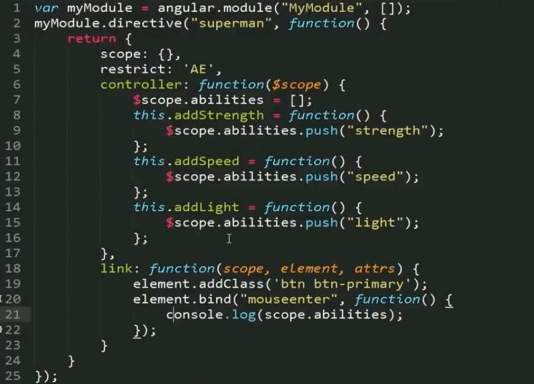

# 2019年

## 6月


### 24日
- 马太效应：Matthew Effect ，指强者愈强、弱者愈弱的现象


### 23日


<article data-v-1eef596a="" itemscope="itemscope" itemtype="http://schema.org/Article" class="article" data-v-7526ed6a=""><meta itemprop="url" content="https://juejin.im/post/5d10229ee51d4510a37bac1b"><meta itemprop="headline" content="精读《智能商业》"><meta itemprop="keywords" content="JavaScript"><meta itemprop="datePublished" content="2019-06-24T01:14:23.311Z"><meta itemprop="image" content="https://b-gold-cdn.xitu.io/icon/icon-128.png"><div itemprop="author" itemscope="itemscope" itemtype="http://schema.org/Person"><meta itemprop="name" content="黄子毅"><meta itemprop="url" content="https://juejin.im/user/57de0eee79bc440065e0e904"></div><div itemprop="publisher" itemscope="itemscope" itemtype="http://schema.org/Organization"><meta itemprop="name" content="掘金"><div itemprop="logo" itemscope="itemscope" itemtype="https://schema.org/ImageObject"><meta itemprop="url" content="https://b-gold-cdn.xitu.io/icon/icon-white-180.png"><meta itemprop="width" content="180"><meta itemprop="height" content="180"></div></div><div data-v-1eef596a="" class="author-info-block"><a data-v-1eef596a="" href="/user/57de0eee79bc440065e0e904" target="_blank" rel="" class="avatar-link"><div data-v-d023309e="" data-v-2c59fb76="" data-v-1eef596a="" data-src="https://leancloud-gold-cdn.xitu.io/d424a77cdab322afa8c9.png?imageView2/1/w/100/h/100/q/85/format/webp/interlace/1" class="lazy avatar avatar loaded" style="background-image: url(&quot;https://leancloud-gold-cdn.xitu.io/d424a77cdab322afa8c9.png?imageView2/1/w/100/h/100/q/85/format/webp/interlace/1&quot;);"></div></a><div data-v-1eef596a="" class="author-info-box"><a data-v-133bb25e="" data-v-1eef596a="" href="/user/57de0eee79bc440065e0e904" target="_blank" rel="" class="username username ellipsis">黄子毅<a data-v-a7d9de92="" data-v-133bb25e="" href="/book/5c90640c5188252d7941f5bb/section/5c9065385188252da6320022" target="_blank" rel="" class="rank"></a></a><div data-v-1eef596a="" class="meta-box"><time data-v-1eef596a="" datetime="2019-06-24T01:14:23.311Z" title="Mon Jun 24 2019 09:14:23 GMT+0800 (中国标准时间)" class="time">2019年06月24日</time><span data-v-1eef596a="" class="views-count">阅读 121</span><!----></div></div><button data-v-1851671b="" data-v-1eef596a="" class="follow-button follow">关注</button></div><!----><h1 data-v-1eef596a="" class="article-title">精读《智能商业》</h1><div data-v-1eef596a="" data-id="5d1023efe51d45108c59a562" itemprop="articleBody" class="article-content"><h1 class="heading" data-id="heading-0">1. 引言</h1>
<p><a target="_blank" href="https://link.juejin.im?target=https%3A%2F%2Fbook.douban.com%2Fsubject%2F30357931%2F" rel="nofollow noopener noreferrer">智能商业</a> 是阿里巴巴前总参谋长曾鸣于 2018-11 出版的商业图书，对最近 20 年中国商业以及互联网发展有着深刻的总结，并描述了未来智能商业的蓝图。</p>
<p>笔者之所以读这本书，是因为笔者所在阿里巴巴数据中台，需要更深刻的理解数据，而《智能商业》就提到了数据时代的变革，对笔者工作有所帮助。</p>
<p>但读完这本书后，笔者发现不同人站在不同视角会有不同的理解：如果你是一名数据行业从业者，你可以理解数据在当今行业发展中如何起到作用；如果你是企业高管，你会领悟到商业平台发展的规则；如果你是一名创业者，你能体会到点线面体的存在，找到自己的定位；如果你是一名管理者，你能领域到管理模式正在发生的变化；如果你是一名传统行业从业者，你能体会到为什么互联网会对传统行业带来这么大的冲击；如果你是一名社会评论家，你会找到衡量智能时代对人类社会带来影响的标尺，等等。商业是推动人类社会发展的源动力，甚至也是文化与战争的源头，智能商业正因为将商业讲的通透，才摆脱了普通商业书籍枯燥的理论体系，从社会实践中总结理论，最终能上升到富有哲理的思考。</p>
<p>智能商业一书中有许多关键词，比如 “三浪叠加” “网络协同” “数据智能” “C2B” “S2B2C” “点线面体” “创造力革命” “网红” “互联网X” 等等，能将这些关键词串起来的，笔者认为是 “商业演化”，在近几十年范围内，商业模式存在一些不变底层逻辑（“三浪叠加” “网络协同” “数据智能”），而在大趋势下存在不断演变的商业模式（“C2B” “S2B2C” “点线面体” “创造力革命” “网红” “互联网X”）。</p>
<p>读完书后会发现，这么多的关键词，最终都为了实现 “C2B” 这个商业最终演化目标，即便是远在十八世纪的工业革命，也在为 C2B 模式打下让物质资源极大丰富的生产力基础，而网络协同和数据智能，都为了让商业规模更大，精准度更强，可以个性化识别每个用户的需求。新的组织模式也是为了更高效服务用户，整合社会 “点线面体” 的生态关系最终可以形成 “C2B” 的服务网络，而网红、互联网 X 都是 C2B 转型在不同阶段、不同行业的尝试。</p>
<h1 class="heading" data-id="heading-1">2. 精读</h1>
<p>智能商业全书分为六个章节，分别是 “智能商业”、“商业模式变革”、“战略变革”、“组织变革”、“案例分析”、“关于未来”。</p>
<p>笔者看过一些类似的书评，将书中的观点一一枚举出来，这样的解读笔者认为是难以抓到重点的。看似把重点一一提取了出来，但没有一条 “逻辑线” 将其贯穿，分散的理解任何一个知识点都不会有太大的帮助。而这条 “逻辑线” 其实就是作者的目录组织结构。</p>
<p>任何一本书，写作的目的是作者为了全面阐述一个观点，书中的重点都是一个个割裂的小观点，作者会通过目录方式组织一条最合理的逻辑路线，将这些重点串联起来，最终引出作者想阐述的大观点（智能商业），因此请跟着笔者从这本书的章节结构开始，有一个连贯的理解。</p>
<p><strong>前言</strong></p>
<p>前言笔者认为是最精彩的部分，因为提到了一个核心概念 “三浪叠加”，中国人口众多，土地广袤，互联网发展程度不均衡，因此任何互联网模式都可能存在，再加上互联网自身演化很快，当第二浪盖过第一浪时，第三浪已经悄然形成了，只从规模上可能难以分辨处于尾声的第一浪与处于巅峰的第二浪，更难分辨出还没有起色的第三浪在哪。读完这本书如果能看清楚中国商业发展的前三浪，并预测出未来三浪，目的就达到了。</p>
<p><strong>智能商业</strong></p>
<p>第一章的名字和书名一样，表示我们现在正处于智能商业时代。通过对中国社会的分析，解释了为什么商业时代发展的这么快，而且为什么创业方向那么多，有些行业快速崛起，有些行业快速衰退，而想要抓住未来，就要把握住互联网机遇，利用<strong>网络协同</strong>与<strong>数据智能</strong>实现智能商业，然后为什么这样的智能商业模式可以胜出。</p>
<p><strong>商业模式变革</strong></p>
<p>第二章讲的是商业模式由传统的 B2C 逐渐演变到 C2B，而在 C2B 演变的过程中，一种过渡阶段 S2B2C 正在快速崛起，而这些名词并非人为创造，而是商业发展自然演化而来的，能理解到 S2B2C 是通向 C2B 的自然演化路径，自然就能理解现在一些企业模式（比如网红、大搜车）等，也能自然理解 S2B2C 的不足（毕竟是过渡阶段），未来的战略方向自然就清晰了。</p>
<p><strong>战略变革</strong></p>
<p>前两章分别介绍了什么是智能商业，为什么要做智能商业，以及商业模式的演变，那第三章就自然要介绍企业战略变革了。第三章介绍了企业战略如何转型才能应对智能商业的节奏，比如何制定战略计划，以及通过 点-线-面-体 理解企业在市场中的定位，理解了这一点，不仅能理解各企业在市场中定位，还能理解之间相互关系，以及 点-线-面-体 的定位是可以改变的，抓住机遇的企业会逐渐向上发展，失去机遇的企业会逐渐向下退化。</p>
<p>理解了 点-线-面-体 的特性，可以更好的找准自己的定位，越往上资源越多，但排他性就越强，大部分时候，做一个深耕垂直行业的点，虽然同质化可能很多，但竞争不是排他性的，而且有线与面的平台支撑，特别是合理利用多个 “面” 后，可能爆发出强劲的商业价值，比如网红就是同时利用多个 “面” 的典型例子。</p>
<blockquote>
<p>从战略变革这一章可以看到，这本书虽然前两章站在 BAT 高级战略的视角俯瞰商业演化，看似与普通企业，普通个人没什么关系，但读到战略变革这一章时，可以明显体会到理解 “面” 与 “体” 角度下商业思维后，可以给 “点” 与 “线” 带来巨大的战略价值。</p>
</blockquote>
<p><strong>组织变革</strong></p>
<p>第四章是组织变革，因为当战略变革后，必须轮到组织变革了。工业革命带来了生产力的极大提高，那互联网则带来了创造力革命的浪潮，没有统一机器的约束，每个人都能充分发挥自己的创造力 - 前提是组织管理模式要支持。一个新的组织管理模式不是自上而下的分配任务，而是自下而上，充分发挥每个人创造力的 “赋能” 管理模式。都是互联网的管理模式是打平的，其实这是终极的理想情况，通过形成自组织协同网络，充分调动每一个人的创造力。</p>
<p><strong>案例分析</strong></p>
<p>读到第五章就没有多少新概念了，但第五章是真正把前四章理论映射到现实案例的实战环节，这一章我们能看懂许多企业战略背后的战略模式，都可以归纳到网络协同、数据智能的布局，商业模式都在向 C2B 转型，旧的面被新的面取代而下降为线，线抓住了机遇逐渐发展成面，多个面相互协同逐渐形成了 “体” 等多个维度的变化。</p>
<p><strong>关于未来</strong></p>
<p>第六章是对未来的判断，重点在互联网与传统产业如何碰撞，提出的 互联网x 概念背后有着更深刻的含义。如果你今年听说了 “产业物联网” 这个名词，可以甄别一下相应的企业，是仅仅将互联网技术运用到了传统行业，还是将传统行业从底层的运作逻辑就互联网化了呢？互联网不仅是一种技术，更是一种思维，互联网思维可以将被传统行业束缚住的各个流程逐渐还原到最原始、高效的模样。</p>
<p>比如说传统工程需要提前计算销量固化产能，但加入了互联网快速反馈的网络，就可以实时调整产能，当然这需要整个生产流程的互联网化，将整个环节都做到快速反馈。</p>
<p><strong>结语 - 新文明：感受未来已来</strong></p>
<p>印象最深的是引用了经济学家周其仁的一句话：“文明的一次次传承和复兴，就是一步步找回对人的尊重”。害怕机器取代人类的思想还是被局限在现有的世界观、价值观之中的，将工人固定在工厂流水线，或者程序员每天写着相似的业务逻辑，本身就是一种践踏人类尊严的行为，而计算机可以逐步取代这些低创造性的工作，可以理解为抢了那些人的饭碗，但站在历史长河的角度，何不是还给人类以尊严？</p>
<h2 class="heading" data-id="heading-2">智能商业</h2>
<p>首先是分析互联网巨头都至少做对了这三个方向中的两个：<strong>在线化、智能化、网络化</strong>。</p>
<p>在线化是指将业务都搬到互联网上，这基本是必备的一条。智能化是利用算法打造竞争优势，比如谷歌搜索算法。网络化就是形成多方共赢的协作网络，比如广告主与网站主通过谷歌搜索形成网络化协作。</p>
<p>简介提到的 <strong>网络协同</strong>与<strong>数据智能</strong> 就是指后两者，它们之间要形成一种反馈闭环就形成了智能商业的双螺旋：</p>
<p><strong>网络协同</strong> 产生数据，通过 <strong>数据智能</strong> 进行学习，进一步优化 <strong>网络协同</strong>。</p>
<p><strong>网络协同</strong> 需要建立起一张多角色之间的协同网，比如优步组织的司机与乘客的协同网。协同网络越复杂，经济效益越大、门槛越高，比如淘宝的协同网络非常复杂，体现在协同者多（买家，卖家，物流，客服，淘女郎）等等，他们之间也有相互关联，各角色对网络需求粘性强，网络的不可替代性就高。</p>
<p><strong>数据智能</strong> 现在所有企业都没有充分利用数据，数据的潜在价值是无穷的，理论上可以利用数据做任何战略决策、管理决策。</p>
<p>而网络化与智能化叠加，会产生黑洞效应，也就是数据越多越吸附数据，网络协同越多就越容易扩张出新的协同。</p>
<p>作者对 <strong>互</strong> <strong>联</strong> <strong>网</strong> 这三个字的拆字解读也更容易让我们理解互联网的本质：</p>
<p><strong>联：</strong> 联接，从 PC 互联网开始，到移动互联网，再到万物互联，联接内容越来越多。</p>
<p><strong>互：</strong> 交互，从一对多的门户时代，到通过关注方式的微博时代，再到社交朋友圈时代，交互越来越简单，越来越频繁，也越来越精准。</p>
<p><strong>网：</strong> 网络协同。</p>
<p>看了这么多概念，不知道你是否能理解智能商业的概念呢？也许每个人都有自己的体会，也许智能商业概念难以被定义，但 <strong>网络协同</strong>、<strong>数据智能</strong> 一定是核心，谁能充分利用这两股力量，将其充分发挥黑洞效应，形成一套更广泛的“互”，更多的“联”，更复杂的“网”络协同，谁就能更好利用互联网实现智能商业。</p>
<h2 class="heading" data-id="heading-3">商业模式变革</h2>
<p>商业领域较为常见的模式有 B2B、B2C、C2C。</p>
<p>B2B 代表企业是阿里巴巴、中化网，阿里巴巴是水平 B2B，是指企业与客户之间是平行关系；而中化网属于垂直 B2B，帮助企业寻找上下游合作伙伴。</p>
<p>B2C 代表企业是亚马逊、天猫、京东，也就是直接把商品卖给消费者。</p>
<p>C2C 代表企业是易贝、淘宝，即个人用户服务与个人，淘宝主要是个人用户开网店卖给个人。</p>
<p>而商业模式的变革，是指这些模式最终都要演化为 C2B 模式，即个人提出需求，企业快速满足。按照笔者理解，C2B 是由客户驱动的模式，虽然只是简单的单词调整位置，但背后需要企业做巨大的转型，不仅组织结构需要调整，还需要企业具有第一章说的 “智能商业” 属性，因为只有将服务在线化，通过数据智能与网络协同，才能精准触达每一位消费者，了解每个人的需求，快速服务与消费者。</p>
<p>然而快速服务消费者的需求还需要背后的供应链平台支持，所以 C2B 将以客户驱动的模式一直改造到背后的供应链逻辑。</p>
<p>然而 C2B 模式跨度太大，最近还诞生了一种过渡模式，就是 S2B2C 的模式，S 指的是供应平台，通过对小 B 的赋能，让小 B 直接服务于 C。这种模式是看场景的，因为只有 S2B 的价值大于单纯的 B，这个模式才行得通，所以在比如汽车、医药行业，小 B 急需 S 赋的业务场景可以做起来，而在本身就有大 B 存在的行业，就算有 S 赋能，小 B 依然竞争不过大 B，就不适合 S2B2C 这种模式。</p>
<p>另外 S2B2C 的模式也在升级，未来的产品可能会同时透出 S 于 B 的品牌，因为只透出 B 的品牌，可能导致 S 不能很好的掌握消费者需求，只透出 S 的品牌，就变成了传统加盟模式，而加盟模式最大的问题是无法发挥每个小 B 的积极性触达客户，加盟本质上还是 B2C，比如肯德基，一个大品牌对应每个消费者，就算加盟再多店铺也不会改变这一点，但是 S2B2C 比如网红模式，淘宝平台给网红赋能，网红通过自己的品牌吸引能力圈住一批客户，带来非常高的转化率，这就结合了两者优势。</p>
<p>另外也提到了云集，笔者以前认为云集是一种传销模式，和微墒差不多，但其实云集要做的事情就是 S2B2C，将供应链完全打通后，包括网络系统一并提供给小 B，云集的小 B 就是任何有微信的用户，用户的资源就是他的朋友（朋友圈），所以云集号称没有商品就能做卖家，因为它的 S 服务做得好，集成性高，给小 B 带来的便利性就高。但问题是 小 B 到 C 环节是云集的弱势环节，拥有朋友圈的普通人与网红有本质的区别，普通人随意转发消息也许会带来朋友的反感与屏蔽，而普通人也不能为客户带来更大的价值，反观网红，他们可以得到粉丝的认可，成为粉丝的榜样，但是你愿意认可朋友圈里随便一个人成为你的榜样吗？</p>
<p>第二章总的来说解读了目前出现的网红现象，以及一些做的较好的独角兽（比如土巴兔、大搜车），其实他们都属于 S2B2C 的模式，而他们最终的目的地是 C2B。</p>
<h2 class="heading" data-id="heading-4">战略变革</h2>
<p>既然商业模式变革了，战略也要变革。之前也说过互联网处于三浪叠加状态，从 B2B 开始产生了很多新模式，从 C2B 到 S2B2C，比如 S2B2C 的模式也是在发展过程中逐渐发现的新模式，因此企业对战略的制定要采取一种高效反馈闭环，<strong>核心在于做战略实验</strong>。</p>
<p>首先确定几个未来可能的战略方向，各投入一些人力尝试，尝试一年后自然会发现正确的方向，此时再将其他方向合并到正确方向。比如 2011 年阿里巴巴独立了三个子公司 - 淘宝、天猫、一淘，是为了赌未来的局势到底是 B2C，还是 C2C，还是一个搜索引擎指向无数小 B2C。最终发现由于中国网络基础设施还不成熟，导致独立 B2C 成本太高，因此 一淘 就回到了阿里巴巴。</p>
<p>因此当你发现公司在同时做几个相似的业务时，先不要急着觉得公司傻，这样做是在浪费资源，但你是否能看清楚这几个业务间微妙的差别？也许你不能猜到哪一个才是未来方向（能猜到你就当 CEO 吧），但至少能理解公司这样做的战略意图，而不是做什么都是淘宝。</p>
<p>对于企业战略选择，作者给出的建议是 <strong>点-线-面-体</strong>。也就是企业一定要在这其中找到自己的定位。</p>
<p>根据笔者读后的理解，点就是各种各样服务的角色，比如卖家、模特、独立开发者都属于点。线就是连接点与面沟通桥梁，比如微墒或微博大 V 都属于线，原因是他们联接了平台与点。面就是指平台，比如淘宝属于面，因为它撬动了整个行业的资源，对上面无数个点赋能，联接了无数个点，面也是竞争最激烈的一环，也就是所谓的生态竞争，如果面对点的赋能力度不够，点也许就被其他的面吸引过去了。体是最大的概念，由多个 <strong>相互协同的面</strong> 组成，比如物流平台、网购平台、支付平台这三个面之间相互协作，才能逐渐形成体。</p>
<p>顺带一提，体不是一开始就形成，面也不是谁设计出来的，而是先有一个简单构想，根据市场需求逐步演化过来的，比如淘宝就是由 BBS 演化过来的，那 BBS 就是淘宝的基因，因此淘宝可以协同那么多点，可以快速反馈用户需求，可以演化出支付、物流、云业务并各自独立发展成新的面。</p>
<p>点-线-面-体 定位越上升，拥有的资源就越多，但面对的变化挑战就越多，其中“面”的竞争最为激烈，比如传统媒体本来是面，但在门户网站出现有，就降维到了点，微博的出现又使门户网站降为成线，而微信的出现使微博降为成线。</p>
<p>所以看似风光的 BAT 都选择了最为艰难的 “体” 的打造，而笔者认为，到了体这个级别，将撬动巨量的社会资源，带来巨大的回报，但排他性也是最强的。一个最完整的 “体” 本质上就是一个全面的协同网络 - 国家，国家与国家之间的排斥性大家可以想象，因此留给体的位置并不多，而新体的出现必然会与旧体展开生死决战。因此如果创业，将自己定位为“点”是比较靠谱的，因为有大量的“面”资源可用，只要能找到自己的亮点，就算有竞争，也不会收到太大的影响。</p>
<h2 class="heading" data-id="heading-5">组织变革</h2>
<p>战略变革后，就轮到组织变革了。组织变革的目的是最大程度激发员工的创造力，因此自上而下的结构是不适合了，需要一种新的组织形态与管理思路。</p>
<p>这种新的管理思路就是 “赋能” 的思路，一方面，赋能的思路可以提升员工的自主程度，充分发挥其创造力，一方面，赋能可以转变管理者的管理方式，使一个经理能管理十几、二十几个下属。互联网行业的工资都很高，尤其是顶尖人才，对于金钱的渴望已经不是找工作的最大决定因素，“成就感” “使命感” 更容易受这些顶尖人才的青睐，因此 “赋能” 的管理思路也是招募到顶尖人才的方法。</p>
<p>最后作者提到了 “自组织协同网”，这是一个非常超前的概念，也源于企业最大的痛点 - 如何衡量 KPI。</p>
<p>随着商业环境复杂性提高，几个核心指标远不能反应一个企业真实情况。有句话说，如果你只看一个指标，那最后达成的方式一定是你最不愿意看到的，比如淘宝为了冲刺销量 KPI，出了全年免网购费用的年卡，也许一天就能完成全年 KPI，但未来一年内可能会亏空整个公司老本。因此利用数据，从多个维度衡量指标是唯一的解法，换个说法，就是用复杂性对抗复杂性。</p>
<p>通过将公司所有业务数据化，训练出一个逐步优化的模型，是可能从所有维度逐渐趋向最真实反馈公司表现的多维度指标的，衡量员工工作绩效方式也同理。</p>
<p>读完这一段，笔者感受到数据最终也会被用在员工身上这句话，简单来说就是晋升答辩不用写 PPT 了，年底通过上千、上万种维度对你进行综合测评，直接出结果。现在已经能感受到公司在这个方向发力了，第一步是将所有开发过程数据化，也许离这一天已经不远。</p>
<h2 class="heading" data-id="heading-6">案例分析</h2>
<p>案例分析十分精彩，由于篇幅限制，笔者就不洋洋洒洒的转述了，如果感兴趣强烈推荐读<a target="_blank" href="https://link.juejin.im?target=https%3A%2F%2Fdetail.tmall.com%2Fitem.htm%3Fspm%3Da220m.1000858.1000725.1.5518639bdKutaT%26id%3D587836001802%26standard%3D1%26user_id%3D832978172%26cat_id%3D2%26is_b%3D1%26rn%3Dab05936e7d8ab2699ab0bbc07bb2cb3f" rel="nofollow noopener noreferrer">原文</a>，笔者至少还会再读一遍。</p>
<p>从案例分析中，有两个核心观点笔者在此处提一下。</p>
<p>第一个是平台演化的自然性，作者以淘宝的发展历程作为案例，说明了淘宝并不是顶层设计的产物，而是根据市场反馈的产物，唯有如此才能在高速变化的时代搭建一个平台。</p>
<p>第二个是网红案例，网红不仅完成了点到线的演化，而且是综合利用了多个“面”的案例，通过综合利用社交平台（微博），电商平台（淘宝），快速反应供应链平台（由网红推动产生的新型供应链），结合这三个平台，网红这个线被赋予前所未有的能量，带来了巨大收益。</p>
<h2 class="heading" data-id="heading-7">关于未来</h2>
<p>读完本书的目的，不仅是了解当下的智能商业，更是为了思考未来。</p>
<p>在这个大变革时代，未来战略是难以预测的，所以凭空去勾勒未来蓝图没有什么意义，我们要在通过战略实验快速试探出未来几年的方向，在第二浪即将到达巅峰时，找到第三浪并积极布局。</p>
<p>其实本书只能给出寻找战略方向的方法论，而不能给出具体的未来发展方向是什么，因为这套方法论本身就是通过战略实验快速寻找方向的过程，唯有投入资源去做尝试，仔细观察身边发生的变化，才能逐渐找到未来的新商业模式。未来的商业模式也是在逐步演变的，受到的影响因素太多，因此大概处于一种 “不可观测” 的状态，但至少未来十年内 C2B 的模式，笔者认为是一个固定的大方向，而传统行业与互联网结合的产业互联网也是新的发展机遇，利用互联网优化传统行业的各个环节，是一个确定的方向标。</p>
<p>无论未来商业怎么发展，都会为消费者带来越来越好的体验，这是一个消费为王的时代，根据消费者的需求，掀起从平台到供应链的全方位改造，目的是带来更好的消费体验。</p>
<h1 class="heading" data-id="heading-8">3. 总结</h1>
<p>读完了智能商业，笔者留下一个思考题：尝试站在智能商业的角度，分析你熟悉的公司各处于什么发展阶段，走的是什么商业模式？</p>
<blockquote>
<p>讨论地址是：<a target="_blank" href="https://link.juejin.im?target=https%3A%2F%2Fgithub.com%2Fdt-fe%2Fweekly%2Fissues%2F169" rel="nofollow noopener noreferrer">精读《智能商业》 · Issue #169 · dt-fe/weekly</a></p>
</blockquote>
<p><strong>如果你想参与讨论，请 <a target="_blank" href="https://link.juejin.im?target=https%3A%2F%2Fgithub.com%2Fdt-fe%2Fweekly" rel="nofollow noopener noreferrer">点击这里</a>，每周都有新的主题，周末或周一发布。前端精读 - 帮你筛选靠谱的内容。</strong></p>
<blockquote>
<p>关注 <strong>前端精读微信公众号</strong></p>
</blockquote>

<blockquote>
<p>版权声明：自由转载-非商用-非衍生-保持署名（<a target="_blank" href="https://link.juejin.im?target=https%3A%2F%2Fcreativecommons.org%2Flicenses%2Fby-nc-nd%2F3.0%2Fdeed.zh" rel="nofollow noopener noreferrer">创意共享 3.0 许可证</a>）</p>
</blockquote>
</div></article>

### 21日
- 冰山模型：
    - 冰山模型是美国著名心理学家麦克利兰提出来的，它全面地描述了一个人的个体素质要素，也就是说，**你跟一个岗位是不是匹配、匹配程度如何、市场薪资值多少，都是这个模型可以解释的，几乎所有大公司都会用它来进行人才招聘和培养。**


- 知识容易在后天习得，性格特质动机价值观这些隐形要素很难后天改变
- 搞明白“我应该选择什么样的工作”，比“我应该如何在别人认为的好工作里面成功”，要重要得多
- 掌握一定数量的思维模型，能够解决这个世界上90%的问题。

## 5月


# 2017年

## 6月


### 12日


单词： doodle （有两种含义，一种是“涂鸦；漫不经心地画画”，另一种是“闲荡，打发时间”。）

当前提到Doodle，更多的是指Google Doodle，即Google的标志Logo的创意

[Google2016万圣节Doodle](https://www.google.com/doodles/halloween-2016)


### 9日

echarts.getDataURL 中可以设置图片的背景色


### 8日


X-UA-Compatible是自从IE8新加的一个设置，对于IE8以下的浏览器是不识别的。 通过在meta中设置X-UA-Compatible的值，可以指定网页的兼容性模式设置。

在网页中指定的模式优先权高于服务器中（ 通过HTTP Header ）所指定的模式。


```

<meta http-equiv="X-UA-Compatible" content="IE=7">  
// 以上代码告诉IE浏览器，无论是否用DTD声明文档标准，IE8/9都会以IE7引擎来渲染页面。  

<meta http-equiv="X-UA-Compatible" content="IE=8">  
// 以上代码告诉IE浏览器，IE8/9都会以IE8引擎来渲染页面。  

<meta http-equiv="X-UA-Compatible" content="IE=edge">  
// 以上代码告诉IE浏览器，IE8/9及以后的版本都会以最高版本IE来渲染页面。  

<meta http-equiv="X-UA-Compatible" content="IE=7,IE=9">  
<meta http-equiv="X-UA-Compatible" content="IE=7,9">  
<meta http-equiv="X-UA-Compatible" content="IE=Edge,chrome=1">
// 以上代码IE=edge告诉IE使用最新的引擎渲染网页，chrome=1则可以激活Chrome Frame.

```


## 4月

### 15日

- ionic 开发环境安装
	- Node.js
	- Ionic2
	- Cordova
	- JDK
	- Andorid SDK


### 13日

- 基本JPEG(Baseline JPEG)和渐进JPEG(Progressive JPEG)
	- photoshop 生成 jpeg 图片时，将连续打钩即可生成Progressive JPEG。


- JDK 是啥？
	- Java Development Kit (JDK) 是太阳微系统针对Java开发人员发布的免费软件开发工具包(SDK，Software development kit)。JDK 是整个Java的核心，包括了Java运行环境、Java工具和Java基础类库。2006年太阳微系统宣布将发布基于GPL协议的开源JDK，使JDK成为自由软件。
- 配置JDK：
	- 如：jdk安装在“D:\Program Files\java\jdk1.6.0_10”
	- 第一步：新建“java_home”值，输入“D:\Program Files\java\jdk1.6.0_10”；
	- 第二步：新建“classpath”值，输入“.;%java_home%\lib”；
	- 第三步：在path中增加“%java_home%\bin”；
	- 备注：配置环境变量在“计算机”右击“属性”，之后选择“高级环境变量”，在选择“环境变量”即可。


### 11日

- 数据显示 Angular 2 比Angular 1 快5到10倍
- CLI（command-line interface，命令行界面）
- UWP应用 是啥？
	- uwp就是通用应用的意思。可以在电脑端，手机端，或其他设备通用。不用分别为不同的平台设计不同的软件。既一个软件就可以通吃。这估计现在是win10系统的一个软件发展趋势了。不管是开发者，还是使用者，都省事。
- [VS Code](https://code.visualstudio.com/) 编辑器  强大的智能感知，自定义的类都可以哦，真的有点开发强类型语言的感觉啊


- 使用cnpm（不造为啥 直接用 npm 切国内淘宝镜像 有时候安装会报错）

```
npm install -g cnpm --registry=http://registry.npm.taobao.org
```

- 管理 node 版本的工具 ，首先安装 n 模块

```
npm install -g n
```

升级 node 到最新的稳定版

```
n stable
```

so easy 也可以跟版本号

```
n v0.10.26
```


### 10日

css中的兼容写法不要省略：
栗子：

```css
// 错误的（这种情况在 Ubuntu 的火狐浏览器下不生效，导致样式）
.box{
    box-sizing: border-box;
}


// 正确的
.box{
    -webkit-box-sizing: border-box;
    -moz-box-sizing: border-box;
    box-sizing: border-box;
}
```

- win10 使用技巧
	- 在记事本第一行打 .LOG 代码，会自动记录你的修改时间（然并卵，我用Git）
	- 系统托盘右键，显示“任务视图”按钮 ，任务视图 可以让你创建多个**虚拟桌面**，快捷键 Win + Alt + 左右键 可以快速切换（不过某个应用在 A 桌面打开的时候，在 B 桌面开启这个应用会回到 A 桌面，在不同桌面开不同的应用才是它的真正用途）
	- 在用户账户（通过运行--netplwiz 可以进入）中可以设置无密码登录
	- Alt Prt Scr，没错！就是比你之前的操作多出一个Alt键。这组快捷键可以将屏幕直接导出成图片，再麻烦的事也是一键搞定。（我可能用的假的win10）
	- 看你的win10吗是不是永久激活 win+R 开启运行 输入   slmgr.vbs -dlv  或者  slmgr.vbs -xpr  即可查看你的win10  是不是永久激活的。


### 8日


- 指令使用中的一个小**坑**


- 指令内部的 scope 叫做创建独立的作用域
- 指令内部的 controller 是给指令暴露出一组 public 方法，给外部调用的



- AngularJS 里内置了 Jquerylight 即简化版 Jquery ，是和我们所熟悉的 jquery 语法一模一样的 

- 指令的 controller 和 link 里放什么逻辑？
	- 如果指令 要暴露一些方法给外部调用，就写在 controller 里
	-  如果是用来处理指令内部的事物的（比如给元素绑定事件呀，绑定数据呀），这时候就写在 link 里

- 指令中的 require 表示该指令依赖于哪一个指令（下边的例子表示 strength 这个指令依赖于 superman 指令）


- 有 require 之后我们就可以在 link 函数里写第四个参数 即被依赖指令的 controller 写成 “指令名Ctrl” 的形式。 接下来我们就可以通过 指令名Ctrl.fn 来调用被依赖指令暴露出的方法了。


### 7日

AngularJS 指令（Directive）

自定义指令的配置项

1. restrict (匹配模式)：有 A E M C 四种，推荐使用 A 和 E 这两种模式(以 hello 指令为例)
	- E 作为元素名使用（element）
	- A 作为属性使用（attribute）
	- M 作为注释使用（comment）
		- 做注释的时候要注意 ： directive:hello 前后要各有一个空格，否则angular可能无法解析（这是一个小**坑**）。
	- C 作为类名使用（class）

```html
<hello></hello>
<div hello></div>
<div class="hello"></div>
<!-- directive:hello -->
<div></div>
```


2. template
	- template 可以写模板
	- templateUrl 可以引入独立的HTML文件,其中可以写大块的模板
	- templateCache 可以将模板缓存起来，让多个指令去使用它


3. replace 与 transclude
	- transclude 允许 指令内部嵌套（非常重要，使指令与指令嵌套的基础）


### 6日

- 啥是环境变量？
 
环境变量（environment variables）一般是指在操作系统中用来指定操作系统运行环境的一些参数，如：临时文件夹位置和系统文件夹位置等。

环境变量是在操作系统中一个具有特定名字的对象，它包含了一个或者多个应用程序所将使用到的信息。例如Windows和DOS操作系统中的path环境变量，当要求系统运行一个程序而没有告诉它程序所在的完整路径时，系统除了在当前目录下面寻找此程序外，还应到path中指定的路径去找。用户通过设置环境变量，来更好的运行进程。

- node-uuid 是啥？

- node n 命令是干嘛用的？

n 是管理node版本的 

[管理 node 版本，选择 nvm 还是 n？](http://web.jobbole.com/84249/)


### 5日

HTTP是一个**无状态协议**。

通俗的说就是，服务器因为每天要接待太多客户了，是个**健忘鬼**，你一挂电话，他就把你的东西全忘光了，把你的东西全丢掉了。你第二次还得再告诉服务器一遍。


## 3月


### 28日

- 测试玩


```javascript

// JavaScript把null、undefined、0、NaN和空字符串''视为false

Boolean(-1)
//true

Boolean(0)
//false

Boolean(null)
//false

Boolean(undefined)
//false

Boolean(NaN)
//false

Boolean("")
//false

Boolean('')
//false

typeof(null)
//"object"

typeof(undefined)
//"undefined"

typeof("")
//"string"

typeof(123)
//"number"

typeof(Date)
//"function"

typeof(window)
//"object"

typeof(elememt)
//"undefined"

typeof(qwe)
//"undefined"

typeof(typeof(qwe))
//"string"

typeof(typeof(123))
//"string"

typeof(typeof(NaN))
//"string"

typeof(NaN)
//"number"

0/0
//NaN

0/9
//0

123/0
//Infinity

1/0
//Infinity
```

### 27日

- dotdotdot.js  多行文本溢出解决方案。

```javascript
dot = require('../plugins/jquery.dotdotdot.min');
$('.info-item-desc,.image-list-title,.image-list-desc').dotdotdot({wrap: 'letter'});
```

- 浏览器通知
	- 原生
```javascript
if(window.Notification && Notification.permission !== "denied") {
    Notification.requestPermission(function(status) {
        var n = new Notification('通知标题', { body: '这里是通知内容！' }); 
    });
}
```
	- 插件 [iNotify.js](http://blog.csdn.net/zhanglong_longlong/article/details/52539302)

npm

```
$ npm install title-notify
```

bower

```
$ bower install inotify
```

**init**

```javascript
var iNotify = new iNotify().init()
//推荐下面写法
var iNotify = new iNotify({
    message: '有消息了。',//标题
    effect: 'flash', // flash | scroll 闪烁还是滚动
    //可选播放声音
    audio:{
        //可以使用数组传多种格式的声音文件
        file: ['msg.mp4','msg.mp3','msg.wav']
        //下面也是可以的哦
        //file: 'msg.mp4'
    },
    //标题闪烁，或者滚动速度
    interval: 1000,
    //可选，默认绿底白字的  Favicon
    updateFavicon:{
        // favicon 字体颜色
        textColor: "#fff",
        //背景颜色，设置背景颜色透明，将值设置为“transparent”
        backgroundColor: "#2F9A00" 
    },
    //可选chrome浏览器通知，默认不填写就是下面的内容
    notification:{
        title:"通知！",//设置标题
        icon:"",//设置图标 icon 默认为 Favicon
        body:'您来了一条新消息'//设置消息内容
    }
})
```


### 24日


- Windows 下的 cmd 中查看当前位置下的文件 用 dir  命令。


- const 声明创建一个只读的常量。这不意味着常量指向的值不可变，而是变量标识符的值只能赋值一次。

```javascript
// 注意: 常量在声明的时候可以使用大小写，但通常情况下会使用全部大写英文。 

// 定义常量MY_FAV并赋值7
const MY_FAV = 7;

// 在 Firefox 和 Chrome 这会失败但不会报错(在 Safari这个赋值会成功)
MY_FAV = 20;

// 输出 7
console.log("my favorite number is: " + MY_FAV);

// 尝试重新声明会报错 
const MY_FAV = 20;

//  MY_FAV 保留给上面的常量，这个操作会失败
var MY_FAV = 20; 

// MY_FAV 依旧为7
console.log("my favorite number is " + MY_FAV);

// 下面是一个语法错误
const A = 1; A = 2;

// 常量要求一个初始值
const FOO; // SyntaxError: missing = in const declaration

// 常量可以定义成对象
const MY_OBJECT = {"key": "value"};

// 重写对象和上面一样会失败
MY_OBJECT = {"OTHER_KEY": "value"};

// 对象属性并不在保护的范围内，下面这个声明会成功执行
MY_OBJECT.key = "otherValue";
```

- npm就是Node的软件包管理器
	- 在项目根目录执行 npm init 命令可以帮你创建 package.json 。注意**项目名不能包含大写字母**
	- 如果用 npm 安装模块的过程中报域名错误的话，请清空缓存 > npm cache clean 或重启计算机即可

- 特别注意：package.json是一个普通json文件，所以不能添加任何注释


- npm安装 gulp 时警告:npm WARN deprecated minimatch@2.0.10: Please update to minimatch 3.0.2 or higher to
	- 解决办法： (update不行)   直接重装 ：

```
npm install -g npm@3
```


### 23日

Gulp

- 全局安装

```
npm install --global gulp
```

- 作为项目的开发依赖（devDependencies）安装

```
npm install --save-dev gulp
```


### 22日

IPXX防护等级概念

- 防尘部分：0-6共7级
- 防水部分：0-8共9级

	例如： 
	- Xperia Z2的防护等级IP58  
	- 三星Galaxy S5的防护等级IP67


chrome 离线版下载

- 最新稳定版：http...网址...**?standalone=1**
- 最新测试版：http...网址...**?standalone=1&extra=betachannel**
- 最新开发版：http...网址...**?standalone=1&extra=devchannel**


JavaScript


#### 字符串

- 如果字符串内部既包含'又包含"怎么办？可以用转义字符\来标识，比如：

```javascript
'I\'m \"OK\"!';
```

- ASCII字符可以以\x##形式的十六进制表示

```javascript
'\x41'; // 完全等同于 'A'
```

- 还可以用\u####表示一个Unicode字符

```javascript
'\u4e2d\u6587'; // 完全等同于 '中文'
```

- 由于多行字符串用\n写起来比较费事，所以最新的ES6标准新增了一种多行字符串的表示方法，用反引号 ` ... ` 表示


```javascript
`这是一个
多行
字符串`;
```

- 如果有很多变量需要连接，用+号就比较麻烦。ES6新增了一种模板字符串，它会自动替换字符串中的变量

```javascript
var name = '小明';
var age = 20;
var message = `你好, ${name}, 你今年${age}岁了!`;
alert(message);
```

- **需要特别注意的是**: 字符串是不可变的，如果对字符串的某个索引赋值，不会有任何错误，但是，也没有任何效果

```javascript
var s = 'Test';
s[0] = 'X';
alert(s); // s仍然为'Test'
```

#### 数组

- 请注意，直接给Array的length赋一个新的值会导致Array大小的变化

```javascript
var arr = [1, 2, 3];
arr.length; // 3
arr.length = 6;
arr; // arr变为[1, 2, 3, undefined, undefined, undefined]
arr.length = 2;
arr; // arr变为[1, 2]
```

- 请注意，如果通过索引赋值时，索引超过了范围，同样会引起Array大小的变化

```javascript
var arr = [1, 2, 3];
arr[5] = 'x';
arr; // arr变为[1, 2, 3, undefined, undefined, 'x']
```

- indexOf()来搜索一个指定的元素的位置：

```javascript
var arr = [10, 20, '30', 'xyz'];
arr.indexOf(10); // 元素10的索引为0
arr.indexOf(20); // 元素20的索引为1
arr.indexOf(30); // 元素30没有找到，返回-1
arr.indexOf('30'); // 元素'30'的索引为2
```

- slice()就是对应String的substring()版本，它截取Array的部分元素，然后返回一个新的Array
	- slice()的起止参数包括开始索引，不包括结束索引
	- 如果不给slice()传递任何参数，它就会从头到尾截取所有元素。利用这一点，我们可以很容易地复制一个Array

```javascript
var arr = ['A', 'B', 'C', 'D', 'E', 'F', 'G'];
arr.slice(0, 3); // 从索引0开始，到索引3结束，但不包括索引3: ['A', 'B', 'C']
arr.slice(3); // 从索引3开始到结束: ['D', 'E', 'F', 'G']
var aCopy = arr.slice();
aCopy; // ['A', 'B', 'C', 'D', 'E', 'F', 'G']
aCopy === arr; // false
```

> 写一个判断数组是否相等的方法:

```javascript
var cmpare = function(arr1,arr2){
    if(arr1.length === arr2.length){
        for(var i = 0;i<arr1.length;i ++){
            if(arr1[i] === arr2[i]){
                if(i === (arr1.length - 1)){
                    return true;
                }
            }else{
                return false;
            }
        }
    }else{
        return false;
    }
}
```


- push() 向 Array 的末尾添加若干元素，pop() 则把 Array 的最后一个元素删除掉。如果要往 Array 的头部添加若干元素，使用 unshift() 方法，shift() 方法则把 Array 的第一个元素删掉。
- 添加时的返回值是数组的新长度，删除时的返回值被删除的元素。
- 空数组继续 pop/shift 不会报错，而是返回 undefined 。
- reverse()把整个Array的元素给掉个个，也就是反转
- sort()可以对当前Array进行排序，它会直接修改当前Array的元素位置，直接调用时，按照默认顺序排序
- splice()方法是修改Array的“万能方法”，它可以从指定的索引开始删除若干元素，然后再从该位置添加若干元素,返回删除的元素

```javascript
var arr = ['Microsoft', 'Apple', 'Yahoo', 'AOL', 'Excite', 'Oracle'];
// 从索引2开始删除3个元素,然后再添加两个元素:
arr.splice(2, 3, 'Google', 'Facebook'); // 返回删除的元素 ['Yahoo', 'AOL', 'Excite']
arr; // ['Microsoft', 'Apple', 'Google', 'Facebook', 'Oracle']
// 只删除,不添加:
arr.splice(2, 2); // ['Google', 'Facebook']
arr; // ['Microsoft', 'Apple', 'Oracle']
// 只添加,不删除:
arr.splice(2, 0, 'Google', 'Facebook'); // 返回[],因为没有删除任何元素
arr; // ['Microsoft', 'Apple', 'Google', 'Facebook', 'Oracle']
```

- concat()方法把当前的Array和另一个Array连接起来，并返回一个新的Array

```javascript
var arr = ['A', 'B', 'C'];
var added = arr.concat([1, 2, 3]);
added; // ['A', 'B', 'C', 1, 2, 3]
arr; // ['A', 'B', 'C']
```

- join()方法是一个非常实用的方法，它把当前Array的每个元素都用指定的字符串连接起来，然后返回连接后的字符串

#### 对象

- 最后一个键值对不需要在末尾加,，如果加了，有的浏览器（如低版本的IE）将报错

- 访问属性是通过.操作符完成的，但这要求属性名必须是一个有效的变量名。如果属性名包含特殊字符，就必须用''括起来

```javascript
var xiaohong = {
    name: '小红',
    'middle-school': 'No.1 Middle School'
};
xiaohong['middle-school']; // 'No.1 Middle School'
xiaohong['name']; // '小红'
xiaohong.name; // '小红'
```

> 这个例子中，xiaohong 的属性名 middle-school 不是一个有效的变量，就需要用''括起来。访问这个属性也无法使用.操作符，必须用['xxx']来访问（我们在编写JavaScript代码的时候，属性名尽量使用标准的变量名，这样就可以直接通过object.prop的形式访问一个属性了）

- JavaScript规定，访问不存在的属性不报错，而是返回undefined

- JavaScript的对象是动态类型，你可以自由地给一个对象添加或删除属性

```javascript
var xiaoming = {
    name: '小明'
};
xiaoming.age; // undefined
xiaoming.age = 18; // 新增一个age属性
xiaoming.age; // 18
delete xiaoming.age; // 删除age属性
xiaoming.age; // undefined
delete xiaoming['name']; // 删除name属性
xiaoming.name; // undefined
delete xiaoming.school; // 删除一个不存在的school属性也不会报错
```

- 如果我们要检测xiaoming是否拥有某一属性，可以用in操作符：

```javascript
var xiaoming = {
    name: '小明',
    birth: 1990,
    school: 'No.1 Middle School',
    height: 1.70,
    weight: 65,
    score: null
};
'name' in xiaoming; // true
'grade' in xiaoming; // false
```

> 不过要小心，如果in判断一个属性存在，这个属性不一定是xiaoming的，它可能是xiaoming继承得到的：

```javascript
'toString' in xiaoming; // true
```

- 因为toString定义在object对象中，而所有对象最终都会在原型链上指向object，所以xiaoming也拥有toString属性。

要判断一个属性是否是xiaoming自身拥有的，而不是继承得到的，可以用 **hasOwnProperty()** 方法：

```javascript
var xiaoming = {
    name: '小明'
};
xiaoming.hasOwnProperty('name'); // true
xiaoming.hasOwnProperty('toString'); // false
```


#### 判断

- 如果语句块只包含一条语句，那么可以省略{}

```javascript
var age = 20;
if (age >= 18)
    alert('adult');
else
    alert('teenager');
```

- 省略{}的危险之处在于，如果后来想添加一些语句，却忘了写{}，就改变了if...else...的语义，所以我们建议永远都要写上{}

- 如果if的条件判断语句结果不是true或 false 怎么办？例如 

```javascript
var s = '123';
if (s.length) { // 条件计算结果为3
    //
}
```
> JavaScript把null、undefined、0、NaN和空字符串''视为false，其他值一概视为true，因此上述代码条件判断的结果是true


#### 循环

- for循环的3个条件都是可以省略的，如果没有退出循环的判断条件，就必须使用break语句退出循环，否则就是死循环

```javascript
var x = 0;
for (;;) { // 将无限循环下去
    if (x > 100) {
        break; // 通过if判断来退出循环
    }
    x ++;
}
```
- for循环的一个变体是for ... in循环，它可以把一个**对象**的所有**属性**依次循环出来
> 请注意，for ... in对Array的循环得到的是String而不是Number

- while循环只有一个判断条件，条件满足，就不断循环，条件不满足时则退出循环。


### 21日

- **AngularJS 四大核心特性**
	- MVC
	- 模块化和依赖注入
	- 双向数据绑定
	- 指令

- Angular 的“遥控器”是Controller。
- **路由**
	- 路由的本质是由地址栏url的不同，为我们展示不同的视图。（这个过程没有和服务器交互）。
	- 只有两个方法： when 和 otherwise
	- URL 中的 # 号是防止浏览器向服务器提交请求的。
	- 我们就可以将不同的视图交给不同的控制器去处理，这样视图之间的职能就分的很清晰。
- angular 自己的 router 是不支持深层次的路由的，可以使用[angular-ui](angular-ui.hithub.io),ui-router 提供了可以深度路由的方式。(导入了ui-router之后就不需要angular自己的router)
- **前端路由**的基本原理
	- 哈希 # 
	- HTML5 中新的 history API
	- 路由的核心是给应用定义“状态”
	- 使用路由机制会影响到应用的整体编码方式（需要预先定义好状态）
	- 要考虑兼容性和“优雅降级”


---
JavaScript

- {...} 是代码块  不需要分号
- 让JavaScript引擎自动加分号 **（意思就是你懒得加分号）** 在某些情况下会改变程序的语义，导致运行结果与期望不一致

- ECMAScript 标准定义了 6 种数据类型:

```
Number
String
Boolean
Null
Undefined
Object
```

- NaN 和 Infinity（无限大）是 Number 类型

```javascript
NaN === NaN; // false
```

唯一能判断NaN的方法是通过isNaN()函数 ：	

```javascript
isNaN(NaN); // true
```

- 要注意浮点数的相等比较：

```javascript
1 / 3 === (1 - 2 / 3); // false
```

这不是JavaScript的设计缺陷。浮点数在运算过程中会产生误差，因为计算机无法精确表示无限循环小数。要比较两个浮点数是否相等，只能计算它们之差的绝对值，看是否小于某个阈值：

```javascript
Math.abs(1 / 3 - (1 - 2 / 3)) < 0.0000001; // true
```

### 20日

- Stero 是立体声
- Mono 是单声道。

MarkDown 插入图片的语法：

```

```


- AngularJS 中的 MVC 是借助 $scope 实现的。
- $rootScope 是控制器之间的桥梁。
- **神奇的 $scope**
	1. $scope 是一个POJO(Plain Old JavaScript Object)
	2. $scope 提供了一些工具方法 $watch()/$apply()   (用来实时监测对象属性的变化的)
	3. $scope 是表达式的执行环境（或者叫作用域）
	4. $scope 是一个树形结构，**与DOM标签平行**
	5. 子 $scope 对象会继承父 $scope 上的**属性和方法**
	6. 每个 Angular 应用只有一个根 $scope 对象（$rootscope，一般位于ng-app上）
	7. $scope 可以传播事件，类似DOM事件，可以向上也可以向下。
	8. $scope 不仅是 MVC 的基础，也是后面实现实现双向数据绑定的基础。 
	9. 可以用 angular.element($0).scope() 进行调试。（可以获得当前元素上的$scope）
	
- **$scope 的生命周期**
	1. Creation （创建）
	2. Watcher registration （注册监控）
	3. Model mutation （监测模型变化）
	4. Mutation observation （观察模型有没有脏）
	5. Scope destruction （销毁scope）

- 监察？   extJS?

### 18日

- grunt 的插件 安装

```cmd
npm install grunt-contrib-uglify --save-dev
npm install grunt-contrib-qunit --save-dev
npm install grunt-contrib-concat --save-dev
npm install grunt-contrib-jshint --save-dev
npm install grunt-contrib-watch --save-dev
```

- npm 会把非全局安装的工具 安装到当前目录下的 node_modules 目录下

- 10款工具：

	- Bower           依赖管理工具
	- Sublime         编辑器
	- Protractor      专为Angular定制的测试工具 基于WebDriverJS
	- NodeJS          node
	- http-server     快速创建web服务器
	- Grunt           自动化工具
	- Karma           用来跑测试用例的容器
	- Jasmine         提供了一套语法用来编写测试用例
	- Git             版本控制
	- Chrome          浏览器

- MVC只是手段，终极目标是模块化和复用

- Controller:

- 不要复用Controller；
- 不要在 Controller 中操作DOM；
- 不要在 Controller 中做数据格式化，ng有很好的表单控件
- 不要在 Controller 中做过滤操作。ng有$filter。
- 一般来说，Controller是不会互相调用的。控件之间的交互式通过事件进行的。

### 14日

- npm 换源：

```
npm config set registry https://registry.npm.taobao.org
//配置后可通过下面方式来验证是否成功
npm config get registry
```
