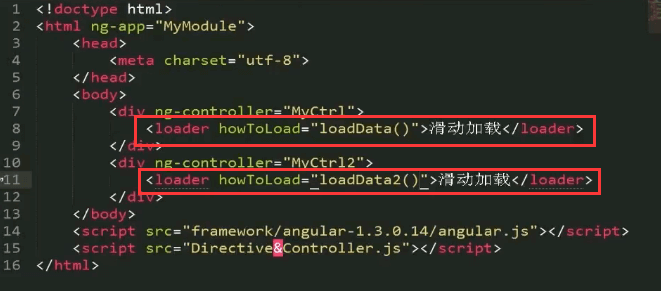

### 涉及到了这些标签
 ```【想知道】``` ```【BOOK】``` ```【SONG】``` ```【动漫】``` ```【游戏】``` ```【硬件】``` ```【想法】``` ```【思考】``` ```【知识】``` ```【Markdown】``` ```【JavaScript】``` ```【iOS】``` ```【Android】``` ```【摄影】``` ```【见闻】``` ```【发现】``` ```【执念】``` ```【英语单词】``` ```【TODO】``` ```【TODO & DOWN】```

<!-- 
标签|解释
:-|:-
【想知道】| 表示我还未知但想要去了解的一些问题
【BOOK】| 书单
【SONG】| 喜欢的歌
【动漫】| 看动漫的一些相想法
【游戏】|
【硬件】| 通常是一些数码产品相关的知识或者问题
【想法】| 包括想做的事儿，以及一些突发奇想
【思考】| 吾日三省吾身 的 “省”
【知识】| 字面意思，往往会会跟着一些知识所属的范畴标签，目前已经出现过的标签
【Markdown】|
【JavaScript】|
【iOS】|
【Android】|
【摄影】|
【见闻】| 有趣的见闻会放在这里
【发现】| 偶然发现的有趣事物
【执念】| 包含了一些我一直有的想法，可能是待改善但一直没有改善的想法
【英语单词】| 见到的一些主要是一些他都认识我了，我还不认识他的单词收集，为啥不叫单词？因为我觉得我可能还会去了解别的语言🙄
【TODO】| 这是准备做和那些做了一半的事儿
【TODO & DOWN】| 如果 TODO 解决了，会改成这个，并在末尾标注解决的日期。像这样  2019-07-12 
-->

# TODO
- [ ] 知识：计算机起源 & 历史
- [x] 技能：前端课程，耗时预估已统计
- [ ] 能力：PMP 项目管理课程
- [x] [技能：许岑的 KeyNote 课程学习](./skill/keynote.md)
- [ ] 兴趣：学吉他，不能吃灰了
- [x] 读书：《图解HTTP》
- [ ] 技能：驾照考试
- [ ] 知识：算法学习


# 2019年

## 11月


### 20日 
- 【知识点】印度种姓制
    - 印度种姓制度源于印度教，又称瓦尔纳制度，是在后期吠陀时代形成的，具有3000多年历史。这一制度将人分为4个等级，即婆罗门、刹帝利、吠舍、首陀罗和达利特。一张根据《梨俱吠陀·原人歌》所绘的瓦尔那等级：婆罗门是原人的嘴、刹帝利是原人的双臂、吠舍是原人的大腿、首陀罗是原人的脚。至于贱民，则被排除在原人的身体之外。
    - 它是古代世界最典型、最森严的等级制度，并且种姓制度下的各等级世代相袭。
    - 四个等级在地位、权利、职业、义务等方面有严格的规定：
        1. 第一等级**婆罗门**主要是僧侣贵族，拥有解释宗教经典和祭神的特权以及享受奉献的权利，主教育，受众刹帝利，负责垄断文化教育和报道农时季节以及宗教话语解释权；
        2. 第二等级**刹帝利**是军事贵族和行政贵族，婆罗门思想的受众，他们拥有征收各种赋税的特权，主政军，负责守护婆罗门阶层生生世世；
        3. 第三等级**吠舍**是普通雅利安人，政治上没有特权，必须以布施和纳税的形式来供养前两个等级，主商业；
        4. 第四等级首**陀罗绝**大多数是被征服的土著居民，属于非雅利安人，由伺候用餐、做饭的高级佣人和工匠组成，是人口最多的种姓。被认为低贱的职业。在种姓制度中，来自不同种姓的父母双方所生下的后代被称为杂种姓。


### 18日
- 【知识点】DAPP、有向无环图、poxos

### 15日
- 【知识点】微波炉注意事项：
    - 不能放金属，会产生火花造成火灾
    - 不能放封闭的物体，水蒸气出不来，会炸掉
    - 不能放普通塑料，容易产生毒素，专用的耐热塑料是可以的
    - 可以使用玻璃，陶瓷器皿
- 【知识点】波长由短到长（频率由高到低）：
    - γ （伽马）射线
    - x 射线
    - 人类能见的光
    - 微波
    - 中波
    - 长波
- 【知识点】γ （伽马）射线 和 x 射线，会致癌是应为他们能射穿 DNA ，容易产生癌细胞
- 【知识点】wifi 信号、手机信号 都和微波的频率接近，都对人体没有大伤害


### 14日 
- 【知识点】**独角兽企业**：独角兽公司一般指投资界对于10亿美元以上估值，并且创办时间相对较短（一般为十年内）还未上市的公司的称谓。

### 13日
- 【知识】区块链相关知识
    - [Solidity语言](https://www.tryblockchain.org/index.html)
    - [区块链——共识算法之争（PBFT，Raft，PoW，PoS，DPoS，Ripple）](https://www.cnblogs.com/X-knight/p/9157814.html)
    - 拜占庭将军问题
- 【知识点】购车 **金融渗透率** 40%

### 12日
- 【笔记】[如何才能摆脱贫穷？穷人和富人有什么差别？【2019诺贝尔经济学奖解读】](https://www.youtube.com/watch?v=aBTDvlteZcs)
    1. 援助是否有用
    2. 健康：
        - 每年900万人5岁前夭折
        - 疟疾、蚊子、蚊帐
    3. 教育：
        - 平均教育时间增加 1 年 -> GDP 增加 30%
        - 为贫穷地区的儿童除虫、对家长进行教育的效果很好
        - 提高教育质量也很重要：教师旷工的问题；阅读障碍的问题
    4. 经济：
        - 穷人的生活充满风险
        - 穷人和富人对金钱的使用方式有很大的不同：电视机比食物重要
        - **贫困陷阱**，跨越需要一次一次的克服自己的欲望
        - **葬礼**：越穷的地方葬礼办的越隆重


### 10日
- 【实事】FXP 3:0 击败 G2 夺冠，S10 总决赛落户上海
- 【发现】[MacBook Pro: 专业人士的地狱](https://zhuanlan.zhihu.com/p/37370219)（这位大哥和我遇到一样的屏幕问题）


### 7日
- 【知识】**价格歧视**的目的就是利益最大化。—— [双十一资本套路：阶级排位，价格歧视，大数据杀熟，特价学区房【巫师经济学01】](https://www.bilibili.com/video/av74254215)
- 【收藏】[散装八碗 - 站酷](https://www.zcool.com.cn/u/2136662/)
- 【技术】[Valine - 一款快速、简洁且高效的无后端评论系统。](https://valine.js.org/)


### 6日
- 【思考】[B站敬汉卿事件](https://www.bilibili.com/video/av62026826)：商标权的重要性
- 【技术】[可能是最全的 “文本溢出截断省略” 方案合集](https://juejin.im/post/5dc15b35f265da4d432a3d10)


### 5日
- 【收藏】[flutter好用的轮子推荐八-flutter一个超酷动画的底部tab栏](https://juejin.im/post/5dc0c52df265da4d5609129e)
- 【深刻】幸福的人用童年治愈一生，不幸的人用一生治愈童年。
    - [相关微博](https://weibo.com/1748067122/HD7WlAdfJ?type=comment)


### 4日
- 【收藏】[7道简单的 JavaScript 面试题，三个月没招到一个人](https://juejin.im/post/5dbe818a6fb9a0203c34e4bb)


## 10月

### 31日
- 【软件】【iTerm2】
    - 【偏好设置】
        - ```Preferences``` -> ```Profiles``` -> ```Terminal``` -> ```Scrollback lines``` -> ```Unlimited scrollback``` 无限制的滚动
    - 【菜单选项】
        - ```View > Size Changes Update Profile``` 启用后，在此会话中对文本大小所做的更改（通过选择“使文本更大/更小”）将反映在其配置文件中。
    - 【快捷键】
        - ```command + D``` 纵向分隔当前窗格
        - ```command + 左``` 、 ```command + 右``` 左右切换 Tab
        - ```command + shift + D``` 横向分隔当前窗格
        - ```command + [``` 、```command + ]``` 在分割的窗格间切换

### 30日
- 【收藏】[Apple 的设计哲学·交互篇](https://mp.weixin.qq.com/s/ikPyu5QGkESAJv0HehCDPw)


### 28日
- 【收藏】hexo 主题
    - [Chic](https://siricee.github.io/hexo-theme-Chic/)
    - [Cactus](https://probberechts.github.io/hexo-theme-cactus/)
    - [A-Obsidian - 超赞](https://tridiamond.me/) / [github](https://github.com/TriDiamond/hexo-theme-obsidian)

### 25日
- 【设计】[一篇文章读懂交互设计7大定律](https://mp.weixin.qq.com/s/RdjJ6Yq5lglkxewALnQIWw)
    - 除非有更好的选择，否则就遵从标准 —— 交互设计之父 阿兰·库珀

### 24日
- 【发现】【前端】[你所不知道的 CSS 阴影技巧与细节](https://juejin.im/post/5be1023951882516fd36a38e)
- 【发现】【前端】[7天撸完KTV点歌系统,含后台管理系统(完整版)](https://juejin.im/post/5dac3b4351882576534d33d7)
- 【发现】【前端】[原生JS灵魂之问, 请问你能接得住几个？(上)](https://juejin.im/post/5dac5d82e51d45249850cd20)
- 【发现】【前端】[前端框架用vue还是react？清晰对比两者差异](https://juejin.im/post/5dad09be518825393e52d1bd)
- 【发现】【前端】[写给新手前端的各种文件上传攻略，从小图片到大文件断点续传](https://juejin.im/post/5da14778f265da5bb628e590)
- 【发现】【前端】[1.5万字概括ES6全部特性(看图就能记下，值得收藏)](https://juejin.im/post/5d9bf530518825427b27639d)


### 23日
- 【知识点】【前端】【CSS】[CSS遮罩CSS3 mask/masks详细介绍](https://www.zhangxinxu.com/wordpress/2017/11/css-css3-mask-masks/)
- 【发现】【前端】[很棒的前端翻页时钟 —— FlipClock](https://github.com/objectivehtml/FlipClock)
- 【发现】【前端】[每个 JavaScript 工程师都应懂的33个概念](https://github.com/stephentian/33-js-concepts)
- 【软件】vscode 全局查找替换快捷键： ```command + Shift + H```


### 22日
- 【知识点】二十四节气

月|正月|二月|三月|四月|五月|六月|七月|八月|九月|十月|冬月|腊月
:-|:-|:-|:-|:-|:-|:-|:-|:-|:-|:-|:-|:-
节|立春|惊蛰|清明|立夏|芒种|小暑|立秋|白露|寒露|立冬|大雪|小寒
气|雨水|春分|谷雨|小满|夏至|大暑|处暑|秋分|霜降|小雪|冬至|大寒


### 21日
- 【知识点】[获取不到scrollTop的问题](https://blog.csdn.net/weixin_34006468/article/details/88744865)，DOCTYPE的锅
    ```javascript
    var scrollTop = document.documentElement.scrollTop || window.pageYOffset || document.body.scrollTop;
    ```

### 20日
- 【知识点】[190926金灿荣:中国未来20年的机遇不在5G互联网，在这5个领域！](https://www.bilibili.com/video/av71482310)
    - 五个领域
        1. 新材料：新的电子工业材料——石墨烯（石墨烯电池充电10分钟，家用轿车跑1000公里）
        2. 基因工程
        3. 人工智能
        4. 量子技术
        5. 核聚变
    - tips：前三个10年末端投资（2029）
    - 
    - 美国创新能力强的原因：
        1. 美国资本操作能力好，硅谷天使基金很多；
        2. 美国人才聚集里比较好，生活方式、文化、价值观很有魅力；
        3. 有好的奖励机制；有这三样必然有成果
    - 好的技术必须转化为产品才能有回报，否则就是废纸，产品靠产业，美国现在产业没了；
    - 中国的产业体系太完整了，人类的什么工业门类都有；中国南方的企业家能把西方的高科技做成白菜价（华强北、雷军，不要笑他，能做到这样很厉害）这是美国学不来的。
    - 但是美国的优点我们是能学来的；

### 19日
- 【知识点】“西方” ： 美国、欧盟、日本 + 四个小跟班（加拿大、澳大利亚、新西兰、以色列）[来源 36:40](https://www.bilibili.com/video/av69601521?t=1755)

### 18日 
- 【工具】[移动端js调试工具：eruda](https://www.jianshu.com/p/d8e232b23f7a)
    ```html
    <script type="text/javascript" src="//cdn.jsdelivr.net/npm/eruda"></script>
    <script>eruda.init();</script>
    ```


### 15日 
- 【知识点】打水漂：[来源](https://www.youtube.com/watch?v=fOzR-PO-lQ8)
    - 石头片和水面的夹角 α ，速度和水面的夹角 β ，自旋角速度 ω 
    - 
    - 一定的速度，保持旋转，再找两个合适的角度，就能打出漂亮的水漂了

### 10日
- 【知识点】锂电池：正负极的核心都是锂原子：
    - 负极基本上就是石墨，石墨层中塞进锂原子；
    - 正极的材料有很多种：
        - 磷酸铁：能量密度 100~150Wh/kg （较低）， 低温性能很差 ， 800摄氏度会自燃（安全性好）
        - 三元材料（镍、钴、锰或铝）：能量密度 200~300Wh/kg （较高）， 低温性能很好（-20摄氏度） ， 200摄氏度会自燃（安全性差）
    - 电池自燃的原因：热失控（高温通常促进化学反应、化学反应放热、进一步加剧反应，就失控了）
        - 热失控的原因有很多：比如
            1. 外界高温
            2. 针刺或异物撞击或弯折导致膈膜破裂正负极短路放热
            3. 过充过放
            4. 外电短路
        - 如何保护？
            - 特斯拉 使用 18650 电池（长的像5号电池一样），有8000节 ， 不好管理
            - 别克 VELITE6 ， 使用了96节方块状电池，被动安全性能：气凝胶（强度大，1200度的熔点，导热率低）；主动安全性能：传感器，传感器国际标准 ASIL ：ABCD (别克达到了D，最高级) 


### 8日
- 【知识点】【ES6】[扩展运算符](https://blog.csdn.net/qq_36663682/article/details/89634319)（ spread ）是三个点（...）。它好比 rest 参数的逆运算，将一个数组转为用逗号分隔的参数序列。


### 6日
- 【见闻】[为什么说“奶头乐”是一个不值得重视的“理论”](https://www.huxiu.com/article/262614.html)
    - 简单化的结论对我们有着巨大的吸引力，但这是一个复杂的世界。要想获得真知，就不能浮于表面，用大而化之的语言来做判断：“它是好的！它是坏的！”而是需要沉下去，看到事情的复杂性：“在什么样的条件下，它的哪一部分会对哪些人产生哪些影响？这些影响在什么情况下是好的，什么情况下是坏的？如果要减少坏的影响，我们可以具体从哪些方面着手？……”


### 2日
- 【思考】**家里的网速为什么没有标称的那么高？**
    1. 我们先来看看网络信号是怎么到达你的设备的？
        - （通常）手机的网络路径：```运营商的网线``` -> ```光猫``` -> ```网线(1)``` -> ```路由器``` -> ```wifi发射器``` -> ```手机wifi接收器```
        - （通常）电脑的网络路径：```运营商的网线``` -> ```光猫``` -> ```网线(1)``` -> ```路由器``` -> ```网线(2)``` -> ```电脑的网卡（网线接口）```
    2. 网络经过的这些路径就像河流一样，终点的流量取决于路程中最窄的那一条
    3. 也就是说你的网速是由这些设备中 ```支持带宽最低的``` 那一个决定的
    4. 举个栗子：
        - 你开通的是 200Mbps 的宽带，在电脑上下载电影的速度却只有 8MB/s ，那你需要确认以下几件事：
        - 运营商确实给你提供的是 200Mbps 的带宽
        - **光猫**需要是千兆级的（ 没有200兆级的，只有100兆级 和 1000兆级 ，网线、路由器同理 ）
        - **网线**(1) 和 网线(2) 至少得是 **超五类网线（支持 1000Mbps 的带宽）**
        - **路由器**需要千兆路由器（这里要注意：需要千兆网口的路由器，而不是千兆发射频率，很多人栽在这里）
            - 看一个关键参数就行：**传输速率**，```10/100/1000Mbps``` 的就是千兆， ```10/100Mbps``` 的是百兆 
        - 你的手机/电脑支持千兆网络（现在9102年智能手机基本都是支持千兆的，电脑要确认你的**网卡**是不是千兆的）
    5. 补充一点：**换算关系**
        - 电脑 、 手机上显示的速率单位是 ```MB/s (兆字节每秒)```
        - 运营商使用的速率单位是 ```Mbps（兆比特每秒）```
        - 1Byte = 8bits（1字节为8比特）因此 200Mbps = (200/8)MB/s = 25MB/s （ 例子中提到的 8MB/s 显然不正常 ）
        - 即 **运营商速率除以 8 就是你应该有的下载速度**

## 9月

### 25日
- 【纪录片】[《无节制消费的元凶》](https://www.bilibili.com/bangumi/play/ep119577)（记住这个人： 雅克·佩雷迪）
    - 第一集：
        - 计划报废，缩短产品的使用周期，计划报废是如何演变成“瞬间淘汰”的；
        - 越来越高的更新频率也使产品的更新内容逐渐脱离产品核心的功能，甚至到了换个漂亮的颜色，依然会有消费者买单的程度
    - 第二集：广告给观众制造一种焦虑，讲述一些他们不了解的可怕的事儿 ，然后在介绍一种神奇的解决方案（恐惧是消费的主要动机）
        - 血清让你更年轻
        - SUV 让人误以为更大的更安全，但 SUV 的翻车率很高
        - 李施德林漱口水：没有需求？创造需求
        - 治疗偶发性胃灼烧的胃药——善卫得
        - 降低胆固醇的他汀类药物
        - 抑菌香皂
        - 声称能减少感冒、慢性病甚至癌症的发冰风险（其实并不怎么健康的）的维他命水
        - 任天堂的《不老大脑》
    - 第三集：
        - 商家是如何把小孩子变成消费者的；
        - 商家是如何怂恿成年人放纵自己的童心的；
        - 游戏：是一个挑战、成功、释放多巴胺的过程；商品游戏化
        - 成年人犹豫和谨慎的态度是商家最不想看到的，他们更希望成年人像小孩子一样：我想要这个，我现在就想要。。。
        - 让我们屈服于即时满足，最大的推手就是信贷（信用卡）
        - 在线支付缩短了你和你想要的东西的距离
    - 总结：无节制消费的元凶
        - 被消费主义主宰的世界，事实上是让我们无节制消费的人精心设计的陷阱 
        - 其聪明之处就在于他们创造出的无法满足的欲望：无论我们拥有什么，市场上永远有更多更好的选择


### 24日
- 【思考】我认为人们将手机设置为静音，更大的原因并不是因为铃声不好听，而是因为所在的场合（再者演讲者认为现在手机的铃声都变成了振动，是他只看到了身边的人使用振动，而没有做数据额统计），不过 MIUI11 的思考精神是值得肯定的
- 【见闻】小米发布会
    - 小米 oppo vivo 联合实现了 airdrop 🤣
    - 文档查看器，就像 mac 的空格，还添加了扩展的功能
    - 投屏，带一台手机进去，整个场子都是你的（全能投屏）不展示通知这样的私密信息
    - 点击文档直接打印，支持2000多款打印机
    - PPT 拿最新的 MIX 和 iPhone8 对比，不厚道呀
    - MIX alpha 干掉了手机壳


### 23日
- 【知识点】[跨域资源共享 CORS 详解 / 阮一峰](http://www.ruanyifeng.com/blog/2016/04/cors.html)
    - 源问题：借款项目，使用 ```axios``` 添加自定义请求头之后，发送跨域请求时，一直进 ```catch``` 
    - 原因就是添加了自定义请求头使之成为了非简单请求
    - RD 没有对 “预检” 请求做处理，响应中没有任何 CORS 相关的头信息字段
    - 导致浏览器认为服务器不同意预检请求，因此触发一个错误，被 ```catch``` 捕获。
- 【震惊】《纪念小苏丽》为人父母不需要考试，实在是世界上最可怕的事。——伊坂幸太郎

### 22日
- 【知识点】详实”和“翔实”区别：
    - 说法一：“详实” 跟“翔实”是一对异形词，目前尚没有进行规范，都可使用。
    - 说法二：史志界总爱用“史料翔实”或“资料翔实”作评。


### 21日
- 【发现】[iOS验证通道查询](https://ipsw.me/)，可以查能不能降级
- 【知识点】【手机刷机】OAT 和 线刷 有啥区别？[来源](http://bbs.zol.com.cn/sjbbs/d98_233427_0.)
    - OTA英文全称是Over-the-Air Technology，即空间下载技术的意思。OTA升级是Android系统提供的标准软件升级方式。它功能强大，可以无损失升级系统，主要通过网络[比如WIFI、3G]自动下载OTA升级包、自动升级，但是也能用通过下载OTA升级包到SD卡升级。OTA升级包，一般几十M到几百M，跨大版本升级会出现1G左右的更新。
        - OTA升级的优点与弊端
            1. 升级简单便利，在很短时间内完成升级操作。
            2. 无需备份数据，升级完成后保留全部数据。
            3. 通过在线的补丁对系统进行修好和升级。
            4. 会保留许多系统文件，造成系统臃肿，占用存储空间较高。
            5. 有时候会引发新数据和旧数据不兼容，造成卡顿或异常。
            6. 在系统修改过（解锁，Root,三方ROM）之后不能正常升级。
    - 线刷是指使用USB线联接个人计算机，并在个人计算机上使用刷机软件进行刷机的行为。线刷一般是官方所采用的升级方式，（三星售后都是刷固件）比如系统的重新分区，这些都要通过线刷来进行底层文件的重置达到最佳效果。
        - 线刷升级的优点与弊端
            1. 彻底消除底层的数据，进行全新的安装，干净彻底。
            2. 因软件問題导致的卡顿，没方法开机等，可以进行线刷修好救砖。
            3. 可以对卡刷或者Root失败不能进入系统的机器，进行还原官方固件操作。
            4. 对于新人来说，容易造成错刷误刷，导致手机没方法开启，甚至变砖。
            5. 操作步骤繁琐，需要借助电脑，数据线及刷机软件。
            6. 需要备份数据，刷机会清空资料，恢復数据繁琐。
            7. 刷机途中不能断开数据线或者断电，有可能造成未知风险。
    - 总结： OTA与线刷各有利害，请您根据自己的需求做出对应的操作。做为楼主我建议新人可以使用三星官方的S换机助手（Smart Switch）也可以轻松实现数据的备份还原与系统的更新，这样更新也比较干净。当然如果你是老司机的话，刷机是最好的挑选！


### 19日
- 【思考】为啥短视频火了？ 是焦虑？还是人们把时间看的更宝贵了？
    - 我觉得做得好的视频有的特点，全程干货，没有废话，直奔主题，能在开头，（测试要测试多次，不能用一次的结果，这是初中就学过的知识）或者结尾给出观众最关心的问题的答案
    - 我觉得做的不好的视频，废话多，讲话很慢（很浪费时间），主题不突出，收音质量差，字幕太快还没看清就消失了等等，总的来说就是视频拍摄者只照顾了自己的感受，没有站在观众的角度思考（不客气地说就是视频作者在这些方面没有动脑）

### 17日
- 【知识点】**幸存者偏差（Survivorship bias）**，另译为“生存者偏差”或“存活者偏差”，是一种常见的逻辑谬误（“谬误”而不是“偏差”）。指的是只能看到经过某种筛选而产生的结果，而没有意识到筛选的过程，因此忽略了被筛选掉的关键信息。在“沉默的数据”、“死人不会说话”等等日常表达中，涉及幸存者偏差。


### 15日
- 【发现】[不要肆无忌惮地在你的项目中使用 ES78910 了～](https://juejin.im/post/5d7efbbb6fb9a06b2650c74a) （主要是作者的求知过程值得参考）

### 14日
- 【发现】[如何写出一个惊艳面试官的深拷贝?](https://juejin.im/post/5d6aa4f96fb9a06b112ad5b1)

### 13日
- 【发现】[「前端进阶」高性能渲染十万条数据(时间分片)](https://juejin.im/post/5d76f469f265da039a28aff7)


### 10日
- 【发现】[刻意练习100次，分析力提升80%](https://www.myhuahuo.com/index.php?mod=article&id=1833)

### 9日
- 【发现】： 一些不错的网站
    - [OfficePLUS，微软Office官方在线模板网站！](http://www.officeplus.cn/Template/Home.shtml)
    - [重现化学——可能会让你疯狂地爱上化学](http://www.envisioningchemistry.cn/)
    - [全历史——没想过历史还能这么玩](https://www.allhistory.com/)
    - [求字体网——轻松识别不认识的字体](http://new.qiuziti.com/)
    - [AlteredQualia —— 各种好玩的神器~](https://alteredqualia.com/)
    - [OpenStax CNX —— 免费分享教科书的网站](https://cnx.org)
    - [tunefind —— 快速找到热门影视剧的BGM！](https://www.tunefind.com/movie/zootopia-2016)
    - [好看的效果](https://wangyasai.github.io/Stars-Emmision/)
    - [正版中国——正版软件限时免费](https://getitfree.cn/)

### 6日
- 【技术】js-xss库可以帮助你转义

### 4日
- 【发现】[一个过来人的打字指法纠正之路](https://sspai.com/post/45721)

### 3日
- 【知识】一些前端的 库工具
    - 了解 UnderScore 库，有很多实用的函数，看看源码。
    - Moment：日期和实践操作库
- 【思考】为何要学习浏览器工作原理？
    - 准确评估 Web 开发项目的可行性
    - 从更高维度审视页面
    - 解决面试中遇到的绝大部分浏览器问题
- 【思考】对于计算机基础我们需要做到大体了解，这样的话我们对整体的流程会有一个大概的把握。在实际开发过程中不会过于被动。


### 2日
- 【解决问题】[Parallels Desktop 14.1.2-45479正确安装方法（ PD 安装 ）](https://bbs.feng.com/read-htm-tid-12151376.html)
    1. 打开终端执行显示隐藏文件命令 ```defaults write com.apple.finder AppleShowAllFiles Yes && killall Finder```，这时候你可以看到在Parallels Desktop文件夹中 “Parallels Desktop”显示出来了
    2. 把它拖到 “Applications”(应用程序)里去,若之前安装过则会提示是否覆盖,覆盖即可
    3. 执行 ```chflags nohidden "/Applications/Parallels Desktop.app"```
    4. 再执行 ```xattr -cr "/Applications/Parallels Desktop.app"```
    5. 再执行 ```codesign --sign - --force --deep "/Applications/Parallels Desktop.app"```
    6. 从“应用程序”中点击PD运行，跳过更新，安装完成即可；
    7. 执行关闭隐藏文件命令 ```defaults write com.apple.finder AppleShowAllFiles No && killall Finder```
- 【知识】家庭内部的成员相互联结、相互依靠，在家庭这个系统里面，没有谁可以单独拿出来理解。有一个著名的模式，称为 **“卡普曼三角（KarpmanTriangle）”** ，该名称来自于其创立者、医学博士史蒂芬·卡普曼（StephenCarpman）。所有家庭都存在卡普曼三角，哪怕是较为健康的家庭也不可避免。三角中的角色包括：
    - 受害者
    - 加害者，也就是欺负受害者的人
    - 拯救者，也就是拯救受害者的人
    - 卡普曼三角会阻碍真正问题的解决，只会创造痛苦和困惑，而不是解决方案。无论谁在三角中获胜，都没有人会好过。这就产生了两层不愉快：一层是永无止境的争辩；一层是争辩的内容永远也无法达成和解。

兰迪克雷格. 边缘型人格障碍:深入解读边缘型人格的权威著作 (Chinese Edition) (Kindle 位置 1022-1024). Kindle 版本. 


## 8月
### 30日
- 【知识】[计算机的本质 ---- 起源](https://www.cnblogs.com/mq0036/p/8566161.html)
    - 特别喜欢这种带有心路历程的文章，并且以容易理解的方式还原了知识的由来和发展的历程，很接地气。不像单纯的技术文章那样只讨论技术。
    - 其中也不乏对读者的鼓励，消除读者对未知的敬畏感（见： 2、继电器——信号的传递，最后一段）
    - 每当知识要上一个台阶时，作者就会跳出来提示读者，在继续之前，你必须理解xxx，帮助读者更好的继续阅读（见： 3、门电路——信号的关联，最后一段： **你必须开始习惯这种抽象**）
    - 作者与读者站在同一个角度，提出读者同样会产生的疑问，并和读者一起解决，很有带入感（见： 5、触发器——信号的保存，第一段）
    - 这篇文章也算是 《编码·隐匿在计算机软硬件背后的语言》 的读书分享

### 29日
- 【解决】[Mac安装powerline 权限问题](https://blog.csdn.net/Mona_233/article/details/54563416)
    - 基于用户的权限来安装模块包显得更加合理。   ```pip install powerline-status --user -U```
- 【同感】安装 Powerline 的方法有很多种，我们可以通过 pip 或者 git 等工具，我推荐使用 pip 并且将其安装在根目录下 （也就是 /usr/ 目录中）需要注意的是在安装之前我们要检查是否自己已经安装过了 Powerline **（我就是那种有时候自己都不知道在电脑里装了什么的人）** 我们可以使用命令： ```pip show powerline-status```
- 【折腾】[iTerm2 主题](https://github.com/robbyrussell/oh-my-zsh/wiki/Themes)
    - [关于 iTerm2 你不知道的一些事](https://jianshu.com/p/3436bcb17a03)
    - [iTerm 2(for mac) && Oh My Zsh &&自动补全](https://www.jianshu.com/p/892bd2a7936a)
    - [最漂亮（ iTerm2+oh-my-zsh配色）](https://www.jianshu.com/p/246b844f4449)
- 【发现】[GTD最全面教程，从入门到精通](https://www.jianshu.com/p/cbf62bbe39c1)

### 28日 
- 【要学】设计模式、设计原则


### 27日
- 【见闻】 为什么 Mac 可以不粘贴 Intel 标志？
    - Jobs的回答：We like our own sticker. (群笑)We’re very proud to ship Intel products in Macs. I mean, they are screamers. And combined with our operating system, we’ve really tuned them well together, so we’re really proud of that. It’s just that everyone knows we’re using Intel processors, and so I think putting a lot of stickers on the box is just redundant. We’d rather tell them about the product inside the box, and they know it’s got an Intel processor.
    - 回答很有艺术性。大概意思就是希望产品是个整体给客户，客户就已经知道在用Intel CPU，没必要单独标记。
    - Intel inside的提出人得到了Intel里面的创新最高奖IAA，该案例也被哈弗列入最佳商业案例。在几十年的宣传中，Intel的品牌价值得到了大幅增长。这个小小的logo让沉默在机箱里的CPU凸显出来了，成了整机品质的代表。它和微软的logo搭档，变成当时每个笔记本电脑的必备部分。
    - 微软的logo需要通过微软的WHQL认知，实际上是要花钱的（尽管很少），而Intel的logo是会补贴钱给OEM。尽管补贴具体数目和各自厂商的品牌和出货量相关，但因为笔记本市场的激烈竞争和产品的同质化，这个logo和它背后的补贴变得不可或缺。
    - Apple却不一样，它有自己的品牌和独特的客户群，它自己的品牌形象比Intel的更高，产品的毛利率更高，当然看不上Intel的logo和后面的那点补贴了。Apple带了头之后，和他有类似定位的微软Surface系列当然萧规曹随，并不贴logo，甚至面向学生的廉价笔记本chrombook都不贴Intel的logo了。
- 【网页】[MikuTools - 工具集合](https://tools.imiku.me)
- 【知识】树莓派 是单片机
- 【网页】[有哪些软件堪称神器，却不为大众所知？ - 彭宏豪的回答 - 知乎](https://www.zhihu.com/question/300735799/answer/767428571)

### 24日
- 【知识】【计算机】【CPU】 [从多线程到Event Loop全面梳理](https://juejin.im/post/5d5b4c2df265da03dd3d73e5)
    - 进程就好比工厂的车间，它代表CPU所能处理的单个任务。 进程之间相互独立，任一时刻，CPU总是运行一个进程，其他进程处于非运行状态。CPU使用 **时间片轮转进度算法** 来实现同时运行多个进程。
    - 线程就好比车间里的工人，一个进程可以包括多个线程，多个线程共享进程资源
    - 进程是cpu资源分配的最小单位（是能拥有资源和独立运行的最小单位）
    - 线程是cpu调度的最小单位（线程是建立在进程的基础上的一次程序运行单位，一个进程中可以有多个线程）
    - 不同进程之间也可以通信，不过代价较大
    - 单线程与多线程，都是指在一个进程内的单和多
    - 浏览器是多进程的。
    - 每一个Tab页，就是一个独立的进程。
-【知识】**可预期** 做项目，写代码，最起码要保证可预期！！！这是很多初级程序员会犯的错，当然也有很多优秀的初级不会犯这样的错！


### 23日
- 【TODO】《送我上青云》【电影】
- 【思考】当小组长的这一年多，真正体会到人的惰性有多可怕。如果我对我的组员要求严格一点，多敲打一些，让他们不敢犯错。可能被裁的人里，就不会有他了。哎，这一点我们三个组长做的都不好。


### 22日
- 【知识】[前端该如何准备数据结构和算法？](https://juejin.im/post/5d5b307b5188253da24d3cd1)
- 【知识】[30 道 Vue 面试题，内含详细讲解（涵盖入门到精通，自测 Vue 掌握程度）](https://juejin.im/post/5d59f2a451882549be53b170)


### 21日
- 【思考】拼夕夕的拆红包根本不能提现，你费了好大的力气找了上百人来给你拆，结果给你两个满 1000 减 50 的圈，还只有 12 小时的有效期。看家免费拿也是同样的坑爹，一个价值 ￥500 左右的拍立得，砍价到剩下 ￥100 的时候，一人只能砍掉 1 分钱。**so，不要贪图小便宜。最后吃亏的还是你！**


### 20日
- 【知识】[文档 - Markdown 语法](https://zh.mweb.im/markdown.html)
- 【知识】[Markdown 語法官方說明繁體中文版](https://zh.mweb.im/markdown-syntax-guide-full-version-zh.html)

### 18日
- 【想知道】计算机的前世今生
- 【想知道】 ```Promise``` 的 ```catch``` 异常捕获必须只能让 ```.then()``` 接受一个函数吗？，如果 ```.then()``` 既接受了两个函数，又写了 ```.catch()``` ，在有错误的时候会发生什么？
- 【想知道】全球项目经理认证（PMP：Project Management Professional），三个月时间，PM book 这本书

### 17日
- 【想知道】 Promise/A+ 标准的前世今生
- 【知识】23种设计模式，5个设计原则


### 15日
- 【知识】[动画片头的Aniplex是什么？解开误区，这些都不是动画制作公司！](https://baijiahao.baidu.com/s?id=1623513655498975227&wfr=spider&for=pc)
- 【想知道】财报怎么看？
- 【相机】[A7M3出了，出的好，我选A7R3（20180514）](http://www.360doc.com/content/18/0916/17/37057107_787157624.shtml)


### 14日
- 【前端】[css 技巧](https://qishaoxuan.github.io/css_tricks/)
- 【前端】[js 技巧](https://qishaoxuan.github.io/js_tricks/)
- 【前端】[TypeScript 教程](https://www.cnblogs.com/tansm/p/TypeScript_Handbook.html)
- 【前端】[TypeScript 入门教程](https://ts.xcatliu.com/)
- 【TODO】至少阅读一遍[《JavaScript 高级程序设计》](https://book.douban.com/subject/10546125/)
- 【知识】品牌背书
    - 品牌为了增强其在市场上的承诺强度，通常还会借用第三方的信誉，然后第三方以一种明示或者暗示的方式来对原先品牌的消费承诺作出再一次的确认和肯定。这种品牌营销策略，我们称其为“品牌背书”（Brand Endorsement）。通过品牌背书，被背书品牌从而达到对于消费者先前承诺的再度强化，并与消费者建立一种可持续的、可信任的品牌关联。
- 【知识】[linux ln 用法，知识（软链接和硬链接）](https://blog.csdn.net/mengzuchao/article/details/80426316)
- 【知识】[Notion 帮助](https://www.notion.so/Help-Support-e040febf70a94950b8620e6f00005004)


### 13日
- 【前端】[Bootstrap：弹出框和提示框效果以及代码展示](https://www.cnblogs.com/cpcpc/p/7233898.html)


### 7日
- 【知识】安装 http-server ，快速启动一个 http服务 ：
    ```shell
    # 安装 （mac）
    sudo npm install http-server -g

    # 以当前文件夹为根目录，在 8881 端口启动一个 http 服务
    http-server -p 8881
    ```

### 6日
- [有哪些比较好用的洗面奶？ - 老爸评测的回答 - 知乎](https://www.zhihu.com/question/21661845/answer/352741570)


### 5日
- 【想知道】ES Module 规范 、到底啥是类数组？
- 【见闻】[任正非：人感知到自己的渺小，行为才开始伟大。](https://www.thepaper.cn/newsDetail_forward_3901763)

### 4日
- 【TODO】学习[B站视频制作教程推荐](https://www.bilibili.com/read/cv960192?from=search)


### 3日
- 【知识】【摄影】曝光基础
    - 光圈：f/1.4 、 f/2 ... 数字越大光圈越小，光圈越小景深越深，越没有背景模糊的效果
    - 快门：快门一般不能小于视频帧率， 否则就会变成 王家卫 （《重庆森林》那种一卡一卡的效果）
        - 大部分情况下，你开 1/50 或者 1/100 去拍摄一些没有快速运动的物体的时候，不会有太大区别
        -  所以你在相机没有 ```内置ND``` 的情况下，可以把快门调高，拍一些大光圈，浅景深的镜头
        -  还有在极限情况下，你可以吧快门降低到 1/25 ，来获得额外的一档曝光，去获得相对静止的镜头
        -  灯光环境的频闪问题：因为光都是波，波都是有频率的，如果快门速度高于或者低于这个频率，都会频闪
            - 如何让你的升格即曝光正常，有没有频闪呢？有三个办法
            - 找个大太阳，自然光拍摄
            - 将灯光全部换成直流电
            - 飓风灯一号无频闪，[淘宝](https://h5.m.taobao.com/awp/core/detail.htm?ut_sk=1.XR8HPL8rPLEDAKl5RFAf4gdK_21380790_1564843340698.Copy.1&id=581546832274&sourceType=item&price=398-465&suid=AD3D0CEB-CD89-48A9-B26F-F3DFF23F0974&un=a12eccaeba9f237f2040bd82ddc2e1ea&share_crt_v=1&sp_tk=wqJHQnd1WVJzcnBKdMKi&cpp=1&shareurl=true&spm=a313p.22.2sc.1054768433814&short_name=h.eRzUGWU&sm=0b5319&app=macos_safari)
    - ISO：感光度，是相机的放大电路，如果你光圈开大了，还是曝光不足，可以调高ISO
        - 电路在放大的是后续，不管有用没用的信号他都放大了，随之影响的就是你画面的噪点增多了 
        - ISO也不是越低越好的 ，这里就要引出一个概念了 ： 原生 ISO  即 相机不需要变动传感器典雅的  ISO 值
        - 你的相机在这个 ISO 值得时候，画面最纯净，噪点最少
        - 在拍摄夜景的时候，通常会把调整 ISO 放在光圈和快门之后，以保证画面的纯净度
- 【知识】```npm audit fix``` 看[这里](https://blog.csdn.net/weixin_40817115/article/details/81007774)


### 2日
- 【知识】抖音运营必备
    - [e抖音.康姆](https://e.douyin.com/site/)
    - 关注 电商小助手
    - 关注 巨量课堂（抖音官方的教学账号）


### 1日
- 【想知道】“展期” 是啥意思？
- 【想知道】1908年通古斯大爆炸 原因是什么？
- [bilibili创作学院](https://member.bilibili.com/academy/home)

## 7月
### 31日
- 【游戏】QQ飞车手游技巧——重刹断氮接cww
    1. 前提：释放氮气过程中需要释放另一管氮气
    2. 释放氮气过程中漂移——重刹断氮（方向键不松）
    3. 释放氮气
    4. 段位拉车头形成cww
- 【知识】使用 console.dir() 方法可以 dump 对象的详细信息，包括对象里的属性和方法。（dump 是啥意思）
- 【知识】console.trace(); 追踪函数的调用轨迹
- 【游戏】QQ飞车手游技巧——双刹弹射
    1. 
    2. 
    3. 


### 30日
- [你未必知道的49个CSS知识](https://juejin.im/post/5d3eca78e51d4561cb5dde12)
- 【知识】UNIX 与 Linux 之间的关系是一个很有意思的话题。在目前主流的服务器端操作系统中，UNIX 诞生于 20 世纪 60 年代末，Windows 诞生于 20 世纪 80 年代中期，Linux 诞生于 20 世纪 90 年代初，可以说 UNIX 是操作系统中的"老大哥"，后来的 Windows 和 Linux 都参考了 UNIX。（来源：[Linux和UNIX的关系及区别（详解版）](http://c.biancheng.net/view/707.html)）


### 29日
- 【游戏】QQ飞车手游技巧——进阶氮气入弯
    1. 前提：有一管氮气
    2. 漂移入弯过程中先释放氮气
    3. 段位拉车头形成cww

### 27日
- 【游戏】QQ飞车手游技巧——重刹断氮
    1. 前提：氮气释放中
    2. 连按两下刹车（越快越好）
    3. 目的：必要的时候减速，或者需要释放下一管氮气的时候
- 【游戏】QQ飞车手游技巧——段位拉车头
    1. 正常漂移
    2. 拉车头（按漂移方向的反方向键）的时候松开漂移键再迅速按回漂移键（松开再按回的过程就是段位）
    3. tips：拉车头的时候可以按两次漂移键，这样拉车头更快，但是要多练习掌握好角度，否则会撞上外侧的墙
- 【游戏】QQ飞车手游技巧——快速出弯
    1. 正常漂移
    2. 漂移过程中轻点两下漂移键即可提前结束漂移快速出弯

### 26日
- [mac技巧，不少我不会的](https://www.zhihu.com/question/33911186/answer/126286115)
- [网络上有哪些免费的教育资源？ - 木子淇的回答 - 知乎](https://www.zhihu.com/question/19942068/answer/730647908)
- [有哪些越早知道越好的人生经验？ - Even的回答 - 知乎](https://www.zhihu.com/question/266090769/answer/695965746)
- [什么样的员工容易被提拔为管理者，他们有哪些共同特质？ - 韩大叔的回答 - 知乎](https://www.zhihu.com/question/283897068/answer/595124309)
    - 执行力强
    - 以身作则
    - 向上管理
    - 激发他人


### 25日
- 【TODO】[100本书](http://www.shejipi.com/161206.html) ， [这也是100本书](http://www.sohu.com/a/155546296_661888)
- 【知识】markdown 怎么写 todolist ， 注意：未完成的标记 ```[``` 和 ```]``` 中间有**一个空格**，不能多不能少
    ```markdown
    [ ] 这是未完成的事项
    [x] 这是已经完成的事项
    ```
- 【知识】[99%的人都理解错了HTTP中GET与POST的区别](http://www.techweb.com.cn/network/system/2016-10-11/2407736.shtml)
- 【TODO】学习[技术胖的 Flutter 的实战课](https://jspang.com/posts/2019/03/01/flutter-shop.html#post-comments)
- 【发现】github 的提交热力图颜色策略：
    ```json
    {
        "没有提交": "白色",
        "1次提交": "最浅绿色",
        "2、3次提交": "较浅绿色",
        "4次提交": "较深绿色",
        "5次及以上次数提交": "最深绿色" 
    }
    ```
    
- 【经验】做点击反馈，不要太快，起码不要瞬间完成，如果相同位置会变成另一个可点的，容易出问题。学学苹果，苹果任何反馈都有一点点延时，用户感觉不到，但又确实存在，防止用户操作太快。

### 24日
- 【惊喜的发现】VSCode 在编辑 markdown 的时候，拷贝一个链接，选中你想添加链接的文本，直接按 ```command + V``` 即可快速创建超链


### 23日
- 【想知道】带宽是什么？
- 【知识】庞氏骗局：简言之就是利用新投资人的钱来向老投资者支付利息和短期回报，以制造赚钱的假象进而骗取更多的投资。


### 22日
- 【TODO】 Notion 到底好用在哪里？ 如何快速记笔记？
- 【想知道】如何构建个人知识体系？


### 21日
- 【知识】下面的语法就是 markdown 的删除线啦
    ```markdown
    ~~这是删除线~~
    ```
- 【动漫】巨人这部动画要封神了


### 19日
-【想知道】开源协议有啥用？  IMT ， ISC 这两种有啥区别？

### 18日
- 【想法】现在很多前端都不会**正则**，我学会了是不是可以作为一点儿优势
- 【想法】打 “简单” 的时候误打成了 “煎蛋” ，难道 “煎蛋学堂” 是 “简单学堂” 的意思？
- 【知识】[JS魔法堂：彻底理解0.1 + 0.2 === 0.30000000000000004的背后](https://www.cnblogs.com/fsjohnhuang/p/5115672.html)
    - [IEEE 754 Floating-point](https://en.wikipedia.org/wiki/IEEE_754)
    - [0.30000000000000004.com](http://0.30000000000000004.com/)


### 16日

- 【想知道】编程中的注释问题： ```#``` 是什么语言的注释，为啥 命令行 可以用 ```#``` 做注释
- 【TODO】为 ONE PIECE 1000 话做纪念海报  大概时间是 2020年7月中旬(不休刊，那是不可能的)，或者 2020年10月中旬(按一月一休来算的)
    - 收集素材（按时间线、按人物）
    - 确定海报形式
- 【思考】越来越觉得自己的生活是被这个世界牵着鼻子走


### 15日
- 【BOOK】原则 —— 瑞·达利欧
- 【BOOK】投资的常识 —— [美]伯顿•马尔基尔（Burton G. Malkiel） / [美]查尔斯•埃利斯（Charles D. Ellis） 
- 【BOOK】平凡的世界 —— 路遥
- 【BOOK】活着 —— 余华

### 12日
- [远离你身边这3类“穷人”](https://mp.weixin.qq.com/s/DPKfk1GdHjcXl7oIINrfQg)
    - **心穷**：我花了钱，就得把它吃回来，绝对不会让自己吃亏。
    - **漠视规则的“穷人”**：无论什么人，做什么事，都要严格遵循契约精神。没有契约精神、不守规则的人，就像长不大的巨婴，只会害人害己。
    - **爱给别人添麻烦的“穷人”**：蔡康永说：“给别人添麻烦的原因，可能来自于无知，来自于没有教养，可是一切的根源通通在于，他没有把别人放在心上。”
- 【英语单词】**studio** 
    - 英 [ˈstjuːdiəʊ]   美 [ˈstuːdioʊ]  
    - ```n.``` (广播、电视的)录音室，录像室，演播室，制作室;(音乐)录音棚;电影摄影棚;电影公司;电影制片厂
        - 例子 Andrioid Studio 
- 【英语单词】**parse**
    - 英 [pɑːz]   美 [pɑːrs]  
    - ```v.``` (对句子)作语法分析;作句法分析
        - 例子：parseInt 
- 【英语单词】**strict**
    - 英 [strɪkt]   美 [strɪkt]  
    - ```adj.``` 严格的(指必须恪守);要求严格的;严厉的;恪守教规(或信条等)的
        - 例子：js 的严格模式用的就是这个单词 "use strict"
- 【想知道】为啥表都是石英钟，石英有啥牛逼的？
- 【想知道】Unicode 是啥，为啥是6位16进制？
- 【硬件】【自己的MBP】 已经发现的键盘问题：
    - ```command``` (左) - 偶尔失灵
    - ```E``` - 按一下触发多次
    - ```I``` - 按一下触发多次
    - ```U``` - 按一下触发多次
    - ```.``` - 按一下触发多次
    - ```O``` - 按一下触发多次
    - 测试：EIEEIEIEIEIEIEIEIEIEIEEIEIEIEIEIEIEIEIEIEEIEIEIEIEIEIEIEIEIEIEIEIEIEEIEIEIEIEIEIEIEIEIEIEIEIEIEIEIEIEIEIEEEIEIEIEIEIEEEIEEEIEEIEIIEEEIEEIEEIEIEIEIEEIEEIEIEEEIEIEEIEEIEIEIEEIEIEIEIEIEIEEIEIEIEIEIEEIEIEIEIEIEIEEIEIEIEIEIEEIEUEUEUEUEUEUUEEUEUEEUEUEUUEUEUEUEUEUEUEUEUUEUEUEUEEUEUEUEUEUEUEUEUEUEUEEUEUEUEUEUEUEUEEEUEUEUEEUEUEUEEUEEUEUEEUEEUEEUEUEUEUEUUEUEUEUEUEUEEUEUEUE2.2.2.2.2..2.2.2.2.22.2.2.2.2.2.2.22.2..2.2.2.2.2.2.2.2.2.2.2.2.2.2.2.2.2...2.2..2.2.2.2.2.2.2.2..2.2..2.2..2.2..2.2.2.2..2.2.2..2.2.
- 【执念】为什么 github 不把 marKdown 的样式做的好看一些，代码高亮鲜艳一些
- 【知识】音频视频，流文件是啥
- 【知识】ast v8 引擎 （ast是前端里边逼格最高的，我踏马竟然不知道）
- 【经验】懂低层，想怎么玩怎么玩；不懂底层，走哪哪都是坑
- 原生js才是王道，底层才是王道


### 8日
- 【知识】SSR : 服务端渲染(Server Side Render，简称“SSR”)
- 【想法】孩子出生那年买生肖纪念邮票
    - 孩子成长路上给他拍好玩视频（开心的，难过的，出糗的），等他18岁成年那天剪辑成一个送给他当生日礼物
    - 视频内容的组合方式可以参考一些电影神剪
    - 还有更多关于孩子成长的仪式感。。。搜一搜
- 【想法】老婆成长仪式感😛
- 【想知道】1988 韩国发生了什么？（疑问源自请回答 1988）
- 【想知道】普京为啥被称为铁腕酷哥【疑问】
- 【想知道】2001.9.11 改变世界格局，很多人还存有幸灾乐祸心态
- 【想知道】2002年姚明（姚11）是如何誉满全球的
- 【想知道】2004年的印度洋大海啸，夺走20万生命
- 【想知道】2006 萨达姆为什么被绞刑
- 【想知道】安倍明明在2007年辞掉了日本首相，怎么又当上的？
> 这些我好奇的内容源自这里：[38年的集体回忆](https://mp.weixin.qq.com/s/SKUeGuErbrOUF5Ic7ORWvw)
- 【想法】闲的时候只知道刷剧？不如了解了解历史，好好认识一下这个世界


- 【TODO】查征信注册了账号，浏览器不支持，走不下去了
- 【TODO】中国人名银行的官网上有纪念钞的兑换信息，长期关注一下纪念钞的发布，生肖邮票怎么买
- 【TODO】牛年给我妹搞个牛票，猪年给我妈搞个猪票，鼠年给我爸搞个鼠票😁

### 5日
- 【经验】iOS 升级对数据不会影响，但是降级会抹掉所有数据，并且高版本系统下的备份无法在低版本上恢复。
> 风险来自于你不知道自己在做什么。 ——巴菲特


### 3日
- 【知识】前后端同构 是啥意思？（[源](https://zhuanlan.zhihu.com/p/32487533)）
- 【闪现想法】有问题不一定非要在网上找解决办法，自己开辟一条路出来说不定效果更好（就比如我总想找前端开发需要的知识体系，网上没有，那我就自己通过各种方法，整理这么一套前端学习的框架，当然这只是在知识与技能层面的，那在社会角色、自我形象、特质和动机，也可以去扩展，并且更重要）
- 【执念】几个一直存在的问题
    1. 如何做好个人知识管理
        - 遇到问题的时候总感觉自己有收藏过相关的办法，但是在哪个软件收藏的，想不起来。
        - 学到碎片化的东西往往隔天就忘记了，用到的时候还得重复学习。
        - 感觉自己知道也不少，但就是说不上来知道啥
        - 有没有能解决这些痛点的方法。
    2. 整理前端知识体系图，有以下要求
        - 清晰，一眼能看到整个结构的那种(脑图兴许是个好的选择，也可以看看其他的知识图谱)，而不是要进击的滚动条滚滚滚滚滚...
        - 难易程度，区分哪些是基础的，哪些是中级的，哪些是进阶的？
        - 重要程度区分，不一定是重要与不重要的区分，可以给重要程度打星级评分，比如，一颗星到五颗星
            - 扩展思维：
                - 展示的动画，
                - 星级评分要依赖数据而非个人感觉，数据怎么来有待研究。
                - 写文章或者教程的时候，**把你的思路过程写出来，而不是剖析结论**，我觉得更有借鉴意义（[Flutter实战](https://book.flutterchina.club/)让我对这点体会很深）
        - 加分项：
        - 其他软技能
            - 重要性高的：
            - 实用性强的：

- 【思考】最近学习了 **冰山模型** ，还让我遇到了[停止学习框架](https://juejin.im/post/5c1a839f518825780008537d) 和 [哪些技术会决定前端开发者的未来发展？](https://juejin.im/post/5d1589c8e51d45776031b02e) 这两篇文章，我强烈的感觉这不是巧合，而是为了让我看清**思维**的重要性、**知识**的重要性以及现在的我在浩大的知识海洋面前是多么的无知。

- 【思考】我本以为我已经拥有了**独立思考**的能力（也就是质疑一切的能力），直到看了这么几篇文章~ 🤔事情没有那么简单，因为我看第一篇文章的时候非常认同作者的观点。直到我发现了还有2、3、4、5 😂 ，原来我的独立思考只是建立在我自己已有的知识上的，对于未知我还是别人给什么我信什么。最后，写这些文章的家伙是真的这么闲吗🤨
    1. [《停止学习框架》](https://juejin.im/post/5c1a839f518825780008537d)
    2. [《驳 《停止学习框架》》](https://juejin.im/post/5c1b469af265da6125781140)
    3. [《驳 《驳 《停止学习框架》》》](https://juejin.im/post/5c1b832cf265da61776bef36)
    4. [《驳 《驳 《驳 《停止学习框架》》》》](https://juejin.im/post/5c1bad0be51d454c254d9cff)
    5. [《对于你们驳来驳去的《停止学习框架》，我有话说！》](https://juejin.im/post/5c1c864c51882561431a2ee8)

- 【思考】垃圾分类引出的思考：
    - 我的生活中到处都是这样的问题
        1. 整理浏览器书签的时候
        2. 整理网易云的歌单的时候
        3. 整理电子笔记的时候
        4. 整理硬盘文件分类的时候
        5. 整理手机里的 app 的时候
        6. 等等
    - 为什么这些不同的事情会有同样的困扰？我觉得是因为没有一个合理的分类标准
    - 那什么是合理的分类标准？抱歉，我到现在都没有找到 😛

- 【产品】为什么苹果自家的的软件（比如 KeyNote 、Final Cut Pro）特别易于上手，背后的逻辑是什么？
- 【未来可期】京津冀一体化 / 天津海河计划 / 武清还不错


### 2日
- 【知识】句柄是啥意思？（[源](https://blog.csdn.net/tcy83/article/details/80427195)）
- [哪些技术会决定前端开发者的未来发展？](https://juejin.im/post/5d1589c8e51d45776031b02e)
    - ```TypeScript``` 解决了前端的两大问题，**规避错误** 和 **提升效率**
    - 图形技术不会在短时间内席卷前端，也永远不可能成为前端的热门技术，但是却是前端开发者进阶必学的技术。
    - 编辑器领域技术，小众的领域
    - 其他热点技术：
        - Serverless 
        - IOT (不如去研究js runtime，比如node和deno，这是真正有助于提升能力的技术)
        - GraphQL (这个让前端开发爽到天的技术，付出的代价就是大量的改造工作需要后端来做，后端团队累死累活搞了GraphQL，得利最大的却是前端，出了错锅得后端背，这种技术推动的阻力可想而知)
        - 
- **【思考】** 5G 会带来哪些风口？
- 【知识】稀疏数组，密集数组 

### 1日
- 在 mac 的命令行输入 ```say xxx``` ，它会读出来。
> 吃老本是建立在时代停止发展的前提下的。——imWEB课老师。
- 早上上班路上听歌的意识流，创建一个动次打次的歌单，可以用这个跟歌单做什么事呢？以下是听的歌。对了，通过相似的歌曲找到类似的最爱，嗯， love & share ，不是大爱我不说。
    - [Salt -- Ava Max](https://music.163.com/song?id=1299557938&userid=118059293)
    - [Ain't Nothing Like It -- KLYMVX](https://music.163.com/song?id=1348835834&userid=118059293)

- **不是大爱我不说**的节目可以扩展到其他的领域。


## 6月


### 29日

1. 遇到一个问题：

    ```javascript
    function F() {}
    function O() {}

    O.prototype = new F();
    var obj = new O();

    console.log(obj instanceof O); // true
    console.log(obj instanceof F); // true
    console.log(obj.__proto__ === O.prototype); // true
    console.log(obj.__proto__.__proto__ === F.prototype); // true

    // 这个我懂，但是稍微调整了一下代码顺序，为啥输出全是 false
    // prototype 的改写不是会应用到所有的实例吗？，为什么输出结果会变成 false

    function F() {}
    function O() {}

    var obj = new O();
    O.prototype = new F();

    console.log(obj instanceof O); // false
    console.log(obj instanceof F); // false
    console.log(obj.__proto__ === O.prototype); // false
    console.log(obj.__proto__.__proto__ === F.prototype); // false
    ```

2. 说一下你对 ```generator``` 的了解
3. ```flex-grow``` 和 ```flex-shrink``` 属性有什么用？
4. 说一下 ```macrotask``` 和 ```microtask``` 
5. ```Http```请求中的 ```keep-alive``` 有了解吗
6. ```React``` 中的 ```controlled component``` 和 ```uncontrolled component``` 区别（受控组件和不受控组件）
7. 了解过 ```react-router``` 内部实现机制吗
8. 数组扁平化处理：实现一个 ```flatten``` 方法，使得输入一个数组，该数组里面的元素也可以是数组，该方法会输出一个扁平化的数组
9. 从输入 ```URL``` 到页面加载发生了什么？
10. 刚刚你说到过缓存，说一下缓存相关的知识吧？
11. 请描述一下 ```DNS``` 解析的具体过程？
12. ```TCP``` 是如何发起连接和关闭连接的？
13. 你知道哪些状态码？
14. 刚刚你说的整个过程中，有哪些优化手段可以优化提高网页响应速度？
15. 5点15分，时钟和分钟的夹角？
16. 8个外表一样的小球 其中7个球重量相同 1个球为 ```异常球``` 可能重量比较重也可能比较轻 利用天平称重至少多少次可以确保找出这个 ```异常球``` ，并需要知道到底是轻了还是重了。


### 26日

1. ```Promise``` 对象
    - ```Promise``` 有三种状态
        - ```pending``` - 进行中，或者等待中，表示还没有得到结果
        - ```fulfilled``` - 已成功，在异步操作成功时调用，并将结果作为参数传递出去。
        - ```rejected``` - 已失败。在异步操作失败时调用，并将报出的错误作为参数传递出去。

        > 从基本用法的例子中我们看到Promise构造函数的参数是 ```resolve``` 和 ```reject``` ，并不是三种状态中的 ```fulfilled``` 和 ```rejected``` ，原因就是： ```resolved``` 表示的是已结束（已定型），它包含 ```fullfilled``` 和 ```rejected``` 两种状态，但使用中，我们默认的将 ```resolved``` 当做 ```fulfilled``` （成功）使用。
    - ```Promise``` 对象的状态改变，只有两种可能：从 ```pending``` 变为 ```fulfilled``` 和从 ```pending``` 变为 ```rejected``` 。
    - 基本 ```API``` 
        1. ```.then()``` 
            > 语法 ```Promise.prototype.then( onFulfilled, onRejected )```
        2. ```.catch()``` ，抛出异常
            > 语法 ```Promise.prototype.catch( onRejected )```

            ```javascript
            var promise = new Promise(function(resolve, reject)){
                // some code
            }

            promise.then(function(data) {
                console.log('success');
            }, function(error) {
                console.log('error', error);
            });

            // 等价于
            promise.then(function(data){
                console.log('success');
            }).catch(function(error) {
                console.log('error', error);
            });
            ```
        3. ```.all()``` - ```Promise``` 中的“**逻辑与**”，同时开始，并行执行
            > 语法 ```promise.all( iterable )```

            ```javascript
            var p = Promise.all([p1, p2, p3]);
            ```
            - 接收一个数组（或具有 ```Iterator``` 接口）作参数
            -  ```p1、p2、p3``` 均为 ```promise``` 实例，如果不是一个 ```promise``` ，该项会被用 ```Promise.resolve``` 转换为一个 ```promise```
            - 当 ```p1, p2, p3``` 状态都变为 ```fulfilled``` ， ```p``` 的状态才会变为 ```fulfilled``` ，并将三个 ```promise``` 返回的结果，按参数的顺序（而不是 ```resolved``` 的顺序）存入数组，传给 ```p``` 的回调函数

            ```javascript
            var p1 = new Promise(function(resolve, reject) {
                setTimeout(resolve, 3000, "first");
            });
            var p2 = new Promise(function(resolve, reject) {
                resolve("second");
            });
            var p3 = new Promise(function(resolve, reject) {
                setTimeout(resolve, 1000, "third");
            });

            Promise.all([p1, p2, p3]).then(function(values) {
                console.log(values);
            });
            
            // 约3秒后 输出
            // ["first", "second", "third"]
            ```
            - 当 ```p1, p2, p3``` 其中之一状态变为 ```rejected``` ， ```p``` 的状态也会变为 ```rejected``` ，并把第一个被 ```reject``` 的 promise 的返回值，立即触发并传给 ```p``` 的回调函数
       
            ```javascript
            // 将上例中的p2适当修改如下
            var p2 = new Promise(function(resolve, reject) {
                resolve(x);
            });
            ```
            
            - 这时，p2会抛出错误，立即传给Promise.all()，结束执行。

        4. ```.race()``` - 竞速执行， ```Promise``` 中“**逻辑或**”，先结束的传值给 ```then```
            > 语法： ```Promise.race( iterable )```
            - ```Promise.race``` 方法同样接受一个数组（或具有Iterator接口）作参数
            - 当 ```p1, p2, p3``` 中有一个实例的状态发生改变（变为 ```fulfilled``` 或 ```rejected``` ）， p 的状态就跟着改变。并把第一个改变状态的 ```promise``` 的返回值，传给p的回调函数。

            ```javascript
            // 执行resolve
            var p1 = new Promise(function(resolve, reject) { 
                setTimeout(reject, 500, "one"); 
            });
            var p2 = new Promise(function(resolve, reject) { 
                setTimeout(resolve, 100, "two"); 
            });

            Promise.race([p1, p2]).then(function(value) {
                console.log('resolve', value); 
            }, function(error) {
                //not called
                console.log('reject', error); 
            });
            // 输出
            // resolve two

            // 执行reject
            var p3 = new Promise(function(resolve, reject) { 
                setTimeout(resolve, 500, "three");
            });
            var p4 = new Promise(function(resolve, reject) { 
                setTimeout(reject, 100, "four"); 
            });

            Promise.race([p3, p4]).then(function(value) {
                //not called
                console.log('resolve', value);              
            }, function(error) {
                console.log('reject', error); 
            });
            // 输出
            // reject four
            ```
        5. ```.resolve()``` - 立即执行 ```Promise-resolve```
            > 语法： 
            > 1. ```Promise.resolve(value);``` 
            > 2. ```Promise.resolve(promise);``` 
            > 3. ```Promise.resolve(thenable);```
            - 可以看做 ```new Promise()``` 的快捷方式

            ```javascript
            new Promise(function (resolve) {
                resolve('Success');
            });
            // 等同于
            Promise.resolve('Success');
            ```


        ```javascript

        ```

        ```javascript

        ```

        ```javascript

        ```

### 25日

#### 圈外lessons2：四大要素决定了你的市场价值
- 冰山模型**越往下**的要素，**越难培养、越难发现**，也正因如此，相对也**越能成为竞争优势**
- 冰山下的要素会影响冰山上的要素
    - 举例来说，一个人的知识储备有多少，跟ta的学习能力、动机等等都非常相关。如果你的学习和思考能力更强、并以追求真理作为价值观，知识储备就会更高
- 冰山**底层**的因素加起来，差不多决定了一个人的**70%**
- 把时间投入在不同的要素上，会有什么结果
    1. 投入到知识：单纯的知识储备，如果不能结合**思维能力**去解决一些具体问题，是很难提升你的市场价值的
    2. 投入到技能：技能的定价如何？天花板在哪里呢？取决于该技能的**稀缺性**
        - 技能在稀缺的时期很值钱，一旦**行业变动**、人才供给增多，市场价值就会下跌，**不得不学习新的技能**
    3. 投入到能力：有一些岗位，对技能没有特殊要求，看起来好像门槛不高，但薪资天花板却很高，而且薪资范围很宽，例如互联网运营、产品经理、项目经理、还有大多数的管理岗位，这些岗位也被称为是能力导向型岗位。**能力导向型岗位转行是比较容易的**
    4. 投入到冰山低层的自我发现：如果我们对自己能有一个清晰的**认识**，然后**找到**跟这些要素相**匹配的工作**，其实也能大大提升我们的市场价值
- 想要提升自己的市场价值，把大多数时间花在提升能力和认识自己冰山底层要素上面，是最好的选择
    - 大多数人是怎么做的呢？
        - 每天打开各种**学习**产品、不断学很多**碎片化知识**
        - 练习一些并**不稀缺**的技能、考各种几个月就能拿下来的证
        - 最后收入还是上不去，反而会觉得很**挫败**。
    - 为什么我们大多数人会做出这样的选择呢？
        - 知识和技能的学习最容易：**人们总是倾向于做容易的事情，而不是正确的事情**
        - 受限于目前岗位的定位：
            - 一些岗位的性质本身是**技能导向型，能力要求低**
            - 比如只要表格做的越快越好，流程越熟练越好
            - 而人都是有**惰性**的
            - 这种情况下，也就**没有动力**提升目前岗位不需要，但更有价值的能力了。
            - so：**你选的不是一份工作，而是一个天花板**
        - 没有看清工作的本质
            - 很多人以为值钱的是知识和经验，但并非如此
            - 任何工作都是在解决问题
            - 一家公司也是在解决某类用户的问题
            - 所以你单有一个知识就是没用的，你会背很多营销理论，但没法帮公司宣传和卖出更多产品，就是没价值的
- 总结：
    - **知识**容易获取跟习得，如果不能用它**解决问题**，几乎就没什么竞争力；
    - **技能**有进入门槛，其市场价值取决于稀缺程度，但**长期**来说，所有技能都会走向供需平衡，**高收入不可持续**；
    - **能力**可迁移，并且对知识和技能也有很大促进，**值得我们多投入**；
    - 而每个人的**性格、动机和价值观**不同，所以做不同的工作，也会有产出的不同。
- 总之来说，我们的时间应该多投入在后两者上面，但现实是大多数人都在提升前两者。**我们的时间，永远应该花在正确的事情上，而不是容易的事情上**。

> 思考：
> 1. 程序员是技能型的，那如何提升能力呢？程序员的软技能有哪些？


### 24日
- 马太效应：Matthew Effect ，指强者愈强、弱者愈弱的现象


### 21日

1. 圈外lessons1：一个模型，帮你找到真正热爱的工作
    - 冰山模型：
        - 冰山模型是美国著名心理学家麦克利兰提出来的，它全面地描述了一个人的个体素质要素，也就是说，**你跟一个岗位是不是匹配、匹配程度如何、市场薪资值多少，都是这个模型可以解释的，几乎所有大公司都会用它来进行人才招聘和培养。**

    

    - 知识容易在后天习得，性格特质动机价值观这些隐形要素很难后天改变
    - 搞明白“我应该选择什么样的工作”，比“我应该如何在别人认为的好工作里面成功”，要重要得多
    - 掌握一定数量的思维模型，能够解决这个世界上90%的问题。    

    > 思考：
    > 1. 在招聘中，如何通过冰山模型的各个要素考察面试者；对应的：面试者在面试中如何通过冰山模型向面试官示自己的优点？
    > 2. 通过冰山模型分析自己


## 5月


# 2017年

## 6月


### 12日


单词： doodle （有两种含义，一种是“涂鸦；漫不经心地画画”，另一种是“闲荡，打发时间”。）

当前提到Doodle，更多的是指Google Doodle，即Google的标志Logo的创意

[Google2016万圣节Doodle](https://www.google.com/doodles/halloween-2016)


### 9日

echarts.getDataURL 中可以设置图片的背景色


### 8日


X-UA-Compatible是自从IE8新加的一个设置，对于IE8以下的浏览器是不识别的。 通过在meta中设置X-UA-Compatible的值，可以指定网页的兼容性模式设置。

在网页中指定的模式优先权高于服务器中（ 通过HTTP Header ）所指定的模式。


```html

<meta http-equiv="X-UA-Compatible" content="IE=7">  
<!-- 以上代码告诉IE浏览器，无论是否用DTD声明文档标准，IE8/9都会以IE7引擎来渲染页面。 -->

<meta http-equiv="X-UA-Compatible" content="IE=8">  
<!-- 以上代码告诉IE浏览器，IE8/9都会以IE8引擎来渲染页面。 -->

<meta http-equiv="X-UA-Compatible" content="IE=edge">  
<!-- 以上代码告诉IE浏览器，IE8/9及以后的版本都会以最高版本IE来渲染页面。 -->

<meta http-equiv="X-UA-Compatible" content="IE=7,IE=9">  
<meta http-equiv="X-UA-Compatible" content="IE=7,9">  
<meta http-equiv="X-UA-Compatible" content="IE=Edge,chrome=1">
<!-- 以上代码IE=edge告诉IE使用最新的引擎渲染网页，chrome=1则可以激活Chrome Frame. -->

```


## 4月

### 15日

- ionic 开发环境安装
	- Node.js
	- Ionic2
	- Cordova
	- JDK
	- Andorid SDK


### 13日

- 基本JPEG(Baseline JPEG)和渐进JPEG(Progressive JPEG)
	- photoshop 生成 jpeg 图片时，将连续打钩即可生成Progressive JPEG。


- JDK 是啥？
	- Java Development Kit (JDK) 是太阳微系统针对Java开发人员发布的免费软件开发工具包(SDK，Software development kit)。JDK 是整个Java的核心，包括了Java运行环境、Java工具和Java基础类库。2006年太阳微系统宣布将发布基于GPL协议的开源JDK，使JDK成为自由软件。
- 配置JDK：
	- 如：jdk安装在“D:\Program Files\java\jdk1.6.0_10”
	- 第一步：新建“java_home”值，输入“D:\Program Files\java\jdk1.6.0_10”；
	- 第二步：新建“classpath”值，输入“.;%java_home%\lib”；
	- 第三步：在path中增加“%java_home%\bin”；
	- 备注：配置环境变量在“计算机”右击“属性”，之后选择“高级环境变量”，在选择“环境变量”即可。


### 11日

- 数据显示 Angular 2 比Angular 1 快5到10倍
- CLI（command-line interface，命令行界面）
- UWP应用 是啥？
	- uwp就是通用应用的意思。可以在电脑端，手机端，或其他设备通用。不用分别为不同的平台设计不同的软件。既一个软件就可以通吃。这估计现在是win10系统的一个软件发展趋势了。不管是开发者，还是使用者，都省事。
- [VS Code](https://code.visualstudio.com/) 编辑器  强大的智能感知，自定义的类都可以哦，真的有点开发强类型语言的感觉啊


- 使用cnpm（不造为啥 直接用 npm 切国内淘宝镜像 有时候安装会报错）

```shell
npm install -g cnpm --registry=http://registry.npm.taobao.org
```

- 管理 node 版本的工具 ，首先安装 n 模块

```shell
npm install -g n
```

升级 node 到最新的稳定版

```shell
n stable
```

so easy 也可以跟版本号

```shell
n v0.10.26
```


### 10日

css中的兼容写法不要省略：
栗子：

```css
/* 错误的（这种情况在 Ubuntu 的火狐浏览器下不生效，导致样式） */
.box{
    box-sizing: border-box;
}


/* 正确的 */
.box{
    -webkit-box-sizing: border-box;
    -moz-box-sizing: border-box;
    box-sizing: border-box;
}
```

- win10 使用技巧
	- 在记事本第一行打 .LOG 代码，会自动记录你的修改时间（然并卵，我用Git）
	- 系统托盘右键，显示“任务视图”按钮 ，任务视图 可以让你创建多个**虚拟桌面**，快捷键 Win + Alt + 左右键 可以快速切换（不过某个应用在 A 桌面打开的时候，在 B 桌面开启这个应用会回到 A 桌面，在不同桌面开不同的应用才是它的真正用途）
	- 在用户账户（通过运行--netplwiz 可以进入）中可以设置无密码登录
	- Alt Prt Scr，没错！就是比你之前的操作多出一个Alt键。这组快捷键可以将屏幕直接导出成图片，再麻烦的事也是一键搞定。（我可能用的假的win10）
	- 看你的win10吗是不是永久激活 win+R 开启运行 输入   slmgr.vbs -dlv  或者  slmgr.vbs -xpr  即可查看你的win10  是不是永久激活的。


### 8日


- 指令使用中的一个小**坑**





- 指令内部的 scope 叫做创建独立的作用域
- 指令内部的 controller 是给指令暴露出一组 public 方法，给外部调用的


- AngularJS 里内置了 Jquerylight 即简化版 Jquery ，是和我们所熟悉的 jquery 语法一模一样的 

- 指令的 controller 和 link 里放什么逻辑？
	- 如果指令 要暴露一些方法给外部调用，就写在 controller 里
	-  如果是用来处理指令内部的事物的（比如给元素绑定事件呀，绑定数据呀），这时候就写在 link 里

- 指令中的 require 表示该指令依赖于哪一个指令（下边的例子表示 strength 这个指令依赖于 superman 指令）


- 有 require 之后我们就可以在 link 函数里写第四个参数 即被依赖指令的 controller 写成 “指令名Ctrl” 的形式。 接下来我们就可以通过 指令名Ctrl.fn 来调用被依赖指令暴露出的方法了。


### 7日

AngularJS 指令（Directive）

自定义指令的配置项

1. restrict (匹配模式)：有 A E M C 四种，推荐使用 A 和 E 这两种模式(以 hello 指令为例)
	- E 作为元素名使用（element）
	- A 作为属性使用（attribute）
	- M 作为注释使用（comment）
		- 做注释的时候要注意 ： directive:hello 前后要各有一个空格，否则angular可能无法解析（这是一个小**坑**）。
	- C 作为类名使用（class）

```html
<hello></hello>
<div hello></div>
<div class="hello"></div>
<!-- directive:hello -->
<div></div>
```


2. template
	- template 可以写模板
	- templateUrl 可以引入独立的HTML文件,其中可以写大块的模板
	- templateCache 可以将模板缓存起来，让多个指令去使用它


3. replace 与 transclude
	- transclude 允许 指令内部嵌套（非常重要，使指令与指令嵌套的基础）


### 6日

- 啥是环境变量？
 
环境变量（environment variables）一般是指在操作系统中用来指定操作系统运行环境的一些参数，如：临时文件夹位置和系统文件夹位置等。

环境变量是在操作系统中一个具有特定名字的对象，它包含了一个或者多个应用程序所将使用到的信息。例如Windows和DOS操作系统中的path环境变量，当要求系统运行一个程序而没有告诉它程序所在的完整路径时，系统除了在当前目录下面寻找此程序外，还应到path中指定的路径去找。用户通过设置环境变量，来更好的运行进程。

- node-uuid 是啥？

- node n 命令是干嘛用的？

n 是管理node版本的 

[管理 node 版本，选择 nvm 还是 n？](http://web.jobbole.com/84249/)


### 5日

HTTP是一个**无状态协议**。

通俗的说就是，服务器因为每天要接待太多客户了，是个**健忘鬼**，你一挂电话，他就把你的东西全忘光了，把你的东西全丢掉了。你第二次还得再告诉服务器一遍。


## 3月


### 28日

- 测试玩


```javascript

// JavaScript把null、undefined、0、NaN和空字符串''视为false

Boolean(-1)
//true

Boolean(0)
//false

Boolean(null)
//false

Boolean(undefined)
//false

Boolean(NaN)
//false

Boolean("")
//false

Boolean('')
//false

typeof(null)
//"object"

typeof(undefined)
//"undefined"

typeof("")
//"string"

typeof(123)
//"number"

typeof(Date)
//"function"

typeof(window)
//"object"

typeof(elememt)
//"undefined"

typeof(qwe)
//"undefined"

typeof(typeof(qwe))
//"string"

typeof(typeof(123))
//"string"

typeof(typeof(NaN))
//"string"

typeof(NaN)
//"number"

0/0
//NaN

0/9
//0

123/0
//Infinity

1/0
//Infinity
```

### 27日

- dotdotdot.js  多行文本溢出解决方案。

```javascript
dot = require('../plugins/jquery.dotdotdot.min');
$('.info-item-desc,.image-list-title,.image-list-desc').dotdotdot({wrap: 'letter'});
```

- 浏览器通知
	- 原生

    ```javascript
    if(window.Notification && Notification.permission !== "denied") {
        Notification.requestPermission(function(status) {
            var n = new Notification('通知标题', { body: '这里是通知内容！' }); 
        });
    }
    ```
	- 插件 [iNotify.js](http://blog.csdn.net/zhanglong_longlong/article/details/52539302)
        - npm

        ```shell
        npm install title-notify
        ```
        - bower

        ```shell
        bower install inotify
        ```

        - **init**

        ```javascript
        var iNotify = new iNotify().init()
        //推荐下面写法
        var iNotify = new iNotify({
            message: '有消息了。',//标题
            effect: 'flash', // flash | scroll 闪烁还是滚动
            //可选播放声音
            audio:{
                //可以使用数组传多种格式的声音文件
                file: ['msg.mp4','msg.mp3','msg.wav']
                //下面也是可以的哦
                //file: 'msg.mp4'
            },
            //标题闪烁，或者滚动速度
            interval: 1000,
            //可选，默认绿底白字的  Favicon
            updateFavicon:{
                // favicon 字体颜色
                textColor: "#fff",
                //背景颜色，设置背景颜色透明，将值设置为“transparent”
                backgroundColor: "#2F9A00" 
            },
            //可选chrome浏览器通知，默认不填写就是下面的内容
            notification:{
                title:"通知！",//设置标题
                icon:"",//设置图标 icon 默认为 Favicon
                body:'您来了一条新消息'//设置消息内容
            }
        })
        ```


### 24日


- Windows 下的 cmd 中查看当前位置下的文件 用 dir  命令。

- const 声明创建一个只读的常量。这不意味着常量指向的值不可变，而是变量标识符的值只能赋值一次。

    ```javascript
    // 注意: 常量在声明的时候可以使用大小写，但通常情况下会使用全部大写英文。 

    // 定义常量MY_FAV并赋值7
    const MY_FAV = 7;

    // 在 Firefox 和 Chrome 这会失败但不会报错(在 Safari这个赋值会成功)
    MY_FAV = 20;

    // 输出 7
    console.log("my favorite number is: " + MY_FAV);

    // 尝试重新声明会报错 
    const MY_FAV = 20;

    //  MY_FAV 保留给上面的常量，这个操作会失败
    var MY_FAV = 20; 

    // MY_FAV 依旧为7
    console.log("my favorite number is " + MY_FAV);

    // 下面是一个语法错误
    const A = 1; A = 2;

    // 常量要求一个初始值
    const FOO; // SyntaxError: missing = in const declaration

    // 常量可以定义成对象
    const MY_OBJECT = {"key": "value"};

    // 重写对象和上面一样会失败
    MY_OBJECT = {"OTHER_KEY": "value"};

    // 对象属性并不在保护的范围内，下面这个声明会成功执行
    MY_OBJECT.key = "otherValue";
    ```

- npm就是Node的软件包管理器
	- 在项目根目录执行 npm init 命令可以帮你创建 package.json 。注意**项目名不能包含大写字母**
	- 如果用 npm 安装模块的过程中报域名错误的话，请清空缓存 > npm cache clean 或重启计算机即可

- 特别注意：package.json是一个普通json文件，所以不能添加任何注释


- npm安装 gulp 时警告:npm WARN deprecated minimatch@2.0.10: Please update to minimatch 3.0.2 or higher to
	- 解决办法： (update不行)   直接重装 ：

```
npm install -g npm@3
```


### 23日

Gulp

- 全局安装

```shell
npm install --global gulp
```

- 作为项目的开发依赖（devDependencies）安装

```shell
npm install --save-dev gulp
```


### 22日

IPXX防护等级概念

- 防尘部分：0-6共7级
- 防水部分：0-8共9级

	例如： 
	- Xperia Z2的防护等级IP58  
	- 三星Galaxy S5的防护等级IP67


chrome 离线版下载

- 最新稳定版：http...网址...**?standalone=1**
- 最新测试版：http...网址...**?standalone=1&extra=betachannel**
- 最新开发版：http...网址...**?standalone=1&extra=devchannel**


- JavaScript


    1. 字符串

        - 如果字符串内部既包含'又包含"怎么办？可以用转义字符\来标识，比如：

        ```javascript
        'I\'m \"OK\"!';
        ```

        - ASCII字符可以以\x##形式的十六进制表示

        ```javascript
        '\x41'; // 完全等同于 'A'
        ```

        - 还可以用\u####表示一个Unicode字符

        ```javascript
        '\u4e2d\u6587'; // 完全等同于 '中文'
        ```

        - 由于多行字符串用\n写起来比较费事，所以最新的ES6标准新增了一种多行字符串的表示方法，用反引号 ` ... ` 表示


        ```javascript
        `这是一个
        多行
        字符串`;
        ```

        - 如果有很多变量需要连接，用+号就比较麻烦。ES6新增了一种模板字符串，它会自动替换字符串中的变量

        ```javascript
        var name = '小明';
        var age = 20;
        var message = `你好, ${name}, 你今年${age}岁了!`;
        alert(message);
        ```

        - **需要特别注意的是**: 字符串是不可变的，如果对字符串的某个索引赋值，不会有任何错误，但是，也没有任何效果

        ```javascript
        var s = 'Test';
        s[0] = 'X';
        alert(s); // s仍然为'Test'
        ```

    2. 数组

        - 请注意，直接给Array的length赋一个新的值会导致Array大小的变化

        ```javascript
        var arr = [1, 2, 3];
        arr.length; // 3
        arr.length = 6;
        arr; // arr变为[1, 2, 3, undefined, undefined, undefined]
        arr.length = 2;
        arr; // arr变为[1, 2]
        ```

        - 请注意，如果通过索引赋值时，索引超过了范围，同样会引起Array大小的变化

        ```javascript
        var arr = [1, 2, 3];
        arr[5] = 'x';
        arr; // arr变为[1, 2, 3, undefined, undefined, 'x']
        ```

        - indexOf()来搜索一个指定的元素的位置：

        ```javascript
        var arr = [10, 20, '30', 'xyz'];
        arr.indexOf(10); // 元素10的索引为0
        arr.indexOf(20); // 元素20的索引为1
        arr.indexOf(30); // 元素30没有找到，返回-1
        arr.indexOf('30'); // 元素'30'的索引为2
        ```

        - slice()就是对应String的substring()版本，它截取Array的部分元素，然后返回一个新的Array
            - slice()的起止参数包括开始索引，不包括结束索引
            - 如果不给slice()传递任何参数，它就会从头到尾截取所有元素。利用这一点，我们可以很容易地复制一个Array

        ```javascript
        var arr = ['A', 'B', 'C', 'D', 'E', 'F', 'G'];
        arr.slice(0, 3); // 从索引0开始，到索引3结束，但不包括索引3: ['A', 'B', 'C']
        arr.slice(3); // 从索引3开始到结束: ['D', 'E', 'F', 'G']
        var aCopy = arr.slice();
        aCopy; // ['A', 'B', 'C', 'D', 'E', 'F', 'G']
        aCopy === arr; // false
        ```

        > 写一个判断数组是否相等的方法:

        ```javascript
        var cmpare = function(arr1,arr2){
            if(arr1.length === arr2.length){
                for(var i = 0;i<arr1.length;i ++){
                    if(arr1[i] === arr2[i]){
                        if(i === (arr1.length - 1)){
                            return true;
                        }
                    }else{
                        return false;
                    }
                }
            }else{
                return false;
            }
        }
        ```


        - push() 向 Array 的末尾添加若干元素，pop() 则把 Array 的最后一个元素删除掉。如果要往 Array 的头部添加若干元素，使用 unshift() 方法，shift() 方法则把 Array 的第一个元素删掉。
        - 添加时的返回值是数组的新长度，删除时的返回值被删除的元素。
        - 空数组继续 pop/shift 不会报错，而是返回 undefined 。
        - reverse()把整个Array的元素给掉个个，也就是反转
        - sort()可以对当前Array进行排序，它会直接修改当前Array的元素位置，直接调用时，按照默认顺序排序
        - splice()方法是修改Array的“万能方法”，它可以从指定的索引开始删除若干元素，然后再从该位置添加若干元素,返回删除的元素

        ```javascript
        var arr = ['Microsoft', 'Apple', 'Yahoo', 'AOL', 'Excite', 'Oracle'];
        // 从索引2开始删除3个元素,然后再添加两个元素:
        arr.splice(2, 3, 'Google', 'Facebook'); // 返回删除的元素 ['Yahoo', 'AOL', 'Excite']
        arr; // ['Microsoft', 'Apple', 'Google', 'Facebook', 'Oracle']
        // 只删除,不添加:
        arr.splice(2, 2); // ['Google', 'Facebook']
        arr; // ['Microsoft', 'Apple', 'Oracle']
        // 只添加,不删除:
        arr.splice(2, 0, 'Google', 'Facebook'); // 返回[],因为没有删除任何元素
        arr; // ['Microsoft', 'Apple', 'Google', 'Facebook', 'Oracle']
        ```

        - concat()方法把当前的Array和另一个Array连接起来，并返回一个新的Array

        ```javascript
        var arr = ['A', 'B', 'C'];
        var added = arr.concat([1, 2, 3]);
        added; // ['A', 'B', 'C', 1, 2, 3]
        arr; // ['A', 'B', 'C']
        ```

        - join()方法是一个非常实用的方法，它把当前Array的每个元素都用指定的字符串连接起来，然后返回连接后的字符串

    3. 对象

        - 最后一个键值对不需要在末尾加,，如果加了，有的浏览器（如低版本的IE）将报错

        - 访问属性是通过.操作符完成的，但这要求属性名必须是一个有效的变量名。如果属性名包含特殊字符，就必须用''括起来

        ```javascript
        var xiaohong = {
            name: '小红',
            'middle-school': 'No.1 Middle School'
        };
        xiaohong['middle-school']; // 'No.1 Middle School'
        xiaohong['name']; // '小红'
        xiaohong.name; // '小红'
        ```

        > 这个例子中，xiaohong 的属性名 middle-school 不是一个有效的变量，就需要用''括起来。访问这个属性也无法使用.操作符，必须用['xxx']来访问（我们在编写JavaScript代码的时候，属性名尽量使用标准的变量名，这样就可以直接通过object.prop的形式访问一个属性了）

        - JavaScript规定，访问不存在的属性不报错，而是返回undefined

        - JavaScript的对象是动态类型，你可以自由地给一个对象添加或删除属性

        ```javascript
        var xiaoming = {
            name: '小明'
        };
        xiaoming.age; // undefined
        xiaoming.age = 18; // 新增一个age属性
        xiaoming.age; // 18
        delete xiaoming.age; // 删除age属性
        xiaoming.age; // undefined
        delete xiaoming['name']; // 删除name属性
        xiaoming.name; // undefined
        delete xiaoming.school; // 删除一个不存在的school属性也不会报错
        ```

        - 如果我们要检测xiaoming是否拥有某一属性，可以用in操作符：

        ```javascript
        var xiaoming = {
            name: '小明',
            birth: 1990,
            school: 'No.1 Middle School',
            height: 1.70,
            weight: 65,
            score: null
        };
        'name' in xiaoming; // true
        'grade' in xiaoming; // false
        ```

        > 不过要小心，如果in判断一个属性存在，这个属性不一定是xiaoming的，它可能是xiaoming继承得到的：

        ```javascript
        'toString' in xiaoming; // true
        ```

        - 因为toString定义在object对象中，而所有对象最终都会在原型链上指向object，所以xiaoming也拥有toString属性。

        要判断一个属性是否是xiaoming自身拥有的，而不是继承得到的，可以用 **hasOwnProperty()** 方法：

        ```javascript
        var xiaoming = {
            name: '小明'
        };
        xiaoming.hasOwnProperty('name'); // true
        xiaoming.hasOwnProperty('toString'); // false
        ```


    4. 判断

        - 如果语句块只包含一条语句，那么可以省略{}

        ```javascript
        var age = 20;
        if (age >= 18)
            alert('adult');
        else
            alert('teenager');
        ```

        - 省略{}的危险之处在于，如果后来想添加一些语句，却忘了写{}，就改变了if...else...的语义，所以我们建议永远都要写上{}

        - 如果if的条件判断语句结果不是true或 false 怎么办？例如 

        ```javascript
        var s = '123';
        if (s.length) { // 条件计算结果为3
            //
        }
        ```
        > JavaScript把null、undefined、0、NaN和空字符串''视为false，其他值一概视为true，因此上述代码条件判断的结果是true


    5. 循环
        
        - for循环的3个条件都是可以省略的，如果没有退出循环的判断条件，就必须使用break语句退出循环，否则就是死循环

        ```javascript
        var x = 0;
        for (;;) { // 将无限循环下去
            if (x > 100) {
                break; // 通过if判断来退出循环
            }
            x ++;
        }
        ```
        - for循环的一个变体是for ... in循环，它可以把一个**对象**的所有**属性**依次循环出来
        > 请注意，for ... in对Array的循环得到的是String而不是Number

        - while循环只有一个判断条件，条件满足，就不断循环，条件不满足时则退出循环。


### 21日

- **AngularJS 四大核心特性**
	- MVC
	- 模块化和依赖注入
	- 双向数据绑定
	- 指令

- Angular 的“遥控器”是Controller。
- **路由**
	- 路由的本质是由地址栏url的不同，为我们展示不同的视图。（这个过程没有和服务器交互）。
	- 只有两个方法： when 和 otherwise
	- URL 中的 # 号是防止浏览器向服务器提交请求的。
	- 我们就可以将不同的视图交给不同的控制器去处理，这样视图之间的职能就分的很清晰。
- angular 自己的 router 是不支持深层次的路由的，可以使用[angular-ui](angular-ui.hithub.io),ui-router 提供了可以深度路由的方式。(导入了ui-router之后就不需要angular自己的router)
- **前端路由**的基本原理
	- 哈希 # 
	- HTML5 中新的 history API
	- 路由的核心是给应用定义“状态”
	- 使用路由机制会影响到应用的整体编码方式（需要预先定义好状态）
	- 要考虑兼容性和“优雅降级”


---
JavaScript

- {...} 是代码块  不需要分号
- 让JavaScript引擎自动加分号 **（意思就是你懒得加分号）** 在某些情况下会改变程序的语义，导致运行结果与期望不一致

- ECMAScript 标准定义了 6 种数据类型:

```
Number
String
Boolean
Null
Undefined
Object
```

- NaN 和 Infinity（无限大）是 Number 类型

```javascript
NaN === NaN; // false
```

唯一能判断NaN的方法是通过isNaN()函数 ：	

```javascript
isNaN(NaN); // true
```

- 要注意浮点数的相等比较：

```javascript
1 / 3 === (1 - 2 / 3); // false
```

这不是JavaScript的设计缺陷。浮点数在运算过程中会产生误差，因为计算机无法精确表示无限循环小数。要比较两个浮点数是否相等，只能计算它们之差的绝对值，看是否小于某个阈值：

```javascript
Math.abs(1 / 3 - (1 - 2 / 3)) < 0.0000001; // true
```

### 20日

- Stero 是立体声
- Mono 是单声道。

MarkDown 插入图片的语法：

```

```


- AngularJS 中的 MVC 是借助 $scope 实现的。
- $rootScope 是控制器之间的桥梁。
- **神奇的 $scope**
	1. $scope 是一个POJO(Plain Old JavaScript Object)
	2. $scope 提供了一些工具方法 $watch()/$apply()   (用来实时监测对象属性的变化的)
	3. $scope 是表达式的执行环境（或者叫作用域）
	4. $scope 是一个树形结构，**与DOM标签平行**
	5. 子 $scope 对象会继承父 $scope 上的**属性和方法**
	6. 每个 Angular 应用只有一个根 $scope 对象（$rootscope，一般位于ng-app上）
	7. $scope 可以传播事件，类似DOM事件，可以向上也可以向下。
	8. $scope 不仅是 MVC 的基础，也是后面实现实现双向数据绑定的基础。 
	9. 可以用 angular.element($0).scope() 进行调试。（可以获得当前元素上的$scope）
	
- **$scope 的生命周期**
	1. Creation （创建）
	2. Watcher registration （注册监控）
	3. Model mutation （监测模型变化）
	4. Mutation observation （观察模型有没有脏）
	5. Scope destruction （销毁scope）

- 监察？   extJS?

### 18日

- grunt 的插件 安装

```shell
npm install grunt-contrib-uglify --save-dev
npm install grunt-contrib-qunit --save-dev
npm install grunt-contrib-concat --save-dev
npm install grunt-contrib-jshint --save-dev
npm install grunt-contrib-watch --save-dev
```

- npm 会把非全局安装的工具 安装到当前目录下的 node_modules 目录下

- 10款工具：

	- Bower           依赖管理工具
	- Sublime         编辑器
	- Protractor      专为Angular定制的测试工具 基于WebDriverJS
	- NodeJS          node
	- http-server     快速创建web服务器
	- Grunt           自动化工具
	- Karma           用来跑测试用例的容器
	- Jasmine         提供了一套语法用来编写测试用例
	- Git             版本控制
	- Chrome          浏览器

- MVC只是手段，终极目标是模块化和复用

- Controller:

- 不要复用Controller；
- 不要在 Controller 中操作DOM；
- 不要在 Controller 中做数据格式化，ng有很好的表单控件
- 不要在 Controller 中做过滤操作。ng有$filter。
- 一般来说，Controller是不会互相调用的。控件之间的交互式通过事件进行的。

### 14日

- npm 换源：

```shell
npm config set registry https://registry.npm.taobao.org
//配置后可通过下面方式来验证是否成功
npm config get registry
```
