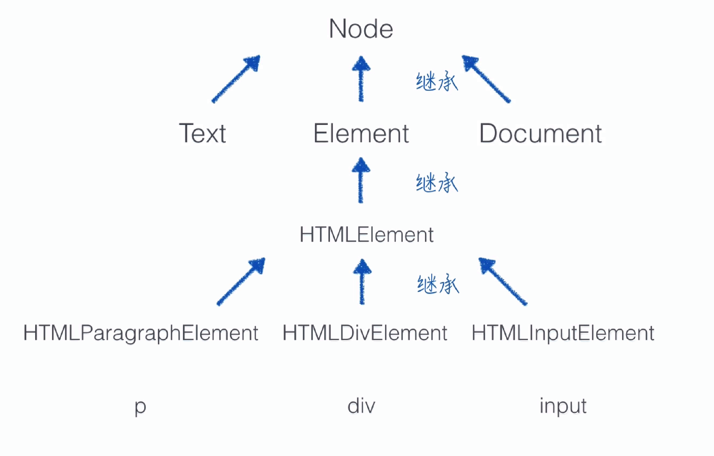

- [0. 进阶之前](#0-%e8%bf%9b%e9%98%b6%e4%b9%8b%e5%89%8d)
  - [导师的建议](#%e5%af%bc%e5%b8%88%e7%9a%84%e5%bb%ba%e8%ae%ae)
  - [不断迭代的web技术](#%e4%b8%8d%e6%96%ad%e8%bf%ad%e4%bb%a3%e7%9a%84web%e6%8a%80%e6%9c%af)
  - [web 历史](#web-%e5%8e%86%e5%8f%b2)
    - [HTTP 协议](#http-%e5%8d%8f%e8%ae%ae)
    - [浏览器](#%e6%b5%8f%e8%a7%88%e5%99%a8)
- [1. Part1-JS进阶](#1-part1-js%e8%bf%9b%e9%98%b6)
  - [1.1. 创建对象](#11-%e5%88%9b%e5%bb%ba%e5%af%b9%e8%b1%a1)
    - [1.1.1. 聊聊函数](#111-%e8%81%8a%e8%81%8a%e5%87%bd%e6%95%b0)
      - [1.1.1.1. arguments](#1111-arguments)
      - [1.1.1.2. this](#1112-this)
      - [1.1.1.3. 函数的属性](#1113-%e5%87%bd%e6%95%b0%e7%9a%84%e5%b1%9e%e6%80%a7)
      - [1.1.1.4. 函数是一等公民](#1114-%e5%87%bd%e6%95%b0%e6%98%af%e4%b8%80%e7%ad%89%e5%85%ac%e6%b0%91)
      - [1.1.1.5. 闭包](#1115-%e9%97%ad%e5%8c%85)
    - [1.1.2. 构造函数](#112-%e6%9e%84%e9%80%a0%e5%87%bd%e6%95%b0)
    - [1.1.3. 构造函数的不足之处](#113-%e6%9e%84%e9%80%a0%e5%87%bd%e6%95%b0%e7%9a%84%e4%b8%8d%e8%b6%b3%e4%b9%8b%e5%a4%84)
    - [1.1.4. 原型](#114-%e5%8e%9f%e5%9e%8b)
      - [1.1.4.1. constructor](#1141-constructor)
      - [1.1.4.2. 读写](#1142-%e8%af%bb%e5%86%99)
      - [1.1.4.3. isPrototypeOf](#1143-isprototypeof)
      - [1.1.4.4. 小结](#1144-%e5%b0%8f%e7%bb%93)
      - [1.1.4.5. 原型的缺陷（共享的缺陷）](#1145-%e5%8e%9f%e5%9e%8b%e7%9a%84%e7%bc%ba%e9%99%b7%e5%85%b1%e4%ba%ab%e7%9a%84%e7%bc%ba%e9%99%b7)
    - [1.1.5. 构造函数 + 原型 （完美的创建对象的方式）](#115-%e6%9e%84%e9%80%a0%e5%87%bd%e6%95%b0--%e5%8e%9f%e5%9e%8b-%e5%ae%8c%e7%be%8e%e7%9a%84%e5%88%9b%e5%bb%ba%e5%af%b9%e8%b1%a1%e7%9a%84%e6%96%b9%e5%bc%8f)
  - [1.2. 继承](#12-%e7%bb%a7%e6%89%bf)
    - [1.2.1. 继承的概念](#121-%e7%bb%a7%e6%89%bf%e7%9a%84%e6%a6%82%e5%bf%b5)
    - [实现继承](#%e5%ae%9e%e7%8e%b0%e7%bb%a7%e6%89%bf)
    - [原型链继承的缺陷](#%e5%8e%9f%e5%9e%8b%e9%93%be%e7%bb%a7%e6%89%bf%e7%9a%84%e7%bc%ba%e9%99%b7)
    - [借用构造函数继承](#%e5%80%9f%e7%94%a8%e6%9e%84%e9%80%a0%e5%87%bd%e6%95%b0%e7%bb%a7%e6%89%bf)
    - [组合继承](#%e7%bb%84%e5%90%88%e7%bb%a7%e6%89%bf)
    - [组合继承的不足](#%e7%bb%84%e5%90%88%e7%bb%a7%e6%89%bf%e7%9a%84%e4%b8%8d%e8%b6%b3)
    - [最佳实践](#%e6%9c%80%e4%bd%b3%e5%ae%9e%e8%b7%b5)
    - [面向对象实际应用的例子：Node 和 Element](#%e9%9d%a2%e5%90%91%e5%af%b9%e8%b1%a1%e5%ae%9e%e9%99%85%e5%ba%94%e7%94%a8%e7%9a%84%e4%be%8b%e5%ad%90node-%e5%92%8c-element)
    - [面向对象](#%e9%9d%a2%e5%90%91%e5%af%b9%e8%b1%a1)
        
# 0. 进阶之前
## 导师的建议
- 多看书，形成体系
- 多交流，想成为大牛必须先接近大牛
- 一遍不懂就多看几遍，提到了 [imweb 社区](https://imweb.io/topic/tab/all)
- 学好英语

## 不断迭代的web技术
- 新技术新框架层出不穷，如何跟上脚步
- web技术的本质没有发生改变，工具化和工程化上有了较多的演变
- 所以要认识以下web技术的历史

## web 历史
- 蒂姆·伯纳斯·李 ： 英国计算机科学家， web 的设计者，实现者，web 标准的引领者，他是 web 之父
- 1989年提出了整套 web 的解决方案，包括服务器，网络协议和浏览器，1990年凭借一人之力完成了web所需的所有工具的研发，1991年对外发布
- 重要李里程碑：
    - 免费：1993年4月，CERN宣布任何人都可以免费的 web 协议和代码，至此免费的 World Wide Web 干掉了收费的 Gopher
    - 标准化：1994年10月 Tim Berners-Lee 在 MIT 成立了 W3C 。通过定义标准，让行业成员实现兼容一致，为 web 后续的发展奠定了坚实的基础

### HTTP 协议
- HTTP 协议是 web 的基础，所以常以是否了解HTTP协议来区分你是一个基础的开发者还是高级的开发者
- HTTP 协议最终会发布为一系列的 RFC 文档：最有名的是 **1999年：HTTP 1.1 (RFC2616)** ， 之后 **2015年：HTTP 2.0 (RFC7540)** 将逐渐成为主流
- 所以你想要深入的理解 HTTP 协议，就要搞清楚，RFC2616 和 RFC7540 到底讲了什么

### 浏览器
- 浏览器是 web 架构的重要组成部分，决定了web如何向用户呈现，因为直接面向用户，具有很高的商业价值，所以她的历史就更加精彩
    - 1993 UIUC 的学生 Marc Andreessen 和 Eric Bina 研发 Mosaic 
    - Marc Andreessen 毕业创立了 Netscape （网景）公司，1994年发布 Netscape Navigator，短短4个月就占据了市场份额的70%
    - 微软感受到了压力，有没有足够时间开发，就以200万美元购买了 Mosaic 的授权，开发了 IE 浏览器，**浏览器大战**一触即发
    - 此时浏览器只能展示网页，无法与用户交互，所有数据必须传送到服务器，才能与用户交互，此时 Netscape 意识到，web需要变得更加动态， Marc Andreessen 需要一种脚本语言，可以嵌入网页中，于是他招募了 布兰登·艾克（Brendan Eich）让他去实现 Netscape 的动态语言，为了赶排期，布兰登·艾克只花了10天时间，完成了脚本语言的设计，由于时间很短，js语言的设计不够严谨，到之后来很长一段时间，JS 写出来的程序都很混乱
    - 随着 Netscape 2.0 的发布 IE 也马上发布了 3.0 （支持 JScript 支持 VBScript 支持 Java 支持 CSS）
        - IE 3.0 成为第一个支持 CSS 的商用浏览器
        - CSS 在1994年由 Hakon Wium Lie （哈克维姆莱，是蒂姆·伯纳斯·李的同事，他认为更美观的超文本会让web发展的更好，于是他在公共邮件组提出了几种方案）和 Bert Bos （她的建议是最有建设性的） 共同设计
    - 至此浏览器端网页开发的三剑客已全部出现，HTML CSS JS
- 1998 年 IE 占有率超过网景，并在 2002年达到 96% ，第一次浏览器大战结束
- IE 大胜之后也停止了创新，2001年发布6.0之后5年内都没有新的浏览器发布，由于IE 的不思创新，不思进取和安全性的问题，FireFox 和 Opera 的开源浏览器占据一定的市场份额，直到2008年 google 发布了 Chrome ，IE 占有率持续下降
- 由于 Chrome 对web标准的支持IE、安全性、稳定性以及技术创新都有很好的表现，Chrome在发布之后，到今天为止，已经成为世界上第一的浏览器 ，Chrome 成为第二次浏览器大战的赢家 


# 1. Part1-JS进阶

## 1.1. 创建对象
- 创建一个对象很简单，那创建四个呢？
    - 可以复制，但如果有很多很多呢？所以，复制是解决不了根本问题的
    - 有很多的简单的方法让我们创建很多很多的对象
- 工厂模式：函数传参，返回相应的对象。
    - 有一个严重的问题：无法证明这个工厂造的这个对象杯子是“杯子”
 
### 1.1.1. 聊聊函数

#### 1.1.1.1. ```arguments```
- 是一个对象，不是数组，是类数组，有 length 属性。
- 建议不要滥用，比如使用 ```arguments[0]``` 会很影响代码可读性
- 非常适合动态参数（参数数量不定）的场景

```javascript
function superAdd(){
    var len = arguments.length,
        result = 0,
        i;

    if(len){
        for(i = 0; i < len; i ++ ){
            result = result + arguments[i];
        }
    }
    return result;
}
superAdd(1, 2);
superAdd(1, 2, 3);
superAdd(1, 2, 3, 4);
```

#### 1.1.1.2. ```this```
- 全局作用域指向 ```window```；
- 对象的方法中的 ```this``` ，指向这个对象；
- ```this``` 的指向并不能在定义时确定，在调用时才能确认。


```javascript
window.name = "jero";
var o = {
    name : "henry"
};

function sayName() {
    console.log(this.name);
}

sayName();          // "jero"

o.sayName = sayName;
o.sayName();        // "henry"
```

- 改变 ```this``` 的指向

    - bind 传入一个对象，将 ```this``` 指向这个对象

    ```javascript
    window.name = "jero";
    var o = {
        name : "henry"
    };

    function sayName() {
        console.log(this.name);
    }

    o.sayName = sayName.bind(window);
    o.sayName();        // "jero"
    ```

    - ```call, apply``` 改变 ```this``` 的指向

    ```javascript
    window.name = "jero";
    var o = {
        name : "henry"
    };
    function sayName(){
        console.log(this.name);    
    }
    // apply
    sayName.apply(o);       // "jero"
    // call
    sayName.call(o);        // "jero"

    // apply 和 call 的区别：传参的时候 apply 要传数组，call 直接逗号传就可以，e.g.
    function sayName(){
        console.log(this.name , arguments); 
    }
    sayName.call(o , 1 , 2);
    sayName.apply(o , [1 , 2]); 
    ```

#### 1.1.1.3. 函数的属性
- 函数名 ```name```
- 形参的个数 ```length``` ，在函数声明的时候就确认了
    - 区别：实参的个数 ```arguments.length``` ，在函数被调用的时候确才认的
- 原型 ```prototype``` 是一个对象，继承的关键

#### 1.1.1.4. 函数是一等公民 
- 一等公民其实是 ```First Class``` 的翻译，（毫无疑问这是个糟糕的翻译）
- ```First Class``` 其实是数据类型的一类，以下这三类分类是跨语言的
    - ```First Class``` 可以作为函数的参数和返回值，也可以赋给变量
    - ```Second Class``` 可以作为函数的参数，但不能从函数返回，也不能赋给变量
    - ```Third Class``` 不能作为函数的参数

```javascript
var add = function(a, b){
    return a + b;
}

// 另一种声明方式：最后的参数是 函数体，前边的参数就是参数
var add = new Function("a", "b", "return a + b");

// 函数 可以作为 函数的参数 的例子：回调函数
[1, 2, 3].sort(function(a, b){
    return a < b;
});

// 函数作为返回值 
function createScope(member){
    return function(){
        return member;
    }
}

var getHenry = creatScope("henry");
getHenry();

var getJero = creatScope("jero");
getJero();

// 上边这个例子涉及到一个非常重要的思想：不可修改的变量，也叫私有变量
// 这样创建私有变量、私有方法 的方法称之为 闭包
```

#### 1.1.1.5. 闭包 
- **闭包** 是指有权访问另一个函数作用域中变量的函数。——《JavaScript高级程序设计》
- 怎么理解这句话？分两步：
    - 闭包是**函数**。什么样的函数？
    - 有权访问另一个**函数作用域**中变量 的**函数**。

```javascript
function foo(){
    var a = "test";

    function bar(){
        console.log(a);
    }
    bar();
}
foo();
```
- 这个函数闭包的部分可以理解为这样，所以闭包又叫**带有数据的函数**

```javascript
var a = "test";

function bar(){
    console.log(a);
}
```

```javascript
function foo(){
    var a = "test";

    function bar(){
        console.log(a);
    }
    return bar;
}

var bar = foo();
bar();
```

### 1.1.2. 构造函数
- ```instanceof``` 判断对象是否是构造函数的实例

```javascript
// 原生构造函数
var obj = new Object();
var add = new Function("a", "b", "return a + b");

console.log(obj instanceof Object);     // true
console.log(add instanceof Function);   // true

// 同理 构造函数
var bottle = new Bottle("杯子", 59, true);
console.log(bottle instanceof Bottle);  // true

// 构造函数的声明
function Bottle(name, price, isKeepWarm){
    this.name = name;
    this.price = price;
    this.isKeepWarm = isKeepWarm;
}
// 约定：如果作为构造函数，要首字母大写
// 特点1：没有显示的创建对象
// 特点2：将 属性 和 方法 挂载到 this 上
// 特点3：没有 return 语句

// new 会做什么事儿？
// 1. 创建一个空对象
// 2. 
// 3. 
// 4. 
```
 
### 1.1.3. 构造函数的不足之处

```javascript
function Bottle(name, price, isKeepWarm){
    this.name = name;
    this.price = price;
    this.isKeepWarm = isKeepWarm;

    
    this.sayHello = function(){
        console.log("hello!");
    };

    // 这里的 sayHello 是一个 function 实例
    // this.sayHello = new Function({"console.log('hello!');"});
}

var bottle1 = new Bottle("马克杯", 29, false);
var bottle2 = new Bottle("保温杯", 99, true);

// 创建两个 Bottle 的实例伴随着创建了两个 sayHello 方法，并没有复用
// 这就是构造函数的缺陷：功能相同的函数，重复的声明消耗内存
// 要想解决这个问题，就要用到 “原型”
```

### 1.1.4. 原型
- **原型** 是函数的一个属性，是一个对象

#### 1.1.4.1. constructor

- ```constructor``` 指向它的构造函数
```javascript
Object.prototype.constructor === Object     // true
```
#### 1.1.4.2. 读写
- 原型 是可读，可写的
    ```javascript
    function Bottle(){
        this.sayName = function(){}
    }

    // 原型可写
    Bottle.prototype.name = "保温杯";
    Bottle.prototype.price = 99;
    Bottle.prototype.sayHello = function(){
        console.log("hello");
    };

    var bottle1 = new Bottle();
    console.log(bottle1);
    // 输出一个 Bottle 对象，只有一个属性 __proto__ ，这就是它的原型
    // 我们在代码里一定一定不要使用 __proto__ ，而要用 prototype 去访问原型
    // 疑惑：为啥代码中不能用 __proto__ ？

    console.log(bottle1.name);      // "保温杯"
    bottle1.sayHello();             // "hello!"

    // 那怎么证明解决了内存的问题呢？
    var bottle2 = new Bottle();
    console.log(bottle1.sayName === bottle2.sayName);       // false
    console.log(bottle1.sayHello === bottle2.sayHello);     // true
    ```
- 通过构造函数生成的对象都会 **共享** 这个构造函数的原型。利用这个特性，我们就能解决浪费内存的问题。

#### 1.1.4.3. isPrototypeOf
- 检验实例是否挂了这个构造函数的原型

```javascript
console.log(Bottle.prototype.isPrototypeOf(bottle1));   // true
```

#### 1.1.4.4. 小结
- **原型** 是函数的一个属性，是一个对象。
- 如果函数作为告诉早函数使用，那么这个构造函数的所有实例，都**共享**这个原型对象。

#### 1.1.4.5. 原型的缺陷（共享的缺陷）

- 先看一个例子

    ```javascript
    var price = 5;
    var priceCopy = price;

    priceCopy = 10;
    console.log(price, priceCopy);  // 5 ,10


    var color = ["红", "黄"];
    var coloCopy = color;

    colorCopy.push("蓝");
    console.log(color, colorCopy);  // ["红", "黄", "蓝"], ["红", "黄", "蓝"]
    ```
- 使用原型创建对象的例子

    ```javascript
    function Bottle(){}

    Bottle.prototype.color = ["红", "黄"];

    var bottle1 = new Bottle();
    var bottle2 = new Bottle();

    bottle1.color.push("蓝");

    console.log(bottle1.color);  // ["红", "黄", "蓝"]
    console.log(bottle2.color);  // ["红", "黄", "蓝"]
    ```
- 这样的共享会导致，我们不希望共享的属性被共享。

> 思考：多选题：一下哪些情形会有共享问题（变量 b 的值会受影响）

```javascript
// A
var a = 1;
var b = a;
a = 2;
console.log(b);

// B
var a = [1, 2, 3];
var b = a;
a.length = 2;
console.log(b);

// C
var a = {key : 1};
var b = a;
a = {key : 2};
console.log(b);

// D
var a = {key : 1};
var b = a;
a.key = 2;
console.log(b);


// 1
// [1, 2]
// {key: 1}
// {key: 2}
// 答案是 B D
```


### 1.1.5. 构造函数 + 原型 （完美的创建对象的方式）
- 通过 **构造函数** 创建独享的 **属性 & 方法**
- 通过 **原型** 创建共享的 **属性 & 方法**

    ```javascript
    // 通过 构造函数 创建独享的 属性 & 方法
    function Bottle(name, price, isKeepWarm){
        this.name = name;
        this.price = price;
        this.isKeepWarm = isKeepWarm;
    }

    // 通过 原型 创建共享的 属性 & 方法
    Bottle.prototype.sayName = function(){
        console.log(this.name);
    };
    Bottle.prototype.for = "盛水";

    var bottle = new Bottle("超级保温杯", 299, true);
    ```
- 注意几点
    - 属性的覆盖：如果构造函数和原型上都有这个属性，**构造函数中的属性会覆盖原型上的属性**
    - 判断对象有没有 某个属性。
        - ```in``` 操作符，只能判断对象有没有某个属性，不能判断是不是原型上的属性

            ```javascript
            console.log("name" in bottle);    // true
            console.log("for" in bottle);    // true
            ```
        - ```hasOwnProperty``` 操作符

            ```javascript
            console.log(bottle.hasOwnProperty("name"));    // true
            console.log(bottle.hasOwnProperty("for"));    // false
            ```

## 1.2. 继承
- 先看一段代码

    ```javascript
    // 飞机
    function Airliner(color){
        this.color = color;
        this.passengers = [];
    }
    Airliner.prototype.fly = function(){
        console.log("flying");
    }

    // 如果我们还需要战斗机
    function Fighter(color){
        this.color = color;
        this.bullets = [];
    }
    Airliner.prototype.fly = function(){
        console.log("flying");
    }
    Airliner.prototype.shoot = function(){
        console.log("biu biu biu");
    }

    // 我们发现 这些部分是一样的，这就造成了代码冗余，浪费内存的问题
    this.color = color;

    fly = function(){
        console.log("flying");
    }
    ```
- 有一种很好的模型可以解决这个问题，他就是继承

### 1.2.1. 继承的概念
- 继承可以使子类具有父类的属性和方法，而不需要重复编写相同的代码。
- 抽离共性作为父类用来继承，保留个性。

### 实现继承

- 目标：子类具有父类的方法和属性
- 做法：将 **子类的原型** 指向 **父类的实例**

    ```javascript
    // 父类 Plane 飞机
    function Plane(color){
        this.color = color;
    }

    // 父类的公有方法
    Plane.prototype.fly = function(){
        console.log("flying");
    }

    // 子类 Fighter 战斗机
    function Fighter(){
        this.bullets = [];
    }

    // 子类的原型指向父类的实例
    Fighter.prototype = new Plane("blue");

    // 子类的特有方法
    Fighter.prototype.shoot = function(){
        console.log("biu biu biu");
    }

    // 检验一下继承的效果
    var fighter = new Fighter();
    console.log(fighter.color); // "blue"
    fighter.fly();              // "flying"
    ```

### 原型链继承的缺陷

1. constructor 的指向问题

    ```javascript
    // constructor 的指向问题 ： 子类的原型指向父类的实例之后，发现子类的构造函指向了父类
    Fighter.prototype = new Plane("blue");
    var fighter = new Fighter();
    console.log(fighter.constructor); // Plane

    // 要解决这个问题也很简单，只要【手动】将子类的 constructor 指向子类就行了
    Fighter.prototype = new Plane("blue");
    Fighter.prototype.constructor = Fighter;
    ```

2. 属性共享问题

    ```javascript
    function Plane(color){
        this.color = color;
        this.pilots = [];   // 有这种复杂类型就麻烦了
    }

    fighter1.pilots.push("kevin");
    console.log(fighter2.pilots);   // ["kevin"]

    // 关于这一段的疑问：老师说是会受影响，但是我试过之后是没有影响的呀，大雾🤨
    ```

3. 参数的问题：如果是父类的参数，子类不好修改，比如上边例子中 Plane 的 color 参数

### 借用构造函数继承
- 借用父类的构造函数
- 可以传递参数

    ```javascript
    function Plane(color){
        this.color = color;
    }

    // 原型链上的方法是继承不到的
    Plane.prototype.fly = function(){
        console.log("flying");
    }

    function Fighter(color){

        // 这里是关键：把 Plane 这个构造函数的 this 指向到 Fighter 上，call 的 第一个参数 this 指的就是 Fighter 。
        // 这里的 Plane 被当做了一个普通函数执行
        Plane.call(this, color);   

        this.bullets = [];
    }

    var fighter = new Fighter("blue");
    console.log(fighter.color);     // "blue"
    console.log(fighter.fly);       // undefined 
    ```
- 但是父类原型上的方法都继承不了
- 所以也不能单独使用


### 组合继承

    ```javascript
    // 父类 Plane 飞机
    function Plane(color){
        this.color = color;
    }

    // 父类原型上的公有方法
    Plane.prototype.fly = function(){
        console.log("flying");
    }

    // 子类 Fighter 战斗机
    function Fighter(color){

        // 借用借用 父类的构造函数 继承实例属性 【解决共享的问题】（这还是有疑问，回头再理解理解）
        Plane.call(this, color);  
        this.bullets = [];
    }

    // 子类的原型指向父类的实例，实现【继承父类的原型链】
    Fighter.prototype = new Plane();

    // 然后，手动将子类的 constructor 指向子类，【解决构造函数指向父类的问题】
    Fighter.prototype.constructor = Fighter;

    // 这是子类的特有方法
    Fighter.prototype.shoot = function(){
        console.log("biu biu biu");
    }

    // 检验一下继承的效果
    var fighter1 = new Fighter("blue");
    var fighter2 = new Fighter("red");
    ```
- 属性和方法都是从父类继承的（实现了代码复用）
- 继承的属性是私有的（互不影响）
- 继承的方法都在原型里（函数复用）

### 组合继承的不足
- 重复调用父类的构造函数

    ```javascript
    // 创建一个 Fighter 对象时，会调用 Plane 两次
    var fighter = new Fighter("blue");

    // 第一次调用
    Fighter.prototype = new Plane();

    // 第二次调用
    Plane.call(this, color);  
    ```
- 属性冗余

    ```javascript
    // 创建的 Fighter 对象，有两个 color 属性
    var fighter = new Fighter("blue");
    console.log(fighter);

    // 以下是输出的 fighter
    Fighter {color: "blue", bullets: Array(0)}
        bullets: []
        color: "blue"
        __proto__: Plane
            color: undefined
            constructor: ƒ Fighter(color)
            shoot: ƒ ()
            __proto__: Object
    // Plane 这一层上的 color 一直是被 Fighter 上的 color 覆盖掉的，永远调用不到，也就没有必要存在
    ```
### 最佳实践
- 对于  重复调用父类的构造函数，我们可以在 ```Fighter.prototype = new Plane();``` 上下功夫
- 这段代码的目的是将父类原型上的方法，扩展到子类的原型上来
- 我们可以不通过调用构造函数来达成这个目的：

    ```javascript
    /**
     * @parm function child - 子类
     * @parm function parent - 父类
     */
    function inheritPrototype(child, parent){
        var protoType = Object.creat(parent.prototype);     // 复制父类的原型
        protoType.constructor = child;                      // 重置 constructor
        child.prototype = protoType;                        // 修改子类的原型
    }
    ```
- 最佳实践：
    - 基于组合继承
    - 不必调用父类的构造函数，只需要继承原型

    ```javascript
    // 父类
    function Plane(color){
        this.color = color;
    }
    Plane.prototype.fly = function(){
        console.log("flying");
    }

    // 子类
    function Fighter(color){
        Plane.call(this, color);  
        this.bullets = [];
    }

    inheritPrototype(Fighter, Plane);
    function inheritPrototype(child, parent){
        var protoType = Object.creat(parent.prototype);     // 复制父类的原型
        protoType.constructor = child;                      // 重置 constructor
        child.prototype = protoType;                        // 修改子类的原型
    }

    // 这是子类的特有方法
    Fighter.prototype.shoot = function(){
        console.log("biu biu biu");
    }


    // 检验一下继承的效果
    var fighter1 = new Fighter("blue");
    var fighter2 = new Fighter("red");
    ```

### 面向对象实际应用的例子：Node 和 Element
1. 在 Chrome 的开发者工具中的 Elements 标签下 点选一个 div 元素
2. 在 Console 标签运行 ```console.dir($0)``` ，就能看到这个 DOM 的继承关系，以及面向对象的思想




### 面向对象
- 两个重要概念： **封装** 和 **继承**
- 三个重要的目的（优点）： **减少重复** 、 **易于维护** 、 **方便扩展**


```javascript

```


```javascript

```


```javascript

```