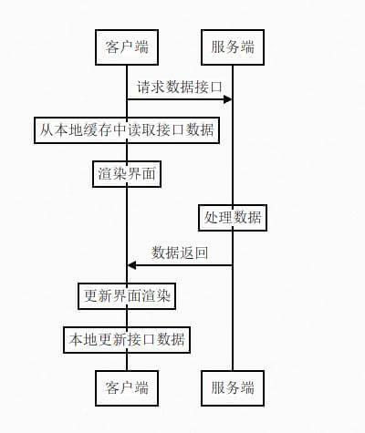

# H5体验优化方案

## 加载速度优化
### 资源离线

- 在非首次进入界面的时候，页面不需要等待网络数据返回，就可以进行界面渲染，渲染的初始数据和资源来自于本地的缓存，页面可以“秒开”。而当服务端的数据返回之后，本地的渲染会再次更新，缓存也被更新。

- 优点：
    - 非首次进入的时候，秒开
- 缺点：
    - 首次加载不可避免
    - 不适合数对据新旧敏感的网页
    - 数据的更新容易出错

### vue 路由拆分（减小请求大小）

### 冗余代码清除（减小请求大小）

### 骨架屏（让用户知道页面正在加载中，减轻等待焦虑）

### 图片资源使用 webp ，无损压缩可以减少 20% 到 40% 的体积，有损压缩可以减少 50% 到 80% 的体积 （做兼容区分，不兼容 webp 的使用 原图）

## 页面体验优化

### 页面内容变化动画

### 用户操作反馈
- active 变色

