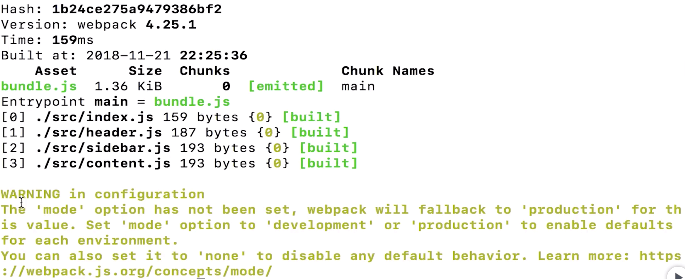

# 1. Webpack

<!-- 
imooc 
https://coding.imooc.com/learn/list/316.html
主讲： Dell Lee

Find /myOwn/README.MD -> helbo -> apsid
 -->

## 1.1. 导学
- webpack 的优势： tree shaking 、 代码懒加载 、 代码分割  等等
- 学习 webpack 可以极大拓宽前端开发视野，对前端工程化有更深的理解


# 2. 初识 Webpack

## 2.1. Webapck 是什么
- 为了解决项目越来越大，文件越来越多的开发痛点
- **ES Module** 模块 **引入** 方式
    ```javascript
    import Header from "./Heaeder.js";
    ```
- **ES Module** 模块 **导出** 方式
    ```javascript
    function Heaeder(){
        ...
    }
    export default Header;
    ```
- Webpack 是一个 **模块打包工具**
    - 刚推出的时候只是 js 的打包工具
    - 随着发展， Webpack 还可以打包图片，css 等文件
- Webpack 同样能识别 CommonJS CMD AMD 的引入方式

    ```javascript
    // CommonJS 引入
    var Header = requer("./Header.js");

    // CommonJS 导出
    function Heaeder(){
        ...
    }
    module.exports = Header;
    ```

### 2.1.1. 【作业】文档阅读： 
- [Modules](https://webpack.js.org/concepts/modules/) ，对模块化的基本概念有比较明确的认识
- [Module Methods](https://webpack.js.org/api/module-methods/)
- [Module Variables](https://webpack.js.org/api/module-variables/)


## 2.2. webapck 的正确安装方式
1. 创建 webpack-demo 文件夹并进入
    ```shell
    mkdir webpack-demo && cd webpack-demo
    ```
2. 初始化项目： ```npm init``` 可以帮助我们以 ```Node``` 的规范创建一个 ```Node``` 的包文件 ```package.json```
    ```shell
    npm init
    ```
    - ```package.json``` 描述了这个项目的信息
    - 打开 ```package.json``` 可以加一个 ```"private": true,``` ，表示这是一个私有项目，不会被发送到 npm 的线上仓库里边去
    - 把 ```"main": "index.js",``` 这一行去掉，因为我们这个实验项目没有必要向外暴露一个 js 文件
    - ```scripts``` 对象里的内容也可以先去掉
    - ```author``` 改成自己的名字
    - ```license``` 如果大家想开源，可以写成 ```IMT```， ```ISC``` 也是 OK 的。
3. 安装 webpack ：（有两种方式）
    1. 全局安装
        ```shell
        # 全局安装 webpack 和 webpack-cli （这里其实只要安装 webpack-cli 它会自动帮我们安装 webpack）
        npm install webpack webpack-cli -g

        # 测试 webpack 是否安装成功 ，如果打印出版本号说明全局已经安装好 Webpack 了
        webpack -v
        ```
        - **非常不推荐全局安装**，因为有这样的问题：
            - 假如我有两个项目，两个项目是不同的版本号的 一个是用 Webpack3 打包的，另一个是用 Webpack4 打包的
            - 如果你全局只安装了 Webpack4 就只能跑 Webpack4 的项目
            - 如果你想跑 Webpack3 的项目，就只能卸载 Webpack4 重装 Webpack3 这已经很麻烦了
            - 再如果这两个项目又有依赖关系，必须同时使用，此时全局只有一个版本的 Webpack 就不行了
            - 解决这些问题的办法就是 项目内安装 Webpack 
            - 在此之前，你可以先把 全局的 webpack 卸载掉
            ``` shell
            npm uninstall webpack webpack-cli -g

            # 此时再执行 webpack -v 会提示没有这个命令
            webpack -v
            ```
    2. **项目内安装 推荐**
        ``` shell
        # 先进入你要安装 webpack 的项目目录， 我以 webpack-demo 为例
        cd webpack-demo

        # 安装 webpack 和 webpack-cli ， 其中 --save-dev 等同于 -D
        npm install webpack webpack-cli --save-dev

        # 此时执行 webpack -v 是打不出东西的
        webpack -v

        # 我们可以使用 npx 来查看，npx 会帮助我们再当前项目的 node_modules 文件夹下找相应的命令，
        npx webpack -v 
        # 我的运行结果是 4.35.3   
        ```
        - 所以安装在项目内之后，我们就可以借助 ```npx``` 命令来使用 Webpack 了
        - 如果我有另一个项目 使用的是 webpack 4.25 的版本
            ```shell
            mkdir webpack-demo2 && cd webpack-demo2

            # 加 -y 他就不会问你怎么配置了，直接全 yes 
            npm init -y

            # 想要安装 4.25 版本 ，那我又不知道这个版本是否存在咋办？ 运行一下 npm info ，打印结果的最顶部的部分就能看到它的版本信息
            npm info webpack

            # 不妨安装一个老一点的 4.16.5 的版本，要安装固定版本，在包名后跟 "@版本号" 即可
            npm install webpack@4.16.5 webpack-cli -D

            # 看一下版本号 ，打印的是 4.16.5
            npx webpack -v 
            
            ```
        - 同样的打开 ```package.json```， 添加 ```"private": true,``` ，不要 ```"main": "index.js",``` ，删掉 ```scripts``` 对象里的内容
    3. 协作的时候是不会把 node_modules 上传版本库的（通常在 .gitignore 中写入 node_modules ）， 当你下载别人的项目后，需要进入项目文件夹，执行：
        ```shell
        npm install
        ```
        - 这个命令会根据 ```package.json``` 文件的内容下载安装你的依赖包，这样 node_modules 就回来了。

## 2.3. webpack 的配置文件
- webpack 需要你通过这个配置文件告诉他这么打包，打包到哪里
- 之前的打包操实际上用的是 **webpack 的默认配置**
    ```shell
    # 之前的打包操作： 需要传入打包的文件名，webpack 会帮你自动打包到 dist 目录下，并起名为 main.js  
    npx webpack index.js

    # 如果现在执行
    npx webpack 

    # webpack 就会报错，因为他不知道你要打包什么东西， 此时就要用到 webpack 的配置文件了
    ```

1. 在项目目录创建一个名为 **webpack.config.js** 的文件，写入以下内容
    ```javascript
    const path = require("path");

    module.exports = {
        entry: "./index.js",                // 打包的入口文件
        output: {                           // 输出配置
            filename: "bundle.js",          // 输出文件名
            path: path.resolve(__dirname, "bundle")     // 输出路径，要写绝对路径，此时我们需要一个 path 模块
        },
    }

    // 解释：调用了 path.resolve 方法， __dirname 是 node 的默认变量
    // 指的是当前 webpack.config.js 这个文件坐在的目录
    // path.resolve 把一个路径或路径片段的序列解析为一个绝对路径
    path.resolve(__dirname, "bundle")
    ```
2. 此时只要执行以下命令即可打包，webpack 会根据 刚写的这个配置文件进行打包，所以也不需要写文件名（之前写文件名是这样： ```npx webpack inde.js```）
    ```shell
    npx webpack
    ```
    - 执行完后，项目目录下会多一个 bundle 文件夹，这个文件夹里还会有一个 bundle.js 
    - 梳理一下流程
        1. 当你在项目文件夹下，执行 ```npx webpack``` 的时候， webpack 并不知道不要打包什么
        2. 于是，他就会找默认的配置文件 webpack.config.js 
        3. 然后他就知道了应该这么打包，怎么输出
    - 如果把 webpack.config.js 改名为 webpackconfig.js 再执行 ```npx webpack``` 同样会像没有配置文件时报一样的错
        - 这是因为 webpack 默认的配置文件名就是 webpack.config.js 
        - 如果就是想要让 webpack 使用这个 webpackconfig.js 配置文件，也很简单：
        ```shell
        npx webpack --config webpackconfig.js
        ```
        - 意思是 webpack 你来帮我打包，以哪个配置文件打包呢？ 以 webpackconfig.js 配置文件打包
        - 注意这个命令就直接帮你打包了，并不会永久修改 webpack 使用的配置文件，你执行 ```npx webpack``` 同样会去找 webpack.config.js 这个配置文件

    - 此时的项目目录是这样的：
        ```
        |-- lesson
            |-- bundle
                |-- bundle.js
            |-- node_modules
                |-- webpack
                |-- webpack-cli
                |-- ...
            |-- content.js
            |-- header.js
            |-- index.js
            |-- index.html
            |-- package-lock.json
            |-- package.json
            |-- sidebar.js
            |-- webpack.config.js
        ```
    - 优化一下目录结构
        - 删掉 bundle 文件夹
        - 新建 src 文件夹 （源代码文件夹）
        - 把  content.js 、 header.js 、 index.js 、 sidebar.js 移入 src 目录下
            ```
            |-- lesson
                |-- node_modules
                    |-- webpack
                    |-- webpack-cli
                    |-- ...
                |-- src
                    |-- content.js
                    |-- header.js
                    |-- index.js
                    |-- sidebar.js
                |-- index.html
                |-- package-lock.json
                |-- package.json
                |-- webpack.config.js
            ```
        - 同时要修改 webpack.config.js
            ```javascript
            const path = require("path");

            module.exports = {
                entry: "./src/index.js",                // 修改index.js 的位置
                output: {
                    filename: "bundle.js",
                    path: path.resolve(__dirname, "dist")     // 通常叫 dist
                },
            }
            ```
3. 使用 npm scripts 简化打包代码
    - 打开 package.json 编辑 scripts 对象
        ```javascript
        scripts: {
            "bundle": "webpack"
        }
        ```
    - 再打包的时候，就不用 ```npx webpack``` 了，使用这个命令就行
        ```shell
        npm run bundle
        ```
    - 这里涉及到了一个 npm scripts 的知识点
        - 当运行 ```npm run bundle``` 的时候，实际在运行的是 scripts 中 "bundle" 对应的命令
        - 那为啥不写成 ```"bundle": "npx webpack"``` 呢？
        - 实际上，在 scripts 中配置的命令会先在工程目录下的 node_modules 中找这个命令，如果这里边有，他直接就会用了
    - 这时候就和 Vue / React 的项目很像了
    - 把 index.html 移入 dist 目录下，并修改 index.html 中对 bundle.js 的引用，打开 index.html ， 此时页面时可以正常运行的。

### 2.3.1. 小结
- 之前我们用 webpack 打包用了三种方式
    1. 全局安装 webpack 
        ```shell
        webpack index.js
        ```
    2. 项目内安装 webpack
        ```shell
        npx webpack index.js

        # 还可以写配置文件，直接
        npx webpack
        ```
    3. npm script
        ```shell
        # 实际被翻译成了 webpack
        npm run bundle
        ```
- 这三种方式归根结底都是在命令行使用 ```webpack``` 这个命令
- 还记得安装的 **webpack-cli** 吗？ 它的 **作用** 就是让我们可以在命令行中使用 ```webpack``` 的命令


### 2.3.2. 【作业】文档阅读： 
    - [Getting Started](https://webpack.js.org/guides/getting-started/)  巩固本节课程讲的内容


## 2.4. 浅析 webpack 打包输出内容
1. 执行打包命令后，打印的内容分析
    
    - Hash: 哈希值，本次打包唯一的一个哈希值
    - Version: 是指本次打包使用的 webpack 办版本
    - Time: 本次打包用时
    - Built at: 执行打包的时间
    - Asset: 表示打包出的文件
    - Size: 文件大小
    - Chunks: 放的是输出文件对应的 ID
    - Chunk Names: 放的是输出文件对应的名字
        - 那这个 main 是哪来的？ 在 webpack.config.js 中
            ```javascripit
            entry: "./src/bundue.js",

            // 就相当于 下边这段代码的简写
            entry: {
                "main": "./src/bundue.js"
            },
            ```
    - Entrypoint main = bundle.js : 说明入口文件是 bundle.js
    - 再往下就是打包的步骤了
    - 最下边的警告部分，它说我们在打包的时候没有指定打包的环境 或者打包的模式，可以在 webpack.config.js 中写入
    ```javascript
    mode: "production",
    ```
    - 再编译就不会报警告了，这个 production 是编译压缩，如果你不想压缩，可以改为 development


# 3. webpack 核心概念

- 学习这章之前先问自己几个问题：
    - webpack 是什么？
    - 模块是什么？
    - webpack 配置文件的作用是什么？

## 3.1. loader 
- 如果要打包图片，该怎么办
    ```javascript
    // 假如我们想要在 index.js 引入图片，常尝试这么做
    var avatar = require("./avatar.jpg");
    ```
    - 执行打包命令
        ```shell
        npm run bundle
        ```
    - 报错了，webpack 说他不认识 ./avatar.jpg ，这是因为 webpack 是默认可以打包js文件的，但是 webpack 不知道怎么打包图片文件 

- 此时需要告诉 webpack 我们要打包图片，怎么告诉 webpack 呢？ 没错，还是配置文件
    1. 修改配置文件
        ```javascript
        // 在 webpack.config.js 里 exports 的对象中写入 module ， 也就是模块配置，其中的 rules 是规则，可以写多条
        module: {
            rules: [{
                test: /\.jpg$/,
                use: {
                    loader: "file-loader"
                }
            }]
        }
        ```
    2. 需要安装一下这个 loader :
        ```shell
        npm install file-loader -D

        # 然后运行 打包
        npm run bundle
        ```
- 打包完之后，在看 dist 文件夹，里边多了一个 乱码名字的图片，打开这张图发现就是被打包的 avatar.jpg
- 那我们在 index.js 里 require 的结果是什么呢？打印一下
    ```javascript
    var avatar = require("./avatar.jpg");
    console.log(avatar);
    // bd81a2c0f7e09dc83ae8c36fd7c3a00a.jpg
    // 也就是打包完的这个文件名
    ```
### 3.1.1. 分析一下打包的流程
1. 有一个 index.js 文件，要对 index.js 进行打包，所以运行了 npm run bundle
2. 运行 npm run bundle 的时候，实际上你执行的是 package.json 里的 ```npm scripts``` 中配置的 ```webpack``` 这个命令
3. 此时 webpack 会去找他的配置，根据这个配置帮你打包
4. 当 webpack 遇到 index.js 中 引入 js 的语句时，它是知道怎么打包
5. 但当遇到 ```var avatar = require("./avatar.jpg");``` 这一句时， webpack 就傻了，不知道怎么打包
6. 此时他就去配置的 module 里看有没有能帮他的，谢天谢地，他遇到了 ```test: /\.jpg$/,``` 正好符合这个条件
7. 它就知道了对应的 ```file-loader``` 可以帮它打包这个文件，那我们是怎么知道 ```file-loader``` 可以打包这样的文件呢
8. 实际上我们是在完整的阅读了 webpack 的官方文档之后知道的，官网的 [loaders 下的 file-loader](https://webpack.js.org/loaders/file-loader/) 告诉了我们可以这么做
9. 回到我们的配置文件，再想一下， file-loader 的底层帮我们做了几件事儿？
    1. 当他发现你在项目里引入了一张图片时，他会把这张图片 copy 到 dist 目录下
    2. 会给这个图片改一个名字（这个名字我们也可以自定义）
    3. 把 dist 下的这个文件名返回给我们
10. file-loader 不仅可以打包 jpg ，还可以打包 png 、 svg 、 txt 、甚至是 excel
11. 换句话说，**如果你想在打包的过程中把某个文件 copy 到 dist 目录，并获得他的文件名，你就可以用 file-loader 来处理**

### 3.1.2. loader 是什么
- 上边的例子并不是想讲 file-loader 的用法，而是想告诉你 loader 是什么
- loader 是**打包的方案**，他知道对于一些文件该怎么打包， webpack 是不知道的，但是 loader 知道

### 3.1.3. 语法
- 上边的例子 引入图片时用的是 CommonJS 的语法(require)，也完全可以用 ES Module 的语法(import)来写
    ```javascript
    import avatar from "./avatar.jpg";

    var img = new Image();
    img.src = avatar;

    var root = document.getElementById("root");
    root.append(img);
    ```
- 打包


### 3.1.4. 小结 
- loader 是什么？因为 webpack 不能识别除 js 之外的文件，就需要 loader 帮助 webpack 打包他不认识的文件
- 怎么配置 loader ？在 webpack.config.js 中写入 module 配置项，通过 rules 配置 loader 
- 写过 Vue 的话，一定见过 这样的代码
    ```javascript
    import Header from "./Header.vue";
    ```
    - webpack 能打包吗？ 不能打包，因为他不认识 .vue 的文件，可以在 webpack.config.js 的 module 下的 rules 里添加一个对象
        ```javascript
        {
            test: /\.vue$/,
            use: {
                loader: "vue-loader"
            }
        }
        ```
    - 我怎么知道是 vue-loader 呢？ [Vue 官网](https://vue-loader.vuejs.org/zh/) 有对 vue-loader 的说明
    - 别忘了安装 vue-loader
        ```shell
        npm install vue-loader -D
        ```
- 最后：当你看到引入的文件不是以 .js 结尾的，就要想到，这时候就要使用 loader 了

## 3.2. 使用 loader 打包静态资源（图片篇）

### 3.2.1. file-loader
- 上一个例子中被打包的图片，文件名变成了一个常常的字符串。如果想让被打包的文件名字不变，需要对 loader 做一些别的配置
    ```javascript
    {
        test: /\.jpg$/,
        use: {
            loader: "file-loader",

            // 额外的配置，放在 options 中
            options: {                       
                // 这种配置的语法，我们称之为 placeholders 也就是 占位符
                name: "[name].[ext]"         // 希望打包的 文件名 和 后缀 都和老的文件一样
            }
        }
    }
    ```
- 将 bundle 文件夹下的打包生成的文件删除，重新运行 打包命令 ```npm run bundle``` 可以在 bundle 下看到 avatar.jpg 
- 关于 [placeholders](https://webpack.js.org/loaders/file-loader/#placeholders) 的说明
- 我们再来改改配置：给文件名加上哈希值、使其支持 png 、 gif 并且不打包到 dist 目录，打包到 images 目录
    ```javascript
    {
        test: /\.(jpg|png|gif)$/,                   // 添加 png gif 后缀的文件
        use: {
            loader: "file-loader",
            options: {
                name: "[name]_[hash].[ext]",        // 加上 哈希值
                outputPath: 'imagse/'               // 会打包到 dist/images 目录下
            }
        }
    }
    ```
- flie-loader 的配置项特别多，当你在使用过程中遇到问题时，可以查阅 [file-loader 的文档](https://webpack.js.org/loaders/file-loader/)

### 3.2.2. url-loader
- 把上边 file-loader 的配置直接改名为 url-loader （ file-loader 能做的事儿 url-loader 也能做）
- 安装 url-loader 后，运行打包，也是可以打包的
    ```shell
    npm install url-loader -D

    # 打包
    npm run bundle 
    ```
- 但是，发现一个问题： 图片并没有被打包到 dist 目录下，浏览器打开 index.html ，发现图片可以正确显示，这是为什么呢？
    - 当你用 url-loader 打包 jpg 文件时，它会把图片转为 base64 的字符串，放在 js 里，而不是单独生成一个文件
    - 优点：图片直接打包在 js 中，不用额外请求图片文件，节省了 Http 请求的次数
    - 缺点：如果图片源文件很大，打包生成的 js 也会很大，加载这个 js 耗费的时间也会越长，这样就导致页面加载时，在很长的时间内，页面什么都加载不出来
- 所以： url-loader 最佳的使用方式： 图片只有 1、2kb 时，把图片打包到 js 中是个明智的选择，没必要让一个 1、2k 的资源占一个请求。如果图片很大，就像 file-loader 一样打包到 dist 目录下，这样更合适。那如何做到这样的最佳实践呢？
    ```javascript
    {
        test: /\.(jpg|png|gif)$/,
        use: {
            loader: "url-loader",
            options: {
                name: "[name]_[hash].[ext]",
                outputPath: 'imagse/',
                limit: 2048                         // 添加一个 limit 配置项
            }
        }
    }

    // 这个配置项的意思是，如果超过 2048 个字节，就会像 file-loader 一样打包到 dist 目录下。
    // url-loader 和 file-loader 非常的类似，只是 url-loader 多了一个 limit 参数
     
    ```
> 作业： 阅读 url-loader 和 file-loader 的官方文档，读完之后对这两个 loader 的理解就没啥问题了


## 3.3. 使用 loader 打包静态资源（样式篇）

- 现在希望图片大小为 150 * 150 ，需要写样式来修饰这张图片，在 src 目录下新建 index.css ，写入以下内容：
    ```css
    .avatar {
        height: 150px;
        width: 150px;
    }
    ```
- 修改 index.js ：
    ```javascript
    import avatar from "./avatar.jpg";
    import "./index.css";                   // 引入 css 文件

    var img = new Image();
    img.src = avatar;
    img.classList.add("avatar");            // 给 img 标签添加类名

    var root = document.getElementById("root");
    root.append(img);
    ```
- 这样是不是就能缩小图片了呢？根据以往的经验肯定是不能的，在执行打包命令试试看：
    ```shell
    npm run bundle 
    ```
- 报错了，一定会这样，因为 webpack 不知道这么打包 css 文件，那怎么做呢？聪明的你一定想到了，没错，就是 webpack.config.js 
- 我们在 module 下的 rules 中添加一个对象：
    ```javascript
    {
        test: /\.css$/,
        use: ["style-loader", "css-loader"]
    }

    // 打包 css 的时候一般会用到两个 loader ，所以 use 就不能用对象了，而是要用数组来表示。
    ```
- 安装需要用到的 style-loader 和 css-loader 并打包：
    ```shell
    npm install style-loader css-loader -D

    # 打包
    npm run bundle 
    ```
- 来看一下打包流程
    - 首先在 index.js 中引入一个 index.css 
    - 打包的时候 webpack 不知道怎么处理 css 文件，我们在配置文件中告诉了 css 怎么打包
    - webpack 看到了 ```test: /\.css$/,``` 就会用 style-loader 和 css-loader 打包 css
    - 打包好了之后生成的 js 里就有了 css 相关的内容

### 3.3.1. style-loader 和 css-loader 做了什么？
- 现在的 css 内容非常简单，我们在 src 目录下新建一个 avatar.css 把 index.css 的内容拷贝到 avatar.css 中， index.css 改成这样
    ```css
    @import "./avatar.css"; 
    ```
- 现在的逻辑是： index.html 引用了 index.js ， index.js 引用了 index.css ， index.css 引用了 avatar.css 。再重新打包，发现还是一样的效果。
- **css-loader** 帮我们分析出 css 之间的关系，解析成一整段的 css 代码
- **style-loader** 帮我们把这段 css 挂载到页面的 head 中，可以通过检查元素查看 页面的 head 标签中有个 style 标签，他就是 style-loader 帮我们挂载上来的

### 3.3.2. Sass / Less / Stylus
- 先做一些修改：
    - 把 index.css 改名为 index.scss ，清空内容
    - 把 avatar.css 的内容粘贴回 index.scss ， 删除 avatar.css
    - 把 index.js 引入的 index.css 改为 index.scss 
    - 因为 sass 支持嵌套，我们修改一下 index.scss 的内容：
        ```scss
        body{
            .avatar {
                height: 150px;
                width: 150px;
            }
        }
        ```
- 此时打包能成功吗？ 肯定还是不行的，为什么？ 因为 index.js 引入的是 index.scss ， webpack 不知道怎么处理 .scss 后缀的文件
- 尝试修改 webpack.config.js
    ```javascript
    {
        test: /\.scss$/,                        // 这里把 /\.css$/ 改成了 /\.scss$/ 
        use: ["style-loader", "css-loader"]
    }
    ```
- 再打包，没有报错，好像打包成功了，看一下页面，发现样式并不是我们要的 150 * 150 ，为什么？
- 打开浏览器的开发者工具，我们发现 head 中的 style 标签是这样的：
    ```html
    <style>
        body{
            .avatar {
                height: 150px;
                width: 150px;
            }
        }
    </style>
    ```
- 浏览器根本不认识这样的 css ，此时我们还需要一个 scss 的编译器，修改 webpack.config.js ：
    ```javascript
    {
        test: /\.scss$/, 
        use: ["style-loader", "css-loader", "sass-loader"]      // 添加了  , "sass-loader"
    }
    ```
- sass-loader 的使用可以参考 [webpack 官网](https://webpack.js.org/loaders/sass-loader/)
- 官方文档告诉我们，要使用 sass-loader 需要安装 sass-loader 和 node-sass （ webpack 就不用安装了，因为之前安装过）
    ```shell
    # 大概会花费 3 到 5 分钟
    npm install sass-loader node-sass --save-dev

    # 再次打包
    npm run bundle
    ```
- 注意： webpack 的 loader 是有执行顺序的，执行顺序是： **从右到左** 、 **从下到上** ，首先执行 sass-loader 把 scss 翻译成 css ， 再交给 css-loader ，它处理完后，再交给 style-loader 挂载到页面中

- 接着来看，如果写这样一个样式
    ```scss
    body{
        .avatar {
            height: 150px;
            width: 150px;
            transform: translate(100px, 100px);         // 添加一个 translate 
        }
    }
    ```
- 打包，看效果正常，但是呢，我们写这样的 css3 属性的时候通常会写一些兼容的 厂商前缀，比如 ```-webkiit-  -ms-  -moz-``` 等
- 正好有这样的 loader 可以帮我们做这件事儿 [postcss-loader](https://webpack.js.org/loaders/postcss-loader/)
    ```javascript
    {
        test: /\.scss$/,
        use: [
            "style-loader", 
            "css-loader", 
            "sass-loader",
            "postcss-loader"
        ]
    }
    ```
- 根据文档的安装方法安装 postcss-loader ：
    ```shell
    npm i -D postcss-loader
    ```
- 文档上的 [使用方法](https://webpack.js.org/loaders/postcss-loader/#usage) 中要求我们创建一个 **postcss.config.js** 文件
- 把官方提供的内容 copy 过来，删掉 parser ，删掉 plugins 中的内容，我们只需要一个插件： autoprefixer
    ```javascript
    // postcss.config.js
    module.exports = {
        // plugins 可以写对象，也可以写数组 
        plugins: [
            require("autoprefixer")
        ]
    }
    ```
    ```shell
    npm install autoprefixer -D
    ```
- 至此，我们就配置好了 postcss 的插件，重新进行一次打包，再看效果就能在样式里 看到有 ```-webkit-transform``` 这条 postcss 中的 autoprefixer 插件帮我们添加的属性了


### 3.3.3. css-loader 常用的配置项
- 因为要给 css-loader 添加配置项，所以就不能写成字符串了，先改写一下 css-loader 的配置
    ```javascript
    {
        test: /\.scss$/,
        use: [
            "style-loader", 
            {
                loader: "css-loader",
                options: {
                    importLoaders: 2
                }
            }, 
            "sass-loader",
            "postcss-loader"
        ]
    }
    ```
- 在很多的脚手架工具里大家都能看到 ```importLoaders``` 这样的配置参数
- 假设在 index.scss 文件里我们又引入了一个 scss 文件：在 src 下新建 avatar.scss 并在 index.scss 中引入
    ```scss
    // avatar.scss
    body {
        .abc {
            background: red;
        }
    }

    // index.scss
    @import "./avatar.scss";

    body{
        ...
    }
    ```
- 原因解释：
    1. 在 index.js 中引入了 index.scss 这个文件，webpack 对于 js 中引入的这个文件，他会依次调用：postcss-loader 、 sass-loader 、 css-loader 和 style-loader
    2. 但是他打包 index.scss 文件的时候，遇到 ```@import "./avatar.scss";``` 的时候，也就是在 ```@import``` 语法中再次引入其他的 scss 文件的时候（ **有可能** ？老师说的是有可能？ why？）就不会走 postcss-loader 和 sass-loader 了 ，而是直接走 css-loader 了
    3. 那如果我希望：在 index.scss 中引入的 avatar.scss 也走 postcss-loader 、 sass-loader 、 css-loader 和 style-loader 该怎么办？
    4. 在 css-loader 中配置 ```importLoaders: 2``` 意思是你通过 ```@imoprt``` 引入的这样的 scss 文件 ，也要走前边的而两个 loader 也就是 postcss-loader 、 sass-loader 。这样无论是在 js 中引入的 scss 还是在 scss 中引入的 scss 都会会执行所有的 loader 

### 3.3.4. css 打包的模块化
- 先把 index.scss 中的 avatar.scss 的引用删除掉， avatar.scss 也删掉
- 复习一下现在的代码：
    ```javascript
    import avatar from "./avatar.jpg";
    import "./index.scss";                   // 引入 css 文件

    var img = new Image();
    img.src = avatar;
    img.classList.add("avatar");            // 给 img 标签添加类名

    var root = document.getElementById("root");
    root.append(img);
    ```
- 我在 src 下创建一个 createAvatar.js 写入以下代码：
    ```javascript
    import avatar from "./avatar.jpg";
    import "./index.scss";                   // 引入 css 文件

    var img = new Image();
    img.src = avatar;
    img.classList.add("avatar");            // 给 img 标签添加类名

    var root = document.getElementById("root");
    root.append(img);
    ```

- 在 webpack.config.js 中给 css-loader 添加 ```module: true``` 的配置，告诉它模块化打包

### 3.3.5. 如何打包字体文件
- 示例：
    - 下载了 iconfont 网站的 demo
    - 把 svg 、 eot 、 ttf 、 woff 四个文件拷贝到项目中的 font 文件夹中
    - 用 iconfont.css 文件 中的引入方式将字体文件引入项目（copy 代码 ，改改路径）
    - 打包发现，不支持字体文件，我们可以使用 file-loader 来解决
    ```javascript
    {
        test: /\.(eot|ttf|svg)$/,
        use: {
            loader: "file-loader"
        }
    }     
    ```
### 3.3.6. 作业
- [Asset Management](https://webpack.js.org/guides/asset-management/)
- [postcss-loader](https://webpack.js.org/loaders/postcss-loader/)
- [css-loader](https://webpack.js.org/loaders/css-loader/)
- [sass-loader](https://webpack.js.org/loaders/sass-loader/)
- [style-loader](https://webpack.js.org/loaders/style-loader/)


## 3.4. 使用 plugins 让打包更便捷
- 提出问题：每次打包都要复制一些文件，这样很麻烦，怎么可以不用手动拷贝文件呢？
    - [HtmlWebpackPlugin](https://webpack.js.org/plugins/html-webpack-plugin/)
        - 安装
        - 使用：引入 、 在 plugins 数组配置中实例化一下
            ```js
            // webpack.config.js 文件中写入
            const HtmlWebpackPlugin = require('html-webpack-plugin')
            module.expots = {
                plugins: [
                    new HtmlWebpackPlugin()
                ]
            }
            ```
        - 作用说明： HtmlWebpackPlugin 会在打包之后自动生成一个 html 文件 并且把打包生成的 js 文件引入
        - 可以添加模板配置，以满足你的个性化需求： HtmlWebpackPlugin 会以你指定的模板创建 HTML 文件，并且注入 打包后的 js 文件
            ```js
            // webpack.config.js 文件中写入
            const HtmlWebpackPlugin = require('html-webpack-plugin')
            module.expots = {
                plugins: [
                    new HtmlWebpackPlugin({
                        template: 'src/index.html'
                    })
                ]
            }
            ```
- plugin 可以在 webpack 运行到某个时刻的时候帮你做些事儿，很像生命周期处理函数的作用
- 新需求： 每次打包都先清除 dist 目录
    - cleanwebpackplugin 非官方的插件，帮助我们删除 打包文件夹中的内容
        ```js
        // webpack.config.js 文件中写入
        const { CleanWebpackPlugin } = require('clean-webpack-plugin')
        module.expots = {
            plugins: [
                new CleanWebpackPlugin(['dist'])
            ]
        }
        ```
- 关于插件是在打包前执行还是打包后执行，需要查阅插件的文档
    - CleanWebpackPlugin 在打包之前运行
    - HtmlWebpackPlugin 在打包之后运行

## 3.5. Entry 与 Output 基础配置
- Entry  打包的入口文件
- Output  打包的输出文件

```js
// webpack.config.js 文件中写入

// 例子1： entry 可以写成字符串
module.expots = {
    entry: 'src/index.js'
}


// 例子2： 没有给 output 配置 filename 的时候，会用 entry 的 key 值作为文件名
module.expots = {
    entry: {
        main: 'src/index.js'        // 输出的文件名叫 main.js
    }
}
// 那如果没用用对象的形式，而是字符串呢？ 会用原来的名字命名吗？ 


// 例子3： 想要一个文件打包多次 ， 此时 output 中的 filename 不能写一个名字，会报错。可以使用占位符
module.expots = {
    entry: {
        main: 'src/index.js',
        dev: 'src/index.js'
    },
    output: {
        filename: '[name].js'   // name 对应 entry 中的 key 名
    }
}
// 输出 main.js 和 dev.js
// 但这样有个问题，  HtmlWebpackPlugin  会帮我们在生成的 html 中插入两次 js 
```
- 新需求： 希望将 静态资源（js） 放到另一个域名，想在生成的 HTML 中对 js 的引用路径前添加 域名地址，怎么办
    - 解决办法： 在 output 中配置一个 publicPath
        ```js
        // webpack.config.js 文件中写入
        module.expots = {
            entry: 'src/index.js',
            output: {
                publicPath: 'https://s1.cdn.com'
            }
        }
        ```
### 3.5.1. 作业：看文档
- 不要求全看懂，过一下，知道有些啥，不理解的东西后边会讲到
    - [Output](https://webpack.js.org/configuration/output/)
    - [Entry](https://webpack.js.org/configuration/entry-context/#entry)
- 重点要看的
    - [Output Management](https://webpack.js.org/guides/output-management/)
    - [HtmlWebpackPlugin](https://webpack.js.org/plugins/html-webpack-plugin/)
        - [github 上的完整的配置项](https://github.com/jantimon/html-webpack-plugin#options)


## 3.6. SourceMap 的配置
- SourceMap 是一个映射关系，它知道打包后的代码和的源代码之间的映射关系
```js
// webpack.config.js 文件中写入
module.expots = {
    devtool: 'source-map'
}
```
- 添加 SourceMap 编译之后会生成一个对应的 .map 文件，使用一种叫 [VLQ](https://en.wikipedia.org/wiki/Variable-length_quantity) 的编码表示

- 文档：
    - [devtool](https://webpack.js.org/configuration/devtool/)
- 最佳实践：
    - 开发环境建议使用 ```eval-cheap-module-source-map```
    - 生产环境（线上）建议使用 ```cheap-module-source-map```

## 3.7. 使用 WebpackDevServer 提升开发效率
- 之前每次改代码，都需要手动去打包，希望修改了源码就能自动打包，这样就能提高开发效率
- 解决办法有三种：
    1. 可以在 package.json 中 scripts 内容做文章：将原有的 'webpack' 改为 'webpack --watch' 
        - webpack 会帮我们监听打包的文件
    2. 希望能帮我打开浏览器等，这样第一种就不行了，可以借助 WebpackDevServer 帮我们实现
        - 安装 WebpackDevServer ：  ```npm i webpack-dev-server -D```
        - webpack 配置
            ```js
            // webpack.config.js 文件中写入
            module.expots = {
                devServer: {
                    contentBase: './dist'       // 启动服务器的根目录
                },
            }
            ```
        - package.json 配置
            ```json
            // package.json 中写入
            "scripts": {
                "start": "webpack-dev-server"
            }
            ```
        - WebpackDevServer 不但监听并打包，还会帮我们刷新浏览器
        - 自动打开浏览器
            ```js
            // webpack.config.js 文件中写入
            module.expots = {
                devServer: {
                    contentBase: './dist',       // 启动服务器的根目录
                    open: true
                }
            }
            ```
        - [proxy](https://webpack.js.org/configuration/dev-server/#devserverproxy) ，帮助转发请求（Vue , React 中的实际开发会用到）
    3. 之前 WebpackDevServer 功能不成熟时，开发者选择自己写一个
        - package.json 配置
            ```json
            // package.json 中写入
            "scripts": {
                "server": "node server.js"
            }
            ```
        - 安装 express 和 webpack 中间件 ： ```npm i express webpack-dev-middleware -D```
            - 因为服务器要监听 webpack 文件的变化，所以还需要一个 webpack 中间件
        - 修改一下 webpack 配置， 目的是打包文件的路径前都加上一个斜杠，确保根目录开始
            ```js
            // webpack.config.js 文件中写入
            module.expots = {
                output: {
                    publicPath: '/'
                }
            }
            ```
        - 编写服务器脚本 server.js
            ```js
            const express = require("express");
            const webpack = require("webpack");
            const webpackDevMiddleware = require("webpack-dev-middleware");
            const config = require("./webpack.config.js");
            const complier = webpack(config);    // 在 node 中直接使用 webpack

            const app = express();

            app.use(webpackDevMiddleware(complier, {
                publicPath: config.output.publicPath
            }));


            app.listen(3000, ()=>{
                console.log("server is running");
            });
            ```

- 在命令行中怎么使用 webpack [Command Line Interface](https://webpack.js.org/api/cli/)
- 在 node 中怎么使用 webpack [Node Interface](https://webpack.js.org/api/node/)

### 3.7.1. 看文档作业
- [Development](https://webpack.js.org/guides/development/)


## 3.8. Hot Module Replacement 热模块更新
- 热模块替换，简称 HMR
- 在使用 WebpackDevServer 时， 比如，你修改了 css ，你希望浏览器中只更新 css ， 而不刷新 html （因为html 可能有些 dom 的增删改，你不希望 dom 丢失），就可以使用 HMR 了
- 如何使用 HMR
    - 修改一下 webpack 配置， 开启热更新
        ```js
        // webpack.config.js 文件中写入
        const webpack = require('webpack');

        module.expots = {
            devServer: {
                hot: true,
                hotOnly: true    // 即使 HMR 没有生效，我也不让浏览器自动刷新
            },
            plugins: [
                new webpack.HotModuleReplacementPlugin()
            ]
        }
        ```
        - tips: 修改了 webpack 配置之后，要重新运行打包命令，否则 配置无法生效
- HMR 对 js 的更新，还需要再写一些代码
    - 为啥 css 不用写？  因为 css-loader 帮你写了， vue 也类似，是由 vue-loader 搞定的

### 3.8.1. 作业 看文档
- [Hot Module Replacement](https://webpack.js.org/guides/hot-module-replacement/)
- [Hot Module Replacement API](https://webpack.js.org/api/hot-module-replacement/)
- [Hot Module Replacement 底层实现原理](https://webpack.js.org/concepts/hot-module-replacement/)


## 3.9. 使用 Babel 处理 ES6 语法
- [babel 官网](https://babeljs.io/)
- [babel 在 webpack 怎么使用](https://www.babeljs.cn/setup) ，点击 webpack 查看，有安装以及配置的方法
    - ```npm install --save-dev babel-loader @babel/core```
    - ```npm install @babel/preset-env --save-dev```
    - ```npm install --save @babel/polyfill```   [相关文档](https://www.babeljs.cn/docs/babel-polyfill) 
        - 需要在 js 代码中引入 babel/polyfill
            ```js
            import '@babel/polyfill';

            // es6 code ...
            ```
    - 修改一下 webpack 配置
        ```js
        // webpack.config.js 文件中写入
        module.expots = {
            module: {
                rules: [{ 
                    test: /\.js$/, 
                    exclude: /node_modules/, 
                    loader: "babel-loader",
                    options: {
                        "presets": [
                            ["@babel/preset-env", {
                                useBuiltIns: "usage"       // 用到的方法才打包进来，没用到的忽略，可以减小打包后的大小
                            }]
                        ]
                    },
                }]
            }
        }
        ```
- 作用：
    - babel-loader ： babel 和 webpack 的桥梁
    - babel/preset-env  ： ES6 - ES5 的语法转换
    - babel/polyfill  ： 补充 ES6 中新增方法的实现
- babel/polyfill 有个问题，会污染全局变量，如果你是写一些类库的代码，最好还是不要污染全局。 解决方法 [transform-runtime](https://www.babeljs.cn/docs/babel-plugin-transform-runtime)
    - 安装 
        - ```npm install --save-dev @babel/plugin-transform-runtime```
        - ```npm install --save @babel/runtime```
    - 配置 plugins
        ```js
        // webpack.config.js 文件中写入
        module.expots = {
            module: {
                rules: [{ 
                    test: /\.js$/, 
                    exclude: /node_modules/, 
                    loader: "babel-loader",
                    options: {
                        // "presets": [
                        //     ["@babel/preset-env", {
                        //         useBuiltIns: "usage"
                        //     }]
                        // ],
                        plugins: [["@babel/plugin-transform-runtime", {
                            "corejs": 2,
                            "helpers": true,
                            "regenerator": true,
                            "useESModules": false,
                        }]]
                    },
                }]
            }
        }
        ```
        - corejs 一般写2， 需要安装 ```npm install --save @babel/runtime-corejs2```
        - 记得删除 index.js 中的 ```import '@babel/polyfill';```
        - 然后打包即可，这样不会污染全局环境
- babel 的配置非常多，如何更好的管理这些配置 
    - 可以将 webpack 配置中 babel-loader 下的 options 拿出来，放到 .babelrc 文件中


## 3.10. Webpack 实现对 React 框架代码的打包
- 示例
    - 安装 react ```npm i react react-dom --save```
    - 写一些 react 的代码
    - 安装 react 的 [preset](https://www.babeljs.cn/docs/babel-preset-react) ```npm install --save-dev @babel/preset-react``` ， 之后在 .babelrc 中配置一下 ，写在 ```@babel/preset-env``` 之后
    - 注意 .babelrc 中的 preset 执行是有顺序的，从数组的后边往前执行的， 这里的意思是先把 react 转成 js ，再转换成 ES5


# 4. webpack 进阶

## 4.1. Tree Shaking
- Tree Shaking 摇树，可以理解为把没用的东西都摇晃掉
- 主要目的就是减小打包后文件大小，用到什么方法就打包什么方法，没用到的就不打包
- 注意： Tree Shaking 只支持 ES Module 方式的导入，并且是 webpack 4 之后才有的功能
- development 模式默认是没有 Tree Shaking 的，想添加，怎么做？
    ```js
    // webpack.config.js 文件中写入
    // 开发环境下
    module.expots = {
        module: 'development',
        optimization: {
            usedExports: true, 
        }
    }
    ```
    - 在 package.json 中添加一项配置： ```sideEffects: false```
        - 介绍一下 sideEffects 接收一个数组，包含不想受 Tree Shaking 影响的模块，比如 @babel/polyfill 、 css 文件等没有导出但有用的模块，防止 Tree Shaking 把它们忽略。 值为 false 时，代表所有模块都执行 Tree Shaking

## 4.2. Develoment 和 Production 模式的区分打包
||Develoment（开发）|Production（生产）|
|:-|:-|:-|
|sourcemap|非常全|简洁|
|压缩|未压缩|被压缩|

- 对于开发环境和线上环境的不同配置，可以创建两个 webpack 配置文件 ，通过 package.json 中不同的脚本使用不同的配置文件进行打包
    ```json
    // package.json
    "scripts": {
        "dev": "webpack-dev-server --config ./webpack.dev.js",
        "build": "webpack --config ./webpack.prod.js"
    }
    ```
- 对于多个 webpack 配置文件有一样的配置时，可以把公共的配置拿出来，放到一个文件中，然后使用 webpack-merge 将公用配置和私有配置合并
    - 安装 webpack-merge ```npm i webpack-merge -D```
    - 使用 webpack-merge 将配置合并并导出：
    ```js
    // webpack.common.js
    module.exports = {
        ...
    }


    // webpack.dev.js
    const merge = require('webpack-merge');
    const commonConfig = require('./webpack.common.js');

    const devConfig = {
        ...
    }

    module.exports = merge(commonConfig, devConfig);


    // webpack.prod.js
    const merge = require('webpack-merge');
    const commonConfig = require('./webpack.common.js');

    const prodConfig = {
        ...
    }

    module.exports = merge(commonConfig, prodConfig);
    ```

## 4.3. Webpack 和 Code Splitting
- 解决一个小坑： 当为了方便管理配置文件，而把 webpack 的几个配置文件从项目根目录移动到新建的文件夹（比如 ```./build``` ）下时（注意：移动完了之后需要重新确认打包输出的目录，应该需要前边加个 ```../``` ），会遇到 clean-wabpack-plugin ，无法清除上层同级的 dist 目录的问题，原因是 clean-wabpack-plugin 认为所在的目录即为项目根目录，只能操作该目录一下的文件，上层之外的文件不可操作。怎么解决呢？
    - **实操时遇到个问题：不是所有的都要加 ../ 绝对路径是要调整的，相对路径不需要调整，相对路劲是相对于执行命令的位置吗？**
    - github 上搜索 [clean-wabpack-plugin](https://github.com/johnagan/clean-webpack-plugin)，查看他的文档
    - 可以配置 root 选项
        ```js
        // webpack.config.js 文件中写入
        const { CleanWebpackPlugin } = require('clean-webpack-plugin')
        module.expots = {
            plugins: [
                new CleanWebpackPlugin(['dist'], {              // 因为配置了 root ，这个目录是基于 root 的，所以不需要加 '../'
                    root: path.resolve(__dirname, "../")        // 配置项目根路径
                })
            ]
        }

- 进入正题： 安装 loadsh  ```npm i lodash --save```
- 写我们的js
    ```js
    // src/index.js 文件的内容
    import _ from 'lodash';     // 假设这个库 1mb

    console.log(_.join(['a', 'b', 'c'], '***'));
    // 省略 100000 行代码
    // 假设业务逻辑 1mb

    // 打包后的 main.js (不压缩的情况) 大概 2mb

    // 两个问题：
    // 1. 这样的话，用户想要看到页面 得先加载一个 2mb 的js ， 加载时间会很长
    // 2. 如果我们只更改了一点儿业务逻辑，打包后 是新的 2mb 文件 用户访问的时候还得重新加载这个 2mb 的文件
    ```
- 一种解决方式：把依赖的库抽出来，分开打包
    ```js
    // src/lodash.js
    import _ from 'lodash';
    window._ = _;


    // src/index.js
    console.log(_.join(['a', 'b', 'c'], '***'));


    // webpack.config.js
    module.expots = {
        entry: {
            lodash: 'src/lodash.js',
            main: 'src/index.js',
        }
    }

    // 这样打包就会生成两个 js 文件， 在页面中也会引入两个，
    // 这样更改业务就只会影响业务的 main.js 文件了

    // 这种思想 就是 Code Splitting
    ```
- **Code Splitting 本质上和 webpack 是没有任何关系的** ，因为 webpack 有些插件可以帮我们非常方便的实现 Code Splitting 这样的功能，所以现在很多人提到 webpack 就会提到 Code Splitting
- 在 webpack4 中，有个插件叫  ， 直接和 webpack 做了捆绑，不用单独安装就能用
- 上边的方法，实际是自己手动做的代码分割，看看插件怎么用
    ```js
    // src/index.js 文件的内容 库和业务逻辑写在一起
    import _ from 'lodash';

    console.log(_.join(['a', 'b', 'c'], '***'));

    // webpack.config.js  
    // 注意： 要把之前 entry 中加的 lodash 删掉 
    module.expots = {
        optimization: {
            splitChunks: {
                chunks: 'all'       
            }
        }
    }

    // 之后打包就能发现 webpack 已经自动帮你分割好了 
    ```
- 除了同步的引入，还能分析异步的引入，例子
    ```js
    // src/index.js
    function getComponent(){
        return import('lodash').then(({default: _}) => {    // 异步载入
            const element = document.createElement('div');
            element.innerHTML = _.join(['DELL', 'LEE'], '-');
            return element;
        })
    }

    getComponent().then(element => {
        document.body.appendChild(element);
    });
    ```
    - 打包时可能遇到(**实操 webpack 4.42.1 没遇到**) 动态引入（ dynamicImport ）是个实验特性，不被 webpack 支持时，可以通过安装一个 babel 插件来解决
        - ```npm i babel-plugin-dynamic-import-webpack```
        - 在 .babelrc 中配置一下
        ```json
        {
            plugins: ["dynamic-import-webpack"]
        }
        ```
        - 重新打包即可
    - 打包之后，看看 dist 目录，异步加载的库会被放到一个单独文件中

- tips：同步载入的代码分割 需要同时给 webpack 配置 optimization ， 异步载入的不需要配置 optimization ， webpack 会自动帮你分割

### 4.3.1. 小结
- Code Splitting 本质上和 webpack 没有关系
- webpack 中实现代码分割两种方式：
    1. 同步代码： 只需要在 webpack.config.js 中做 optimization 的配置即可
    2. 异步代码（ ```import()``` ）： 无需任何配置（不代表配置了无效，详见下一节）， webpack 会自动代码分割，放到新的文件中


## 4.4. SplitChunksPlugin 配置参数详解
- 上节例子中 异步加载的 lodash 被打包成了名为 0.js 的文件，这个0其实是代码分割的一个 id ， 我想给他一个有意义的名字，该怎么做？
    - 异步加载中有一种语法，魔法注释（ magic comment ）
        ```js
        // src/index.js
        function getComponent(){

            // 魔法注释：意思是 webpack 做代码分割时给他个名字叫 lodash
            return import(/* webpackChunkName:"lodash" */'lodash').then(({default: _}) => {
                ...
            })
        }
        ...
        ```
        - 打包，发现然并卵
        - 原因是 dynamic-import-webpack 不是 webpack 官方插件，不支持 magic comment ，我们找一个 babel 官方支持的动态引入插件：
            - 搜索 babel import dynamic ， 找到官方的 [@babel/plugin-syntax-dynamic-import](https://babeljs.io/docs/en/babel-plugin-syntax-dynamic-import/)
            - 安装并使用它，记得把 package.json 和 .babelrc 中 涉及到 dynamic-import-webpack 的内容删掉
        - 打包之后，生成的文件叫 ```vendors~lodash.js``` ，想要就叫 ```lodash.js``` 的话，还要改个 optimization 的配置，怎么改呢？ 打开 [webpack 官网 ](https://webpack.js.org/plugins/split-chunks-plugin/#optimizationsplitchunks)
            ```js
            // webpack.config.js  
            module.expots = {
                optimization: {
                    splitChunks: {
                        chunks: 'all',
                        cacheGroups: {
                            vendors: false,
                            default: false
                        }
                    }
                }
            }
            ```
        - **实际上不论你做 同步还是异步代码分割，optimization 都会有效果**
- 我们来看看 optimization 下 splitChunks 的默认配置都是啥意思
    ```js
    // webpack.config.js  
    module.expots = {
        optimization: {
            splitChunks: {
                chunks: 'async',   // async : 代码分割时 只对异步代码生效 ；initial ： 同步代码； all 同步异步都有 。 chunks 是和 cacheGroups 配合着用的
                minSize: 30000,   // 最小分割字节，大于这个数才会分割， 30000 也就是大概 30KB
                minRemainingSize: 0,
                maxSize: 0,     // 可配可不配，如果配置了 50000 即 50KB， 假设 lodash 100KB ，他会尝试对 大于 50KB 的做2次分割，一般像 lodash 这样的库无法二次分割，也是不能分割的，哈哈哈哈
                minChunks: 1,   // 当一个模块至少被用了多少次的时候，才会对其分割
                maxAsyncRequests: 6,    // 最大分割数，保证请求数量不大于这个数，比如你引入了10个库，分割到6个就不会帮你分割后边的了
                maxInitialRequests: 4,  // 入口文件最大分割数
                automaticNameDelimiter: '~',   // 生成文件时 组名 和 文件名 之间的连接符 ， 比如 vendors~main.js
                cacheGroups: {          // 缓存组  
                    vendors: {
                        test: /[\\/]node_modules[\\/]/,
                        priority: -10
                    },
                    default: {
                        minChunks: 2,
                        priority: -20,          // 优先级
                        reuseExistingChunk: true    // 如果一个模块被打包过了，我直接引用之前的模块 而不重新打包了
                    }
                }
            }
        }
    }
    ```
- 阅读文档：[SplitChunksPlugin](https://webpack.js.org/plugins/split-chunks-plugin/)， 英文文档比较全


## 4.5. Lazy Loading 懒加载，Chunk 是什么
### 4.5.1. 懒加载
- 异步加载写的代码比同步的要多，为啥要这么做？因为这种方式可以实现懒加载
    ```js
    // src/index.js
    function getComponent(){
        return import(/* webpackChunkName:"lodash" */'lodash').then(({default: _}) => {    // 异步载入
            const element = document.createElement('div');
            element.innerHTML = _.join(['DELL', 'LEE'], '-');
            return element;
        })
    }

    document.addEventListener('click', () => {      // 点击时才加载 lodash
        getComponent().then(element => {
            document.body.appendChild(element);
        });
    }); 
    ```
- 用异步函数优化一下
    ```js
    // src/index.js
    async function getComponent(){
        const {default: _} = await import(/* webpackChunkName:"lodash" */'lodash');
        const element = document.createElement('div');
        element.innerHTML = _.join(['DELL', 'LEE'], '-');
        return element;
    }

    document.addEventListener('click', () => {      // 点击时才加载 lodash
        getComponent().then(element => {
            document.body.appendChild(element);
        });
    }); 
    ```
### 4.5.2. Chunk 是什么？
- 打包生成的多个 js 文件，每个 js 都是一个 chunk


## 4.6. 打包分析， Preloading,  Prefetching

### 4.6.1. 打包分析
- 对打包生成的文件进行一定的分析，然后看一下打包是否合理
- 官方提供了分析工具 [analyse](https://github.com/webpack/analyse)
    - 使用： 非常简单，打包时指向一个描述文件即可
    - ```webpack --profile --json > stats.json``` ， 对应的要在package.json 中修改你的打包命令：比如
        ```json
        // package.json
        "scripts": {
            "dev-build": "webpack --profile --json > stats.json --config ./webpack.dev.js"
        }
        ```
        - 意思是把整个大包过程的描述放到 stats.json 文件中，文件格式是 json 格式
        - 打包生成的文件看着是挺头大的，可以通过 [这个地址](http://webpack.github.com/analyse) 导入生成的json 文件做一个分析
- 还有一些其他工具可以参考 [Bundle Analysis](https://webpack.js.org/guides/code-splitting/#bundle-analysis)
    - 老师用的比较多的是[Webpack Bundle Analyzer](https://github.com/webpack-contrib/webpack-bundle-analyzer) ， 需要安装


### 4.6.2. Preloading / Prefetching
[Prefetching/Preloading modules](https://webpack.js.org/guides/code-splitting/#prefetchingpreloading-modules)
- webpack 真正希望我们写代码的方式是什么？
    - 写一段代码
        ```js
        // src/index.js
        document.addEventListener('click', () => {      // 点击时才加载 lodash
            const element = document.createElement('div');
            element.innerHTML = 'DELL LEE';
            document.body.appendChild(element);
        }); 
        ```
        - 打包，打开页面，打开控制台，```command+shift+P``` 输入 coverage ， 选择 ```Show Coverage``` 刷新页面，就能看到 js 的利用率，没有100% 说明这个 js 利用率有压榨空间，因为你的点击处理函数  在没有点击的时候内部代码其实是没有用的，这就造成了利用率变低。
    - 我们来改改这段代码
        ```js
        // src/index.js
        document.addEventListener('click', () => {      // 点击时才加载 lodash
            import('./click.js').then(({default: fn}) => {
                fn();
            });
        });

        // src/click.js
        function handleClick(){
            const element = document.createElement('div');
            element.innerHTML = 'DELL LEE';
            document.body.appendChild(element);
        }
        export default handleClick;
        ```
- **写前端代码的时候，缓存什么的不是你要重点考虑的，你要重点考虑的是代码的利用率**
- webpack 认为你多写异步的代码，才能让你的网站性能真正提升
    - 这也是为啥 webpack 代码分割 splitChunks 下的 chunks 参数默认值为 async （异步）

- 如果很多功能都要交互的时候再加载，会不会很慢呀。确实会有这个问题，这时候 ```Preloading / Prefetching``` 就派上用场了
- 空闲时间偷偷下载非核心代码，怎么做呢？通过 magic comment
    ```js
    // src/index.js
    document.addEventListener('click', () => {
        // Prefetching
        import(/* webpackPrefetch: true */ './click.js').then(({default: fn}) => {
            fn();
        });
    });

    document.addEventListener('click', () => {
        // Preloading
        import(/* webpackPreload: true */ './click.js').then(({default: fn}) => {
            fn();
        });
    });
    ```
- 区别：
    - Prefetching 会在空闲时间加载
    - Preloading 会和核心代码一起加载
- tips：Preloading / Prefetching 在某些浏览器上会有兼容问题，使用时需要留意一下


## 4.7. CSS 文件的代码分割
- 铺垫知识：webpack 配置中的 ```chunkFilename``` ，他管的是 间接引入的模块的名字 ； ```filename``` 管的是入口文件的名字
    ```js
    module.exports = {
        output: {
            filename: '[name].js',
            chunkFilename: '[name].chunk.js'
        }
    }
    ```
    - 打包出来两个文件
        - 入口： ```dist/main.js```
        - 引入模块： ```venders~main.chunk.js```
- [MiniCssExtractPlugin](https://webpack.js.org/plugins/mini-css-extract-plugin/) 帮助我们分割 css 文件
    - 在 index.js 中引入一个 css 文件
    - 运行打包实验一下，此时并没有使用任何插件
    - 发现打包结果还是哪两个文件，webpack 会把 css 打包到 js 中，这就是常说的 ```css in js```
    - 如果我希望打包的时候如果遇到了css 文件 就打包到 dist 下的css 文件中，而不是 js 文件中，就要借助 MiniCssExtractPlugin 了（他有个缺陷 就是目前不支持热更新 HMR，这样开发的时候就很麻烦了，我们可以在打包线上环境文件时使用它）
- 怎么用：
    - 安装： ```npm install --save-dev mini-css-extract-plugin```
    - 在打包线上环境的配置文件中使用这个插件
        ```js
        // webpack.prod.js
        const MiniCssExtractPlugin = require('mini-css-extract-plugin');

        module.exports = {
            plugins: [
                new MiniCssExtractPlugin()
            ],
            module: {
                rules: [
                    {
                        test: /\.css$/i,
                        use: [MiniCssExtractPlugin.loader, 'css-loader'],
                    },
                ],
            },
        }

        // 注意 ： 要把 common 中的 css 和 scss 的 loder 配置剪切出来，放在 dev 和 prod 中，然后将 prod 的 style-loader 换成 上边的插件 ，这样才能让他俩各走各的
        ```
    - 如果你打包了，发现并没有 css 文件出现在 dist 文件夹中，可能有以下原因
        - tree shaking 把你的 css 忽略掉了，可以通过配置 package.json 中的 sideEffects 解决这个问题
        ```json
        "sideEffects": [
            "*.css"
        ]
        ```
        - 把 dev 配置文件中的 usedExports: true 放到 common 配置文件中去，放到 splitChunks  上边
    - 还可以给 MiniCssExtractPlugin 添加文件名等配置
        ```js
        // webpack.prod.js
        const MiniCssExtractPlugin = require('mini-css-extract-plugin');

        module.exports = {
            plugins: [
                new MiniCssExtractPlugin({
                    filename: '[name].css',
                    chunkFilename: '[name].chunk.css'
                })
            ]
        }
        ```
        - 被页面直接引用的会走 ```filename``` ； 被页面间接引用的会走 ```chunkFilename``` 
    - 想要对代码压缩怎么做：[这里](https://webpack.js.org/plugins/mini-css-extract-plugin/#minimizing-for-production) 有说明，使用 [optimize-css-assets-webpack-plugin](https://github.com/NMFR/optimize-css-assets-webpack-plugin)
        - 安装 ```npm install --save-dev optimize-css-assets-webpack-plugin```
        ```js
        // webpack.prod.js  引用和使用
        const OptimizeCSSAssetsPlugin = require('optimize-css-assets-webpack-plugin');

        module.exports = {
            optimization: {
                minimizer: [
                    new OptimizeCSSAssetsPlugin({})
                ]
            }
        };
        ```
    - 想把多个页面用到的 css 都打包到一个 css 文件中？
    - [Extracting all CSS in a single file](https://webpack.js.org/plugins/mini-css-extract-plugin/#extracting-all-css-in-a-single-file)
        ```js
        // webpack.prod.js  引用和使用
        const OptimizeCSSAssetsPlugin = require('optimize-css-assets-webpack-plugin');

        module.exports = {
            optimization: {
                splitChunks: {
                    cacheGroups: {       // 通过 缓存组 把所有的 css 都放在一起打包
                        styles: {
                        name: 'styles',     // 放到 style 文件中
                        test: /\.css$/,     // 所有的 .css 文件
                        chunks: 'all',
                        enforce: true,      // 忽略掉 minSize maxSize 等一些默认参数 ，只要是 css 就放进来
                        },
                    },
                },
            }
        };
        ```
    - 根据入口不同，把 css 放到不同的文件中 [Extracting CSS based on entry](https://webpack.js.org/plugins/mini-css-extract-plugin/#extracting-all-css-in-a-single-file)


## 4.8. Webpack 与浏览器缓存( Caching )
- 为了解决用户浏览器缓存不刷新的问题
    - 指的是实际开发中更新了代码但是文件名不变，导致浏览器缓存不刷新的问题（我的疑问，这不是可以通过 etag 搞定吗？）
    - 解决方式： 通过给文件名添加占位符 ```[contenthash]``` 来解决
    ```js
    // webpack.prod.js
    module.exports = {
        output: {
            filename: '[name].[contenthash].js',
            chunkFilename: '[name].[contenthash].js'
        }
    }
    ```
    - ```[contenthash]``` 是根据文件内容计算的哈希值，只要文件内容不变， 它就不会变 （我自己在多人开发中遇到过：源代码没变，不同开发打包确是不同的 hash ，用的不是 contenthash ？ 还是说因为依赖包可能存在差异？ 这块待研究）
- tips: 对老一点版本的 webpack4 的用户来说可能即使没有内容更改，两次打包的 hash 还是不同，这样的话需要多做一个配置：
    ```js
    // webpack.common.js
    module.exports = {
        optimization: {
            runtimeChunk: {         // 需要加这么一个配置，新版本这么配也是可以的，会多个 runtime 文件
                name: 'runtime'
            }
        }
    }
    ```
    - 原因就在于： 包和包之间的关系代码 ```manifest``` 发生了变化，manifest 在每个包的代码中都有，添加 runtime 之后呢， manifest 就被抽离出来，放在了 runtime 中

## 4.9. Shimming 的作用
- 第三方库依赖其他第三方库的全局变量的请情况，比如 jquery.ui 依赖 全局的 $ ，但是 webpack 打包的文件变量是隔离的，我们不可能改node_module 中的 jquery.ui 的代码，我们又想用， 怎么整？
- 垫片 Shimming 上场
    ```js
    // webpack.common.js
    const webpack = require('webpack');

    module.exports = {
        plugins: [
            new webpack.ProvidePlugin({
                $: 'jquery'                 // 发现你用 $ 符号，我就会帮你在模块中自动引入 jquery 
            })
        ]
    }

    // 可以将 ProvidePlugin 理解成一个垫片，通过它解决这样的问题
    ```
- 还有别的花样
    ```js
    // webpack.common.js
    const webpack = require('webpack');

    module.exports = {
        plugins: [
            new webpack.ProvidePlugin({
                $: 'jquery',
                _: 'lodash',                // 遇到下划线引入 lodash
                _join: ['lodash', 'join']   // 也可以自己定义 遇到 _join 就引入 lodash 下的 join 方法 ，注意要用数组表示
            })
        ]
    }
    ```
- 模块中的 ```this``` 指向的都是该模块，也就是 ```module.exports``` 不会指向 window 如果你想让 每个模块的 this 都指向 window ， 可以借助一个插件 ```imports-loader``` 覆写 ```this```
    - 安装： ```npm i imports-loader -D```
    - 配置 webpack
        ```js
        // webpack.common.js
        module.exports = {
            module: {
                rules: [
                    {
                        test: /\.js$/,
                        exclude: /node_modules/,
                        use: [
                            {
                                loader: 'babel-loader'
                            },
                            {
                                loader: 'imports-loader?this=>window'       // 将模块的this 指向了 window
                            }
                        ]
                    }
                ]
            }
        }
        ```

### 4.9.1. 作业 文档阅读
- [Guides](https://webpack.js.org/guides/) 这些内容基本都讲过了


## 4.10. 环境变量的使用方法
- 将 webpack-merge 放到 webpack.common.js 中去做合并， 判断 production 还是 development 也在 webpack.common.js 中去判断，使用一个名为 env 的变量，这个变量从哪来？一会儿再说
    ```js
    // webpack.common.js
    const merge = require('webpack-merge');
    const prodConfig = require('./webpack.prod.js');
    const devConfig = require('./webpack.dev.js');

    const commonConfig = {
        ...
    }

    module.exports = (env) => {
        if(env && env.production){
            return merge(commonConfig, prodConfig);
        }else{
            return merge(commonConfig, devConfig);
        }
    }

    // webpack.dev.js
    module.exports = {
        ...
    }

    // webpack.prod.js
    module.exports = {
        ...
    }
    ```
    ```json
    // package.json
    "scripts": {
        "dev": "webpack-dev-server --config ./config/webpack.common.js",
        "dev-build": "webpack --config ./config/webpack.common.js",
        "build": "webpack --env.production --config ./config/webpack.common.js"
    }

    // 通过全局变量向 webpack 配置文件传递一个属性 production 默认值为 true
    ```
    - 运行 ```npm run build```


# 5. webpack 实战配置案例

## 5.1. Library 的打包
- 提出问题：之前讲解的都是 业务代码怎么打包，如果我们要开发一个库，一个组件库或者一个函数库的时候，怎么打包呢？
- 准备工作
    - 新建库 ```mkdir webpack-learn-library && cd webpack-learn-library```
    - 初始化： ```npm init -y``` ，会将这个文件夹初始化问一个 node 模块
    - 修改 package.json ： 删除 scripts 中的内容，author 改成自己，协议可以写 MIT ，完全开源的协议
    - 创建 src 目录， 在其中新建 math.js  string.js 
        ```js
        // math.js
        export function add(a, b){
            return a + b;
        }
        
        export function minus(a, b){
            return a - b;
        }
        
        export function multply(a, b){
            return a * b;
        }
        
        export function division(a, b){
            return a / b;
        }


        // string.js
        export function join(a, b){
            return a + ' ' + b;
        }

        // index.js
        import * as math from './math'
        import * as string from './string'

        exoprt default { math, string }
        ```
    - npm i webpack wepack-cli -D
    - package.json scripts 添加 build: webapck
        ```json
        "scripts": {
            "build": "webpack"
        }
        ```
    - 添加 webpack.config.js
        ```js
        // webpack.config.js
        const path = require('path');

        module.exports = {
            mode: 'production',
            entry: './erc/index.js',
            output: {
                path: path.resolve(__dirname, 'dist'),
                filename: 'library.js'
            }

        }
        ```
    - 运行 npm run build 打包，生成的文件会放在 dist 下
- 别人怎么用我们这个库？
    ```js
    // esmodule
    import library from 'library';

    // commonjs
    const library = require('library');

    // AMD
    require(['library'], function(){

    })
    ```
    ```html
    <script src="library"></script>
    ```
    - 外部引入我们的库可能会有很多种方法，我们想让库支持这样的引用，需要做些配置
    ```js
    // webpack.config.js
    const path = require('path');

    module.exports = {
        mode: 'production',
        entry: './erc/index.js',
        output: {
            path: path.resolve(__dirname, 'dist'),
            filename: 'library.js',
            libraryTarget: 'umd',            // 这个配置项 支持 js 的各种导入方式
            library: 'root'          // 意思是有个变量 root 指向这个库
        }

    }
    ```
    - 假如你依赖了第三方的库，比如 lodash 如果用户引入你的库，也引入lodash，这时候用户打包就会打包两份 lodash ，我们可以通过配置 ```externals``` 解决这个问题
        ```js
        // webpack.config.js
        module.exports = {
            externals: [
                "lodash"
            ]
        }
        ```
        - 文档 [Externals](https://webpack.js.org/configuration/externals/)
- 怎么让别人方便的使用呢？
    - 修改 package.json 的入口文件
    ```json
    {
        "main": "./dist/build.js"
    }
    ```
    - [npm 官网](https://www.npmjs.com/) 注册个账号
    - 命令行执行 ```npm adduser``` 会让你输入账号密码
    - 命令行： ```npm publish``` 
    - npm 不允许库重名，这个要注意

## 5.2. PWA 的打包配置
- 这次使用原来的那个项目，删掉一些没用的依赖
- 本地服务的一个东西，```npm i http-server -D``` ，给 package.json 添加一个命令
    ```json
    {
        "scripts": {
            "start": "http-server dist"     // dist 目录开启一个 http-server
        }
    }
    ```
    - 运行 npm start 就可以开启一个服务器，访问页面了，如果 停掉服务器，页面就无法访问了
    - PWA 技术是让你在服务器停掉的情况下，也能访问页面
    - ```npm i workbox-webpack-plugin -D``` google 提供的 插件
        ```js
        // webpack.prod.js
        const WorkboxPlugin = require('workbox-webpack-plugin')

        module.exports = {
            plugin: [
                new WorkboxPlugin.GenerateSW({
                    clientsClaim: true,
                    skipWaiting: true
                })
            ]
        }
        ```
    - ```npm run build``` 打包会多出两个文件 precache-manifest.js 和 service-worker.js
    - 生成了这两个文件还不够，还要写一些业务代码
    ```js
    // src/index.js
    if('serviceWorker' in navigator){       // 如果支持 
        window.addEventListener('load', () => {
            navigator.serviceWorker.register('/service-worker.js')
                .then(registration => {
                    console.log('servive-worker registed');
                })
                .catch(error => {
                    console.log('servive-worker register error');
                });
        })
    }
    ```
    - 打包 npm run build 
    - 启动服务 npm start
    - 访问服务器
    - 终止服务
    - 刷新页面 内容还在

## 5.3. TypeScript 的打包配置
- 准备工作
    - 新建库 ```mkdir webpack-learn-ts && cd webpack-learn-ts```
    - 初始化： ```npm init -y``` ，会将这个文件夹初始化问一个 node 模块
    - 安装 webpack ```npm i webpack wepack-cli -D```
    - 创建 src 目录， 在其中新建 index.tsx
    - [typescript 官网](https://www.typescriptlang.org/)


# 6. webpack 底层原理及脚手架工具分析

# 7. 知识点

- Loader
- HMR
- Create React App
- Caching
- Plugin
- SorceMap
- Vue Cli 3.0
- Shimming
- WebpackDevServer
- TreeShaking
- CodeSplitting
- Babel
- React
- Library
- Eslint
- PWA
- Vue
- Mode
- 性能优化
- 多页应用
- 原理
- PreLoading
- PreFetching
- 环境变量
- TypeScript

