### 涉及到了这些标签
 ```【想知道】``` ```【BOOK】``` ```【SONG】``` ```【动漫】``` ```【游戏】``` ```【硬件】``` ```【想法】``` ```【思考】``` ```【知识】``` ```【Markdown】``` ```【JavaScript】``` ```【iOS】``` ```【Android】``` ```【摄影】``` ```【见闻】``` ```【发现】``` ```【执念】``` ```【英语单词】``` ```【TODO】``` ```【TODO & DOWN】```


<!-- 
标签|解释
:-|:-
【想知道】| 表示我还未知但想要去了解的一些问题
【BOOK】| 书单
【SONG】| 喜欢的歌
【动漫】| 看动漫的一些相想法
【游戏】|
【硬件】| 通常是一些数码产品相关的知识或者问题
【想法】| 包括想做的事儿，以及一些突发奇想
【思考】| 吾日三省吾身 的 “省”
【知识】| 字面意思，往往会会跟着一些知识所属的范畴标签，目前已经出现过的标签
【Markdown】|
【JavaScript】|
【iOS】|
【Android】|
【摄影】|
【见闻】| 有趣的见闻会放在这里
【发现】| 偶然发现的有趣事物
【执念】| 包含了一些我一直有的想法，可能是待改善但一直没有改善的想法
【英语单词】| 见到的一些主要是一些他都认识我了，我还不认识他的单词收集，为啥不叫单词？因为我觉得我可能还会去了解别的语言🙄
【TODO】| 这是准备做和那些做了一半的事儿
【TODO & DOWN】| 如果 TODO 解决了，会改成这个，并在末尾标注解决的日期。像这样  2019-07-12 
-->


<!-- 

打游戏？
看动漫？
看剧？
刷微博？抖音？bilibili？
不 你有更重要的事要做 ！

 -->

# TODO
- [x] [知识：计算机起源 & 历史](./computer/computeroutline.md)
- [x] [技能：前端课程](./frontEnd/interview.md)
- [ ] 能力：PMP 项目管理课程
- [x] [技能：许岑的 KeyNote 课程学习](./skill/keynote.md)
- [x] 读书：《图解HTTP》
- [x] [技能：驾照考试](./skill/driver.md)
- [ ] 知识：算法学习
- [ ] 技能：营养师，做菜
<!-- 

- [ ] 兴趣：学吉他，不能吃灰了 

存一套房的首付： 目标 70W 
[ 
    ********** 
    ********** 
    ========== 
    ========== 
    ==========
    ========== 
    ==========
]


打字，中文打字，英文打字？练习，知乎，小拇指短能练好打字吗？


一月英文bai缩写： Jan.
二月英文缩写： duFeb.
三月 英文缩写zhi： Mar.
四月英dao文缩写： Apr.
五月英文缩写： May.
六月英文缩写： Jun.
七月英文缩写： Jul.
八月英文缩写： Aug.
九月英文缩写： Sept.
十月英文缩写： Oct.
十一月英文缩写： Nov. 
十二月英文缩写： Dec.
-->


# 2021年

## 3月

### 15日
- React Native 动画（Animated）


### 13日
- [React Native 项目常用第三方组件汇总](https://www.jianshu.com/p/53ff78168acc)


## 2月

### 19日
- 检查 npm 包更新信息
    ```
    sudo npm install -g npm-check-updates
    ncu
    ncu --filter @ftoy/core
    npm i 
    ncu -u
    ncu -u --filter @ftoy/core
    npm i 
    ncu -u --filter @ftoy/config
    ```


### 18日
- brew 安装包时遇到 `Error: Permission denied @ apply2files`
    - 解决： 执行 `sudo chown -R $(whoami) $(brew --prefix)/*`

- 单反相机之**高感**是什么意思，有什么意义？
    - 决定曝光的bai因素有光圈、快门速du度和iso感光度，所以iso是决zhi定曝光的三dao个因素之一。
    - iso越高，获内得相同曝光容量的曝光时间也就越短。
    - 例如：使用f4光圈、快门1/200秒，iso 100，拍摄了一张照片；
    - 那么使用相同的f4光圈，iso 调高到iso 400，则快门1/800秒时，拍摄的照片与上一张照片的曝光量完全相同。
    - iso在光线条件不好的时候，可以有效的提高快门速度，从而保证手持拍摄的清晰度。但iso过高容易导致噪点增多、画质下降。不同的机型都有自己能承受的iso的调整范围，在范围内进行调整，画质区别还不明显，但超出范围后，噪点增多明显、画质下降肉眼可见。
    - **高感指的是一个机型能承受的最高iso范围，一般来说，最高的iso范围数值越大，则表明该机型的高感越好。**


### 5日

#### 家庭组网常见问题
1. 建议用路由器桥接光猫
2. 家庭网络中存在两台以上的路由器，
    - 但未设置 mesh 组网，或者 AP 模式
    - 而是使用第二台路由器的 wan 口，连接主路由器的 lan 口，将其作为二级路由使用，这样存在两个问题：
        - 连接两台路由器的设备分别出在不同网段，无法进行互访
        - 连接到耳机路由的设备访问外网时，会进行两次数据处理，增加了额外的性能开销，在一定程度上增加延时
    - 完全可以通过 mesh 或者 ap 模式避免上述问题 （**那要怎么搞？**）
3. 无线 mesh 会占用 5G 信道，还会受到距离和环境的影响，强烈建议有线 mesh ， 可参看[小米AX路由器 mesh 组网攻略](https://www.bilibili.com/video/BV1U5411a74a)
4. 如果布线有障碍，可以使[用单线复用](https://www.bilibili.com/video/BV1qk4y117P3) & [2](https://www.bilibili.com/video/BV1SA411E75D) 的方法，在不改动当前线路的前提下，使用免布线的方式，实现有线 mesh 组网 

#### 小米AX路由器 mesh 组网攻略
- mesh 组网功能需要路由器的固件支持才行
- 小米 AX 系列路由器全部支持 mesh 组网功能

#### 单线复用
- 需要两台交换机（适用于小米AX 系列路由器）
    - 第一步： 两台交换机只连接一台光猫和一台主路由，
        - 主路由 wan 口连接交换机 2 
        - 光猫桥接模式，连接交换机 1
    - 第二步： 小米AX系列路由器有线mesh 步骤：
        - 先无线 mesh 组网，再把主路由的 WAN 口连接子路由的 lan 口
        - 如图：主路由 lan 口连接交换机2 ，子路由的 WAN 口 连接交换机 1  
- 到此为止，就完成啦，如图拓扑图

#### 能不能通过单线复用同时实现 有线mesh 和 iptv 的功能
- 分割网络，需要了解一个概念 VLAN (Virtural Local Area Network) 虚拟局域网 
    - 通过 vlan 我们可以将一个局域网，分割为多个局域网 
    - 想要划分 vlan 需要两台 支持 VLAN 技术的交换机，相较于普通家用交换贵几十元， 最便宜的 5口vlan交换机一台 100 块左右
    - 通过数据流向确定网口 
- 配置交换机： （以水星的 SG105 Pro 为例）
    - 重置交换机，将交换机用网线连接到电脑
    - 将电脑 ip 设置为同网段的任一地址（交换机的 ip 通过查看说明书来确认）
    - 在浏览器输入后台地址，即可访问后台页面
    - 在后台 `vlan` -> `802.1Q VLAN` 下设置
        - 启用
        - 设置VLAN 为2，描述为 IPTV 
        - **多 vlan 公用的网口设置为 Tagged 端口**
        - **单 vlan 使用的网口设置为 Untogged 端口**
        - 设置完 2 之后，点击`添加编辑` 按钮， 再设置 3 的，如图：
    - 设置完之后，点击左侧的 `802.1Q PVID设置`
        - 肩上一步设置为 Untogged 端口的 PVID 值改为 对应的 vlan 值， 上一步设置 Tagged 端口的 PVID 值无需调整

    - 到此为止，交换机1 的配置就完成了


#### 软路由
- 什么是软路由？
    - 硬路由：就是家庭路由器，
        - 通常只能作为路由器使用，功能单一
    - 软路由：利用电脑硬件安装**软路由系统**，来实现路由器功能  
        - 软路由可以是一台旧电脑、笔记本、工控机、各种盒子
        -  由于不具备无线芯片和天线，软路由通常作为游线路由使用
- 软路由优缺点
    - 性能强
    - 扩展型强，插件：多播、去广告、内网穿透、虚拟机、nas 等等（不可言表🤔）
    - 性价比高
    - 无线功能薄弱
    - 使用门槛过高：自行安装和配置
    - 功耗较高
    - 稳定性较差
- 适合谁呢？
    - 对传统路由器功能之外还有非分之想的同学
- 软路由三种组网方式
    - 软路由作为主路由
    - 软路由作为旁路由
    - 软路由作为单臂路由
- DHCP 是啥？
    - 修改DHCP 服务的网关地址


#### 


## 1月


### 15日
- [iPhone自带click点击效果用css去除](https://blog.csdn.net/lyh_951128/article/details/48318067)

### 8日
- 前后端分离的问题：
    - 页面初始化  接口出错 怎么处理

- 需求中的会遇到的通用问题，如果产品有个统一的规范会更好
    - **极值问题**
        - 样式的极值
        - 数字的极值
        - 
    - **各种异常处理**，需要在确定技术方案之后 确定可能出异常的点
    - **文案的超出处理**，哪些需要处理   哪些是自适应的
    - 一个页面有多个弹窗时，优先级要如何


### 7日
- appium app 测试？


### 2日

- [都2020年了，你还不知道这10款UI动效设计工具？](https://zhuanlan.zhihu.com/p/107387479)
- [如何制作出优雅的UI动画？](https://www.zhihu.com/question/23146198)
- [24张UI交互动画/UI交互动效/UI设计/交互动画](https://www.ui.cn/details/378136)


# 2020年

- plans
    - 年PLAN
        - [ ] 前端
            - [ ] RN
            - [ ] Flutter
            - [ ] NodeJS
            - [ ] TS
            - [ ] ES6
            - [ ] 
        - [ ] 语言
            - [ ] Python
        - [ ] 算法数据结构
            - [ ] leetcode 80 题
                - [---------- ---------- ---------- ---------- ---------- ---------- ---------- ----------] 
        - [ ] 软技能
            - [ ] 软件设计思想 （可以参考 GitHub）
            - [ ] 怎么做分享，怎么样把一个事情讲清楚，讲的有趣


## 12月


### 23日
- [HTML5 Audio的兼容性问题和优化](https://www.cnblogs.com/rubyxie/articles/10154521.html)


### 18日
- ps 按住 option 键点击图层，预览区就会根据图层所在的区域缩放到占满窗口的大小，自己体会
- 【非常想知道】语义化： 为什么用 ul 和 li ？
    - 腾讯面试的时候问到的问题


### 17日
- 【TODO】【想知道】表情包制作
    - 有没有统一的工具？
    - 有没有统一的参考？
    - 想法
        - 颜文字表情包？（版权？是否必要？）


### 15日
- 字体下载： [红动中国](https://www.redocn.com/)


### 11日
- [再谈CSS动画 - 说点不知道的（一）贝塞尔曲线](https://www.cnblogs.com/libinfs/p/7743469.html)
- [使用CSS3中的Calc计算器时需要注意的事情](https://www.webhek.com/post/calc-usage.html)
    - 我遇到不生效的原因是计算加减的时候没有在加减号两边添加空格
- 前端程序员必去的7个海外网站
    1. [Devto](https://dev.to/)
    2. [StackOverflow](https://stackoverflow.com/)
    3. [Medium](https://medium.com/) 墙？
    4. [GitHub](https://github.com/)
    5. [SimpleProgrammer](https://simpleprogrammer.com/)
    6. [Sitepoint](https://www.sitepoint.com/)  前端电子书籍网站
    7. [YouTube](http://www.youtobe.com)


### 9日
- 【想知道】JS 自定义事件，HOW ?
- [Lottie到底怎么用 - 知乎](https://zhuanlan.zhihu.com/p/36115993)
    - 提到了 lottie 配合 Framer 制作可交互原型
- [那些年被Lottie坑过的地方 - 知乎](https://zhuanlan.zhihu.com/p/59794085)
- [想用 Lottie 做动画？先收下这份常见错误和解决方法总结 - 优设](https://www.uisdc.com/lottie-common-errors-and-solutions)


### 6日
- [从微交互到lottie动画 - 站酷](https://www.zcool.com.cn/article/ZMTA3MDU3Mg==.html)
- [前端复杂带交互动画的lottie-web方案实现 - 知乎文章](https://zhuanlan.zhihu.com/p/234703627)
    - 有代码实现逻辑，值得参考
- [这样做动画交互，一点都不费力！ - 知乎文章](https://zhuanlan.zhihu.com/p/54426735)
    - 讲了有关 JSON 文件中各个属性的具体含义
- [Airbnb开源炫酷动画库Lottie（译）－看看Airbnb的工程师怎么说 - 简书](https://www.jianshu.com/p/d887c96684be)
- [Lottie在手，动画我有：ios/Android/Web三端复杂帧动画解决方案 - 知乎](https://zhuanlan.zhihu.com/p/82799350)
- [生产环境中的动效落地之插件-lottie - 简书](https://www.jianshu.com/p/ad45c660fded)
- [现在你可以把 Lottie 动画导回 AE 了](https://zhuanlan.zhihu.com/p/104751997)
- [比阿里犸良还强大！Lottie动效设计完全指南 - 优设](https://www.uisdc.com/lottie-dynamic-design-guide-3)
- [做好直接用！动效神器 Lottie 基础入门教学](https://www.uisdc.com/lottie)


### 3日
- [Bodymovin 安装的方法](https://www.jianshu.com/p/fb82eb80bdd7)
    - bodymovie [插件下载地址](https://github.com/bigxixi/bodymovin_cn)：这里有所有的版本，选一个下载就好
    - 推荐使用 [zxp安装器](https://aescripts.com/learn/zxp-installer/)（bodymovin需要这个安装器才能安装）：
    - 直接将zxp文件拖拽进安装器，或者按快捷键cmd + o然后，选择zxp文件进行安装。如果之前安装过bodymovin，会覆盖掉原来的版本。


### 2日

- [大杀器Bodymovin和Lottie：把AE动画转换成HTML5/Android/iOS原生动画](https://www.cnblogs.com/zamhown/p/6688369.html)
- [AE动画转 js ](https://blog.csdn.net/qq_29268061/article/details/85229323)
- [25 个超棒的 HTML5 & JavaScript 游戏引擎开发库](https://www.runoob.com/w3cnote/25-best-game-engine-libraries-for-developers.html)


### 1日

- [5款好用的头像生成器推荐](https://www.v1tx.com/post/best-avatar-generator/)
    - https://getavataaars.com/
    - https://personas.draftbit.com/
    - https://avatarmaker.com/
    - https://ai-art.tokyo/en/
    - https://myoctocat.com/
- [摸头动图生成器]](https://benisland.neocities.org/petpet/)


## 11月

### 30日
- TS 提示 `Cannot find module './app.vue' or its corresponding type declarations.`  找不到模块 `./app.vue` 或其对应的类型声明。
    - 在 `src` 目录下新建文件 `shims-vue.d.ts` ,在文件中输入代码
    ```ts
    declare module '*.vue' {
        import Vue from 'vue'
        export default Vue
    }
    ```


### 23日
- mac 的通知只会在主屏屏幕上展示，如果想更改主屏幕，需要在 显示器 -- 排列 中拖动小白条的位置，小白条所在的就是主屏幕
    - [百度经验](https://jingyan.baidu.com/article/9989c7463e803ef648ecfed5.html)
    - 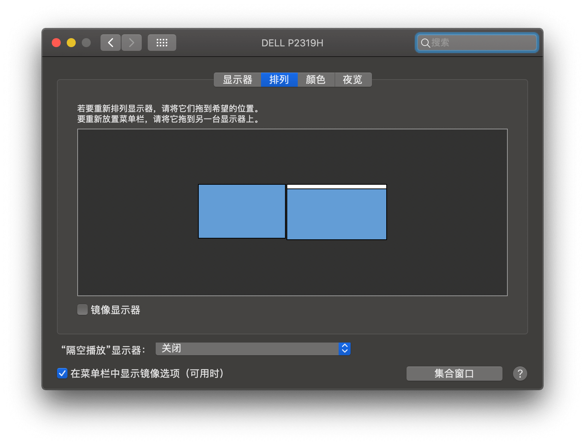
- 【想知道】 label 标签导致点击 `.itemTitle` 区域时 click 触发了两次 ，label 换成 div 就好了， why ？？？
    ```html
    <div class="inputItem" @click="handleClick">
        <label class="dataItem">
            <div class="dataBox">
                <div class="itemTitle" :class="{'validate-error': validateError}">
                    <span>{{title}}</span>
                    <i class="error-icon"></i>
                </div>
                <input
                        :type="type"
                        class="item-input"
                        :placeholder="placeholder"
                        :readonly="readonly"
                        :maxlength="maxLength"
                        v-model="value"
                >
            </div>
            <span class="item-goto" v-if="hasGoToIcon"></span>
        </label>
    </div>
    ```


### 21日
- 工作
    - Tips: 在各个公司工作时的资料
    - p2peye
    - 58
- 生活
    - Tips: 生活的记录，主要是照片视频
    - 相册
        - 诺基亚
        - 三星
        - 小米
        - 苹果
        - 相机
        - 其他
- 娱乐
    - Tips: 影视动漫、游戏等
- 创造
    - Tips: 自己生产，产出的一些东西
- 学习
    - Tips: 学习的视频，主要是各种教程 还有电子书


### 18日
- [MAC上如何导出已安装的chrome插件CRX文件？](https://huajiakeji.com/utilities/2018-04/1379.html)
    - 需要在插件界面打开开发者模式
    - 
- 如何知道 chrome 插件安装在哪里
    - chrome 地址栏输入 `chrome://version/` 回车
    - 打开的页面里 `个人资料路径` 下的 `Extensions` 文件夹就是了

### 14日
- git 修改上一次提交的的，但未 push 的 commit message 的方法
    - 在项目目录下输入命令 `git commit --amend` ，回车
    - 会进入 vim 编辑器可以编辑上一次的 commit message 
    - 编辑完成后保存并退出
    - 执行 `git log` 会发现已经被修改

- 【想知道】【前端】pm2 是什么？ [官网](https://pm2.keymetrics.io/)
- 【想知道】node fork模式 cluster模式


### 12日
- [Mac 之系统中各个文件夹详细介绍](https://blog.csdn.net/yxys01/article/details/73161962)


### 4日
- 小米手机安装 charles 证书
    - 自带浏览器 访问 chls.pro/ssl 下载下来的是 crt 后缀名的证书文件（一安装就闪退）
    - UC浏览器下载下来的是 pem 后缀的证书文件，可以正常安装


### 2日
- [Typescript的interface、class和abstract class](https://www.cnblogs.com/imgss/p/13173091.html)
- [【翻译】在TypeScript中，Extends和Implements一个抽象类有什么不同](https://blog.csdn.net/weixin_30466039/article/details/94860917)
- 【问题】 windows 平台打包提交的代码用的是 CRLF， MAC 却是 LF ，导致每次两个平台开发的时候，都会有很多更新，但其实是换行符的差别导致的
    - CR：Carriage Return，对应ASCII中转义字符\r，表示回车
    - LF：Linefeed，对应ASCII中转义字符\n，表示换行
    - CRLF：Carriage Return & Linefeed，\r\n，表示回车并换行
    - 众所周知，Windows操作系统采用两个字符来进行换行，即CRLF；Unix/Linux/Mac OS X操作系统采用单个字符LF来进行换行。[源自：CRLF、CR、LF详解](https://www.jianshu.com/p/b03ad01acd69)
    - 相关问题的解决： [eslint报错Expected linebreaks to be 'LF' but found 'CRLF'的解决方案](http://www.jsphp.net/webpack/show-26-352-1.html)
    - 建议 windows 系统设置
        ```shell
        #提交时转换为LF，检出时转换为CRLF
        git config --global core.autocrlf true
        ```

- [Vue.js 源码学习九 —— 过渡效果 transition 学习](https://www.jianshu.com/p/f283b39aa212)


## 10月

### 29日

- [UML小白入门基础教程](https://www.cnblogs.com/yuxiuyan/p/7522029.html)
- UML 入门
    - 用例图：
        - **角色** 是人状的图标
        - **用例** 是一个椭圆
        - **通讯** 是连接角色和用例的线
        - 用例图在三个领域很有作用：
            - 决定特征（需求）。当系统已经分析好并且设计成型时，新的用例产生新的需求
            - 客户通讯。使用用例图很容易表示开发者与客户之间的联系。
            - 产生测试用例。一个用例的情节可能产生这些情节的一批测试用例。
    - 类图


### 26日
- camelCase （驼峰命名法）  kebab-case （短横线命名法）


### 23日
- 【开发想法】开发一个阅读器，可以根据标准的文稿，生成各种不同的阅读体验，自己调节颜色主题，翻页效果，代码高亮风格
    - 代码高亮是怎么做到的？
        - 词法分析
        - 一套高亮风格需要多少种颜色，分别对应什么语法要素？


### 21日
- 中间件到底是干啥的

### 20日
- 【置办】
    - 水质监测 DTS 检测
    - 净水器
    - 热水壶
    - 吸尘器
    - 扫地机


### 16日
- iphone 12 支持北斗导航了，北斗导航是啥？很牛逼吗？
- 【前端】[typescript / webpack报错“can only be default-imported using the 'esModuleInterop' flag](https://www.cnblogs.com/xym4869/p/13294798.html)
- 牛人
    - 左耳朵耗子
    - 开课吧创始人(方业昌)


### 15日
- [李舸：摄影是有重量的精神运动│名家名师话美育网络公共课](https://v.qq.com/x/page/c31270lm1zh.html)


### 13日
- 【学习】 [less 中文网 教程](http://lesscss.cn/)
- [移动端h5页面拍照上传图片的时候图片旋转问题](https://blog.csdn.net/xiaoermingn/article/details/94398621)


### 12日
- [什么龙之谷这游戏从当初的爆满到今天的无人问津甚至网吧都没有这个游戏了？](https://www.zhihu.com/question/266436001/answer/1273820341)
- [现在还在玩龙之谷的都是什么样的心态？](https://www.zhihu.com/question/35602163/answer/894079160)


### 11日
- 【想知道】【vue】`v-cloak` 解决 `vue` 在加载时的闪烁，但是 **组件** 在加载时的闪烁怎么解决？


### 10日
- [键盘按键线测试](https://keyboard.51240.com/)
- 【TDOD】 ES6 靠


### 9日
- 【学习】一元白嫖 [重学操作系统](https://kaiwu.lagou.com/course/courseInfo.htm?courseId=478#/content)


### 6日
- [张鑫旭 - 杀了个回马枪，还是说说position:sticky吧](https://www.zhangxinxu.com/wordpress/2018/12/css-position-sticky/)


### 5日
- 婚礼 🎉🎉🎉 囍


### 3日
- [适合婚礼上用的背景音乐有哪些推荐？](https://www.zhihu.com/question/19578707)
- [婚礼上用什么音乐比较好？](https://www.zhihu.com/question/20992094)


### 2日
- [4:3 常见分辨率](https://zhidao.baidu.com/question/1738305006606921907.html)，做婚礼视频用
    - 800×600、1024×768、1280×960、1400×1050、1600×1200、2048×1536


### 1日
- [前端书测评](https://juejin.im/post/6877712145757896717?utm_source=gold_browser_extension)
    - B站好像也有


## 9月


### 30日
- 待看 https://3g.163.com/v/video/VWMOJ3QBE.html
- [encodeURI](https://www.sojson.com/encodeurl.html)  转码工具
- 话说编码到底是个啥？
- [ARGB 和 RGB 的区别](https://blog.csdn.net/wei_chong_chong/article/details/50831493)


### 29日
- [visibilitychange](https://developer.mozilla.org/zh-CN/docs/Web/API/Document/visibilitychange_event) - 浏览器标签页被隐藏或显示的时候会触发 `visibilitychange` 事件
- [position](https://developer.mozilla.org/zh-CN/docs/Web/CSS/position)，主要看 sticky 粘性定位


### 28日

- [从 13K 的前端开源项目我学到了啥？](https://juejin.im/post/6876943860988772360?utm_source=gold_browser_extension)
- [字节研发设施下的 Git 工作流](https://juejin.im/post/6875874533228838925?utm_source=gold_browser_extension)


### 27日


8.0《JavaScript编程精解（原书第3版）》69.3
<!-- 0.0《TypeScript项目开发实战》65 -->
<!-- 0.0《Flutter之旅》82 -->
不足大部分 5《Electron实战：入门、进阶与性能优化》55
<!-- 评价不足《PWA入门与实践》62 -->
<!-- 还不错《Vue.js应用测试》55 -->
<!-- 7.0《PHP和MySQL Web开发（原书第5版）》90 -->
8.4《高效前端：Web高效编程与优化实践》62
<!-- 8.7《Webpack实战：入门、进阶与调优》48 -->
<!-- 评价不足《分布式系统架构：技术栈详解与快速进阶》62 -->


### 26日
- [如何更改placeholder属性中文字颜色](https://www.cnblogs.com/angel648/p/11317615.html)


### 25日
- [OCR 光学字符识别](https://baike.baidu.com/item/%E5%85%89%E5%AD%A6%E5%AD%97%E7%AC%A6%E8%AF%86%E5%88%AB/4162921?fromtitle=OCR&fromid=25995&fr=aladdin) 只能识别打印体，手写体是不行的
- 【[答疑解惑】为什么你的 Charles 会抓包失败？](https://juejin.im/post/6875474994336366606?utm_source=gold_browser_extension)


### 24日
- [vue2.0移动端触摸反馈指令](https://segmentfault.com/a/1190000008634493)
- [如何让 H5 体验接近 APP：（一）触摸反馈](https://segmentfault.com/a/1190000006864910)


### 23日
- [洋爷的站酷主页](https://www.zcool.com.cn/u/525334#tab_anchor)
- [现代 javascript 教程](https://zh.javascript.info/)


### 22日
- [网线的分类，网线分类标准图解](https://www.dgzj.com/baike/87793.html)


### 21日
- 【学习】【ts】[一份不可多得的 TS 学习指南（1.8W字）](https://juejin.im/post/6872111128135073806?utm_source=gold_browser_extension)
- [A/B/C/D.... 站都是指啥——盘点](https://www.bilibili.com/read/cv4835405)
- [给我医疗兵（＞△＜）阿伟死了_(:з」∠)_](https://bcy.net/item/detail/6792238077348682755?_source_page=hashtag)


### 20 日
- 戴耳机后耳朵发痒可能由两个常见原因引起。一种是插入式耳机，因为耳朵总是受到耳塞的刺激，导致外耳道皮肤的**弥漫性炎症刺激，即外耳炎，这将导致耳朵发痒和不适**。还有一种耳机是用外耳包裹的，因为它们总是把外耳道包裹在里面，长时间佩戴，在外耳道**温暖潮湿的环境中容易引起真菌感染和瘙痒**。


### 9日

- [看了才知道你的生日也可以说的如此优雅！(#^.^#)](https://www.jianshu.com/p/a56a6d07e004)
    1. 农历初一至三十别称查询表

        农历日期|别称
        :-:|:-:
        农历初一|朔一日
        农历初二|朔二日
        农历初三|朔三日
        农历初四|朔四日
        农历初五|朔五日
        农历初六|朔六日
        农历初七|朔七日
        农历初八|朔八日
        农历初九|朔九日
        农历初十|朔十日
        农历十一|望一日
        农历十二|望二日
        农历十三|望三日
        农历十四|望四日
        农历十五|望五日
        农历十六|望六日
        农历十七|望七日
        农历十八|望八日
        农历十九|望九日
        农历二十|望十日
        农历二十一|念一日
        农历二十二|念二日
        农历二十三|念三日
        农历二十四|念四日
        农历二十五|念五日
        农历二十六|念六日
        农历二十七|念七日
        农历二十八|念八日
        农历二十九|念九日
        农历三十|念十日

    2. 十二月份雅称一览表

        月份|雅称
        :-:|:-:
        一月|孟春、寅月、正月、元阳、初月、初春、开岁、芳岁、早春、上春
        二月|仲春、卯月、杏月、仲阳、丽月、花朝、中春、甜春、正春、如月
        三月|季春、辰月、暮春、杪春、桃月、桐月、蚕月、桃浪、晚春、末春
        四月|孟夏、巳月、清和、槐月、槐序、麦月、麦秋、清月、初夏、首夏
        五月|仲夏、午月、榴月、蒲月、中夏、皋月、天中、端阳、蕤宾
        六月|季夏、未月、暮夏、荷月、暑月、溽暑、焦月、晚夏、伏月、林钟
        七月|孟秋、申月、瓜月、凉月、兰月、兰秋、巧月、首秋、初秋、早秋
        八月|仲秋、酉月、桂月、正秋、中秋、爽月、桂秋、壮月、获月、仲商
        九月|季秋、戌月、暮秋、菊月、菊序、霜序、咏月、菊秋、晚秋、凉秋
        十月|孟冬、亥月、初冬、良月、开冬、吉月、阳月、上冬、坤月、阳月
        十一月|仲冬、子月、畅月、中冬、雪月、寒月、龙潜、辜月、葭月、黄钟
        十二月|季冬、丑月、残冬、腊月、冰月、暮月、暮冬、嘉平、严月、严冬

    3. 例子：八月初一： 仲秋朔；五月十六：仲夏既望


## 8月

- 月PLAN
    - [ ] 【学习】 RN
        - [ ] react
        - [ ] react Native
    - [ ] 【学习】 Flutetr
    - [ ] 【学习】 NodeJs
    - [ ] 【学习】 TS
    - [ ] 【刷题】 Leetcode 20 道


### 26日
- 【思考】 不喜欢别人说我们是哪种人，是因为我没不是用 某一种就能定性的  我们是一个复杂的个体


### 21日
- 【一直没查】 keynote 展示代码， 高亮代码的最佳实践


### 20日
- [mongodb 设置用户](https://www.py.cn/db/mongodb/14258.html)


### 19日
- [不错的博客 梯 - 如何使用React，TypeScript，NodeJS和MongoDB构建Todo应用](https://www.freecodecamp.org/news/how-to-build-a-todo-app-with-react-typescript-nodejs-and-mongodb/)
- 【工具】【markdown】【协作】[CodiMD - Markdown 协作笔记](https://demo.codimd.org/#) 


### 13日
- 【想知道】什么是 套接字？ 
    - 来源： [mysql npm](https://www.npmjs.com/package/mysql#connection-options) - `socketPath`
- mysql 入门
    ```shell
    ➜  ~ mysql -h localhost -u root -p

    # 展示 MySQL 数据库下的 数据库们
    # show databases;
    mysql> show databases
        -> 
        -> ;
    # 这是因为我没有加分号

    # 创建一个数据库
    # create database 数据库名;
    mysql> create database students_info;

    # 重新查看，确认数据库的创建是否成功
    mysql> show databases;

    # 选择要操作的数据库 
    mysql> use students_info;

    # 在数据库中创建数据库表
    mysql> create table network3
        -> (
        -> id char(10) not null primary key,
        -> name char(16) not null,
        -> sex char(6) not null,
        -> age int not null,
        -> address char(36) not null
        -> );

    # 检查数据表：它是用来查询数据库表的详细信息的（只包括表头，并不包含内容）
    # describe 数据库表名;
    mysql> describe network3;

    # ==========================================================================

    # 向数据表中添加数据
    # insert into 数据库表名 values(value值1,value值2,.......);
    # insert into 数据库表名 (列名1,列名2,...） values(value值1,value值2,...);
    mysql> insert into network3 values("3114006441","xpleaf","male",35,"QingYuan");
    mysql> insert into network3 values("3114006442","Pei","male",41,"PuNing");
    mysql> insert into network3 values("3114006443","Jim","male",38,"JiangMen");
    mysql> insert into network3 values("3114006440","Xuan","male",36,"ShanWei");
    mysql> insert into network3 values("3114006440","Ting","female",30,"ChaoShan");
    mysql> insert into network3 values("3114006336","Ting","female",30,"ChaoShan");

    # ==========================================================================

    # 查询数据库表中的数据
    # select 列名称 from 数据库表名 [查询条件];
    mysql> select * from network3;
    mysql> select id,name from network3;
    mysql> select * from network3 where name='xpleaf';
    mysql> select * from network3 where sex="male";
    mysql> select * from network3 where sex="female";
    mysql> select * from network3 where sex="male" and address="QingYuan";
    mysql> select * from network3 where age < 40 and age > 31;
    mysql> select * from network3 where name like "%leaf";
    mysql> select * from network3 where name like "%i";
    mysql> select * from network3 where name like "%i%";
    mysql> select * from network3 where name like "i";
    mysql> select * from network3 where name like "i%";
    mysql> select * from network3 where name like "%i%";
    mysql> select * from network3;

    # ==========================================================================

    # 修改数据库表中的数据
    # update 数据库表名 set 列名（字段名）=新value where 更新条件;
    mysql> update network3 set address="YuanTan" where name="xpleaf";
    mysql> select * from network3;

    mysql> update network3 set name="Hui" where id="3114006336";
    mysql> select * from network3;

    # 这是我写错的
    mysql> update network3 set age=age+=1;
    mysql> select * from network3;

    mysql> update network3 set age=age+1;
    mysql> select * from network3;

    mysql> delete from network3 where name="Pei";
    mysql> select * from network3;

    # ==========================================================================

    # 修改数据库表的【结构】
    # alter table 数据库表名 change 列名称 新数据类型 [其它];

    # 先 看一下数据表的详细信息
    mysql> describe network3;

    #修改列
    mysql> alter table network3 change address addr char(30) not null;
    mysql> alter table network3 change name name char(20) not null;
    mysql> alter table network3 change sex Sex char(10) not null;
    mysql> describe network3;

    # 删除列
    mysql> alter table network3 drop addr;
    mysql> describe network3;
    # 看完表结构，再看一下标的数据是不是也被删掉了
    mysql> select * from network3;

    # 重命名数据库表
    mysql> alter table network3 rename New_network3;
    mysql> show tables;

    # 删除数据库表
    mysql> drop table New_network3;
    mysql> show tables

    # ==========================================================================
    
    # 删除数据库
    # 先看一下所有的数据库
    mysql> show databases;

    # 删除，我写错了
    mysql> drop students_info;

    # 正确的删除
    mysql> drop database students_info;
    mysql> show databases;

    # 退出 mysql
    mysql> quit    
    ```


### 11日
- 【想法】每天写一些他就能帮我自动总结的工具
- 【想法】视频有视频的优势，文字有文字的优势，如果把这两个结合一下呢？
    - 视频打点，生成笔记，笔记上有时间，点击能跳到视频对应的位置


### 10日
- 【快捷键】`command + option + u`  chrome 查看源代码


### 8日
- [设计模式 之 命令模式](https://www.cnblogs.com/zhigu/p/11847569.html)
- [详解](http://c.biancheng.net/view/1380.html)
- [Java设计模式：23种设计模式全面解析（超级详细）](http://c.biancheng.net/design_pattern/)


### 7日
- [CSS如何实现弹簧动画效果](https://www.w3cplus.com/animation/spring-animation-in-css.html) 牛批
- [纯css3弹性收缩按钮动画特效](https://www.17sucai.com/pins/29927.html) 好效果
- [CSS3实现漂亮的卡片翻转效果](https://blog.csdn.net/qq_16371909/article/details/79858408)
    - 父元素添加：`perspective: 500;-webkit-perspective: 500;`   越大效果越不明显
    - 子元素使用 `transform: rotateX(90deg);`


### 6日
- [阿里大佬浅谈大型项目前端架构设计](https://www.cnblogs.com/web-vue/articles/11383707.html)
    - 范围很广，但没有特别具体的落地方案，可以开拓思路
- 【思考】编程的终极目标是什么
    - 项目目录结构命名的由来
        - https://www.cnblogs.com/Eva-J/p/5168345.html
        - https://zhuanlan.zhihu.com/p/89693668
        - https://wenku.baidu.com/view/ef72e1640b4e767f5acfceb7.html
        - https://blog.csdn.net/like_jack/article/details/64127823
        - https://segmentfault.com/q/1010000021691054
        - https://segmentfault.com/q/1010000000308565

### 5日
- [(Code-Robust ) 利用 VSCode、JSDoc、d.ts 让你的代码更健壮](https://blog.csdn.net/Tmraz/article/details/107620192)


### 4日
- [从零构建一个TS-Node项目](https://blog.csdn.net/qq_38355456/article/details/103931750)


## 7月

### 31日
- 查找命令的位置 `where`
    ```bash
    where git
    /usr/bin/git
    ```
- 我的 Mac 自带的 git
    ```shell
    git --version
    git version 2.24.3 (Apple Git-128)
    ```
- [优雅的卸载Mac默认的Xcode附带的git](https://www.w3cschool.cn/cuhkj/cuhkj-1k5l265q.html) 思路是更改 环境变量的指向

- date 格式标准 [发现来源](https://git-scm.com/docs/git-log#Documentation/git-log.txt-emadem)
    - %cD : committer date, RFC2822 style
        - `Fri, 3 Jul 2020 10:57:24 +0800`
    - %cr : committer date, relative
        - `4 weeks ago`
    - %ct : committer date, UNIX timestamp
        - `1593745044`
    - %ci : committer date, ISO 8601-like format
        - `2020-07-03 10:57:24 +0800`
    - %cI : committer date, strict ISO 8601 format
        - `2020-07-03T10:57:24+08:00`
    - %cs : committer date, short format (YYYY-MM-DD)


### 28日
- [ ] 【想知道】程序中的时间，如何保证全世界在同一时间开启活动
- linux中管道符 `|` 的作用
    - 命令格式：`命令A|命令B`，即命令1的正确输出作为命令B的操作对象
- git 的 提交哈希 和 树哈希 的区别 [问题来源](https://git-scm.com/book/en/v2/Git-Basics-Viewing-the-Commit-History)
    - `git log --pretty=format:"%H %h %T %t"`
- `git log`
    - `--since=<date>` or `--after=<date>` 起始时间
    - `--until=<date>` or `--before=<date>` 截止时间
    - 这个 `<date>` 支持的格式很多，比如
        - `2020-07-23-18:42:53`
        - `2020-07-23 18:42:53`
        - `2020-07-23 18:42`
        - `2020-07-23 6:42 pm`
        - `2020-07-23 19:00` （注意：`2020-07-23 19` 不行） 
        - `2020-07-23` （被省略的时分秒，默认为 `0`）
        - `Jul 23 18:43:53 2020`
        - `Thu Jul 23 18:43:53 2020`
        - `Thu Jul 23 18:42:52 2020 +0800`

- [随机生成文字的网页](http://whatthecommit.com/index.txt`")
    - 皮一下 ```git commit -m"`curl -s http://whatthecommit.com/index.txt`"```
- [commit message 生成工具](https://www.conventionalcommits.org/en/v1.0.0-beta.4/)
- [ishare - Git Commit Message](https://ishare.58corp.com/articleDetail?id=11461)
- [ ] node 中的 `__dirname` 是什么路径？ 执行的是 `A.js` ， `A.js` 引用了 `./lib/B.js` ，  `./lib/B.js` 中的 `__dirname`  是 `A.js` 还是 `B.js` 的位置？
- [mac 自动重启](https://discussionschinese.apple.com/thread/250328884) tony 的看日志方法


### 27日
- 【英语单词】 `session`
    - [n] 一场;一节;一段时间;(法庭的)开庭，开庭期;(议会等的)会议，会期;学年
- 【英语单词】 `appears`
    - [v] 显得;看来;似乎;出现;呈现;显现;起源;首次使用
- 【英语单词】`debugger` 排错程序 

- 看了 [taro 的文档](https://taro-docs.jd.com/taro/docs/README/index.html#%E4%B8%BA-taro-%E8%B4%A1%E7%8C%AE%E4%BB%A3%E7%A0%81)发现，开源社区的贡献是有一套成熟的流程的
    - RFC 文档 （是什么）
    - Taro 的 [RFC 机制](https://github.com/NervJS/taro-rfcs)
- webstrom 
    - `ctrl + shift + 数字` 添加书签
    - [使用webstorm调试node程序](https://www.cnblogs.com/jinguangguo/p/4809886.html)（好文）
- Design
    - [UI Design Dos and Don’ts - Apple Developer](https://developer.apple.com/design/tips/#clarity)
    - [Marketing Resources and Identity Guidelines - App Store - Apple Developer](https://developer.apple.com/app-store/marketing/guidelines/)
    - [设计规范官网汇总：iOS、Material…（持续更新）](https://zhuanlan.zhihu.com/p/31026090)
    - [Apple Design Resources](https://developer.apple.com/design/resources//?ref=heydesigner)


### 23日
- [google noto fonts](https://www.google.com/get/noto/#serif-hant)
    - 衬线体和无衬线体
        - sans serif 无衬线
        - serif 衬线
    - CJK ： 中日韩


### 22日
- vscode `command + ctrl + ←` or `command + ctrl + →` 可以将标签在分屏窗口中移动


### 21日
- 科学跳绳锻炼
- 科学的 400 米训练
- 【思考】一个会日语的主播，直播吃鸡，各种逗日本人，放在以前谁能想到会一门语言还能用在这里
- [壁纸软件](https://sspai.com/post/41665)
    - Irvue
    - Mac推荐 Wallcat, Appstore 直接下载
    - Mac 推荐 [Pap.er](http://paper.meiyuan.in/)【需科学上网】


### 20日
- [关于线条字](https://segmentfault.com/q/1010000014542664)
    - 找到的东西大概可以满足了, 如果想要找相关的内容可以 google "ascii art generator"
    - [Online Ascii Art Creator](https://www.ascii-art-generator.org)
    - mac/linux 可以用 figlet
    - [相关问题](https://serverfault.com/questions/93407/what-command-prints-a-string-as-big-ascii-text-art-in-bash/93408#93408)


### 17日
- vscode 分割屏幕快捷键
    - 横向分割 `command + shift + D`
    - 纵向分割 `command + D`
    - 在分割的窗格间切换 `command + [` 、`command + ]`
- 【TODO】MAKE HEAD IMAGE （no use ,cause igit can't change）


### 16日
- [5分钟教你使用console.log发布公司的招聘信息](https://blog.csdn.net/liuyan19891230/article/details/106654400)
    - patorjk.com
        - [Text to ASCII Art Generator (TAAG)](http://patorjk.com/software/taag/#p=display&f=Graffiti&t=Type%20Something%20)
            - 3D Diagonal
            - Alpha
            - ANSI shadow
            - Flower Power
            - Bloody
            - Block
            - Broadway
            - Caligraphy
    - [挖掘大厂写给程序员的"暗语"](https://www.jianshu.com/p/c69778e515b3)


### 14日
- vscode 快捷键 `command + option + ←` or `command + option + →` 快速切换打开的文件

### 13日
- 【node】 [nodemon](https://www.npmjs.com/package/nodemon) ： 在 `node` 项目的软件开发中，经常需要边写边调试，因此 `node` 服务需要频繁手动重启，特别浪费时间。 `nodemon` 软件会自动监测文件的变化，当有变化时重新启动服务。
- 【js】[JS函数前面加!、+、-、~符号以及;是什么意思、按位取反](https://blog.csdn.net/hot_cool/article/details/77567166)
    - 原理：将函数用括号包括起来，解析器会把函数解析为函数表达式，而函数表达式可以直接调用。因此，其他能将函数体变成函数表达式的方法，都可以让解析器正确调用定义函数。以及其他的一些符号，如：`!、+、-、~`
    - `!、+、-、~ `可以对函数的返回值操作
    - `function` 前加 `;` 是为了防止代码压缩时，前面代码没写 `;` 造成报错
- URI 

### 10日
- 【Charles】[小米手机安装证书问题](https://blog.csdn.net/lan_yangbi/java/article/details/88952184)
    - 机型： 小米6
    - 系统：Android 8.0
    - 手机配置代理，跟电脑处于同一网段；
    - 手机使用第三方浏览器（uc）访问 `chls.pro/ssl`，下载.pem证书后移动到系统的 Download 目录下；
    - 进入 `WLAN设置` ，点击 `高级设置` -> `安装证书` ，选中刚才下载的证书，进行安装。
    - 遇到的问题：
    - 点击证书后出现”键入凭据存储的密码“弹框（不知道密码啊：）
    - 解决办法：
    - 设置手机待机密码：设置 -> 锁屏、密码和指纹，添加锁屏数字密码，安装时输入改密码即可成功。


### 8日
- [flutter 时钟大赛](https://flutter.dev/clock)


### 7日
- 硬盘接口类型
- NAS 
- 勒夏特列定理适合很多现象，有没有违背的？
- [黑科技之Beyond Compare在Mac OS系统下永久试用](https://www.jianshu.com/p/596b4463eacd)
    1. 原理： Beyond Compare 每次启动后会先检查注册信息，试用期到期后就不能继续使用。解决方法是在启动前，先删除注册信息，然后再启动，这样就可以永久免费试用了。
    2. 下载：首先下载Beyond Compare最新版本，链接如下：https://www.scootersoftware.com/download.php
    3. 安装：下载完成后，直接安装。
    4. 创建BCompare文件
        1. 进入Mac应用程序目录下，找到刚刚安装好的Beyond Compare，路径如下/Applications/Beyond Compare.app/Contents/MacOS。
        2. 修改启动程序文件BCompare为BCompare.real。
        3. 在当前目录下新建一个文件BCompare，文件内容如下：
            ```
            #!/bin/bash
            rm "/Users/$(whoami)/Library/Application Support/Beyond Compare/registry.dat"
            "`dirname "$0"`"/BCompare.real $@
            ```
        4. 保存BCompare文件。
        5. 修改文件的权限：
            ```
            chmod a+x /Applications/Beyond\ Compare.app/Contents/MacOS/BCompare
            ```
        6. 以上步骤完成后，再次打开Beyond Compare就可以正常使用了，enjoy it。


### 6日
- 程序中的时区问题，如何同步全球访问者的时间？
- getHour  getUTCHour


### 3日
- 【发现】 Mac ```Ctrl + F11``` or ```Ctrl + F12``` 可以加减音量
- [Git全局配置和单个仓库的用户名邮箱配置](https://blog.csdn.net/dcj3sjt126com/article/details/84739380)
- git 更改已经提交的记录中的 用户名和 邮箱
    
    ```shell script
    # 克隆
    git clone --bare https://github.com/user/repo.git
  
    # 进入目录
    cd repo.git
    
    # 执行这一段
    # OLD_EMAIL 换成你要被替换的邮箱
    # CORRECT_NAME 换成你要替换成的名字
    # CORRECT_EMAIL 换成你要替换成的邮箱
    git filter-branch --env-filter '
       
    OLD_EMAIL="xxxx@old.com"
    CORRECT_NAME="username"
    CORRECT_EMAIL="yyyy@new.com"
    
    if [ "$GIT_COMMITTER_EMAIL" = "$OLD_EMAIL" ]
    then
    export GIT_COMMITTER_NAME="$CORRECT_NAME"
    export GIT_COMMITTER_EMAIL="$CORRECT_EMAIL"
    fi
    if [ "$GIT_AUTHOR_EMAIL" = "$OLD_EMAIL" ]
    then
    export GIT_AUTHOR_NAME="$CORRECT_NAME"
    export GIT_AUTHOR_EMAIL="$CORRECT_EMAIL"
    fi
    ' --tag-name-filter cat -- --branches --tags
       
    # 推送
    git push --force --tags origin 'refs/heads/*'
    
    # 删除这个临时库
    cd ../
    rm -rf repo.git
    ```
  
  
  


### 2日
- [Mac下Vim配置语法高亮](https://www.cnblogs.com/liunlls/p/mac_vim_config.html)


### 1日
- [7个超高质量免费PPT模板网站，收藏不后悔](https://baijiahao.baidu.com/s?id=1655083193384206063&wfr=spider&for=pc)


## 6月

### 30日
- [小技巧：使用命令行打开vscode 以及其他工具](https://blog.csdn.net/h774140913/java/article/details/84650273)
    - vscode
        - 手动打开vscode
        - command + shift + p 打开命令面板（或者点击菜单栏 查看>命令面板）
        - 输入shell（选择"install code command in PATH"）
        - 打开终端 进入需要用IDE打开的文件夹 输入"code ."
    - sublime
        - 打开终端
        - 输入命令行 ```ln -s "/Applications/Sublime Text.app/Contents/SharedSupport/bin```

- 【TODO】整理 chrome 书签
    - 前端主站 ： 腾讯、京东、百度、阿里、奇舞团、58、字节、美团、google、FB ...
    - 产品：
    - 设计
    - 运营
    - 游戏
    - ...


### 29日
- [[转]三种编程命名规则：驼峰命名法，帕斯卡命名法，匈牙利命名法](https://blog.csdn.net/czh500/article/details/81459785)
- [深入研究-webkit-overflow-scrolling:touch及ios滚动](https://www.cnblogs.com/xiahj/p/8036419.html)


### 27日
- 【TODO】webstrome 的使用技巧
    - webstrome 设置模板的方法


### 19日
- 【文字】“仅”和“谨”的区别
    - 谨以此文
        - 谨 [jǐn]，意思是 ①慎重；小心。②郑重地；恭敬地。就
        - 是一种客套的书面用语 。重点突出郑重性。
    - 仅以此文
        - 仅 [jǐn]：仅仅； 只的意思。
        - 也是一种客套的书面用语 。重点是仅仅只是。
        - 两个的侧重点不一样


### 18日
- 【音视频】坏的视频差的音频。。。/ 差的视频 、好的音频  小白评测约见 影视飓风 Tim 那一期


### 16日

- es6 SET MAP
- [环境音效下载](http://www.aigei.com/view/67976.html)


### 15日 
- react 学习网站
    - xxx
    - xxx
    - xxx
- [在 Mac 上连接 AirPods 太麻烦？这个免费 App 帮你一键连接](https://www.sohu.com/a/288465280_602994)


### 14日
- 关于身份证的正反面问题
    - 国徽面是正面
    - 人像面是反面


### 12日
- 【快捷键】【vscode】按住 shift 点击左侧的折叠按钮可以一层一层的折叠该层级下边的内容


### 7日 
- 【想知道】 mkdocs 是啥
- 【前端】[为什么很多web项目还是使用 px，而不是 rem？ - 猫5号的回答 - 知乎](https://www.zhihu.com/question/313971223/answer/628236155)
- 【格言】有时治愈，常常帮助，总是安慰 -- 医生 特鲁多 墓志铭


### 5日
- 【前端】工程化思考
    - 前端架构设计怎么做
    - esLint 怎么用？
    - 强制规范 可以集成到脚手架中去


### 4日
- 【coder】【小技巧】ide 中 输入 lorem 按 tab 可以帮我们生成一段随机文本，或者 lorem300 按 tab 会生成一段 300 个单词的文本。
- [前端动画必知必会：React 和 Vue 都在用的 FLIP 思想实现小姐姐流畅移动。](https://juejin.im/post/5ed72e6f6fb9a04801705e39?utm_source=gold_browser_extension)
- 【软件】vscode ```shift + alt + F``` 款速格式化空格
- 【知识点】【硬件】SD 卡上的 ```lock``` 是写保护。
    - 如果打到 lock 上，就只能读取，不能往卡里写东西。
    - 一般用来保护数据不被误删，和防止感染病毒。


### 3日
- 【vue】[详解Vue SPA项目优化小记](https://www.jb51.net/article/143071.htm)
- 【leetcode】[跳槽从LeetCode开始-之乎专栏](https://zhuanlan.zhihu.com/p/101318593)
- [[面试]HR最常用的20个面试问题及答案](https://blog.csdn.net/hailongwang2412/article/details/68083995)
- [史上最强HR面试问题汇总，拿走不谢~](https://zhuanlan.zhihu.com/p/49752483)
- [HR面试的十大经典问题](https://zhuanlan.zhihu.com/p/27564382)


### 1日
- 【前端】【vue】【vue-cli】 
    - [Vue CLI 3搭建vue+vuex最全分析 - 脚本之家](https://www.jb51.net/article/148100.htm)
    - [一份超级详细的Vue-cli3.0使用教程 - 脚本之家](https://www.jb51.net/article/150901.htm)
    - [vue-cli3.0-beta vue脚手架3.0的使用 - 简书](https://www.jianshu.com/p/fbcad30031c2)


## 5月

### 31日
- 【刷题】【leetcode】【github】 [fucking-algorithm](https://github.com/labuladong/fucking-algorithm)


### 28日
- 【发现】【前端】[前端性能监控：window.performance](https://www.cnblogs.com/libin-1/p/6501951.html)
- 【发现】【前端】[前端性能优化之Performance神器](https://segmentfault.com/a/1190000009845281)


### 27日
- 【知识】【计算机】[内存溢出和内存泄漏的区别](https://blog.csdn.net/buutterfly/java/article/details/6617375)
    - 内存溢出 out of memory，是指程序在申请内存时，没有足够的内存空间供其使用，出现out of memory；比如申请了一个integer , 但给它存了 long 才能存下的数，那就是内存溢出。
    - 内存泄露 memory leak，是指程序在申请内存后，无法释放已申请的内存空间，一次内存泄露危害可以忽略，但内存泄露堆积后果很严重，无论多少内存,迟早会被占光。
    - memory leak 会最终会导致out of memory！


### 25日  
-  [这个百度面经](https://www.nowcoder.com/discuss/401584?type=2&order=0&pos=15&page=1&channel=1000&source_id=discuss_tag)还不错
- [Coding Interview University 一套完整的学习手册帮助自己准备 Google 的面试](https://github.com/jwasham/coding-interview-university/blob/master/translations/README-cn.md)


### 20日 
- 抽卡 复习方式


### 17日
- 【js】 [defer和async的区别](https://segmentfault.com/q/1010000000640869)
- 【前端性能优化】[雅虎前端优化的35条军规](https://www.cnblogs.com/xianyulaodi/p/5755079.html)
- 【vue】[Vue 项目性能优化 — 实践指南（网上最全 / 详细）](https://www.jianshu.com/p/41d161310949)


### 16日
- [未来已来，2020年Web前端开发的六大趋势](https://kuaibao.qq.com/s/20200310A0JJW200?refer=spider)
- 【教程】【ES6】 [Understanding ES6](https://oshotokill.gitbooks.io/understandinges6-simplified-chinese/content/) ( 牛客网 [JS 专题](https://www.nowcoder.com/stack/1) 发现的 )


### 12日
- 【快捷键】【vscode】偶然发现的 快速*分割 + 移动*正在编辑的文件在编辑器中的位置
    - ```ctrl + command + ←``` （分割 + 移动）
    - ```ctrl + command + →``` （恢复）


### 9日
- 【软件】[高性能的屏幕录像工具：Screenflick for Mac](https://blog.csdn.net/yjh66666/article/details/96735483?utm_medium=distribute.pc_relevant.none-task-blog-BlogCommendFromMachineLearnPai2-1&depth_1-utm_source=distribute.pc_relevant.none-task-blog-BlogCommendFromMachineLearnPai2-1)

### 8日
- 【面试题】url 敲回车发什么了什么？
    - 请求阶段：
        - DNS 解析
        - TCP 协议的三次握手 四次挥手
        - https 和  http 的区别 http2
    - 响应阶段
        - http 状态码
        - 304 缓存
        - http 报文
    - 解析阶段：
        - 拿到html代码后在开辟一块栈内存 用于执行代码，同时分配日一个主线程一行一行的执行代码
        - 遇到 ```link``` ```img``` ```audio``` ```video``` ```scripts``` 等这些需要外部加载的标签，都会单独开辟新的线程去执行
        - 任务队列  task queue
        - 第一次自上而下走完后  只生成 DOM TREE
        - 事件循环  微任务宏任务
        - css 处理完  生成 CSSOM TREE
        - CSSOM TREE + DOM TREE = RENDER TREE

- 【演讲笔记】【TED】在摩登时代的思考能力
    1. 让长期的游戏现在有回报。举例：花生 和 棉花
    2. 保持过去的鲜活记忆，从而帮助我们想象未来。举例：福岛核电站 对比 女川核电站（离震中更近） 。工程师对历史的认识让其有远见，将女川核电站建在远离海岸，在海拔更高海堤更高的地方
    3. 创造共享的传家宝
- 【演讲笔记】【TED】睡眠是你的超能力，两点建议
    1. 规律，准时睡觉准时起床，不管是工作日还是周末。规律为王
    2. **保持凉爽**，你的身体需要把体温降低2~3华氏度来进入睡眠，卧室适宜温度 18 摄氏度
    - 不幸的是，睡眠并不是一个可选的奢侈生活方式，而是不容置疑的生理需要，他是你的生命支持系统


### 6日
- 【生活】【饮食】老田科普系列
    - 耗油 ： 李锦裳  选配料以耗汁为主的
        - 谷氨酸钠 就是味精
        - 呈味核 就是味精精，浓度是味精的20倍，用它说白了就是省钱
    - 泡椒凤爪 ： 会用工业的东西泡，泡完又白又大
        - 以前常用双氧水，现在常用二氧化硫
        - 三聚磷酸钠，亚硝酸钠，吃多了致癌
    - 香油： 怎么选，看配料表
        - 压榨，干芝麻压
        - 水代法，就是用磨盘磨，这种方法制出的香油味道更浓
    - 鸡精、味精：
        - 鸡精大部分也是味精
    - 料酒： 
        - 配置料酒：添加味精、呈味核、食用酒精
        - 酿造料酒：水、大米、糯米... (这个好，还分酒的年份)
    - 酱油：
        - 生抽 - 增鲜提味用的
            - 看配料表，有 谷氨酸钠（味精） 、 呈味核的都 pass 
            - 脱脂大豆 pass  （这玩意儿之前是卖给养猪的做猪饲料的）
            - 什么味极鲜呀，拌凉菜的呀... 乱七八糟的功能型酱油其实都是生抽
        - 老抽 - 给菜上色用的

- 【想知道】味精的坏处，呈味核呢？
- 【文章】【浏览器】 [从代码到像素](https://developers.google.com/web/updates/2018/09/inside-browser-part1)


### 5日
- 【终端】【使用技巧】[玩转 Terminal 终端：入门指南及进阶技巧 - 少数派](https://sspai.com/post/45534)
- 【mac】【使用技巧】推出磁盘总是显示占用？我也遇到过好多次，可以通过下边的方法解决：
    - 打开命令行工具
        ```shell
        # 使用命令行终端 先 df -lh查看当前盘
        ➜  ~ df -lh
        Filesystem     Size   Used  Avail Capacity iused               ifree %iused  Mounted on
        /dev/disk1s1  466Gi  310Gi  154Gi    67% 2022114 9223372036852753693    0%   /
        /dev/disk1s4  466Gi  1.0Gi  154Gi     1%       1 9223372036854775806    0%   /private/var/vm
        /dev/disk4    1.8Ti  1.4Ti  457Gi    76%  289650          4294677629    0%   /Volumes/TM Backup
        /dev/disk2s1  116Gi   71Gi   45Gi    62%  581252              370044   61%   /Volumes/Untitled

        # 如上想要推出 /dev/disk2s1 ， 使用 sudo -i ，切换到root用户，尝试推出/dev/disk2s1,输入： diskutil unmount /dev/disk2s1
        ➜  ~ sudo -i
        Password:
        XXXdeMacBook-Pro:~ root# diskutil unmount /dev/disk2s1
        Volume (null) on disk2s1 failed to unmount: dissented by PID 751 (/System/Library/Frameworks/Quartz.framework/Versions/A/Frameworks/QuickLookUI.framework/Versions/A/XPCServices/QuickLookUIService.xpc/Contents/MacOS/QuickLookUIService)
        # 是被进程号为 751 的进程占用了，去活动监视器把 pid=751 的进程结束掉就可以在访达中推出了

        # 想退回普通账户时可以执行 exit 或 logout  
        linzhiqingdeMacBook-Pro:~ root# exit
        logout
        ➜  ~
        ```
    - tips: [su、sudo、sudo su、sudo -i的用法和区别](https://blog.csdn.net/baidu_38172402/article/details/88677290)


### 3日
- 【心理】史金纳箱，行为心理学
    1. 自由只是幻象，你以为你有，其实你没有
    2. 只要改变人造环境，就能改变人类型为，进而改善社会问题
- 【chrome】【快捷键】进入 Chrome 浏览器的“控制台”，有两种方法。
    - 直接进入：按下Option + Command + J（Mac）或者Ctrl + Shift + J（Windows / Linux）
    - 开发者工具进入：开发者工具的快捷键是 F12，或者Option + Command + I（Mac）以及Ctrl + Shift + I（Windows / Linux），然后选择 Console 面板
- 【疑问】递归的尾调用优化是啥来着
    - 严格模式到底有哪些地方严格？
- 数组的方法 lastIndexOf()，该函数返回**相同元素中最后一个元素的索引**，如果没找到相同元素，则返回 -1
- 数组的方法  join 不传参 默认逗号分隔
- vue 重写了数组的哪些方法？
    - shift unshift pop push splice reverce sort


## 4月

### 30日

- 【工具网站】[keywordtool](https://keywordtool.io/) [YouTube 小船推荐](https://www.youtube.com/watch?v=wqGet4bkjs0&t=0805)


### 29日
- 【技巧】 mac 如何在命令行中访问外置移动硬盘？
    - ```cd /Volumes/``` 电脑装载 的所有设备都在这个目录下


### 28日
- 【工具】mac 扒站神器 [SiteSucker 使用记录](https://blog.csdn.net/ygd1994/article/details/77750644)
- 【阅读】哲学上有这样一个词，叫“控制二分法”，指的是：**接受不能控制的，控制能控制的。**我们必须明白，一些事情我们自己能控制，另一些则不能。只有学会区分什么你能控制，什么你不能控制，才可能拥有内在的宁静与外在的效率。伤害我们的并非事情本身，而是我们对事情的看法。将人生视如赴宴，我们就能保持自己的举止优雅得体。
<!-- 
作者：精读君
链接：https://www.jianshu.com/p/089e19bc0df5
来源：简书
著作权归作者所有。商业转载请联系作者获得授权，非商业转载请注明出处。 
-->


### 27日
- 【阅读】[我的《javascript框架设计》终于出版](https://www.cnblogs.com/rubylouvre/p/3658441.html)


### 24日
- 【工具网站】配色参考网站 [adobe color](https://color.adobe.com/zh/explore)


### 23日
- [google Font](https://pub.dev)
- 【概念】自律：放下眼前短暂的欢愉，交换长期的自我尊重的纪律。
- 【知识】Promise/A+规范测试
    ```shell
    npm i -g promises-aplus-tests
    promises-aplus-tests Promise.js
    ```

 
### 22日
- 【学习】[TED演讲：别不信，你只需20个小时，就能学会任何事情！](https://www.bilibili.com/video/BV144411b7Uk)
    1. 将你想学的**技能分解**：
        1. 想达到什么效果
        2. 细化目标，选出最重要的，先练习它们
        3. 这样就能在最短的时间里最大限度的提高自己
    2. 要有一定的**理论学习**，帮你纠错
        1. 找3到5种学习资源
        2. 但不要因为这些而推迟**练习**，这样不对，这就是拖延，**理论不用学习太多，能支撑你开始练习就可以了**，并在练习过程中，自我纠错，自我调整
    3. **排除干扰**，手机、网络，这些东西都会阻止你坐下来学习
    4. **练习至少 20 小时**，就能渡过最初那段很受心的时期，从而有信息将练习持续下去，直到获得回报
    5. 学习新事物的最大障碍不是智力，并不是你要去掌握很多诀窍，走捷径，主要障碍是情绪上的，我们会害怕，会觉得自己很笨，在你学一样新东西的开始阶段，你会觉得自己很傻，因此，最大的障碍不是智力，而是情绪

- 【学习】js 异步编程
    - [Generator详解 - 简书](https://www.jianshu.com/p/83da0901166f)
    - [Generator 函数的含义与用法 - 阮一峰](http://www.ruanyifeng.com/blog/2015/04/generator.html)
        - 什么是异步？
        - 回调函数的概念
        - Promise
        - 协程
        - Generator 函数的概念
        - Generator 函数的数据交换和错误处理
        - Generator 函数的用法
    - [Thunk 函数的含义和用法](http://www.ruanyifeng.com/blog/2015/05/thunk.html)
        - 求值策略：传值调用，传名调用
        - Thunk 函数的含义，“传名调用” 的一种实现策略，用来替换某个表达式
        - JavaScript 语言的 Thunk 函数：在 JavaScript 语言中，Thunk 函数替换的不是表达式，而是多参数函数，将其替换成单参数的版本，且只接受回调函数作为参数。

- 【阅读】[PingCAP 的 5 年远程办公实践](https://www.infoq.cn/article/3zMtchlVWg7EfIfg9jjo)

### 21日 
- 【知识点】code pen 中输入 lorem 按 tab 就可以生成随机的段落文字

### 20日
- 【知识点】【apple动画】 iPhone SE A13 动画是用 AE 制作动画导出 JSON 文件，在通过 Lottie 这个 JS 库将动画加载到网页中的。
    - [EaseInCubic](https://easings.net/) 缓动曲线查询


### 19日 
- 【知识点】【js】构造函数上的方法有时也叫工具方法


### 17日
- 【知识点】[求你了，别再问我的TCP三次握手和四次挥手](https://juejin.im/post/5e965a93e51d4546ba66326d?utm_source=gold_browser_extension) 讲透


### 15日
- 【记录】第五届css大会
    - 大漠
        - [如何通过CSS自定义属性给CSS属性切换提供开关](https://www.w3cplus.com/css/dry-switching-with-css-variables-the-difference-of-one-declaration.html)
        - [Grid](https://w3.org/TR/css3-grid-layout/)
        - Jen Simmons 在 YouTube 有专门讲 layout 的专栏
            - [使用 css grid 的误区](https://hacks.mozilla.org/2018/07/9-biggest-mistakes-with-css-grid/)
        - 【想知道】 em 常用吗？ 为啥大漠演讲一直用 em 这个单位，使用场景是什么？
        - - css 禅意花园 


### 14日
- 【解决问题】【git】背景：辛苦写的代码，手贱执行了 ```git reset –hard xxxxxx``` 命令，没提交的代码全部丢失，我*，
    - 查了半天终于找到了解决方法，前提是你的代码被 ```git add``` 过，而且只能恢复被 add 的那部分
    - 如果你的修改没有 ```git add``` 过，那就完犊子了，灰飞烟灭，重写吧
    - 如果万幸你 add 过，在仓库目录下执行 ```git fsck --lost-found``` 
    - 然后到目录 ```.git/lost-found/other``` 恢复的文件就被放在这里，只不过文件名是 hash 需要你一个一个去看
    - 最后：慎用  git reset –hard xxxxxx 命令，多 add  多 commit
- 【知识】【Flexbox】[Flex 完整指南](https://css-tricks.com/snippets/css/a-guide-to-flexbox/)
- 【收藏】【网站】[CSS 学习网站 CSS-Tricks（国外）](https://css-tricks.com/)
- 【文章】[剖析CSS-Tricks，为我所用](https://yq.aliyun.com/articles/697278?spm=5176.10695662.1996646101.searchclickresult.5b181ba6vT4AxL) 大漠的文章，牛逼就完事儿了


### 9日
- 【格言】凯恩斯： the market can stay irrational longer than you can stay solvent
- 【知识点】```cross-env``` 工具让我们可以传递参数，NODE_ENV ， 使用方法： 安装```npm i cross-env -D``` ， 使用 ```cross-env NODE_ENV=production webpack --config ....```

- [jod](https://www.zhipin.com/job_detail/fb4220e9db2713ba1XF40tm9ElU~.html?ka=search_list_3)
    - 期望3-5年，如果水平可以，年限可以忽略
    - 我们在招对技术有热情的小伙伴，如果你是，耐心看完下文
    - 我们在意的知识点
    - 精通js，es5特别扎实，es6使用熟练
    - react和vue精通任意一种，精通react更佳
    - 对前端框架底层实现原理非常清楚，深入阅读过源码更佳
    - 有丰富的node项目经验为加分项
    - css基础扎实
    - 编程基本功扎实，熟悉常见数据结构与算法


### 7日
- 【歌词】达拉崩吧
    - 达拉崩吧斑得贝迪卜多比鲁翁
    - 昆图库塔卡提考特苏瓦西拉松
    - 昆特牌提琴 烤蛋挞 苏打 马拉松
    - 公主米娅莫拉苏娜丹妮谢莉红
    - 蒙达鲁克硫斯伯古比奇巴勒城


### 6日
- 【知识点】[如何用网页脚本追踪用户](http://www.ruanyifeng.com/blog/2019/04/user-tracking.html)
    - 新发现： Beacon API 


### 4日
- 【发现】[人生逆天技能：如何扭曲主观时空，一辈子活成 N 辈子？](https://www.xiaohui.com/weekly/another-life.htm)
    - **机械黄金时间，是指花在为实现自动运转系统而进行的创造性工作的时间**，而不是为生意打工或者处理日常事务的时间。


### 3日
- 【思考】想把一件事儿干好的两个鸿沟（想把一件事儿干好得跨过这两个鸿沟才行）
    - 从看懂到能干出来有非常巨大的鸿沟
    - 从能干到，能在重压之下吧事儿赶得不变形也是有很大的鸿沟


### 2日
- 【知识点】牛奶。大豆、海带可以补钙，补钙是每个人都该重视的事情
    - 2016 中国居民膳食指南


## 3月

### 27日
- 【知识点】北京五险一金缴存比例

    ||个人|公司
    |:-|:-|:-
    养老|8%|16%
    医疗|2%|10%
    生育|/|0.8%
    失业|0.2%|0.8%
    工伤|/|根据行业
    住房公积金|5%-12%|5%-12%


### 26日
<!-- - 【想法】外行人，外行人怎么理解***
- 例子： 外行人怎么理解计算机
 -->

- 【发现】[这些必备的VSCode JavaScript插件你都用过吗？](https://cloud.tencent.com/developer/article/1498729) 、 [2019年JavaScript开发者必备的10个vscode插件](https://segmentfault.com/a/1190000019893378)

### 24日
- 【知识点】每台服务器可以对外开放的端口是 65535 个
    - IP的端口是双字节，也就是 ```256*256-1``` ，  ```256*256``` 对计算机来说就是 0 ，因为此最大的端口号是 65535 而不是 65536 ，当然端口数值是 0-65535 ，数量是 65536 个，但 0 一般不用，故而我们通常都说 65535 ，而且端口号最大也是 65535 ，所以我们都说端口是 65535
- 【笔记】经济衰退的三个信号[来源](https://www.bilibili.com/video/av98393693)
    - 黄金价格上涨，（避险资产上涨）
    - 债券收益倒挂（即短期利息高于长期利息）
    - 美国联邦利率下降
- 【知识点】发现一篇彻底讲透 [JS中的基本数据类型与引用数据类型](https://blog.csdn.net/qq_38148024/article/details/104838224)  的文章，注释详尽，容易理解
    - 另一篇： [JavaScript 深入了解基本类型和引用类型的值](https://segmentfault.com/a/1190000006752076)
    - 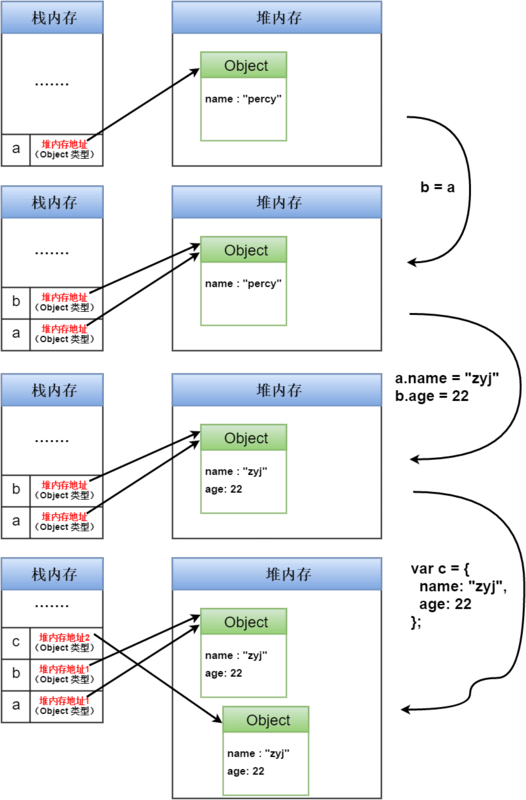
- 【知识点】 [Stack 的三种含义](http://www.ruanyifeng.com/blog/2013/11/stack.html) 在最后一种含义中，了解了不同类型的变量在内存中的存放方式：什么情况使用 **栈内存（stack）** ，什么情况使用 **堆内存（heap）** ：**数据存放的规则是：只要是局部的、占用空间确定的数据，一般都存放在 stack 里面，否则就放在 heap 里面**
- 【知识点】[容错，高可用和灾备](http://www.ruanyifeng.com/blog/2019/11/fault-tolerance.html)
    - 容错：发生故障时，如何让系统继续运行
    - 高可用：系统中断时，如何尽快恢复
    - 灾备：系统毁灭时，如何抢救数据


### 23日
- 【知识点】[如何使用github中的pull request功能？](https://blog.csdn.net/wangzi11111111/article/details/79861056)
    - **pull request是社会化编程的象征，通过这个功能，你可以参与到别人开发的项目中，并做出自己的贡献。pull request是自己修改源代码后，请求对方仓库采纳的一种行为** ——《github入门与实践》
    1. fork 项目到自己的仓库
    2. clone 自己仓库下的该项目到本地
        1. 确认分支：通过在终端运行命令： ```git branch -a``` 查看当前所在的分支，通常我们都是在查看分支后再进行代码的修改，这是一个好的习惯
        2. 创建特性分支：在应用 github 修改代码时，我们常常采用的策略是在主分支下在创建一个特性分支，在该特性分支下进行代码的修改然后通过该分支执行 pull request 操作。通过命令： ```git checkout -b work master``` (其中 work 为你新建的特性分支， master 为你当前坐在的分支)创建新的特性分支并自动切换
    3. 添加修改
        1. 修改工程 
        2. 提交修改：首先使用命令： ```git diff``` 查看修改的内容是否正确，然后使用命令： ```git add readMe.md``` （其中readMe.md为要添加的文件）向仓库中添加文件，在执行命令： ```git commit -m "add readMe.md文件"``` 提交说明（注：提交时要留意该开源项目有没有指定的 message 格式，如果有要与其统一）
        3. 创建远程分支 要从 github 发送 pull request ， github 端的仓库中必须有一个包含了修改后的代码的分支，所以需要创建一个与刚刚创建的特性分支（修改所在的分支）相对应的远程分支，执行命令： ```git push origin work1``` (其中 origin 为当时 fork 的远程主分支的名称，一般默认为 origin , work1 为本地工作的特性分支)，然后执行： ```git branch -a``` 进行查看是否创建成功
    4. 发送 ```pull request``` ： 进入到自己的 github 账户下，并切换到创建的特性分支下，然后点击 ```create pull request``` 后，确定没问题，填写相关内容，然后点击 ```send pull request```
- 【知识点】[GitHub 中 Issue 的使用](https://cloud.tencent.com/developer/article/1560257)


### 20日
- 【知识点】 通过历史来理解[什么是 B/S 架构？](https://blog.csdn.net/gschen_cn/article/details/102794643?ops_request_misc=%257B%2522request%255Fid%2522%253A%2522158476534919724847039340%2522%252C%2522scm%2522%253A%252220140713.130056874..%2522%257D&request_id=158476534919724847039340&biz_id=0&utm_source=distribute.pc_search_result.none-task)


### 18日
- 【知识点】[shim是什么？](https://www.jianshu.com/p/dd77905ecf32)
    - Vue响应式原理中说道：Object.defineProperty是Es5中无法shim的特性，那么这里的shim是什么呢？
    - shim可以将新的API引入到旧的环境中，而且仅靠就环境中已有的手段实现。
    - 文章中说的意思就是，Object.defineProperty这个特性是无法使用低级浏览器中的方法来实现的，所以Vue不支持IE8以及更低版本的浏览器。
    - es5-shim可以让一些低级的浏览器支持最新的ecmascript5的一些特性。支持浏览器或node.js，已经测试的功能见 https://github.com/es-shims/es5-shim


### 17日
- 【想法】未来的视频播放器是什么样的，现在能不能实现
    - 视频关键节点帮助你做笔记，因为信息的沉淀还是要靠文字
    - 视频时间线目录
- 【想法】迷茫？是因为太闲了，找点儿事做吧


### 14日
- 【知识点】 CRUD 是指在做计算处理时的增加(Create)、读取(Retrieve)、更新(Update)和删除(Delete)几个单词的首字母简写


### 3日
- [npm 换源](https://www.cnblogs.com/cythia/p/10985080.html)
- [Homebrew 换源 - 1](https://blog.csdn.net/jeikerxiao/article/details/72705629)
- [Homebrew 换源 - 2](http://blog.csdn.net/jeikerxiao/article/details/72705629)
- 【想知道】 version 我知道， tag 是啥？
    - [问题来源](https://yarn.bootcss.com/docs/usage/)


## 2月
### 29日
- 【瞎BB】**难得的2月29** 因为新冠肺炎在家蹲着，思考人生


### 27日
- 【玩物志】屏幕刷新率 120Hz 的手机：
    - 三星 S20 全系

- 【书单】理财专题书籍
    - 理财基础观念
        - 《富爸爸穷爸爸》
        - 《小狗钱钱》
    - 《股票大作手回忆录》
    - 《股票大作手操盘术》
    - 《日本蜡烛图教程》
    - 《解读基金》
- 【笔记】【乌合之众】
    - 作者认为真正的思想诞生于精英阶层，思想在向大众传播过程中会被歪曲，而歪曲的思想会有一批簇拥者，他们就组成了群体
    - 群体显著特征：精神高度统一，个人意志败给了群体，因此群体智力是低于个体的
        - 宗教情感：缺乏理智、极度保守
        - 领袖的手段：断言、重复、传染
    - 本书结论推导大多基于作者勒庞本人对于社会的观察，而非严谨的科学实验，英雌很多观点都比较片面，甚至带有作者本人强烈的偏见
    - 如果你想正儿八经的学习心理学，更推荐读《社会心理学》


### 26日
- 【笔记】【投资】【基金】
    - 基金后边带A的适合长期投资，短期卖出费用较高（长短期的分界点在哪里？）
    - C类适合短期投资，长期卖出费用较高
    - 新基金请参考基金经理过往业绩表现、投资方向，一般三个月内无法卖出，并只在周五更新一周的涨跌幅

### 25日
 - 【笔记】【面试】【简历】[【萌仲】简历怎么写才能脱颖而出？没实习/经验少/成绩差见招拆招](https://www.bilibili.com/video/av64316667) —— 主要针对校招，社招的朋友可以部分参考
    1. 分析岗位描述：他们要什么样的人？ 0:54
        - 企业需要的是「刚好适合这个岗位的人」
            - 既要能够胜任这个岗位的要求，同时也不要特别好，应为特别好的人会很贵，用不起
            - 还要和现在的团队合得来
            - 要有足够的工作稳定性和积极性
        - 所以写简历的第一步是搞清楚，企业需要什么样的人？
            - 最简单的就是去分析他的岗位描述，举个例子：
            - 岗位描述（产品经理）：
                1. 通过产品或策略提升业务整体的**拉新**效果
                2. 负责用户获取、用户转化等核心产品功能优化
                3. 构建并监测各渠道漏斗、**数据**报表，**分析**公户行为，洞察转化的驱动因素
                4. 以测试和数据驱动产品决策，实现**快速**迭代优化
            - 对描述的分析：
                1. 产品设计/规划能力
                2. 数据分析能力，能从数据中发现和解决问题
                3. 抗压能力、工作积极性、沟通能力、执行力
                4. 相关**经验**
    2. 匹配关键能力：我就是这样的人！ 4:27
        - 针对岗位需要的这些技能，挑那些素材适合放到这个岗位的简历里边
            1. 相关的经验
            2. 并不相关的实践经验，但能提取出岗位需求相关的技能
            3. 参加的一些培训
            4. 读过相关的书籍
            5. 职业技能相关的证书
            6. 和学习相关的专利/论文/奖项/证书 等，体现学习能力
    3. 优化简历描述：我是这类人里更好的人 7:42
        - 教育背景
        - 实践经历
            1. STAR 法则写好骨干
            2. 用行业常用的工作术语去做润色
            3. 增加细节，量化结果，多用数字和百分比
                - 假设小明是学校围棋社的社长，他加入时，围棋社人非常非常少，但是经过两年左右的事件把社团从11人扩大到了200多人，看上去和产品经理无关的经验对吧，我们用这三部整理一下他的故事
                - 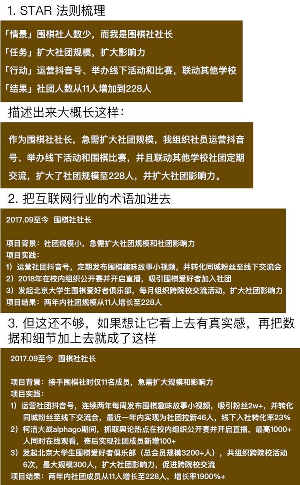
        - 奖项职务
        - 特长介绍
            - 可以罗列出和这项工作相关的技能证书，比如英语证书、计算机证书、你会各种各样的软件等等
            - 而自我介绍这个环节，主要是为了强化简历整体呈现出来的「人设」，写一些「我很积极主动」 「抗压能力强」 「适应能力强」 就足够了，而至于你内心世界多么丰富多么真实，面试官是不关心这些的，和你的朋友分享就好了
    4. 关于整个简历：
        1. 应届生的简历要**正好一页纸**，不多不少刚刚好
        2. 简历模板**整洁清晰**就行，不要花里胡哨的，显得很不专业
        3. 「彩色打印」 「黑白打印」 「厚的纸打印」 「薄的纸打印」 都没有关系
        4. 如果没有硬性规定，尽量不要暴露过多的私人信息：比如照片、年龄、性别、家乡、个人喜好等等，你拿不准看到简历的人会不会对这些信息有偏见，那就干脆不要写
        5. 格式工整，不要有错别字。整个简历体现出的就是你的工作习惯，要展示出自己足够专业细心的一面
    5. 其他问题：没经验/没时间/没学历/...... 11:25
        1. 没有时间经验怎么办？
            - 很多人把「实践经验」的范围理解的太狭隘了
            - 相信你的大学四年或者研究生三年，一定多多少少都做过一些事情，你现在需要事无巨细把这些事情都回忆起来
            - 比如学校里各种活动或者比赛、在学校参加的社团，某一门课老师要求你要去参加社会实践。或者在课堂上和同学一起制作 PPT 进行演讲汇报等等。这些都能拿出来多为一个独立的小项目去讲
            - 校外的机会其实就更多了，比如你作为志愿者帮别人管理过QQ群或者微信群，或者自己有定期更新的公众号，这些都能拿去写
            - 对比一个的确去某家公司实习，但是每天都在打印，复印资料的实习生，还不如说自己管理了一个QQ群，每个月都会组织群里的活动来的有价值
        2. 没有时间实习？
            - **做选择就意味着放弃**，你不可能一边实习，一边门门成绩都要考第一，还要准备考公务员等等，看上去像是抓住了每一个赛道，但其实是给每个赛道的人当分母
            - 优秀分很多种，但是没有一个人可以实现每一种，毕竟**有舍才有得**
        3. 学校不好？表现普通该怎么办？
            - 在匹配度相同的额情况下，当然会选择那些学校更好成绩更好的学生
            - 但是我们为什么不能做的匹配度比别人更高呢？
            - 学历歧视、性别歧视、地域歧视、长相歧视，这些会伴随我们一生，我们要做的是**明确我们想要什么**，做好自己就足够了，让自己在**应该奋斗的时候不后悔**


### 24日
- 【笔记】【面试】【offer】[【萌仲】100%拿offer的独家面试秘笈](https://www.bilibili.com/video/av89908192)
    1. 常见的问题
        - 是否遇到过面试还没开始时就已经紧张的说不出话了
        - 是否面试官问你为题的时候总觉得自己说不到重点，并不是面试官想要的
        - 是否遇到过觉得自己面试表现还不错，但最终就是没有拿到 offer 
    2. 面试的目的是什么 1.43
        - 对面试官来说他的目的是以下三点
            1. 考察简历的**真实性**
            2. 了解面试者经历背后的**能力**
            3. 考察这个人**能否融入团队**
        - 想清楚这一点，我们就能有针对性的做一些准备，降低面试的不确定性，提升自己的自信心，就可以实现在短期内，快速提升面试技巧的效果
        - 针对这三个目的，求职者的目标也非常明确了
            1. 证明简历的真实性
            2. 展示出这个岗位所需要的能力
            3. 证明你是能够并且愿意融入团队的
    3. 如何进行岗位调研 2.42
        - 针对你非常非常想去的公司，正式面试之前一定会做一些基础的调研和分析
        - 所谓的公司调研就是在网上找这家公司的相关资料，目的是去了解这家公司更**喜欢什么样类型的员工**
        - 关于如何根据岗位介绍分析出这个岗位需要什么样的能力要求，之前有一期视频专门讲（[简历怎么写才能脱颖而出](https://www.bilibili.com/video/av64316667)）
        - 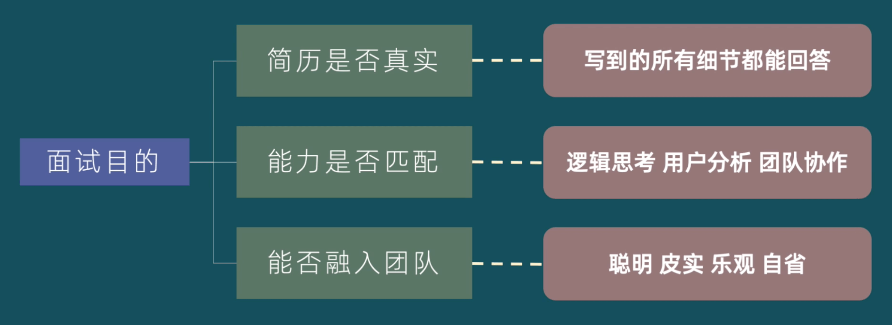
        - 把这些想清楚之后，我们就得到了一个面试的额标准答案
    4. 面试问答题库以及准备 3.32
        - 在面试官的角度，如何把一个完全陌生的我，和他心中的标准答案联系在一起，当然就是要问问题了
        - 我们要做的就是在这个问答的过程中，把自己**最符合岗位的部**分拿出来展示给面试官看
        - 这个环节能否过关，很大概率在于你的真实能力和你的重视程度
        - up 主非常清楚她在校招的时候，以她的背景和资历去一流的名企竞争，她的竞争力是非常一般的（太谦虚了），所以在面试之前做了大量的功课，**穷举**了面试官可能问到的所有问题，一一列出来，把答案提前准备好，并且反复练习，这就相当于面对一场考试，大部分同学都是裸考，而她不仅提前猜题，而且还背下了参考答案
        - 面试官通常会问三类问题
            1. 深挖简历中的项目
                - 将简历上的项目用 STAR 法则和六何分析法，拓展成一个基础的问题矩阵
                    - STAR 法则是撰写简历的基本原则，指的是你经历的每个项目，都需要使用 情景（Sluation）、任务（Task）、行动（Action）、Result（结果）这四个要素进行描述
                    - 六何分析法就是 5W1H ，是对选定的项目、工序或者操作，都从原因（Why）、对象（What）、地点（Where）、时间（When）、人员（Who）、方法（How）六个方面提出问题进行思考
                - 对问题进行删减
                    - 删减原则1：只选出你参与度最深的2~3各项目做这样的问题矩阵展开（相信其他参与度不深的其实也没有这么多话好聊的）
                    - 删减原则2：删除那些和目标岗位技能无关的这些题目
                - 合并同类项
                    - 将展示同一类技能的问题总结起来就会得到这样一张表
                    - 到这一步其实就准备4个答案，能覆盖到所有的要点就行了
                    - 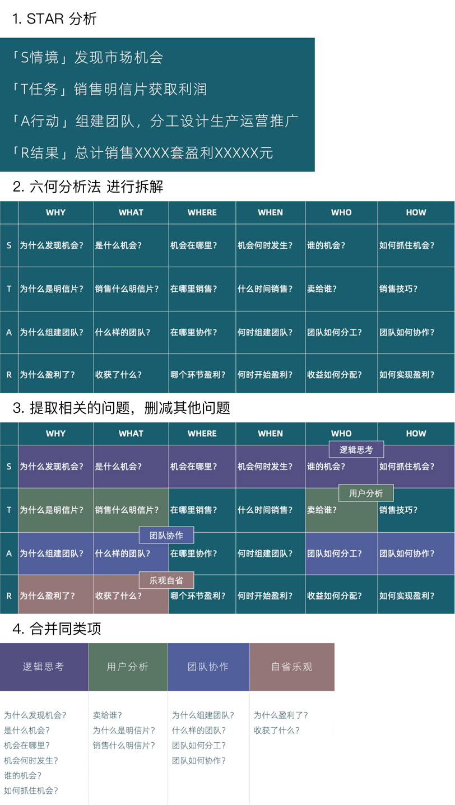
            2. 业务 、 公司 、 行业的思考类的问题（我觉得程序员了解即可，主要还是技术的东西）
                - 通过行业研报、商业类的分析、数据的研究报告，了解行业的大环境是什么样的，最好的公司是哪几家、他们是怎么做业务的
                - 可以搜索你要面试的这家公司最近有什么新闻、发布的新产品、甚至是发布的招聘信息
                    - 新闻和新产品可以知道他们现在在做什么
                    - 招聘信息（招什么岗位、什么岗位招人最多）可以知道他们未来想做什么
                    - 体验该公司和竞争对手公司所提供的服务或者产品，寻找异同还有优化点，要假设自己已经拿到了 offer，这些招聘信息变成了你的工作，你会怎么去做这份工作呢？ 先做什么？后做什么？
                    - 社交品台：微博、脉脉，寻找这家员工的发言，尝试找一些对面试有价值的信息，验证或者修正你刚才准备的这些答案
            3. 为了了解你的性格 & 求职意图
                - 常见问题
                    - 自我介绍
                    - 为什么选择我们公司？
                    - 为什么我们要选你？
                    - 你的优势是什么？
                    - 你的缺点是什么？
                    - 你未来 3 、5年的职业规划是什么？
                    - 你对我们公司有什么问题？
                - 准备这类型的题目要扬长避短，让自己的答案尽量贴近这个岗位的要求
    5. 面试加分项 8.29
        - 如果你的题库建立好，提前捋清思路，已经打败80%的竞争者了
        - 为了万无一失，有备无患，UP 还会在面试的时候准备一些**面试道具**，准备道具的好处非常多
            - 你能**让面试官感受到你的重视程度**
            - 可以**部分实现引导面试话题**的效果，让道具和你认真准备的题目之间形成相互配合
            - **提示表达逻辑**，你可以按照材料上所展示的思路，表达你的想法
            - **给面试官留下深刻印象**，尤其是校招的时候，应届生的经历大同小异，如果面试官完全记不住你那就糟糕了
            - 道具还是从岗位的需求出发，把他们想要的技能点展示出来，形式包括但不限于**脑图、流程图、excel报表、PPT、设计图、照片、获奖证书**等等，你可以直接带电脑或者 pad 过去展示，也可以事先打印出来，上边留姓名和联系方式，留给面试官（一定要带简历）
    6. 面试注意事项 10.35
        - 可以提前模拟面试，写出来和说出来又是两码事儿，尤其是缺乏面试经验，或者对自己表达能力不够自信的同学，一定要提前练习，记住答案的逻辑梗概，只要面试官 cue 到相关的问题，就能将一整套逻辑性的表达出来
        - 着装洁净工作风格，女生可以稍微化一点淡妆，穿着的话就看他们平时上班穿什么，如果面试的是互联网公司，一定不要穿正装
        - 提前 10~15 分钟联系 HR ，不要太早也不要太晚 ，尊重面试官的时间安排也是有礼貌的表现，可以提前半小时到现场，熟悉一下环境，看看材料，缓解一下紧张情绪
        - 找到一种放松、真实、有很自信的面试状态
    7. 远程面试技巧 12.20
        - 缺点：
            - 没有面对面，你说话的感染力会下降，很难传达出情绪
            - 受到通讯工具的限制，很难形成一个流畅的沟通感
            - 容易受外部因素的影响：网络、话筒、摄像头、甚至如果面试中看到你的环境乱七八糟，也会影响你的观感
        - 但远程面试也会有它的优点
            - 首先显而易见的，它给了你疫情期间的面试机会
            - 大概率你有可能拿到面试官的联系方式（因为大家不可能自己开发个远程面试系统），后续就可以厚着面皮问面试官你的面试进度了
            - 视频之外是面试官的盲区，也是你的发挥空间
                - 提前选好位置，背景
                - 提前检查网络和设备
                - 在镜头范围之外准备你的“提词器”
                - 准备在线版道具，在恰当的时机丢给面试官
        - 不用担心远程面试，只要我们准备的够充分，什么样的面试都不怕
        - 
    8. Q & A 15.23
        - 没有相关经验？
        - 面试题库没用到？
        - 面试流程是什么？
        - 面试不通过怎么办？
            - offer 是一时的，人生的道路非常漫长，不到最后一刻谁也说不好，是否拿到了一个满意的结果
            - 相比结果来说，更重要的是**学会对自己负责**，培养这整套的思维习惯和做事态度，远比一个 offer 会让你在之后的人生道路里收获更多


### 23日
- 【玩物志】【】可以替代明基千元 ScreenBar 的 倍思屏幕挂灯 ￥168


### 17日
- 【游戏】主机游戏机
    - PS
        - PS4 Pro
        - PS5
    - XBOX
        - XBOX ONE S 基础班
        - XBOX ONE X 性能加强版
    - Switch 

- 【知识】口罩：
    - 防护等级，从高到低
        - 医用防护口罩 19083-2010
        - 医用外科口罩
        - 一次性医用口罩
    - 不合格口罩的防护效率还不到 5% ，和不带差别不大


- 【知识】【设计】【交互】[**尼尔森10大可用性原则**](https://www.ui.cn/detail/505317.html) —— 交互设计基础理论知识
    1. 系统状态可见性
    	- 定义：系统应该在适当的时间内做出适当的反馈，告知用户当前的系统状态；该原则强调，产品要给用户适当的反馈
    2. 系统与现实世界相匹配
    	- 定义：系统应该使用用户熟悉的词、句、语法，应该符合真实世界中的使用习惯；该原则强调，产品要使用用户语言
    3. 用户控制与自由
    	- 定义：用户在使用产品时经常会误操作，因此需要一个非常明确的“紧急出口”来帮助他们脱离困境，需要支持撤销与重做；该原则强调，产品需要支持用户“反悔”
    4. 一致性与标准化
    	- 定义：产品的信息架构、交互方式、功能名词、视觉表现等应该具有一致性；该原则强调，产品需要具有一致性
    5. 预防错误
    	- 定义：无论错误场景设计的多好看，都不如在第一时间防止用户发生错误；该原则强调，产品需要有防错机制
    6. 辨认而不是回忆
    	- 定义：将用户的记忆负担最小化，尽可能减少让用户去记住信息，应该提供信息让用户辨认
    7. 灵活性与使用效率
    	- 定义：无论是老手还是小白，都能够轻松高效的使用产品
    8. 好看而简洁的设计
    	- 定义：页面中不要出现无关的或者冗余的信息，每个多余的信息都会分散用户的注意力；该原则强调，产品要简洁明了
    9. 帮助用户发现、判断和修复错误
    	- 定义：错误信息需要告知用户哪里有问题，并且告知用户如何解决问题，而不是展示代码；该原则强调，异常状态要告知用户如何解决
    10. 帮助文档
    	- 定义：即便最好就是不需要帮助文档就能轻松使用产品，但是当用户需要帮助时，帮助文档需要易于查找，专注于用户的任务，列出使用步骤，并且信息量不能过大；该原则强调，帮助文档要清晰


- 【发现】【提升】好的习惯
    1. 阅读，每天至少半小时，主要三类：成功人士传记、自我发展、历史
    2. 每天运动，至少半小时用在强化心肺的有氧运动
    3. 乐于结识成功人士，避免负能量的人的影响
    4. 追求自己的梦想与生命的目标，许多人并不认识自己，错把别人的愿望当成自己的梦，比如父母的期待。热情是让工作充满乐趣的动力
    5. 坚持早起，上班时间前3小时起床，早上起床后先完成你认为最重要的三件事儿，让你有掌控生活的自信与感受
    6. 有多种收入来源
    7. 有心灵导师的引导
    8. 积极的人生态度，如果不是非常痴迷，且有你喜爱的东西就不要创业，如果你已经有了退出策略这就不算痴迷
    9. 不盲目从众
    10. 人际往来的人情世故要放在心上，比如常用感谢函，记住别人的生日等等人生大事
    11. 帮助同路者成功，助人者人恒助之
    12. 每天花15~30分钟独处与沉思，让思绪更清楚，包括事业财富、健康、行善等
    13. 欢迎批评与指教


- 【发现】让你越买越穷的东西:
    1. 乐透/彩券
    2. 赌博
    3. 抽烟喝酒
    4. 过多廉价、不耐用的东西
    5. 名车
    6. 过多的娱乐、派对
    7. 时下流行的商品
    8. 令人上瘾的甜食、饮料
    9. 充值会员卡、课程套服卷
    10. 过多华丽的流行服装


- 【发现】如何创造被动收入？6种门坎低回报高的被动收入！
    1. 投资高股息股票，业务稳定，年年赚钱，派息较高的公司，每年都有3、4厘以上的收入
    2. 投资指数基金，跟着指数走的基金
    3. 买入债券（固定收益），高于银行储蓄收益，相对稳健
    4. 创造能自动化的公司或者投资中小企业
    5. 创作者型被动收入，通常有版权（书籍、音乐、相片）、专利费
        - 如果想写书，但不知道观众是否买账，可以从 blog 做起


- 【发现】行为金融学


### 16日
- 【发现】【无趣的二姐】[你的余额宝就能稳赚不赔吗?错！它也会亏钱](https://www.bilibili.com/video/av88209538)
    - 这三种情况，余额宝会亏钱
        1. 提现手续费高于你获得的收益（放进余额宝没几天，就提现的，收益还没有达到手续费的钱）
        2. 遇到金融危机：货币基金的高流动性就成了缺点，遇到严重的巨额赎回，导致基金经理只能低价卖资产，也就导致了亏损
        3. 过节（指春节国庆这样的长假）前一天买入容易亏钱，因为场外货币基金收益是T+1，节前一天买入，过节这几天是没有收益的，相当于白白放着
    - 场内货基不建议在长假前买入，一般长假前人们为了在假期依然获得收益，会选择节前买入，买入得人多，价格自然水涨船高，节后带概率会跌，二姐反向操作了一波，节前最后一个交易日卖出，套利7000多
    - 投资本身就是一个长期行为，关键是认识里边的风险，哪怕是小小的余额宝也有可能会亏损，我们能做的就是理解它的逻辑，然后用好它。回到我们的生活中也是，没有绝对的安稳，永恒不变的就是变化，就像今年突如其来的疫情，无论是奔赴前线的医护人员、身处困境的患者、还是待在家的普通人，都让这个春节边的不平凡。
    - 我们能做的就是努力提高自己的**基本面**扩宽视野，持续的经营自己，认清**生活的逻辑**用坦然的心态，去拥抱生活中足够确定的部分，然后认真生活。


### 15日
- 【发现】技术文档都有详细的介绍，但是对一些人来说看技术文档有些吃力。文档这个东西是看的越多越熟练、对你的帮助越大，其实很多人是不需要培训的，文档上都说的很清楚，就是因为没有自学能力才去花钱培训的。
- 【想知道】如何高效阅读技术文档？
- 检索【苹果Xcode帮助文档阅读指南】，教你怎么去看文档


### 4日
- 【知识点】 HDR10 ：现在买4K电视/4K播放机经常会看到的参数之一就是HDR（**高动态范围**），而HDR10就是各种HDR格式里面最基本最普及的一种了，广泛应用到UHD Blu-ray、影视串流等不同的讯号源上面，可以更多地保留原生拍摄画面的高光、暗位细节，可以让画面更加像真的更加**接近大家肉眼所见到的影像**。 
- 【知识点】杜比视界 ： 杜比视界是HDR技术的一种，它可以让画面的该亮的地方更亮，同时能呈现更**丰富的暗部细节**，获得更高的**亮度和对比度**；另外杜比视界HDR还拥有**更宽的色域**表现，数十亿种颜色远超普通内容的数百万种颜色；同时杜比视界内容还有**12位的色深**，可以比普通内容的8位色深营造出更生动的细节。


## 1月

### 31日
- 【知识】股息投资法
    1. 看派息历史：最好选择每期都在派息，并且股息稳步增长的的公司
    2. 看股息派发率：就是股息占公司盈利的百分比，如果超过 50% 的话说明公司把超过一半的盈利都分给了投资人，对投资人来说固然是好，但公司用来发展的钱就少了，未来派发更多股息的能力可能就会受限。最理想的情况是股息增长的同时，公司收入也相应在上升，并长期维持相同的股息派发率
    3. 看财务状况：留意公司的期末现金以及净收益，因为公司得有充裕的资金和盈利才能持续的派息，派发高额股息的公司盈利若没有持续在增加的话却不断提高股息派发率就要格外小心了。简单来说公司赚的钱和手头上的钱没有越来越多的话又怎么可以支付越来越高的股息呢
  


### 30日
- 【发现】《未来地图》：让人类失去工作的不是科技，而是我们如何运用科技的决定：不用科技取代人，而是用科技让人变得更强大
    1. 平台思维：打造数位平台，依靠市场资源满足需求，未来成功的企业将会是平台化的
    2. 借用资源：以使用权取代了所有权，借用他人闲置资源，创造社会价值
    3. 巧用科技：巧用现有科技，提升自身能力
    4. 提高学力：技术发展远领先于教育系统，倍速时代，停止学习就等着被淘汰
    5. 知识就是工具：从做中学，动手解决实际问题，**从学以致用到用以致学**
    6. 新时代的学习机制：拥抱无限资讯，扩充所需技能


### 29日
- 【想知道】XML 应用 

### 26日
- 【解决问题】联通宽带无法访问 github ？
    - hosts 添加如下内容
        ```shell
        # Github
        151.101.44.249 github.global.ssl.fastly.net
        192.30.253.113 github.com
        103.245.222.133 assets-cdn.github.com
        23.235.47.133 assets-cdn.github.com
        203.208.39.104 assets-cdn.github.com
        204.232.175.78 documentcloud.github.com
        204.232.175.94 gist.github.com
        107.21.116.220 help.github.com
        207.97.227.252 nodeload.github.com
        199.27.76.130 raw.github.com
        107.22.3.110 status.github.com
        204.232.175.78 training.github.com
        207.97.227.243 www.github.com
        185.31.16.184 github.global.ssl.fastly.net
        185.31.18.133 avatars0.githubusercontent.com
        185.31.19.133 avatars1.githubusercontent.com
        192.30.253.120 codeload.github.com
        ```

### 22日
- 【知识】如何自律？[来源](https://www.youtube.com/watch?v=TRaX1kjcwd0)
    - 拖延症、意志力不坚定、不够自律。直接表现就是无法摆脱对手机的成瘾性依赖
    - 重要原因：没有认识到时间的价值
    - 算笔账：每天除去工作、学习、睡觉占据的大块时间以外，再排除掉无法避免的早晚洗漱、化妆、通勤、喝水、发呆、买菜、做饭洗碗聊天等，每天还剩多少时间
    - 上班是为了别人的目标努力着，如果每天都把时间 kill 掉，凭什么去奢望未来能过上更好的日子？
    - **一天的生活不过就是一生的缩影罢了**
    - **投入的差距，时间越久差距越大**
    - 尽可能用所有的时间去提高自己，把所有的时间都花在自己身上，在日积月累之后产生了巨大的复利效应，成就了更优秀的自己
    - 各行各业的佼佼者其实都是远离大众，远离娱乐的，所有的成就都是需要时间的积累和沉淀的
    - 李健现在还在用最古老的诺基亚手机
    - 你看那些所有**有成就的人**，他们所有的时间和精力都用在成就自己这件事儿上，他们的眼睛是向内看的，是忘内求的
    - **平庸的人**，都是往外看，所有的注意力都在外界，时刻都在找寻着乐子，好打发时间：哪个明星出轨了、哪个富翁出事儿了，对别人的事儿操碎了心，却从来不关心自己的成长
    - 向来心是看客心，奈何人是剧中人
    - 我们贪玩不自律的原因就是短视的选择了当下的愉悦，没有去考虑长远的结果，就在此时此刻，我们都相信自己是有脑子的人，可回头看过往时你又会发现，**正是自己做出了太多没脑子的决定**，这是为什么？
        - 其实我们的 “脑子” 这个器官并不可靠，本能的想去偷懒、走捷径、做容易的事儿，喜欢沉溺在那些短暂又廉价的快乐中无法自拔
        - 所以很多时候，我们的直觉判断往往是错的
    - 贪玩、浪费时间、混日子的结果就是落入平庸
    - 醉着年龄的不断增长，为了生存，你将不得不与一个更庞大的额群体去竞争
        - 和同龄人比，没有什么优势，你会的别人都会，接受同样的教育，在思维层面上也没有什么差别，就想批量生产的产品，**做着随时都能被替代的工作**，毫无价值的活着
        - 尽管小时候都是家里的宝，可进入社会后，注定要去玩一场比谁更贱的游戏
        - 站在企业的角度看，我们和其他的人差别无非是他多几百块钱，你少几百块钱，仅此而已
        - 只因你没有更值钱的能力
    - 我们终有一天会无可避免的老去，正因我们年轻，都是第一次做人，所以我们往往意识不到，时间无情的另一面。当我们为自己找借口，欺骗自己，欺骗别人，欺骗生活的时候，其实是心虚和不安的
    - 生活不会突然跳出一个魔鬼或者一个神仙，来教训你、惩罚你，不会的，时间它什么也不说，什么也不做，任由你尽情的表演，任由你发展，任由你自我欺骗，然后任由你在漫长的生命里痛苦的挣扎
    - 所有那些在往日中耍了的滑、偷了的懒，终将会被时间慢慢的全部清算，让你生不如死，想死却又不敢去死
    - 就算你主动选择堕落去逃避现实，沉迷在各种娱乐活动中，最多也只能得到片刻的解脱，欢愉过后还得去面对和解决生活中的各种问题和困难。那些快乐、那些「哈哈哈」，**那些来自脑部的高潮体验。本质上并不能对我们的生存有任何帮助。**
    - 我们总以为「道理」谁都懂，其实不是的。多数人可能只是知道个名称，概念而已，并没有深度的去思考过，更谈不上理解。否则你无法解释，为什么有的孩子年纪轻轻就懂得努力的意义，而有的人到了中年还在瞎混，后者真的懂「道理」么？
    - 在我看来「知道」和「理解」其实是两回事，而且它们的距离相当遥远。《毛泽东选集》中有一句话解释的很好，他说：**“感觉到了的东西，我们不能立刻理解它，只有理解了的东西，才能更深刻的感觉它。”**
    - 我认为**人只有在看透、想通以后才会变成行动。想不通才会做不到，因为我们不会去做自己不想做的事。所以只有当我们真正理解了那些「道理」以后，自然才会去做出改变。**好好去琢磨琢磨时间这个的东西！
    - 我建议你，从现在开始“考虑当前行为的长期后果”，跳脱出来从更高的层面去观察自己每天的行为，对大脑保持警惕，**那些对自己未来没好处的事，再有乐趣都要少做或者不做。而对未来有益的事哪怕再难、再无聊，都要强迫自己去做，做那些真正对的事！**
    - 当你明白了这个道理，连戒烟戒酒都会变得简单，因为你抽的每一根烟都会增加你未来患病得癌的机率，而未来是一定会到来的。你不过是在满足「愚蠢的大脑」，获得短视的愉悦感罢了。难道你还会再去纵容它么？
    - 无论你的梦想是什么，开始去做那些离它可以更近的事，也就是把大目标分解成每天去执行的小目标，眼睛要向内看，**去关心自己的成长，开始去种自己家的地。**
    - 当你开始去做时，「愚蠢的大脑」肯定会不断给你发信号，进行抗拒，暗示你它有多么的不喜欢做这些事，希望你放弃。因为它已经习惯了放纵，“为何不去找点乐子呢”？**这时你大可不必在乎它的感受，忽略它，驯服它，要意识到它只是你的一个器官而已，它必须服从更高层次的你！**
    - **强迫自己去训练对枯燥乏味，习以为常。对简单重复，不再抗拒的能力。你会发下其实难走的路并不拥挤**
    - 当然，改变从来不是打个响指就能做到的，**自律一定会经过反复的挣扎，尤其是对那些从小就没养成好习惯的人来说。**不要幻想着马上就能有大的改变，任何改变都是一点一点开始的。
    - 同时**不要低估了改变的困难程度，不要因为失败而苛责自己**，这本来就是条少有人走的路，但好在我们不是运动员，并不需要打破世界纪录，做世界第一。我们只要比周围的同学、同事更努力一些，比自己的昨天更努力一点，生活就会发生改善。   
    - 最后我想说，做这期内容不是想批评谁，就是因为自己同样不够自律，才会有感而发。写这些东西比单纯推荐一本书要难多了，也容易招致非议。本想讲的轻松些，不想太严肃，可关于人生的话题，又没法儿不深刻的去讨论。**因为等五年、十年后，回头看，害了我们的，正是那些太多毫无意义的「哈哈哈」。**
    - 我们**每个人都要对自己的人生负责任，大家生来拿着不同的牌，这是无法改变的事实**，愤怒、抱怨，责怪过去毫无意义！我们只能向前看往前走，尽力去打好手里这把牌（再烂的牌）。世界充满了不平等，**也只有时间是平等的！** 农民都懂春种秋收的质朴真理！所以，无论你去做什么，只要行动就会有结果，而「躺着」什么都无法改变，真的。


### 21日
- 【知识】如何克服拖延？
    1. 现实乐观：种一棵树最好的时机除了十年前，还有此刻。自信起来：大家都没差，自己也不赖，未必注定失败，试着告诉别人你的目标
    2. 目标细化：也可以说具体化，比如一年要读20本书，或者一个月要读一本书的目标，改为每晚读半小时的书，或者一个章节要几天读完
    3. 分配任务时间：把最高效的时间段留给人物最难的部分，实在要拖延，可以把时间余给必须完成的事儿，比如不想写数学作业，可以把英语先写了，而不是看一小时电视。
    4. 消除干扰：远离充满诱惑、干扰性太强的环境。比如想早睡，断网、手机尽可能放到视线外
    5. 奖励机制：奖励自己，完成一件任务时，可以奖励自己一件最喜欢的事物或东西，逛街呀。看电影呀、旅游都可以
    6. 不怕失败：最后，面对困难，即使失败了，从中获得的进步也是值得开心的事儿


### 20日
- 【知识】7种收入来源，你有几种？
    1. 工资：时间换取收入，也叫主动收入，天花板明显
    2. 利润收入：高于成本的价格出售商品或服务
    3. 利息收入：把钱借贷出去的收入，属于被动收入
    4. 分红收入：通过在公司的**股份**获得公司的部分利润
    5. 租赁收入：将自己的一部分资产租赁给其他人获得收益，
    6. 版权收入：不需要工作任能获得的收入，比如你写了一本书一直被购买
    7. 资本收入：来自于买入卖出资产，不必生产任何产品，二资产的价格大部分是由市场条件决定的，除了买入卖出的时机，其他你能做的就很少了。
- 【发现】如何知道互联网哪个技术的薪水高低？
    - 拉勾网，每年都会出：互联网职场生态书
    - 100offer ，每个季度都会出各语言，或者各技术的薪酬报告
- 【发现】【网站】
    - [NiceTool 生活工具网站](http://www.nicetool.net/)
    - [壁纸网站 wallpaper abyss](https://wall.alphacoders.com/)
    - [导航网站 anywhere anything](http://lackar.com/aa/)
    - [音乐小游戏 Mikutap](https://aidn.jp/mikutap/)


### 13日
- 【知识】慢性咽炎保养比治疗重要
    - 保养：避免感冒、多喝水、避免吃太刺激的食物：辣椒、花椒、太酸的、太甜的
- 【想知道】背景最大的书店是？
- 【想知道】【学习】如何鼓励身边的人让他信心满满？


### 10日
- 【知识】【技巧】Mac 下载 blod 开头的视频资源的方法
    - 准备工作： 
        - 安装 Homebrew 
            ```shell
            /usr/bin/ruby -e "$(curl -fsSL https://raw.githubusercontent.com/Homebrew/install/master/install)"
            ```
        - 使用 Homebrew 安装 
            ```shell
            brew install ffmpeg
            ```
    - 在开发者工具中的 network 标签中获取视频资源的 m3u8 链接，执行如下命令：
        ```shell
        ffmpeg -i url ***.mp4
        ```


### 5日

- 【实用】Mac 动画速度
    - dock 动画速度
        ```shell
        # MAC 自动隐藏 DOCK 之后，干掉出现的延时
        defaults write com.apple.Dock autohide-delay -int 0 && killall Dock
        # 若想恢复
        defaults delete com.apple.Dock autohide-delay && killall Dock
        # 修改dock出现的速度：
        defaults write com.apple.dock autohide-time-modifier -float 0.3;killall Dock
        # 如果是 0 要把 -float 改为 -int
        ```
    - Launchpad 动画速度
        ```shell
        # 修改展示过程持续时间
        defaults write com.apple.dock springboard-show-duration -float 0.08
        # 修改消失过程持续时间
        defaults write com.apple.dock springboard-hide-duration -float 0.08

        # 若想恢复默认设置
        defaults delete com.apple.dock springboard-show-duration
        defaults delete com.apple.dock springboard-hide-duration;killall Dock
        ```
    - mission control 的动画时长设置（没有生效，不知道为啥）：
        ```shell
        defaults write com.apple.dock expose-animation-duration -float 0.1;killall Dock
        ```

### 3日
- 【知识点】【git】```.gitignore``` 内需要忽略的文件： ```*.idea``` 、 ```*.DS_Store``` 、 ```*.sass-cache```
    - ```.idea```
        - PHPStorm 是 基于 IntelliJ IDEA 开发的。
        - .idea文件是 IntelliJ IDEA 工程项目的配置文件，里面包含了这个项目的设置，打个比方，该项目中文本文件采用的默认编码格式，默认缩进是TAB还是4个空格、2个空格之类的。
        - 可以删除，一般对你的项目不会有实际影响。但你的配置会消失，而且下次打开他还会自动生成。所以没有必要。

    - ```.DS_Store```
        - 是MacOS 中 Finder 用来存储这个文件夹的显示属性的：比如文件图标的摆放位置。删除以后的副作用就是这些信息的失去。（当然，这点副作用其实不是太大。
        - 和别人交换文件（或你做的网页需要上传的时候）应该把 .DS_Store 文件删除比较妥当，因为里面包含了一些你不一定希望别人看见的信息（尤其是网站，通过 .DS_Store 可以知道这个目录里面所有文件的清单，很多时候这是一个不希望出现的问题）。

    - ```.sass-cache```
        - Sass 还会自动缓存编译后的模板，这样做能够显著提升重新编译的速度，尤其在处理由 @import 导入多个子文件的大型项目时。单独使用 Sass，缓存内容保存在 .sass-cache 文件夹中。可以删除，但是下次再编译的时候还会产生。


# 2019年

## 12月


### 28日
- 【解决问题】Mac 安装 oh-my-zsh 之后重启失效的问题
    - 只需要执行这个命令 ，切换默认 shell 为 zsh 即可
    - ```chsh -s /bin/zsh```


### 19日
- 【知识】【成语】【大相径庭】
    - [dà xiāng jìng tíng]
    - 比喻相差很远，大不相同。出自《庄子·逍遥游》
    - 【近义词】迥然不同、泾渭分明、截然不同、天差地别
    - 【反义词】一模一样、如出一辙、大同小异、相差无几


### 18日
- 【知识】【github】怎么用？—— 搜索
    - 比如想搜名字中有 ```spring boot``` ， 星标数大于 3000 的项目
    ```
    in:name spring boot stars:>3000
    ```
    - 比如想搜描述中包含 “微服务” ， 语言为 java ， 并且在2019年12月之后有 push
    ```
    in:description 微服务 language:java pushed:>2019-12-01
    ```
    - 再比如想学爬虫，查找描述中包含 “爬虫” ， 语言为 python ， 星标数大于 1000 ， 并且在2019年2月之后有 push
    ```
    in:description 爬虫 language:python stars:>1000 pushed:>2019-02-01
    ```
    - 详细的搜索条件用法可以参考这里？？？？
 

### 15日 
- 【知识】【健康】【大蒜】[嘴里的蒜味为什么那么难去除？](https://zhidao.baidu.com/daily/view?id=184120)
    - 人们不断寻找能抵消蒜味的食物，测评无数。经过许多对比测试，人们惊奇地发现苹果、生菜、薄荷等食物竟然有除蒜味的妙用。原来这类物质都含有酚类化合物，这才是化解蒜味的必杀技。酚类化合物会与AMS这类硫化物结合，结合后分子的体积变大，小分子的优势荡然无存。于是被制服的AMS无法再混进肺循环中，气味自然就除去了。
    - 人们苦恼于吃蒜后的臭味，但臭味的来源却也有妙用。同时不仅人类不喜欢蒜味，人们讨厌的蚊子也总是不愿意靠近大蒜素。于是敌人的敌人就成了朋友，大蒜也被用作驱蚊神器。生活小能手们发掘出各种各样释放大蒜素驱蚊的方法。比如把大蒜切碎，放进剪开口的口罩中，倒入适量风油精，再把开口扎紧。这就成了功效强劲的驱蚊利器。
    - 新鲜生蒜捣碎后产生的硫化氢也是臭味来源之一。这种气体不仅散发出刺激性气味，还有毒。但从大蒜中释放硫化氢的量少，反而对人体心血管系统有保护作用。而经过烹煮或晒干的大蒜却并不产生硫化氢，也就没有此功效。


### 14日
- 【知识】怎么让简历更专业？
    1. 经历按时间顺序倒序：简历中的项目经历、工作经历等，一定要按时间倒序来写。因为HR更看重最近的工作经历，近期工作经历也是最能体现求职者和职位的匹配程度。而如果不按时间倒序来陈述经历，会给HR简历**不专业**的印象，影响求职成功率。
    2. 正确使用英文大小写
    3. 正确使用标点符号：英文简历：所有标点用英文的半角格式；英文标点后面要有空格；简历里一般用不到句号中文简历：避免使用叹号、问号、省略号；酌情使用分号，比如在一段工作和另一段工作间用分号隔开在一段描述结尾时建议不加标点符号中英文标点符号不要混用
    4. 避免使用第一人称及人称代词：第一人称过于主观，同时显得**非常不专业**，用第三方视角来描述和量化工作结果显得更有信服力。建议全文使用动宾结构，动词+名词描述工作内容和可衡量的成果，不需要出现名词代词，尽量做到描述具体和简练
    5. 尽量避免出现重复信息：同一类型的工作内容、奖项等建议合并为一项描述，不要重复出现；不同公司中一直做同样的工作，尽量描述工作成果动词尽量使用不同的用词


### 13日
- 【纪念】今天从天眼离职，4年的青春留在了这里，感谢与你们共事的日子，江湖再见！


### 12日
- 【评测】老爸评测 —— 净水器
    - 便携式净水器推荐（非RO）：Bluetech HS-519
        - 钙离子过滤效率 99.90%
        - 铅离子过滤效率 99.98%
        - 余氯过滤效率 99.95%
        - 微生物过滤效率 99.00%
    - 固定安装式的推荐（RO反渗透型，使用过程中会产生大量的废水）：小米净水器
    - 固定安装式的推荐（非RO）：特百惠 Tupperware TPW-C1型
- 【知识点】TDS笔可以检测水中的杂质，如果测量值超过50~80，建议家里装一台净水器


### 11日
- 【思考】心态的变化，我是个工具控，以前只要一看到XXX是我用过最好的笔记工具...效率工具，就巴不得收入囊中变成自己最得力的工具，用一段时间就发现作者只是扬长避短（或者说作者并没有特别深度的使用 就来种草，这种情况更常见）并不是我能满意的完美工具，就比如说笔记工具，我希望它有版本控制功能，因为我十分珍视笔记修改的历程；我希望它操作简单、高效，毕竟时间无比珍贵；我希望它的内容格式支持完善，我便能突出重点；我希望它有完备的分享机制，抑或直接生成博客；我希望他能有系统的笔记分类模板，可供笔记小白甚至老笔记侠停工科学的分类方式；我希望它搜索系统完善，可以在我需要寻找笔记的时候不至于眼花缭乱等等等等，哦对了，我还是看颜的人，界面简洁大气，耐看也非常重要。
- 【思考】网上能搜到的东西获取几乎是无成本的，一些线下的讲座、会议会让你得到一些不同的东西。
- 【笔记】[Linus 在 2007 年 Google Talk 上介绍 Git](https://www.bilibili.com/video/av34867224)
    - Linus 喜欢提问 - 回答的形式
    - 打负分的 CVS / SVN ，打正分的 **BitKeeper**
    - 实现可靠、高效、分布（关键）的内容管理
    - 为啥**分布式**这么重要
        - 对于版本控制， Linus 的术语是 **源代码管理 SCM** （Source Code Management）
        - 反向工程、竞争产品
        - **不支持分布式的**，out；
        - **性能不好的**，out；
        - **不能保证存进 SCM 的东西原样出来的**，out；
            - 很多 SCM 不保证取出的和存进的一样
            - 如果有磁盘损坏，你也许永远不知道，只有你取出文件时发现损坏了你才会知道
            - SCM 根本没有提供保护，而且还**不是小概率事件**
        - **分布** 的含义是不用一个集中地点追踪数据，没有那个地方是比其他地方重要的
        - 可以离线工作，（如果项目组有成百上千人就显得尤为重要）
        - 分布模式下，每个人都有自己的分支
        - 备份：放到一个点，让其他人去备份，如果自己的机器搞坏了，根本不用担心，因为总能下回来
        - svn/cvs 会有一个 “提交代码权限” 的概念
            - 因为你用的是集中式的代码库，项目组所有人都需要写入这个代码库
            - 这就意味着你不希望所有人都往代码库里写，因为大部分人都是“蠢货”
            - 你就要构造一个 “他大概不是蠢货吧” 的**阶层**，多数情况下，你会把这个阶层弄得很小众，因为很难真的弄明白某个人到底是不是蠢货
            - 而且即使你把阶层弄得很小，还是会出问题，所以这个给谁提交代码权限的问题，有的公司选择个所有人提交权限 —— 无尽的政治斗争
        - 关于**信任网络**，在成千上万的人中只需要信任几个杰出的 coder 
            - 为了保证 merge 的安全性
            - 如果你做的的安全系统，不涉及任何信任网络的概念，那他就不是安全系统，而是自我安慰
            - Linus 认为信任网络是唯一搞安全的方法，也是做开发唯一的方法
            - Linus 的方式是，并不会信任所有人，Linus 很愤世嫉俗，不易信任别人，觉得大部分人根本就是低能儿
            - 分布式的整体思想就是，**我不必信任你们**，也不必给予提交权限
            - 不过我知道，在普通人组成的茫茫人海中，会有那么几个人脱颖而出，赢得我的信任，**只需要信任5个、10个、15个人就行了**
            - 如果我有一个信任网络能覆盖到这5个、10个、15个杰出人物，我就可以从他们那里 pull 代码，我就不会在这个问题上费很多脑筋
            - 又是不赞同某些补丁，但信任意味着“永远不需要说抱歉”？基本含义是，你必须接受其他人做的决定
            - 关于信任，最害的一点是，它会形成网络，这就是信任网络的由来
            - 它是我们的**思维方式**，我们并不了解100个人，我们只有3、5、7个好友（对了我们是极客，所以我们只有两个朋友，突如其来的笑话🤪）
            - 开源世界，值得了解的两个分布式系统：Git / Mercurial
    - 提问：集中式系统的一个特点：代码合并都是由起初的开发者负责解决合并中的问题，Git是怎么做的？**如何让冲突最小化**？
        - Git 的一项优异之处是让合并比其他系统更容易
        - Linux 内核是最大的开源项目之一，有 22000 个文件，使用 Git 两年，平均每天有 4.5 次合并，如果合并很难，不可能这么做，Git 让合并容易了
        - 但是，难免遇到两个维护者同时请求 Linus pull 代码，
        - 他会挑邮件先到的来 pull ，然后另一个人的修改，这些修改导致的冲突太多了（这种情况不常见，但也会有）， Linus 会说：“我能解决这些冲突，但我不愿意” ，代码不是 Liuns 写的，这个领域也不是他擅长的，不好做判断，也不好测试，所以要求他来解决就太疯狂了。**这不是做事的正确方式**。
        - 记住，分布的含义是：**没有人是特殊的**
        - 所以 Linus 不合并，而是 push 第一个没有冲突的树，然后告诉第二个人：“尝试从你那pull ，不过我这里有不小的冲突，所以我觉得**你应该有幸来搞定合并的事儿**”，然后他们就做了，因为是他们做的，所以他们能合并，说不定他们还觉得 Linus 是蠢货🤪
        - 他们做了合并，更新了他们的树，然后说：“嘿，**现在你可以从我这里 pull 了吗？**”，  Linus pull 了他们的树，**他们帮 Linus 干了所有的活**。
    - 提问：为什么你说 集中式是不好用的？ 人数少的小公司，用集中式是不是也挺好吗？
        - 可以用，但是会存在问题：对于多地点的小组，集中式难免会出现问题，如果你有强健的骨干网络，可能工作的很好
        - 不过相信我，不是任何东西都通过网络来获取，这样会节省下来巨大的性能
        - 如果你必须依靠网络的话，很多性能是没有的
        - 如果你有一套去中心化的系统，而你习惯了 提交和整树差异分析需要30秒时间，也许 30 秒在你开来没那么糟，相信我，等你习惯了细分之一秒这样的速度，30 秒听起来就相当糟糕了
        - 即使你的网络很好，还是会有巨大的性能问题，更别说大部分人都没有那么好的网络了
        - **还有**，即使从技术上让创建分支的成本很低，仅凭**创建分支对多所有人可见**这一条（集中式的多有人都可见），基本上就会让你对创建分支有很多的顾虑：
            - 你会有**命名空间**的问题，你怎么命名你的分支？
            - 你命名他叫 “test” ？ 哦，已经有5000 个分支叫 test1 - test5000 了
            - 现在你得为这些分支制订一套**命名规则了**，因为你的集中系统里边是集中的命名空间，对于集中系统基本上是无法避免的
            - 分布式环境里，情况是这样的：你就给你的分支命名为 test ，就是这么容易（不过还是别用 test ，应该按照函数的命名方式来：起个短小精悍，切中主题的名字，git缺省会给你建一个叫 master 的分支）
            - 我不会去逼你门改用区集中化的系统，我只会说你们很丑陋，很愚蠢，就是这样
    - 提问：Git能管理多少个文件？能不能只 pull 项目的一部分文件？
        - Git 追踪的是你的内容，他永远不会追踪单个文件（你在 Git 里是不能追踪一个文件的，你能做的就是追踪**含有一个文件的项目**）
        - 如果你要追踪 10000 个文件， Git 永远都不会把这些文件视为一个个的文件，Git 会把左右的内容视为一个完整的内容，所有Git的历史是基于一个项目的历史，这对性能是有深远影响的
        - 如果你想在大型的项目中追踪一个文件，就会更慢
    - **性能**
        - 很多人认为性能就是更快的做样的事情，实际并非如此，这并不是性能的含义
        - Linus 更关心的是 merge 时的性能，他希望人们**经常做合并，尽早做合并**
        - 如果你天天合并，就不会遇到难解决的巨大冲突
<!-- 
一边看视频一边记笔记 > 因为家里没有显示器的走神 > 买个显示器? > 买个16的电脑? > 苹果新品竟然便宜了 > 拼夕夕的补贴可遇不可求要不下手？ > 买16、1T的给媳妇儿用?才1万8 > 比我的电脑还便宜 > 靠，走神儿了，倒回去重看 😭
-->

- 【疑问】【沙盒】是什么？

### 10日
- 【发现】判断这个工作怎么样，小团队看老板，中型团队看制度流程，大型团队看企业文化价值观愿景。
- 【发现】[magi](https://magi.com/) 是由 [Peak Labs](https://www.peak-labs.com/) 研发的基于机器学习的信息抽取和检索系统，它能将任何领域的自然语言文本中的知识提取成结构化的数据，通过终身学习持续聚合和纠错，进而为人类用户和其他人工智能提供可解析、可检索、可溯源的知识体系。
- 【笔记】如何在你关心的事情上做的更好：
    - 在学习区将进步最大化并在未来的展现中将其表现；在展现区将展现最大化
    - 我们努力却没有太多进步的原因，是我们往往将时间都花在了展现区里
    - 我们一旦认为自己足够好、足够适合工作，而停止学习，展现的进步就会停滞（因为我们仅仅是把时间花费在完成工作上，也就是展现，这绝不是进步的好方法）
    - 而继续在学习区花费时间的人，确实在不断进步
    - 碧昂丝演出完回看录像，记录问题，寻找突破加以纠正
    - 进步，是个螺旋上升的过程
    - 如何将更多的时间用在学习区呢？
        1. 坚信我们一定会进步的信念
        2. 成长目标必须**明确**，因为时间、精力有限
        3. 我们必须知道如何提高：不能单调的重复，而是做一些刻意的练习
        4. 保证低风险：因为犯错在意料之中，其后果必不能不堪设想（没有拦网，走钢索的人不会去训练新技巧）
    - 我们在展现区花费大量的时间是因为：我们通常**不必要的将环境置于高风险的状态**
        - 我们给彼此制造了社会风险
        - 学校的学生举例：学生每时每刻，从小学到大学，都会觉得别人会因为他们犯错而轻视他们
            - 难怪学生一直紧张兮兮，不愿为学习而冒必要的风险
            - 老师、家长对正确答案趋之若鹜的态度无意中让学生抗拒凡犯错
            - 而不是勇于试错、检视过错、并从中吸取教训
            - 我们也只想要“标准答案”，而不是激励学生去进行大有裨益的开拓性思考
            - 一旦学生的作业、作品，都会被评定等级、标上分数，最后被记入期末成绩
            - 它们就起不到练习、试错、反馈、修正的作用了
            - 我们让孩子误认为学校是展示区
        - 职场同样如此，很多企业执行无缺陷企业文化：
            - 领导们努力于激励工作，但这会让员工停留在自己已知的领域，故步自封
            - 公司因此很难创新、进步，从而落了下风
            - 我们可以通过交流为彼此开创进步空间 
    - 那要是我们发现自己长期都在高风险状态下，并且无法开展这样的交流怎么办？作为个人，我们仍可以做这下面三点： 
        1. 首先，我们可以在高风险的汪洋中开辟一个低风险的小岛，在这里，错误的后果不会太严重，比如，我们可以找一个导师，或是可信的同事，和他们分享想法，或是接受批评，甚至角色代入都行。或者是随着项目的进展，举办反馈向会议。我们也可以抽出时间去阅读相关书籍、看视频或是参加在线课程。这只是几个例子。
        2. 其次，我们可以遵循着预期去执行，但将精力集中于如何在下次做的更好，就像碧昂斯，我们可以观察并模仿专家所做。这些观察、映射和调整属于学习区。
        3. 最终，我们可以通过和他人分享希冀在何处取得进步，通过询问未知的问题，通过征求反馈，通过分享我们曾经犯过的错，和从中汲取的教训，为彼此营造一个低风险的状态，这样他人也会安心地做同样的事。


        ||learning zone <br> 学习区|performance zone <br> 展示区
        |-:|:-|:-|
        goal <br> 目标|improve <br> 进步|do as best as we can <br> 做到最好
        activities for <br> 为了|improvement <br> 进步|execution <br> 执行
        concentrate on <br> 集中精力在|haven't mastered yet <br> 还没有掌握的东西上|have mastered <br> 已经掌握的事
        mistakes to be <br> 犯错|expected <br> 预期的事情|minimized <br> 最小化
        benefit <br> 成效|growth and future performance <br> 进步和未来业绩|immediate performance <br> 即时业绩

- 【知识】【成语】**固步自封**：固步：走老步子；封：限制。比喻守着老一套，不求进步，又做故步自封。


### 9日
- 【思考】【抑郁症】到底怎样才能做到真正的倾听？简单说有三点：
    - 一是抛开自己的价值观，试图从对方的角度来理解他的感受
    - 二是承认他的痛苦
    - 三是和他交流你听了以后真实的感受
- 【想法】写一个 ES6 新特性应用代码库
- 【疑问】应该是只有 ES6 和 ES20** 这两种称呼吧，ES7，ES8，ES9 等等都是一些开发自己 yy 的吧
- 【学习笔记】营养师
- 【思考】CSS 怎么实现骨骼动画


### 8日
- 【查漏】前端知识图谱
    - 没听过的
        - 网络 - 通信协议 - UDP
        - 安全 - Same-origin Policy
        - 代码质量 - E2E 测试
        - 游戏开发
    - 听过但从没了解过的
        - zepto
        - ElementUI
        - Ember
        - Backbone
        - TypeScript
        - 编程思想 - 架构模式
        - 编程思想 - 编程范式
        - 编程思想 - 程序设计原则
        - 数据可视化 - webGL
        - 社区发展 - 大前端
        - 社区发展 - 微服务
        - 社区发展 - serverLess 、 WebAssembly 、 Less code/No code
        - 软技能 - 项目管理 、 人员管理 、 架构设计能力
    - 一知半解的
        - 正则表达式
        - JS - 事件
        - ES6 - 解构赋值
        - ES6 - 扩展符
        - JS 模块化的区分以及优缺点
        - 编译器 - babel
        - 代码质量检测 - ESLint
        - 编程思想 - 设计模式
        - 计算机基础 - 数据结构
        - 计算机基础 - 算法
        - 计算机基础 - 数据结构
        - 后端知识


### 7日
- 【工具】网站脚本神器：油猴 tampermonkey 


### 6日
- 【知识点】**毛利**：商业企业商品销售收入（售价）减去商品原进价后的余额。**净利**：是指企业主营业务收入减去主营业务成本、管理费用、销售费用、财务费用、营业税金及附加、营业外支出、所得税；加上其他业务利润、营业外收入得出的金额。

### 5日
- 【知识点】可以让浏览器自动保存、填充信用卡的信息
    ```html
    <input autocomplete="cc-name">
    <input autocomplete="cc-number">
    <input autocomplete="cc-exp-month">
    <input autocomplete="cc-exp-year">
    <input autocomplete="cc-csc">
    ```


### 2日
- 【发现】[编码演示工具](https://brunosimon.github.io/keppler/)
- 【发现】视觉效果牛逼的网站
    - [F1赛车](https://thenewmobileworkforce.imm-g-prod.com/)
    - [婚礼策划](https://prior.co.jp/discover/en)
    - [APP推广页](http://gleec.imm-g-prod.com/instant-messages)
    - [好看的轮播](https://www.refletcommunication.com/fr)
- 【知识点】解释**边缘型人格障**碍的综合方法： 思考 => 感受 => 行为
    1. 思考（破坏感知与理性）：
        - **分裂**（**极端理想化** 或 **极端贬低**）
        - 压力所致的偏执或严重的分离（心不在焉），较为短暂
    2. 感受（情绪不规律，易变）：
        - 情绪激烈、不稳定，对环境变化反映强。易怒或焦虑，通常持续几个小时或几天。强烈的绝望、不快
        - 疯狂地避免想象或现实中的**抛弃**
        - 空虚、自我认同的缺失，导致情绪更加复杂
    3. 行为（冲动行为）：
        - 至少在两个潜在自我伤害行为方面很冲动（如消费、性、物质滥用、鲁莽驾驶、暴饮暴食）
        - 不合适的、强烈的愤怒或难以控制的愤怒（如频繁发脾气、生气时间长、时常打架斗殴）
        - 过度消费、攻击他人、自杀、自残、无知滥用、饮食失调等“痛苦管理”行为


## 11月

### 30日
- 【知识点】二进制
    - 十个手指能表示多少个数字？ 1024个 （ 0 ~ 1023 ）
    - 老鼠毒药的问题，100瓶毒药，最少需要7只老鼠
    - 莱布尼茨，发明了二进制
    - 100个囚犯 奇数枪毙，偶数不枪毙，再站一排，奇数枪毙，偶数不枪毙，直到剩一个释放。如果囚犯想活命要站在哪个位置？


### 29日
- 【知识点】[鼠疫是如何传染的？黑死病从未远离人类！](https://www.youtube.com/watch?v=4-FJP1oEopM&)
    - 鼠疫概述
        - 腺鼠疫、肺鼠疫、败血型鼠疫
        - 发病快：感染到死亡不超10天，最快1天
        - 死亡率高：不经治疗的情况下 腺鼠疫（50%）、肺鼠疫（100%）、败血型鼠疫（100%）
        - 他是甲级传染病，一号病（同为甲级的还有一个霍乱，二号病；天花，已被消灭，三号病）
        - 自然疫源性疾病：鼠、旱獭（土拨鼠），人类必须学会如何和数以共存
    - 鼠疫的三次大流行
        1. 公元6世纪：非洲传给欧洲，亚洲，1亿人死亡
        2. 公元14世纪~17世纪：全世界
            1. 欧洲：1346~1353，死亡2500万，欧洲三分之一的人口
                - 人口减少 -> 农名工资提高 -> 机器代替 -> 工业革命
                - 宗教怀疑 -> 医学、科学、艺术的发展 -> 文艺复兴
            2. 中国：明末大鼠疫 1633 山西 -> 1641 北京
                - 李自成打崇祯皇帝，鼠疫帮了李自成一把；崇祯的人格缺陷
        3. 公元19世纪~20世纪 （1850~1950）
            - 中国云南 1850 ，死亡200万 ，清政府不重视 -> 广东 -> 香港 -> 印度（死亡 1000万人以上）、美国
            - 1894年 香港，引起了细菌学家的重视：
                - 日本：北里柴三郎（科赫研究所）
                - 法国：耶尔森（巴斯德），研究结果被认可，所以将病菌称为耶尔森氏菌
            - 1910，中国东北大鼠疫，哈尔滨
                - 日本：北里柴三郎，解刨老鼠
                - 俄国：迈斯尼，灭鼠
                - 清政府：伍连德，隔离病人、戴口罩（迈斯尼不戴，死了），100天、死亡6万人、发现了肺鼠疫；伍连德彻底的调查发现了旱獭携带鼠疫，1920年，在死亡1000人的时候控制住了鼠疫
    - 如今：经过抗生素（青那霉素、链霉素等）的治疗，死亡率降低到了 10% 以下，越早治疗效果越好，不过鼠疫依然是最危险的传染病之一
    - 如何预防：
        - 注意个人卫生：家里不要有老鼠、不要有跳蚤、常洗澡
        - 如果有鼠疫疫情要戴口罩
        - 还有一个重要的点：避免接触野生动物
- 【知识点】虹吸效应，应用：鱼缸抽水、抽水马桶、S形的排水管等、九龙杯。
- 【发现】数学游戏（ 1 ~ 30 ）
    - A: 3、5、19、15、1、21、17、7、27、25、23、29、13
    - B: 22、18、14、30、19、6、23、3、7、10、27、2、26、11、15
    - C: 6、21、7、14、12、22、4、20、29、28、23、15、13、30、5
    - D: 12、24、30、28、9、14、25、27、15、8、26、29、10、11、13
    - E: 19、27、16、21、22、20、17、18、24、29、25、23、30、28

### 28日
- 【快捷键】【vscode】块注释：``` ⌥ + ⇧ + A ```
- 【思考】最近看了我的打卡记录，发现没有遗漏，想了想，觉得解决忘记打卡的好办法，兴许不是忘打卡的惩罚、也不是将工卡挂在脖子上，而是养成一个好习惯：我每次从三楼上四楼的时候都开始从包里掏出工卡 -> 到达四楼 -> 打卡 -> 进门 一气呵成；上班的时候工卡就放在桌子上，靠近下班离开的方向；下班的时候收拾好背包 -> 工卡拿在手里 -> 出门 -> 打卡 -> 收起工卡。每天都是一样的操作，习惯之后也就不会忘记。钥匙、钱包、手机也是一样的道理，回到家放在固定的位置，不要放在衣物的口袋里，否则出门换件衣服就忘掉了。


### 23日
- 【知识点】沉没成本：我们把这些已经发生**不可收回**的支出，如时间、金钱、精力等称为“沉没成本”（Sunk Cost）。在经济学和商业决策制定过程中会用到“沉没成本”的概念，代指已经付出且不可收回的成本。沉没成本常用来和可变成本作比较，可变成本可以被改变，而沉没成本则不能被改变。 

### 20日 
- 【知识点】印度种姓制
    - 印度种姓制度源于印度教，又称瓦尔纳制度，是在后期吠陀时代形成的，具有3000多年历史。这一制度将人分为4个等级，即婆罗门、刹帝利、吠舍、首陀罗和达利特。一张根据《梨俱吠陀·原人歌》所绘的瓦尔那等级：婆罗门是原人的嘴、刹帝利是原人的双臂、吠舍是原人的大腿、首陀罗是原人的脚。至于贱民，则被排除在原人的身体之外。
    - 它是古代世界最典型、最森严的等级制度，并且种姓制度下的各等级世代相袭。
    - 四个等级在地位、权利、职业、义务等方面有严格的规定：
        1. 第一等级**婆罗门**主要是僧侣贵族，拥有解释宗教经典和祭神的特权以及享受奉献的权利，主教育，受众刹帝利，负责垄断文化教育和报道农时季节以及宗教话语解释权；
        2. 第二等级**刹帝利**是军事贵族和行政贵族，婆罗门思想的受众，他们拥有征收各种赋税的特权，主政军，负责守护婆罗门阶层生生世世；
        3. 第三等级**吠舍**是普通雅利安人，政治上没有特权，必须以布施和纳税的形式来供养前两个等级，主商业；
        4. 第四等级首**陀罗绝**大多数是被征服的土著居民，属于非雅利安人，由伺候用餐、做饭的高级佣人和工匠组成，是人口最多的种姓。被认为低贱的职业。在种姓制度中，来自不同种姓的父母双方所生下的后代被称为杂种姓。
- 【知识点】行百里者半九十：出自西汉·刘向《战国策·秦策五·谓秦王》：“诗云：‘行百里者半于九十。’此言末路之难也。”原文的意思是：一百里的路程，走到九十里也只能算是才开始一半而已。**比喻做事愈接近成功愈困难，越要坚持到最后**。

### 18日
- 【知识点】DAPP、有向无环图、poxos

### 15日
- 【知识点】微波炉注意事项：
    - 不能放金属，会产生火花造成火灾
    - 不能放封闭的物体，水蒸气出不来，会炸掉
    - 不能放普通塑料，容易产生毒素，专用的耐热塑料是可以的
    - 可以使用玻璃，陶瓷器皿
- 【知识点】波长由短到长（频率由高到低）：
    - γ （伽马）射线
    - x 射线
    - 人类能见的光
    - 微波
    - 中波
    - 长波
- 【知识点】γ （伽马）射线 和 x 射线，会致癌是应为他们能射穿 DNA ，容易产生癌细胞
- 【知识点】wifi 信号、手机信号 都和微波的频率接近，都对人体没有大伤害


### 14日 
- 【知识点】**独角兽企业**：独角兽公司一般指投资界对于10亿美元以上估值，并且创办时间相对较短（一般为十年内）还未上市的公司的称谓。

### 13日
- 【知识】区块链相关知识
    - [Solidity语言](https://www.tryblockchain.org/index.html)
    - [区块链——共识算法之争（PBFT，Raft，PoW，PoS，DPoS，Ripple）](https://www.cnblogs.com/X-knight/p/9157814.html)
    - 拜占庭将军问题
- 【知识点】购车 **金融渗透率** 40%

### 12日
- 【笔记】[如何才能摆脱贫穷？穷人和富人有什么差别？【2019诺贝尔经济学奖解读】](https://www.youtube.com/watch?v=aBTDvlteZcs)
    1. 援助是否有用
    2. 健康：
        - 每年900万人5岁前夭折
        - 疟疾、蚊子、蚊帐
    3. 教育：
        - 平均教育时间增加 1 年 -> GDP 增加 30%
        - 为贫穷地区的儿童除虫、对家长进行教育的效果很好
        - 提高教育质量也很重要：教师旷工的问题；阅读障碍的问题
    4. 经济：
        - 穷人的生活充满风险
        - 穷人和富人对金钱的使用方式有很大的不同：电视机比食物重要
        - **贫困陷阱**，跨越需要一次一次的克服自己的欲望
        - **葬礼**：越穷的地方葬礼办的越隆重


### 10日
- 【实事】FXP 3:0 击败 G2 夺冠，S10 总决赛落户上海
- 【发现】[MacBook Pro: 专业人士的地狱](https://zhuanlan.zhihu.com/p/37370219)（这位大哥和我遇到一样的屏幕问题）


### 7日
- 【知识】**价格歧视**的目的就是利益最大化。—— [双十一资本套路：阶级排位，价格歧视，大数据杀熟，特价学区房【巫师经济学01】](https://www.bilibili.com/video/av74254215)
- 【收藏】[散装八碗 - 站酷](https://www.zcool.com.cn/u/2136662/)
- 【技术】[Valine - 一款快速、简洁且高效的无后端评论系统。](https://valine.js.org/)


### 6日
- 【思考】[B站敬汉卿事件](https://www.bilibili.com/video/av62026826)：商标权的重要性
- 【技术】[可能是最全的 “文本溢出截断省略” 方案合集](https://juejin.im/post/5dc15b35f265da4d432a3d10)


### 5日
- 【收藏】[flutter好用的轮子推荐八-flutter一个超酷动画的底部tab栏](https://juejin.im/post/5dc0c52df265da4d5609129e)
- 【深刻】幸福的人用童年治愈一生，不幸的人用一生治愈童年。
    - [相关微博](https://weibo.com/1748067122/HD7WlAdfJ?type=comment)


### 4日
- 【收藏】[7道简单的 JavaScript 面试题，三个月没招到一个人](https://juejin.im/post/5dbe818a6fb9a0203c34e4bb)


## 10月

### 31日
- 【软件】【iTerm2】
    - 【偏好设置】
        - ```Preferences``` -> ```Profiles``` -> ```Terminal``` -> ```Scrollback lines``` -> ```Unlimited scrollback``` 无限制的滚动
    - 【菜单选项】
        - ```View > Size Changes Update Profile``` 启用后，在此会话中对文本大小所做的更改（通过选择“使文本更大/更小”）将反映在其配置文件中。
    - 【快捷键】
        - ```command + D``` 纵向分隔当前窗格
        - ```command + 左``` 、 ```command + 右``` 左右切换 Tab
        - ```command + shift + D``` 横向分隔当前窗格
        - ```command + [``` 、```command + ]``` 在分割的窗格间切换

### 30日
- 【收藏】[Apple 的设计哲学·交互篇](https://mp.weixin.qq.com/s/ikPyu5QGkESAJv0HehCDPw)


### 28日
- 【收藏】hexo 主题
    - [Chic](https://siricee.github.io/hexo-theme-Chic/)
    - [Cactus](https://probberechts.github.io/hexo-theme-cactus/)
    - [A-Obsidian - 超赞](https://tridiamond.me/) / [github](https://github.com/TriDiamond/hexo-theme-obsidian)

### 25日
- 【设计】[一篇文章读懂交互设计7大定律](https://mp.weixin.qq.com/s/RdjJ6Yq5lglkxewALnQIWw)
    - 除非有更好的选择，否则就遵从标准 —— 交互设计之父 阿兰·库珀

### 24日
- 【发现】【前端】[你所不知道的 CSS 阴影技巧与细节](https://juejin.im/post/5be1023951882516fd36a38e)
- 【发现】【前端】[7天撸完KTV点歌系统,含后台管理系统(完整版)](https://juejin.im/post/5dac3b4351882576534d33d7)
- 【发现】【前端】[原生JS灵魂之问, 请问你能接得住几个？(上)](https://juejin.im/post/5dac5d82e51d45249850cd20)
- 【发现】【前端】[前端框架用vue还是react？清晰对比两者差异](https://juejin.im/post/5dad09be518825393e52d1bd)
- 【发现】【前端】[写给新手前端的各种文件上传攻略，从小图片到大文件断点续传](https://juejin.im/post/5da14778f265da5bb628e590)
- 【发现】【前端】[1.5万字概括ES6全部特性(看图就能记下，值得收藏)](https://juejin.im/post/5d9bf530518825427b27639d)


### 23日
- 【知识点】【前端】【CSS】[CSS遮罩CSS3 mask/masks详细介绍](https://www.zhangxinxu.com/wordpress/2017/11/css-css3-mask-masks/)
- 【发现】【前端】[很棒的前端翻页时钟 —— FlipClock](https://github.com/objectivehtml/FlipClock)
- 【发现】【前端】[每个 JavaScript 工程师都应懂的33个概念](https://github.com/stephentian/33-js-concepts)
- 【软件】vscode 全局查找替换快捷键： ```command + Shift + H```


### 22日
- 【知识点】二十四节气

月|正月|二月|三月|四月|五月|六月|七月|八月|九月|十月|冬月|腊月
:-|:-|:-|:-|:-|:-|:-|:-|:-|:-|:-|:-|:-
节|立春|惊蛰|清明|立夏|芒种|小暑|立秋|白露|寒露|立冬|大雪|小寒
气|雨水|春分|谷雨|小满|夏至|大暑|处暑|秋分|霜降|小雪|冬至|大寒


### 21日
- 【知识点】[获取不到scrollTop的问题](https://blog.csdn.net/weixin_34006468/article/details/88744865)，DOCTYPE的锅
    ```javascript
    var scrollTop = document.documentElement.scrollTop || window.pageYOffset || document.body.scrollTop;
    ```

### 20日
- 【知识点】[190926金灿荣:中国未来20年的机遇不在5G互联网，在这5个领域！](https://www.bilibili.com/video/av71482310)
    - 五个领域
        1. 新材料：新的电子工业材料——石墨烯（石墨烯电池充电10分钟，家用轿车跑1000公里）
        2. 基因工程
        3. 人工智能
        4. 量子技术
        5. 核聚变
    - tips：前三个10年末端投资（2029）
    - 
    - 美国创新能力强的原因：
        1. 美国资本操作能力好，硅谷天使基金很多；
        2. 美国人才聚集里比较好，生活方式、文化、价值观很有魅力；
        3. 有好的奖励机制；有这三样必然有成果
    - 好的技术必须转化为产品才能有回报，否则就是废纸，产品靠产业，美国现在产业没了；
    - 中国的产业体系太完整了，人类的什么工业门类都有；中国南方的企业家能把西方的高科技做成白菜价（华强北、雷军，不要笑他，能做到这样很厉害）这是美国学不来的。
    - 但是美国的优点我们是能学来的；

### 19日
- 【知识点】“西方” ： 美国、欧盟、日本 + 四个小跟班（加拿大、澳大利亚、新西兰、以色列）[来源 36:40](https://www.bilibili.com/video/av69601521?t=1755)

### 18日 
- 【工具】[移动端js调试工具：eruda](https://www.jianshu.com/p/d8e232b23f7a)
    ```html
    <script type="text/javascript" src="//cdn.jsdelivr.net/npm/eruda"></script>
    <script>eruda.init();</script>
    ```


### 15日 
- 【知识点】打水漂：[来源](https://www.youtube.com/watch?v=fOzR-PO-lQ8)
    - 石头片和水面的夹角 α ，速度和水面的夹角 β ，自旋角速度 ω 
    - 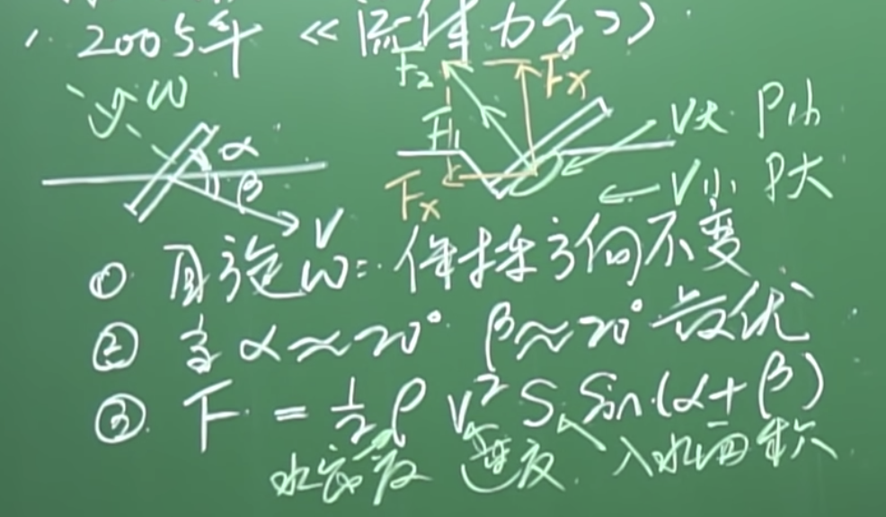
    - 一定的速度，保持旋转，再找两个合适的角度，就能打出漂亮的水漂了

### 10日
- 【知识点】锂电池：正负极的核心都是锂原子：
    - 负极基本上就是石墨，石墨层中塞进锂原子；
    - 正极的材料有很多种：
        - 磷酸铁：能量密度 100~150Wh/kg （较低）， 低温性能很差 ， 800摄氏度会自燃（安全性好）
        - 三元材料（镍、钴、锰或铝）：能量密度 200~300Wh/kg （较高）， 低温性能很好（-20摄氏度） ， 200摄氏度会自燃（安全性差）
    - 电池自燃的原因：热失控（高温通常促进化学反应、化学反应放热、进一步加剧反应，就失控了）
        - 热失控的原因有很多：比如
            1. 外界高温
            2. 针刺或异物撞击或弯折导致膈膜破裂正负极短路放热
            3. 过充过放
            4. 外电短路
        - 如何保护？
            - 特斯拉 使用 18650 电池（长的像5号电池一样），有8000节 ， 不好管理
            - 别克 VELITE6 ， 使用了96节方块状电池，被动安全性能：气凝胶（强度大，1200度的熔点，导热率低）；主动安全性能：传感器，传感器国际标准 ASIL ：ABCD (别克达到了D，最高级) 


### 8日
- 【知识点】【ES6】[扩展运算符](https://blog.csdn.net/qq_36663682/article/details/89634319)（ spread ）是三个点（...）。它好比 rest 参数的逆运算，将一个数组转为用逗号分隔的参数序列。


### 6日
- 【见闻】[为什么说“奶头乐”是一个不值得重视的“理论”](https://www.huxiu.com/article/262614.html)
    - 简单化的结论对我们有着巨大的吸引力，但这是一个复杂的世界。要想获得真知，就不能浮于表面，用大而化之的语言来做判断：“它是好的！它是坏的！”而是需要沉下去，看到事情的复杂性：“在什么样的条件下，它的哪一部分会对哪些人产生哪些影响？这些影响在什么情况下是好的，什么情况下是坏的？如果要减少坏的影响，我们可以具体从哪些方面着手？……”


### 2日
- 【思考】**家里的网速为什么没有标称的那么高？**
    1. 我们先来看看网络信号是怎么到达你的设备的？
        - （通常）手机的网络路径：```运营商的网线``` -> ```光猫``` -> ```网线(1)``` -> ```路由器``` -> ```wifi发射器``` -> ```手机wifi接收器```
        - （通常）电脑的网络路径：```运营商的网线``` -> ```光猫``` -> ```网线(1)``` -> ```路由器``` -> ```网线(2)``` -> ```电脑的网卡（网线接口）```
    2. 网络经过的这些路径就像河流一样，终点的流量取决于路程中最窄的那一条
    3. 也就是说你的网速是由这些设备中 ```支持带宽最低的``` 那一个决定的
    4. 举个栗子：
        - 你开通的是 200Mbps 的宽带，在电脑上下载电影的速度却只有 8MB/s ，那你需要确认以下几件事：
        - 运营商确实给你提供的是 200Mbps 的带宽
        - **光猫**需要是千兆级的（ 没有200兆级的，只有100兆级 和 1000兆级 ，网线、路由器同理 ）
        - **网线**(1) 和 网线(2) 至少得是 **超五类网线（支持 1000Mbps 的带宽）**
        - **路由器**需要千兆路由器（这里要注意：需要千兆网口的路由器，而不是千兆发射频率，很多人栽在这里）
            - 看一个关键参数就行：**传输速率**，```10/100/1000Mbps``` 的就是千兆， ```10/100Mbps``` 的是百兆 
        - 你的手机/电脑支持千兆网络（现在9102年智能手机基本都是支持千兆的，电脑要确认你的**网卡**是不是千兆的）
    5. 补充一点：**换算关系**
        - 电脑 、 手机上显示的速率单位是 ```MB/s (兆字节每秒)```
        - 运营商使用的速率单位是 ```Mbps（兆比特每秒）```
        - 1Byte = 8bits（1字节为8比特）因此 200Mbps = (200/8)MB/s = 25MB/s （ 例子中提到的 8MB/s 显然不正常 ）
        - 即 **运营商速率除以 8 就是你应该有的下载速度**

## 9月

### 25日
- 【纪录片】[《无节制消费的元凶》](https://www.bilibili.com/bangumi/play/ep119577)（记住这个人： 雅克·佩雷迪）
    - 第一集：
        - 计划报废，缩短产品的使用周期，计划报废是如何演变成“瞬间淘汰”的；
        - 越来越高的更新频率也使产品的更新内容逐渐脱离产品核心的功能，甚至到了换个漂亮的颜色，依然会有消费者买单的程度
    - 第二集：广告给观众制造一种焦虑，讲述一些他们不了解的可怕的事儿 ，然后在介绍一种神奇的解决方案（恐惧是消费的主要动机）
        - 血清让你更年轻
        - SUV 让人误以为更大的更安全，但 SUV 的翻车率很高
        - 李施德林漱口水：没有需求？创造需求
        - 治疗偶发性胃灼烧的胃药——善卫得
        - 降低胆固醇的他汀类药物
        - 抑菌香皂
        - 声称能减少感冒、慢性病甚至癌症的发冰风险（其实并不怎么健康的）的维他命水
        - 任天堂的《不老大脑》
    - 第三集：
        - 商家是如何把小孩子变成消费者的；
        - 商家是如何怂恿成年人放纵自己的童心的；
        - 游戏：是一个挑战、成功、释放多巴胺的过程；商品游戏化
        - 成年人犹豫和谨慎的态度是商家最不想看到的，他们更希望成年人像小孩子一样：我想要这个，我现在就想要。。。
        - 让我们屈服于即时满足，最大的推手就是信贷（信用卡）
        - 在线支付缩短了你和你想要的东西的距离
    - 总结：无节制消费的元凶
        - 被消费主义主宰的世界，事实上是让我们无节制消费的人精心设计的陷阱 
        - 其聪明之处就在于他们创造出的无法满足的欲望：无论我们拥有什么，市场上永远有更多更好的选择


### 24日
- 【思考】我认为人们将手机设置为静音，更大的原因并不是因为铃声不好听，而是因为所在的场合（再者演讲者认为现在手机的铃声都变成了振动，是他只看到了身边的人使用振动，而没有做数据额统计），不过 MIUI11 的思考精神是值得肯定的
- 【见闻】小米发布会
    - 小米 oppo vivo 联合实现了 airdrop 🤣
    - 文档查看器，就像 mac 的空格，还添加了扩展的功能
    - 投屏，带一台手机进去，整个场子都是你的（全能投屏）不展示通知这样的私密信息
    - 点击文档直接打印，支持2000多款打印机
    - PPT 拿最新的 MIX 和 iPhone8 对比，不厚道呀
    - MIX alpha 干掉了手机壳


### 23日
- 【知识点】[跨域资源共享 CORS 详解 / 阮一峰](http://www.ruanyifeng.com/blog/2016/04/cors.html)
    - 源问题：借款项目，使用 ```axios``` 添加自定义请求头之后，发送跨域请求时，一直进 ```catch``` 
    - 原因就是添加了自定义请求头使之成为了非简单请求
    - RD 没有对 “预检” 请求做处理，响应中没有任何 CORS 相关的头信息字段
    - 导致浏览器认为服务器不同意预检请求，因此触发一个错误，被 ```catch``` 捕获。
- 【震惊】《纪念小苏丽》为人父母不需要考试，实在是世界上最可怕的事。——伊坂幸太郎

### 22日
- 【知识点】详实”和“翔实”区别：
    - 说法一：“详实” 跟“翔实”是一对异形词，目前尚没有进行规范，都可使用。
    - 说法二：史志界总爱用“史料翔实”或“资料翔实”作评。


### 21日
- 【发现】[iOS验证通道查询](https://ipsw.me/)，可以查能不能降级
- 【知识点】【手机刷机】OAT 和 线刷 有啥区别？[来源](http://bbs.zol.com.cn/sjbbs/d98_233427_0.)
    - OTA英文全称是Over-the-Air Technology，即空间下载技术的意思。OTA升级是Android系统提供的标准软件升级方式。它功能强大，可以无损失升级系统，主要通过网络[比如WIFI、3G]自动下载OTA升级包、自动升级，但是也能用通过下载OTA升级包到SD卡升级。OTA升级包，一般几十M到几百M，跨大版本升级会出现1G左右的更新。
        - OTA升级的优点与弊端
            1. 升级简单便利，在很短时间内完成升级操作。
            2. 无需备份数据，升级完成后保留全部数据。
            3. 通过在线的补丁对系统进行修好和升级。
            4. 会保留许多系统文件，造成系统臃肿，占用存储空间较高。
            5. 有时候会引发新数据和旧数据不兼容，造成卡顿或异常。
            6. 在系统修改过（解锁，Root,三方ROM）之后不能正常升级。
    - 线刷是指使用USB线联接个人计算机，并在个人计算机上使用刷机软件进行刷机的行为。线刷一般是官方所采用的升级方式，（三星售后都是刷固件）比如系统的重新分区，这些都要通过线刷来进行底层文件的重置达到最佳效果。
        - 线刷升级的优点与弊端
            1. 彻底消除底层的数据，进行全新的安装，干净彻底。
            2. 因软件問題导致的卡顿，没方法开机等，可以进行线刷修好救砖。
            3. 可以对卡刷或者Root失败不能进入系统的机器，进行还原官方固件操作。
            4. 对于新人来说，容易造成错刷误刷，导致手机没方法开启，甚至变砖。
            5. 操作步骤繁琐，需要借助电脑，数据线及刷机软件。
            6. 需要备份数据，刷机会清空资料，恢復数据繁琐。
            7. 刷机途中不能断开数据线或者断电，有可能造成未知风险。
    - 总结： OTA与线刷各有利害，请您根据自己的需求做出对应的操作。做为楼主我建议新人可以使用三星官方的S换机助手（Smart Switch）也可以轻松实现数据的备份还原与系统的更新，这样更新也比较干净。当然如果你是老司机的话，刷机是最好的挑选！


### 19日
- 【思考】为啥短视频火了？ 是焦虑？还是人们把时间看的更宝贵了？
    - 我觉得做得好的视频有的特点，全程干货，没有废话，直奔主题，能在开头，（测试要测试多次，不能用一次的结果，这是初中就学过的知识）或者结尾给出观众最关心的问题的答案
    - 我觉得做的不好的视频，废话多，讲话很慢（很浪费时间），主题不突出，收音质量差，字幕太快还没看清就消失了等等，总的来说就是视频拍摄者只照顾了自己的感受，没有站在观众的角度思考（不客气地说就是视频作者在这些方面没有动脑）

### 17日
- 【知识点】**幸存者偏差（Survivorship bias）**，另译为“生存者偏差”或“存活者偏差”，是一种常见的逻辑谬误（“谬误”而不是“偏差”）。指的是只能看到经过某种筛选而产生的结果，而没有意识到筛选的过程，因此忽略了被筛选掉的关键信息。在“沉默的数据”、“死人不会说话”等等日常表达中，涉及幸存者偏差。


### 15日
- 【发现】[不要肆无忌惮地在你的项目中使用 ES78910 了～](https://juejin.im/post/5d7efbbb6fb9a06b2650c74a) （主要是作者的求知过程值得参考）

### 14日
- 【发现】[如何写出一个惊艳面试官的深拷贝?](https://juejin.im/post/5d6aa4f96fb9a06b112ad5b1)

### 13日
- 【发现】[「前端进阶」高性能渲染十万条数据(时间分片)](https://juejin.im/post/5d76f469f265da039a28aff7)


### 10日
- 【发现】[刻意练习100次，分析力提升80%](https://www.myhuahuo.com/index.php?mod=article&id=1833)

### 9日
- 【发现】： 一些不错的网站
    - [OfficePLUS，微软Office官方在线模板网站！](http://www.officeplus.cn/Template/Home.shtml)
    - [重现化学——可能会让你疯狂地爱上化学](http://www.envisioningchemistry.cn/)
    - [全历史——没想过历史还能这么玩](https://www.allhistory.com/)
    - [求字体网——轻松识别不认识的字体](http://new.qiuziti.com/)
    - [AlteredQualia —— 各种好玩的神器~](https://alteredqualia.com/)
    - [OpenStax CNX —— 免费分享教科书的网站](https://cnx.org)
    - [tunefind —— 快速找到热门影视剧的BGM！](https://www.tunefind.com/movie/zootopia-2016)
    - [好看的效果](https://wangyasai.github.io/Stars-Emmision/)
    - [正版中国——正版软件限时免费](https://getitfree.cn/)

### 6日
- 【技术】js-xss库可以帮助你转义

### 4日
- 【发现】[一个过来人的打字指法纠正之路](https://sspai.com/post/45721)

### 3日
- 【知识】一些前端的 库工具
    - 了解 UnderScore 库，有很多实用的函数，看看源码。
    - Moment：日期和实践操作库
- 【思考】为何要学习浏览器工作原理？
    - 准确评估 Web 开发项目的可行性
    - 从更高维度审视页面
    - 解决面试中遇到的绝大部分浏览器问题
- 【思考】对于计算机基础我们需要做到大体了解，这样的话我们对整体的流程会有一个大概的把握。在实际开发过程中不会过于被动。


### 2日
- 【解决问题】[Parallels Desktop 14.1.2-45479正确安装方法（ PD 安装 ）](https://bbs.feng.com/read-htm-tid-12151376.html)
    1. 打开终端执行显示隐藏文件命令 ```defaults write com.apple.finder AppleShowAllFiles Yes && killall Finder```，这时候你可以看到在Parallels Desktop文件夹中 “Parallels Desktop”显示出来了
    2. 把它拖到 “Applications”(应用程序)里去,若之前安装过则会提示是否覆盖,覆盖即可
    3. 执行 ```chflags nohidden "/Applications/Parallels Desktop.app"```
    4. 再执行 ```xattr -cr "/Applications/Parallels Desktop.app"```
    5. 再执行 ```codesign --sign - --force --deep "/Applications/Parallels Desktop.app"```
    6. 从“应用程序”中点击PD运行，跳过更新，安装完成即可；
    7. 执行关闭隐藏文件命令 ```defaults write com.apple.finder AppleShowAllFiles No && killall Finder```
- 【知识】家庭内部的成员相互联结、相互依靠，在家庭这个系统里面，没有谁可以单独拿出来理解。有一个著名的模式，称为 **“卡普曼三角（KarpmanTriangle）”** ，该名称来自于其创立者、医学博士史蒂芬·卡普曼（StephenCarpman）。所有家庭都存在卡普曼三角，哪怕是较为健康的家庭也不可避免。三角中的角色包括：
    - 受害者
    - 加害者，也就是欺负受害者的人
    - 拯救者，也就是拯救受害者的人
    - 卡普曼三角会阻碍真正问题的解决，只会创造痛苦和困惑，而不是解决方案。无论谁在三角中获胜，都没有人会好过。这就产生了两层不愉快：一层是永无止境的争辩；一层是争辩的内容永远也无法达成和解。

兰迪克雷格. 边缘型人格障碍:深入解读边缘型人格的权威著作 (Chinese Edition) (Kindle 位置 1022-1024). Kindle 版本. 


## 8月
### 30日
- 【知识】[计算机的本质 ---- 起源](https://www.cnblogs.com/mq0036/p/8566161.html)
    - 特别喜欢这种带有心路历程的文章，并且以容易理解的方式还原了知识的由来和发展的历程，很接地气。不像单纯的技术文章那样只讨论技术。
    - 其中也不乏对读者的鼓励，消除读者对未知的敬畏感（见： 2、继电器——信号的传递，最后一段）
    - 每当知识要上一个台阶时，作者就会跳出来提示读者，在继续之前，你必须理解xxx，帮助读者更好的继续阅读（见： 3、门电路——信号的关联，最后一段： **你必须开始习惯这种抽象**）
    - 作者与读者站在同一个角度，提出读者同样会产生的疑问，并和读者一起解决，很有带入感（见： 5、触发器——信号的保存，第一段）
    - 这篇文章也算是 《编码·隐匿在计算机软硬件背后的语言》 的读书分享

### 29日
- 【解决】[Mac安装powerline 权限问题](https://blog.csdn.net/Mona_233/article/details/54563416)
    - 基于用户的权限来安装模块包显得更加合理。   ```pip install powerline-status --user -U```
- 【同感】安装 Powerline 的方法有很多种，我们可以通过 pip 或者 git 等工具，我推荐使用 pip 并且将其安装在根目录下 （也就是 /usr/ 目录中）需要注意的是在安装之前我们要检查是否自己已经安装过了 Powerline **（我就是那种有时候自己都不知道在电脑里装了什么的人）** 我们可以使用命令： ```pip show powerline-status```
- 【折腾】[iTerm2 主题](https://github.com/robbyrussell/oh-my-zsh/wiki/Themes)
    - [关于 iTerm2 你不知道的一些事](https://jianshu.com/p/3436bcb17a03)
    - [iTerm 2(for mac) && Oh My Zsh &&自动补全](https://www.jianshu.com/p/892bd2a7936a)
    - [最漂亮（ iTerm2+oh-my-zsh配色）](https://www.jianshu.com/p/246b844f4449)
- 【发现】[GTD最全面教程，从入门到精通](https://www.jianshu.com/p/cbf62bbe39c1)

### 28日 
- 【要学】设计模式、设计原则


### 27日
- 【见闻】 为什么 Mac 可以不粘贴 Intel 标志？
    - Jobs的回答：We like our own sticker. (群笑)We’re very proud to ship Intel products in Macs. I mean, they are screamers. And combined with our operating system, we’ve really tuned them well together, so we’re really proud of that. It’s just that everyone knows we’re using Intel processors, and so I think putting a lot of stickers on the box is just redundant. We’d rather tell them about the product inside the box, and they know it’s got an Intel processor.
    - 回答很有艺术性。大概意思就是希望产品是个整体给客户，客户就已经知道在用Intel CPU，没必要单独标记。
    - Intel inside的提出人得到了Intel里面的创新最高奖IAA，该案例也被哈弗列入最佳商业案例。在几十年的宣传中，Intel的品牌价值得到了大幅增长。这个小小的logo让沉默在机箱里的CPU凸显出来了，成了整机品质的代表。它和微软的logo搭档，变成当时每个笔记本电脑的必备部分。
    - 微软的logo需要通过微软的WHQL认知，实际上是要花钱的（尽管很少），而Intel的logo是会补贴钱给OEM。尽管补贴具体数目和各自厂商的品牌和出货量相关，但因为笔记本市场的激烈竞争和产品的同质化，这个logo和它背后的补贴变得不可或缺。
    - Apple却不一样，它有自己的品牌和独特的客户群，它自己的品牌形象比Intel的更高，产品的毛利率更高，当然看不上Intel的logo和后面的那点补贴了。Apple带了头之后，和他有类似定位的微软Surface系列当然萧规曹随，并不贴logo，甚至面向学生的廉价笔记本chrombook都不贴Intel的logo了。
- 【网页】[MikuTools - 工具集合](https://tools.imiku.me)
- 【知识】树莓派 是单片机
- 【网页】[有哪些软件堪称神器，却不为大众所知？ - 彭宏豪的回答 - 知乎](https://www.zhihu.com/question/300735799/answer/767428571)

### 24日
- 【知识】【计算机】【CPU】 [从多线程到Event Loop全面梳理](https://juejin.im/post/5d5b4c2df265da03dd3d73e5)
    - 进程就好比工厂的车间，它代表CPU所能处理的单个任务。 进程之间相互独立，任一时刻，CPU总是运行一个进程，其他进程处于非运行状态。CPU使用 **时间片轮转进度算法** 来实现同时运行多个进程。
    - 线程就好比车间里的工人，一个进程可以包括多个线程，多个线程共享进程资源
    - 进程是cpu资源分配的最小单位（是能拥有资源和独立运行的最小单位）
    - 线程是cpu调度的最小单位（线程是建立在进程的基础上的一次程序运行单位，一个进程中可以有多个线程）
    - 不同进程之间也可以通信，不过代价较大
    - 单线程与多线程，都是指在一个进程内的单和多
    - 浏览器是多进程的。
    - 每一个Tab页，就是一个独立的进程。
-【知识】**可预期** 做项目，写代码，最起码要保证可预期！！！这是很多初级程序员会犯的错，当然也有很多优秀的初级不会犯这样的错！


### 23日
- 【TODO】《送我上青云》【电影】
- 【思考】当小组长的这一年多，真正体会到人的惰性有多可怕。如果我对我的组员要求严格一点，多敲打一些，让他们不敢犯错。可能被裁的人里，就不会有他了。哎，这一点我们三个组长做的都不好。


### 22日
- 【知识】[前端该如何准备数据结构和算法？](https://juejin.im/post/5d5b307b5188253da24d3cd1)
- 【知识】[30 道 Vue 面试题，内含详细讲解（涵盖入门到精通，自测 Vue 掌握程度）](https://juejin.im/post/5d59f2a451882549be53b170)


### 21日
- 【思考】拼夕夕的拆红包根本不能提现，你费了好大的力气找了上百人来给你拆，结果给你两个满 1000 减 50 的圈，还只有 12 小时的有效期。看家免费拿也是同样的坑爹，一个价值 ￥500 左右的拍立得，砍价到剩下 ￥100 的时候，一人只能砍掉 1 分钱。**so，不要贪图小便宜。最后吃亏的还是你！**


### 20日
- 【知识】[文档 - Markdown 语法](https://zh.mweb.im/markdown.html)
- 【知识】[Markdown 語法官方說明繁體中文版](https://zh.mweb.im/markdown-syntax-guide-full-version-zh.html)

### 18日
- 【想知道】计算机的前世今生
- 【想知道】 ```Promise``` 的 ```catch``` 异常捕获必须只能让 ```.then()``` 接受一个函数吗？，如果 ```.then()``` 既接受了两个函数，又写了 ```.catch()``` ，在有错误的时候会发生什么？
- 【想知道】全球项目经理认证（PMP：Project Management Professional），三个月时间，PM book 这本书

### 17日
- 【想知道】 Promise/A+ 标准的前世今生
- 【知识】23种设计模式，5个设计原则


### 15日
- 【知识】[动画片头的Aniplex是什么？解开误区，这些都不是动画制作公司！](https://baijiahao.baidu.com/s?id=1623513655498975227&wfr=spider&for=pc)
- 【想知道】财报怎么看？
- 【相机】[A7M3出了，出的好，我选A7R3（20180514）](http://www.360doc.com/content/18/0916/17/37057107_787157624.shtml)


### 14日
- 【前端】[css 技巧](https://qishaoxuan.github.io/css_tricks/)
- 【前端】[js 技巧](https://qishaoxuan.github.io/js_tricks/)
- 【前端】[TypeScript 教程](https://www.cnblogs.com/tansm/p/TypeScript_Handbook.html)
- 【前端】[TypeScript 入门教程](https://ts.xcatliu.com/)
- 【TODO】至少阅读一遍[《JavaScript 高级程序设计》](https://book.douban.com/subject/10546125/)
- 【知识】品牌背书
    - 品牌为了增强其在市场上的承诺强度，通常还会借用第三方的信誉，然后第三方以一种明示或者暗示的方式来对原先品牌的消费承诺作出再一次的确认和肯定。这种品牌营销策略，我们称其为“品牌背书”（Brand Endorsement）。通过品牌背书，被背书品牌从而达到对于消费者先前承诺的再度强化，并与消费者建立一种可持续的、可信任的品牌关联。
- 【知识】[linux ln 用法，知识（软链接和硬链接）](https://blog.csdn.net/mengzuchao/article/details/80426316)
- 【知识】[Notion 帮助](https://www.notion.so/Help-Support-e040febf70a94950b8620e6f00005004)


### 13日
- 【前端】[Bootstrap：弹出框和提示框效果以及代码展示](https://www.cnblogs.com/cpcpc/p/7233898.html)


### 7日
- 【知识】安装 http-server ，快速启动一个 http服务 ：
    ```shell
    # 安装 （mac）
    sudo npm install http-server -g

    # 以当前文件夹为根目录，在 8881 端口启动一个 http 服务
    http-server -p 8881
    ```

### 6日
- [有哪些比较好用的洗面奶？ - 老爸评测的回答 - 知乎](https://www.zhihu.com/question/21661845/answer/352741570)


### 5日
- 【想知道】ES Module 规范 、到底啥是类数组？
- 【见闻】[任正非：人感知到自己的渺小，行为才开始伟大。](https://www.thepaper.cn/newsDetail_forward_3901763)

### 4日
- 【TODO】学习[B站视频制作教程推荐](https://www.bilibili.com/read/cv960192?from=search)


### 3日
- 【知识】【摄影】曝光基础
    - 光圈：f/1.4 、 f/2 ... 数字越大光圈越小，光圈越小景深越深，越没有背景模糊的效果
    - 快门：快门一般不能小于视频帧率， 否则就会变成 王家卫 （《重庆森林》那种一卡一卡的效果）
        - 大部分情况下，你开 1/50 或者 1/100 去拍摄一些没有快速运动的物体的时候，不会有太大区别
        -  所以你在相机没有 ```内置ND``` 的情况下，可以把快门调高，拍一些大光圈，浅景深的镜头
        -  还有在极限情况下，你可以吧快门降低到 1/25 ，来获得额外的一档曝光，去获得相对静止的镜头
        -  灯光环境的频闪问题：因为光都是波，波都是有频率的，如果快门速度高于或者低于这个频率，都会频闪
            - 如何让你的升格即曝光正常，有没有频闪呢？有三个办法
            - 找个大太阳，自然光拍摄
            - 将灯光全部换成直流电
            - 飓风灯一号无频闪，[淘宝](https://h5.m.taobao.com/awp/core/detail.htm?ut_sk=1.XR8HPL8rPLEDAKl5RFAf4gdK_21380790_1564843340698.Copy.1&id=581546832274&sourceType=item&price=398-465&suid=AD3D0CEB-CD89-48A9-B26F-F3DFF23F0974&un=a12eccaeba9f237f2040bd82ddc2e1ea&share_crt_v=1&sp_tk=wqJHQnd1WVJzcnBKdMKi&cpp=1&shareurl=true&spm=a313p.22.2sc.1054768433814&short_name=h.eRzUGWU&sm=0b5319&app=macos_safari)
    - ISO：感光度，是相机的放大电路，如果你光圈开大了，还是曝光不足，可以调高ISO
        - 电路在放大的是后续，不管有用没用的信号他都放大了，随之影响的就是你画面的噪点增多了 
        - ISO也不是越低越好的 ，这里就要引出一个概念了 ： 原生 ISO  即 相机不需要变动传感器典雅的  ISO 值
        - 你的相机在这个 ISO 值得时候，画面最纯净，噪点最少
        - 在拍摄夜景的时候，通常会把调整 ISO 放在光圈和快门之后，以保证画面的纯净度
- 【知识】```npm audit fix``` 看[这里](https://blog.csdn.net/weixin_40817115/article/details/81007774)


### 2日
- 【知识】抖音运营必备
    - [e抖音.康姆](https://e.douyin.com/site/)
    - 关注 电商小助手
    - 关注 巨量课堂（抖音官方的教学账号）


### 1日
- 【想知道】“展期” 是啥意思？
- 【想知道】1908年通古斯大爆炸 原因是什么？
- [bilibili创作学院](https://member.bilibili.com/academy/home)

## 7月
### 31日
- 【游戏】QQ飞车手游技巧——重刹断氮接cww
    1. 前提：释放氮气过程中需要释放另一管氮气
    2. 释放氮气过程中漂移——重刹断氮（方向键不松）
    3. 释放氮气
    4. 段位拉车头形成cww
- 【知识】使用 console.dir() 方法可以 dump 对象的详细信息，包括对象里的属性和方法。（dump 是啥意思）
- 【知识】console.trace(); 追踪函数的调用轨迹
- 【游戏】QQ飞车手游技巧——双刹弹射


### 30日
- [你未必知道的49个CSS知识](https://juejin.im/post/5d3eca78e51d4561cb5dde12)
- 【知识】UNIX 与 Linux 之间的关系是一个很有意思的话题。在目前主流的服务器端操作系统中，UNIX 诞生于 20 世纪 60 年代末，Windows 诞生于 20 世纪 80 年代中期，Linux 诞生于 20 世纪 90 年代初，可以说 UNIX 是操作系统中的"老大哥"，后来的 Windows 和 Linux 都参考了 UNIX。（来源：[Linux和UNIX的关系及区别（详解版）](http://c.biancheng.net/view/707.html)）


### 29日
- 【游戏】QQ飞车手游技巧——进阶氮气入弯
    1. 前提：有一管氮气
    2. 漂移入弯过程中先释放氮气
    3. 段位拉车头形成cww

### 27日
- 【游戏】QQ飞车手游技巧——重刹断氮
    1. 前提：氮气释放中
    2. 连按两下刹车（越快越好）
    3. 目的：必要的时候减速，或者需要释放下一管氮气的时候
- 【游戏】QQ飞车手游技巧——段位拉车头
    1. 正常漂移
    2. 拉车头（按漂移方向的反方向键）的时候松开漂移键再迅速按回漂移键（松开再按回的过程就是段位）
    3. tips：拉车头的时候可以按两次漂移键，这样拉车头更快，但是要多练习掌握好角度，否则会撞上外侧的墙
- 【游戏】QQ飞车手游技巧——快速出弯
    1. 正常漂移
    2. 漂移过程中轻点两下漂移键即可提前结束漂移快速出弯

### 26日
- [mac技巧，不少我不会的](https://www.zhihu.com/question/33911186/answer/126286115)
- [网络上有哪些免费的教育资源？ - 木子淇的回答 - 知乎](https://www.zhihu.com/question/19942068/answer/730647908)
- [有哪些越早知道越好的人生经验？ - Even的回答 - 知乎](https://www.zhihu.com/question/266090769/answer/695965746)
- [什么样的员工容易被提拔为管理者，他们有哪些共同特质？ - 韩大叔的回答 - 知乎](https://www.zhihu.com/question/283897068/answer/595124309)
    - 执行力强
    - 以身作则
    - 向上管理
    - 激发他人


### 25日
- 【TODO】[100本书](http://www.shejipi.com/161206.html) ， [这也是100本书](http://www.sohu.com/a/155546296_661888)
- 【知识】markdown 怎么写 todolist ， 注意：未完成的标记 ```[``` 和 ```]``` 中间有**一个空格**，不能多不能少
    ```markdown
    [ ] 这是未完成的事项
    [x] 这是已经完成的事项
    ```
- 【知识】[99%的人都理解错了HTTP中GET与POST的区别](http://www.techweb.com.cn/network/system/2016-10-11/2407736.shtml)
- 【TODO】学习[技术胖的 Flutter 的实战课](https://jspang.com/posts/2019/03/01/flutter-shop.html#post-comments)
- 【发现】github 的提交热力图颜色策略：
    ```json
    {
        "没有提交": "白色",
        "1次提交": "最浅绿色",
        "2、3次提交": "较浅绿色",
        "4次提交": "较深绿色",
        "5次及以上次数提交": "最深绿色" 
    }
    ```
    - 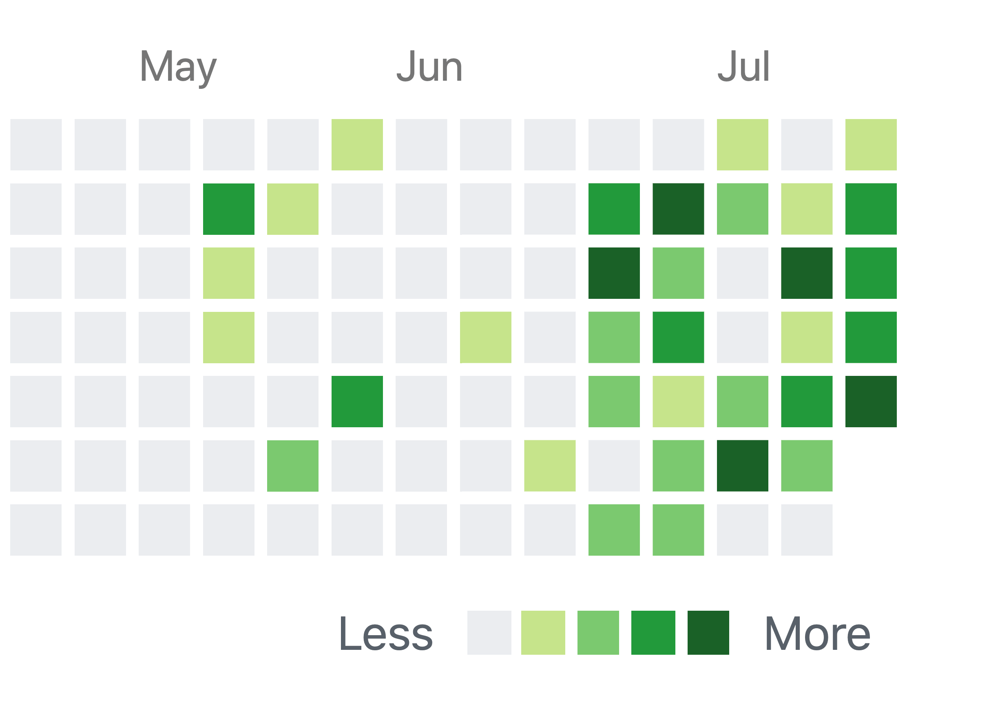
- 【经验】做点击反馈，不要太快，起码不要瞬间完成，如果相同位置会变成另一个可点的，容易出问题。学学苹果，苹果任何反馈都有一点点延时，用户感觉不到，但又确实存在，防止用户操作太快。

### 24日
- 【惊喜的发现】VSCode 在编辑 markdown 的时候，拷贝一个链接，选中你想添加链接的文本，直接按 ```command + V``` 即可快速创建超链


### 23日
- 【想知道】带宽是什么？
- 【知识】庞氏骗局：简言之就是利用新投资人的钱来向老投资者支付利息和短期回报，以制造赚钱的假象进而骗取更多的投资。


### 22日
- 【TODO】 Notion 到底好用在哪里？ 如何快速记笔记？
- 【想知道】如何构建个人知识体系？


### 21日
- 【知识】下面的语法就是 markdown 的删除线啦
    ```markdown
    ~~这是删除线~~
    ```
- 【动漫】巨人这部动画要封神了


### 19日
-【想知道】开源协议有啥用？  IMT ， ISC 这两种有啥区别？

### 18日
- 【想法】现在很多前端都不会**正则**，我学会了是不是可以作为一点儿优势
- 【想法】打 “简单” 的时候误打成了 “煎蛋” ，难道 “煎蛋学堂” 是 “简单学堂” 的意思？
- 【知识】[JS魔法堂：彻底理解0.1 + 0.2 === 0.30000000000000004的背后](https://www.cnblogs.com/fsjohnhuang/p/5115672.html)
    - [IEEE 754 Floating-point](https://en.wikipedia.org/wiki/IEEE_754)
    - [0.30000000000000004.com](http://0.30000000000000004.com/)


### 16日

- 【想知道】编程中的注释问题： ```#``` 是什么语言的注释，为啥 命令行 可以用 ```#``` 做注释
- 【TODO】为 ONE PIECE 1000 话做纪念海报  大概时间是 2020年7月中旬(不休刊，那是不可能的)，或者 2020年10月中旬(按一月一休来算的)
    - 收集素材（按时间线、按人物）
    - 确定海报形式
- 【思考】越来越觉得自己的生活是被这个世界牵着鼻子走


### 15日
- 【BOOK】原则 —— 瑞·达利欧
- 【BOOK】投资的常识 —— [美]伯顿•马尔基尔（Burton G. Malkiel） / [美]查尔斯•埃利斯（Charles D. Ellis） 
- 【BOOK】平凡的世界 —— 路遥
- 【BOOK】活着 —— 余华

### 12日
- [远离你身边这3类“穷人”](https://mp.weixin.qq.com/s/DPKfk1GdHjcXl7oIINrfQg)
    - **心穷**：我花了钱，就得把它吃回来，绝对不会让自己吃亏。
    - **漠视规则的“穷人”**：无论什么人，做什么事，都要严格遵循契约精神。没有契约精神、不守规则的人，就像长不大的巨婴，只会害人害己。
    - **爱给别人添麻烦的“穷人”**：蔡康永说：“给别人添麻烦的原因，可能来自于无知，来自于没有教养，可是一切的根源通通在于，他没有把别人放在心上。”
- 【英语单词】**studio** 
    - 英 [ˈstjuːdiəʊ]   美 [ˈstuːdioʊ]  
    - ```n.``` (广播、电视的)录音室，录像室，演播室，制作室;(音乐)录音棚;电影摄影棚;电影公司;电影制片厂
        - 例子 Andrioid Studio 
- 【英语单词】**parse**
    - 英 [pɑːz]   美 [pɑːrs]  
    - ```v.``` (对句子)作语法分析;作句法分析
        - 例子：parseInt 
- 【英语单词】**strict**
    - 英 [strɪkt]   美 [strɪkt]  
    - ```adj.``` 严格的(指必须恪守);要求严格的;严厉的;恪守教规(或信条等)的
        - 例子：js 的严格模式用的就是这个单词 "use strict"
- 【想知道】为啥表都是石英钟，石英有啥牛逼的？
- 【想知道】Unicode 是啥，为啥是6位16进制？
- 【硬件】【自己的MBP】 已经发现的键盘问题：
    - ```command``` (左) - 偶尔失灵
    - ```E``` - 按一下触发多次
    - ```I``` - 按一下触发多次
    - ```U``` - 按一下触发多次
    - ```.``` - 按一下触发多次
    - ```O``` - 按一下触发多次
    - 测试：EIEEIEIEIEIEIEIEIEIEIEEIEIEIEIEIEIEIEIEIEEIEIEIEIEIEIEIEIEIEIEIEIEIEEIEIEIEIEIEIEIEIEIEIEIEIEIEIEIEIEIEIEEEIEIEIEIEIEEEIEEEIEEIEIIEEEIEEIEEIEIEIEIEEIEEIEIEEEIEIEEIEEIEIEIEEIEIEIEIEIEIEEIEIEIEIEIEEIEIEIEIEIEIEEIEIEIEIEIEEIEUEUEUEUEUEUUEEUEUEEUEUEUUEUEUEUEUEUEUEUEUUEUEUEUEEUEUEUEUEUEUEUEUEUEUEEUEUEUEUEUEUEUEEEUEUEUEEUEUEUEEUEEUEUEEUEEUEEUEUEUEUEUUEUEUEUEUEUEEUEUEUE2.2.2.2.2..2.2.2.2.22.2.2.2.2.2.2.22.2..2.2.2.2.2.2.2.2.2.2.2.2.2.2.2.2.2...2.2..2.2.2.2.2.2.2.2..2.2..2.2..2.2..2.2.2.2..2.2.2..2.2.
- 【执念】为什么 github 不把 marKdown 的样式做的好看一些，代码高亮鲜艳一些
- 【知识】音频视频，流文件是啥
- 【知识】ast v8 引擎 （ast是前端里边逼格最高的，我踏马竟然不知道）
- 【经验】懂低层，想怎么玩怎么玩；不懂底层，走哪哪都是坑
- 原生js才是王道，底层才是王道


### 8日
- 【知识】SSR : 服务端渲染(Server Side Render，简称“SSR”)
- 【想法】孩子出生那年买生肖纪念邮票
    - 孩子成长路上给他拍好玩视频（开心的，难过的，出糗的），等他18岁成年那天剪辑成一个送给他当生日礼物
    - 视频内容的组合方式可以参考一些电影神剪
    - 还有更多关于孩子成长的仪式感。。。搜一搜
- 【想法】老婆成长仪式感😛
- 【想知道】1988 韩国发生了什么？（疑问源自请回答 1988）
- 【想知道】普京为啥被称为铁腕酷哥【疑问】
- 【想知道】2001.9.11 改变世界格局，很多人还存有幸灾乐祸心态
- 【想知道】2002年姚明（姚11）是如何誉满全球的
- 【想知道】2004年的印度洋大海啸，夺走20万生命
- 【想知道】2006 萨达姆为什么被绞刑
- 【想知道】安倍明明在2007年辞掉了日本首相，怎么又当上的？
> 这些我好奇的内容源自这里：[38年的集体回忆](https://mp.weixin.qq.com/s/SKUeGuErbrOUF5Ic7ORWvw)
- 【想法】闲的时候只知道刷剧？不如了解了解历史，好好认识一下这个世界


- 【TODO】查征信注册了账号，浏览器不支持，走不下去了
- 【TODO】中国人名银行的官网上有纪念钞的兑换信息，长期关注一下纪念钞的发布，生肖邮票怎么买
- 【TODO】牛年给我妹搞个牛票，猪年给我妈搞个猪票，鼠年给我爸搞个鼠票😁

### 5日
- 【经验】iOS 升级对数据不会影响，但是降级会抹掉所有数据，并且高版本系统下的备份无法在低版本上恢复。
> 风险来自于你不知道自己在做什么。 ——巴菲特


### 3日
- 【知识】前后端同构 是啥意思？（[源](https://zhuanlan.zhihu.com/p/32487533)）
- 【闪现想法】有问题不一定非要在网上找解决办法，自己开辟一条路出来说不定效果更好（就比如我总想找前端开发需要的知识体系，网上没有，那我就自己通过各种方法，整理这么一套前端学习的框架，当然这只是在知识与技能层面的，那在社会角色、自我形象、特质和动机，也可以去扩展，并且更重要）
- 【执念】几个一直存在的问题
    1. 如何做好个人知识管理
        - 遇到问题的时候总感觉自己有收藏过相关的办法，但是在哪个软件收藏的，想不起来。
        - 学到碎片化的东西往往隔天就忘记了，用到的时候还得重复学习。
        - 感觉自己知道也不少，但就是说不上来知道啥
        - 有没有能解决这些痛点的方法。
    2. 整理前端知识体系图，有以下要求
        - 清晰，一眼能看到整个结构的那种(脑图兴许是个好的选择，也可以看看其他的知识图谱)，而不是要进击的滚动条滚滚滚滚滚...
        - 难易程度，区分哪些是基础的，哪些是中级的，哪些是进阶的？
        - 重要程度区分，不一定是重要与不重要的区分，可以给重要程度打星级评分，比如，一颗星到五颗星
            - 扩展思维：
                - 展示的动画，
                - 星级评分要依赖数据而非个人感觉，数据怎么来有待研究。
                - 写文章或者教程的时候，**把你的思路过程写出来，而不是剖析结论**，我觉得更有借鉴意义（[Flutter实战](https://book.flutterchina.club/)让我对这点体会很深）
        - 加分项：
        - 其他软技能
            - 重要性高的：
            - 实用性强的：

- 【思考】最近学习了 **冰山模型** ，还让我遇到了[停止学习框架](https://juejin.im/post/5c1a839f518825780008537d) 和 [哪些技术会决定前端开发者的未来发展？](https://juejin.im/post/5d1589c8e51d45776031b02e) 这两篇文章，我强烈的感觉这不是巧合，而是为了让我看清**思维**的重要性、**知识**的重要性以及现在的我在浩大的知识海洋面前是多么的无知。

- 【思考】我本以为我已经拥有了**独立思考**的能力（也就是质疑一切的能力），直到看了这么几篇文章~ 🤔事情没有那么简单，因为我看第一篇文章的时候非常认同作者的观点。直到我发现了还有2、3、4、5 😂 ，原来我的独立思考只是建立在我自己已有的知识上的，对于未知我还是别人给什么我信什么。最后，写这些文章的家伙是真的这么闲吗🤨
    1. [《停止学习框架》](https://juejin.im/post/5c1a839f518825780008537d)
    2. [《驳 《停止学习框架》》](https://juejin.im/post/5c1b469af265da6125781140)
    3. [《驳 《驳 《停止学习框架》》》](https://juejin.im/post/5c1b832cf265da61776bef36)
    4. [《驳 《驳 《驳 《停止学习框架》》》》](https://juejin.im/post/5c1bad0be51d454c254d9cff)
    5. [《对于你们驳来驳去的《停止学习框架》，我有话说！》](https://juejin.im/post/5c1c864c51882561431a2ee8)

- 【思考】垃圾分类引出的思考：
    - 我的生活中到处都是这样的问题
        1. 整理浏览器书签的时候
        2. 整理网易云的歌单的时候
        3. 整理电子笔记的时候
        4. 整理硬盘文件分类的时候
        5. 整理手机里的 app 的时候
        6. 等等
    - 为什么这些不同的事情会有同样的困扰？我觉得是因为没有一个合理的分类标准
    - 那什么是合理的分类标准？抱歉，我到现在都没有找到 😛

- 【产品】为什么苹果自家的的软件（比如 KeyNote 、Final Cut Pro）特别易于上手，背后的逻辑是什么？
- 【未来可期】京津冀一体化 / 天津海河计划 / 武清还不错


### 2日
- 【知识】句柄是啥意思？（[源](https://blog.csdn.net/tcy83/article/details/80427195)）
- [哪些技术会决定前端开发者的未来发展？](https://juejin.im/post/5d1589c8e51d45776031b02e)
    - ```TypeScript``` 解决了前端的两大问题，**规避错误** 和 **提升效率**
    - 图形技术不会在短时间内席卷前端，也永远不可能成为前端的热门技术，但是却是前端开发者进阶必学的技术。
    - 编辑器领域技术，小众的领域
    - 其他热点技术：
        - Serverless 
        - IOT (不如去研究js runtime，比如node和deno，这是真正有助于提升能力的技术)
        - GraphQL (这个让前端开发爽到天的技术，付出的代价就是大量的改造工作需要后端来做，后端团队累死累活搞了GraphQL，得利最大的却是前端，出了错锅得后端背，这种技术推动的阻力可想而知)
        - 
- **【思考】** 5G 会带来哪些风口？
- 【知识】稀疏数组，密集数组 

### 1日
- 在 mac 的命令行输入 ```say xxx``` ，它会读出来。
> 吃老本是建立在时代停止发展的前提下的。——imWEB课老师。
- 早上上班路上听歌的意识流，创建一个动次打次的歌单，可以用这个跟歌单做什么事呢？以下是听的歌。对了，通过相似的歌曲找到类似的最爱，嗯， love & share ，不是大爱我不说。
    - [Salt -- Ava Max](https://music.163.com/song?id=1299557938&userid=118059293)
    - [Ain't Nothing Like It -- KLYMVX](https://music.163.com/song?id=1348835834&userid=118059293)

- **不是大爱我不说**的节目可以扩展到其他的领域。


## 6月


### 29日

1. 遇到一个问题：

    ```javascript
    function F() {}
    function O() {}

    O.prototype = new F();
    var obj = new O();

    console.log(obj instanceof O); // true
    console.log(obj instanceof F); // true
    console.log(obj.__proto__ === O.prototype); // true
    console.log(obj.__proto__.__proto__ === F.prototype); // true

    // 这个我懂，但是稍微调整了一下代码顺序，为啥输出全是 false
    // prototype 的改写不是会应用到所有的实例吗？，为什么输出结果会变成 false

    function F() {}
    function O() {}

    var obj = new O();
    O.prototype = new F();

    console.log(obj instanceof O); // false
    console.log(obj instanceof F); // false
    console.log(obj.__proto__ === O.prototype); // false
    console.log(obj.__proto__.__proto__ === F.prototype); // false
    ```

2. 说一下你对 ```generator``` 的了解
3. ```flex-grow``` 和 ```flex-shrink``` 属性有什么用？
4. 说一下 ```macrotask``` 和 ```microtask``` 
5. ```Http```请求中的 ```keep-alive``` 有了解吗
6. ```React``` 中的 ```controlled component``` 和 ```uncontrolled component``` 区别（受控组件和不受控组件）
7. 了解过 ```react-router``` 内部实现机制吗
8. 数组扁平化处理：实现一个 ```flatten``` 方法，使得输入一个数组，该数组里面的元素也可以是数组，该方法会输出一个扁平化的数组
9. 从输入 ```URL``` 到页面加载发生了什么？
10. 刚刚你说到过缓存，说一下缓存相关的知识吧？
11. 请描述一下 ```DNS``` 解析的具体过程？
12. ```TCP``` 是如何发起连接和关闭连接的？
13. 你知道哪些状态码？
14. 刚刚你说的整个过程中，有哪些优化手段可以优化提高网页响应速度？
15. 5点15分，时钟和分钟的夹角？
16. 8个外表一样的小球 其中7个球重量相同 1个球为 ```异常球``` 可能重量比较重也可能比较轻 利用天平称重至少多少次可以确保找出这个 ```异常球``` ，并需要知道到底是轻了还是重了。


### 26日

1. ```Promise``` 对象
    - ```Promise``` 有三种状态
        - ```pending``` - 进行中，或者等待中，表示还没有得到结果
        - ```fulfilled``` - 已成功，在异步操作成功时调用，并将结果作为参数传递出去。
        - ```rejected``` - 已失败。在异步操作失败时调用，并将报出的错误作为参数传递出去。

        > 从基本用法的例子中我们看到Promise构造函数的参数是 ```resolve``` 和 ```reject``` ，并不是三种状态中的 ```fulfilled``` 和 ```rejected``` ，原因就是： ```resolved``` 表示的是已结束（已定型），它包含 ```fullfilled``` 和 ```rejected``` 两种状态，但使用中，我们默认的将 ```resolved``` 当做 ```fulfilled``` （成功）使用。
    - ```Promise``` 对象的状态改变，只有两种可能：从 ```pending``` 变为 ```fulfilled``` 和从 ```pending``` 变为 ```rejected``` 。
    - 基本 ```API``` 
        1. ```.then()``` 
            > 语法 ```Promise.prototype.then( onFulfilled, onRejected )```
        2. ```.catch()``` ，抛出异常
            > 语法 ```Promise.prototype.catch( onRejected )```

            ```javascript
            var promise = new Promise(function(resolve, reject){
                // some code 
            })

            promise.then(function(data) {
                console.log('success');
            }, function(error) {
                console.log('error', error);
            });

            // 等价于
            promise.then(function(data){
                console.log('success');
            }).catch(function(error) {
                console.log('error', error);
            });
            ```
        3. ```.all()``` - ```Promise``` 中的“**逻辑与**”，同时开始，并行执行
            > 语法 ```promise.all( iterable )```

            ```javascript
            var p = Promise.all([p1, p2, p3]);
            ```
            - 接收一个数组（或具有 ```Iterator``` 接口）作参数
            -  ```p1、p2、p3``` 均为 ```promise``` 实例，如果不是一个 ```promise``` ，该项会被用 ```Promise.resolve``` 转换为一个 ```promise```
            - 当 ```p1, p2, p3``` 状态都变为 ```fulfilled``` ， ```p``` 的状态才会变为 ```fulfilled``` ，并将三个 ```promise``` 返回的结果，按参数的顺序（而不是 ```resolved``` 的顺序）存入数组，传给 ```p``` 的回调函数

            ```javascript
            var p1 = new Promise(function(resolve, reject) {
                setTimeout(resolve, 3000, "first");
            });
            var p2 = new Promise(function(resolve, reject) {
                resolve("second");
            });
            var p3 = new Promise(function(resolve, reject) {
                setTimeout(resolve, 1000, "third");
            });

            Promise.all([p1, p2, p3]).then(function(values) {
                console.log(values);
            });
            
            // 约3秒后 输出
            // ["first", "second", "third"]
            ```
            - 当 ```p1, p2, p3``` 其中之一状态变为 ```rejected``` ， ```p``` 的状态也会变为 ```rejected``` ，并把第一个被 ```reject``` 的 promise 的返回值，立即触发并传给 ```p``` 的回调函数
       
            ```javascript
            // 将上例中的p2适当修改如下
            var p2 = new Promise(function(resolve, reject) {
                resolve(x);
            });
            ```
            
            - 这时，p2会抛出错误，立即传给Promise.all()，结束执行。

        4. ```.race()``` - 竞速执行， ```Promise``` 中“**逻辑或**”，先结束的传值给 ```then```
            > 语法： ```Promise.race( iterable )```
            - ```Promise.race``` 方法同样接受一个数组（或具有Iterator接口）作参数
            - 当 ```p1, p2, p3``` 中有一个实例的状态发生改变（变为 ```fulfilled``` 或 ```rejected``` ）， p 的状态就跟着改变。并把第一个改变状态的 ```promise``` 的返回值，传给p的回调函数。

            ```javascript
            // 执行resolve
            var p1 = new Promise(function(resolve, reject) { 
                setTimeout(reject, 500, "one"); 
            });
            var p2 = new Promise(function(resolve, reject) { 
                setTimeout(resolve, 100, "two"); 
            });

            Promise.race([p1, p2]).then(function(value) {
                console.log('resolve', value); 
            }, function(error) {
                //not called
                console.log('reject', error); 
            });
            // 输出
            // resolve two

            // 执行reject
            var p3 = new Promise(function(resolve, reject) { 
                setTimeout(resolve, 500, "three");
            });
            var p4 = new Promise(function(resolve, reject) { 
                setTimeout(reject, 100, "four"); 
            });

            Promise.race([p3, p4]).then(function(value) {
                //not called
                console.log('resolve', value);              
            }, function(error) {
                console.log('reject', error); 
            });
            // 输出
            // reject four
            ```
        5. ```.resolve()``` - 立即执行 ```Promise-resolve```
            > 语法： 
            > 1. ```Promise.resolve(value);``` 
            > 2. ```Promise.resolve(promise);``` 
            > 3. ```Promise.resolve(thenable);```
            - 可以看做 ```new Promise()``` 的快捷方式

            ```javascript
            new Promise(function (resolve) {
                resolve('Success');
            });
            // 等同于
            Promise.resolve('Success');
            ```


        ```javascript

        ```

        ```javascript

        ```

        ```javascript

        ```

### 25日

#### 圈外lessons2：四大要素决定了你的市场价值
- 冰山模型**越往下**的要素，**越难培养、越难发现**，也正因如此，相对也**越能成为竞争优势**
- 冰山下的要素会影响冰山上的要素
    - 举例来说，一个人的知识储备有多少，跟ta的学习能力、动机等等都非常相关。如果你的学习和思考能力更强、并以追求真理作为价值观，知识储备就会更高
- 冰山**底层**的因素加起来，差不多决定了一个人的**70%**
- 把时间投入在不同的要素上，会有什么结果
    1. 投入到知识：单纯的知识储备，如果不能结合**思维能力**去解决一些具体问题，是很难提升你的市场价值的
    2. 投入到技能：技能的定价如何？天花板在哪里呢？取决于该技能的**稀缺性**
        - 技能在稀缺的时期很值钱，一旦**行业变动**、人才供给增多，市场价值就会下跌，**不得不学习新的技能**
    3. 投入到能力：有一些岗位，对技能没有特殊要求，看起来好像门槛不高，但薪资天花板却很高，而且薪资范围很宽，例如互联网运营、产品经理、项目经理、还有大多数的管理岗位，这些岗位也被称为是能力导向型岗位。**能力导向型岗位转行是比较容易的**
    4. 投入到冰山低层的自我发现：如果我们对自己能有一个清晰的**认识**，然后**找到**跟这些要素相**匹配的工作**，其实也能大大提升我们的市场价值
- 想要提升自己的市场价值，把大多数时间花在提升能力和认识自己冰山底层要素上面，是最好的选择
    - 大多数人是怎么做的呢？
        - 每天打开各种**学习**产品、不断学很多**碎片化知识**
        - 练习一些并**不稀缺**的技能、考各种几个月就能拿下来的证
        - 最后收入还是上不去，反而会觉得很**挫败**。
    - 为什么我们大多数人会做出这样的选择呢？
        - 知识和技能的学习最容易：**人们总是倾向于做容易的事情，而不是正确的事情**
        - 受限于目前岗位的定位：
            - 一些岗位的性质本身是**技能导向型，能力要求低**
            - 比如只要表格做的越快越好，流程越熟练越好
            - 而人都是有**惰性**的
            - 这种情况下，也就**没有动力**提升目前岗位不需要，但更有价值的能力了。
            - so：**你选的不是一份工作，而是一个天花板**
        - 没有看清工作的本质
            - 很多人以为值钱的是知识和经验，但并非如此
            - 任何工作都是在解决问题
            - 一家公司也是在解决某类用户的问题
            - 所以你单有一个知识就是没用的，你会背很多营销理论，但没法帮公司宣传和卖出更多产品，就是没价值的
- 总结：
    - **知识**容易获取跟习得，如果不能用它**解决问题**，几乎就没什么竞争力；
    - **技能**有进入门槛，其市场价值取决于稀缺程度，但**长期**来说，所有技能都会走向供需平衡，**高收入不可持续**；
    - **能力**可迁移，并且对知识和技能也有很大促进，**值得我们多投入**；
    - 而每个人的**性格、动机和价值观**不同，所以做不同的工作，也会有产出的不同。
- 总之来说，我们的时间应该多投入在后两者上面，但现实是大多数人都在提升前两者。**我们的时间，永远应该花在正确的事情上，而不是容易的事情上**。

> 思考：
> 1. 程序员是技能型的，那如何提升能力呢？程序员的软技能有哪些？


### 24日
- 马太效应：Matthew Effect ，指强者愈强、弱者愈弱的现象


### 21日

1. 圈外lessons1：一个模型，帮你找到真正热爱的工作
    - 冰山模型：
        - 冰山模型是美国著名心理学家麦克利兰提出来的，它全面地描述了一个人的个体素质要素，也就是说，**你跟一个岗位是不是匹配、匹配程度如何、市场薪资值多少，都是这个模型可以解释的，几乎所有大公司都会用它来进行人才招聘和培养。**
        - 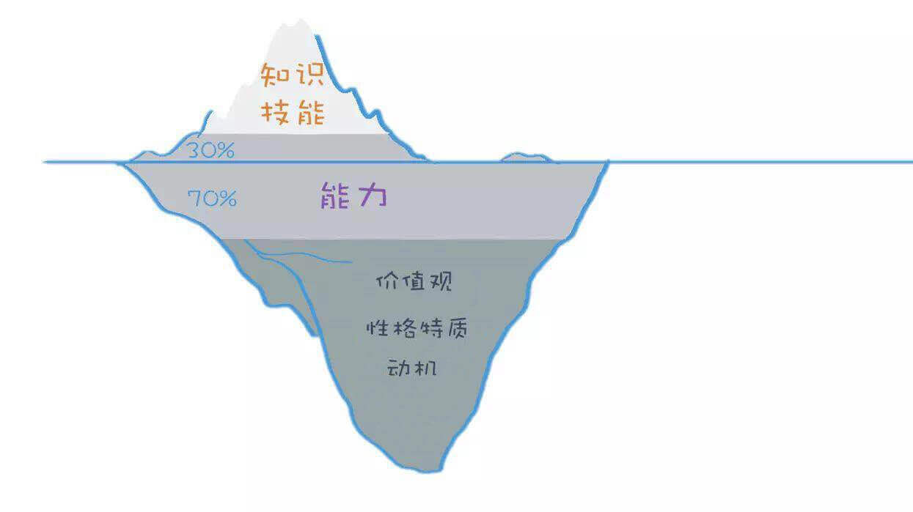

    - 知识容易在后天习得，性格特质动机价值观这些隐形要素很难后天改变
    - 搞明白“我应该选择什么样的工作”，比“我应该如何在别人认为的好工作里面成功”，要重要得多
    - 掌握一定数量的思维模型，能够解决这个世界上90%的问题。    

    > 思考：
    > 1. 在招聘中，如何通过冰山模型的各个要素考察面试者；对应的：面试者在面试中如何通过冰山模型向面试官示自己的优点？
    > 2. 通过冰山模型分析自己


# 2017年

## 6月


### 12日


单词： doodle （有两种含义，一种是“涂鸦；漫不经心地画画”，另一种是“闲荡，打发时间”。）

当前提到Doodle，更多的是指Google Doodle，即Google的标志Logo的创意

[Google2016万圣节Doodle](https://www.google.com/doodles/halloween-2016)


### 9日

echarts.getDataURL 中可以设置图片的背景色


### 8日


X-UA-Compatible是自从IE8新加的一个设置，对于IE8以下的浏览器是不识别的。 通过在meta中设置X-UA-Compatible的值，可以指定网页的兼容性模式设置。

在网页中指定的模式优先权高于服务器中（ 通过HTTP Header ）所指定的模式。


```html

<meta http-equiv="X-UA-Compatible" content="IE=7">  
<!-- 以上代码告诉IE浏览器，无论是否用DTD声明文档标准，IE8/9都会以IE7引擎来渲染页面。 -->

<meta http-equiv="X-UA-Compatible" content="IE=8">  
<!-- 以上代码告诉IE浏览器，IE8/9都会以IE8引擎来渲染页面。 -->

<meta http-equiv="X-UA-Compatible" content="IE=edge">  
<!-- 以上代码告诉IE浏览器，IE8/9及以后的版本都会以最高版本IE来渲染页面。 -->

<meta http-equiv="X-UA-Compatible" content="IE=7,IE=9">  
<meta http-equiv="X-UA-Compatible" content="IE=7,9">  
<meta http-equiv="X-UA-Compatible" content="IE=Edge,chrome=1">
<!-- 以上代码IE=edge告诉IE使用最新的引擎渲染网页，chrome=1则可以激活Chrome Frame. -->

```


## 4月

### 15日

- ionic 开发环境安装
	- Node.js
	- Ionic2
	- Cordova
	- JDK
	- Andorid SDK


### 13日

- 基本JPEG(Baseline JPEG)和渐进JPEG(Progressive JPEG)
	- photoshop 生成 jpeg 图片时，将连续打钩即可生成Progressive JPEG。


- JDK 是啥？
	- Java Development Kit (JDK) 是太阳微系统针对Java开发人员发布的免费软件开发工具包(SDK，Software development kit)。JDK 是整个Java的核心，包括了Java运行环境、Java工具和Java基础类库。2006年太阳微系统宣布将发布基于GPL协议的开源JDK，使JDK成为自由软件。
- 配置JDK：
	- 如：jdk安装在“D:\Program Files\java\jdk1.6.0_10”
	- 第一步：新建“java_home”值，输入“D:\Program Files\java\jdk1.6.0_10”；
	- 第二步：新建“classpath”值，输入“.;%java_home%\lib”；
	- 第三步：在path中增加“%java_home%\bin”；
	- 备注：配置环境变量在“计算机”右击“属性”，之后选择“高级环境变量”，在选择“环境变量”即可。


### 11日

- 数据显示 Angular 2 比Angular 1 快5到10倍
- CLI（command-line interface，命令行界面）
- UWP应用 是啥？
	- uwp就是通用应用的意思。可以在电脑端，手机端，或其他设备通用。不用分别为不同的平台设计不同的软件。既一个软件就可以通吃。这估计现在是win10系统的一个软件发展趋势了。不管是开发者，还是使用者，都省事。
- [VS Code](https://code.visualstudio.com/) 编辑器  强大的智能感知，自定义的类都可以哦，真的有点开发强类型语言的感觉啊


- 使用cnpm（不造为啥 直接用 npm 切国内淘宝镜像 有时候安装会报错）

```shell
npm install -g cnpm --registry=http://registry.npm.taobao.org
```

- 管理 node 版本的工具 ，首先安装 n 模块

```shell
npm install -g n
```

升级 node 到最新的稳定版

```shell
n stable
```

so easy 也可以跟版本号

```shell
n v0.10.26
```


### 10日

css中的兼容写法不要省略：
栗子：

```css
/* 错误的（这种情况在 Ubuntu 的火狐浏览器下不生效，导致样式） */
.box{
    box-sizing: border-box;
}


/* 正确的 */
.box{
    -webkit-box-sizing: border-box;
    -moz-box-sizing: border-box;
    box-sizing: border-box;
}
```

- win10 使用技巧
	- 在记事本第一行打 .LOG 代码，会自动记录你的修改时间（然并卵，我用Git）
	- 系统托盘右键，显示“任务视图”按钮 ，任务视图 可以让你创建多个**虚拟桌面**，快捷键 Win + Alt + 左右键 可以快速切换（不过某个应用在 A 桌面打开的时候，在 B 桌面开启这个应用会回到 A 桌面，在不同桌面开不同的应用才是它的真正用途）
	- 在用户账户（通过运行--netplwiz 可以进入）中可以设置无密码登录
	- Alt Prt Scr，没错！就是比你之前的操作多出一个Alt键。这组快捷键可以将屏幕直接导出成图片，再麻烦的事也是一键搞定。（我可能用的假的win10）
	- 看你的win10吗是不是永久激活 win+R 开启运行 输入   slmgr.vbs -dlv  或者  slmgr.vbs -xpr  即可查看你的win10  是不是永久激活的。


### 8日


- 指令使用中的一个小**坑**

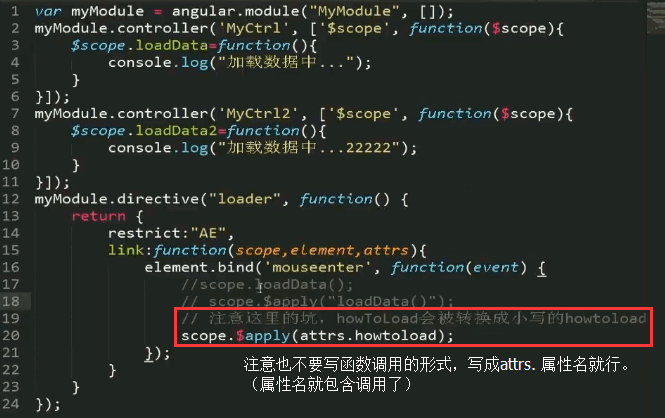

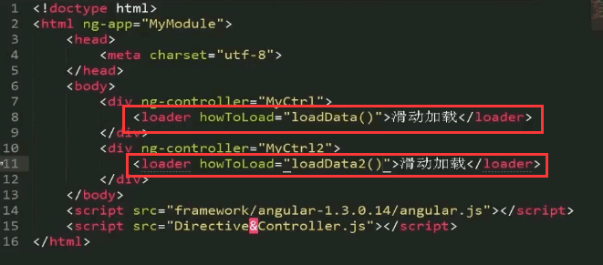


- 指令内部的 scope 叫做创建独立的作用域
- 指令内部的 controller 是给指令暴露出一组 public 方法，给外部调用的

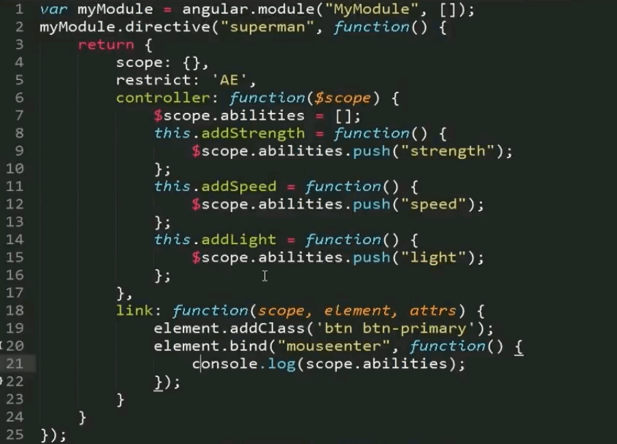

- AngularJS 里内置了 Jquerylight 即简化版 Jquery ，是和我们所熟悉的 jquery 语法一模一样的 

- 指令的 controller 和 link 里放什么逻辑？
	- 如果指令 要暴露一些方法给外部调用，就写在 controller 里
	-  如果是用来处理指令内部的事物的（比如给元素绑定事件呀，绑定数据呀），这时候就写在 link 里

- 指令中的 require 表示该指令依赖于哪一个指令（下边的例子表示 strength 这个指令依赖于 superman 指令）

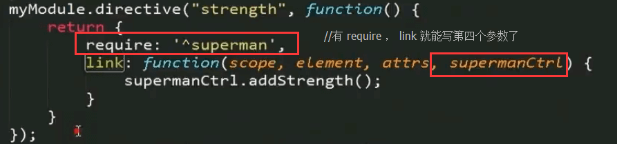

- 有 require 之后我们就可以在 link 函数里写第四个参数 即被依赖指令的 controller 写成 “指令名Ctrl” 的形式。 接下来我们就可以通过 指令名Ctrl.fn 来调用被依赖指令暴露出的方法了。


### 7日

AngularJS 指令（Directive）

自定义指令的配置项

1. restrict (匹配模式)：有 A E M C 四种，推荐使用 A 和 E 这两种模式(以 hello 指令为例)
	- E 作为元素名使用（element）
	- A 作为属性使用（attribute）
	- M 作为注释使用（comment）
		- 做注释的时候要注意 ： directive:hello 前后要各有一个空格，否则angular可能无法解析（这是一个小**坑**）。
	- C 作为类名使用（class）

```html
<hello></hello>
<div hello></div>
<div class="hello"></div>
<!-- directive:hello -->
<div></div>
```


2. template
	- template 可以写模板
	- templateUrl 可以引入独立的HTML文件,其中可以写大块的模板
	- templateCache 可以将模板缓存起来，让多个指令去使用它
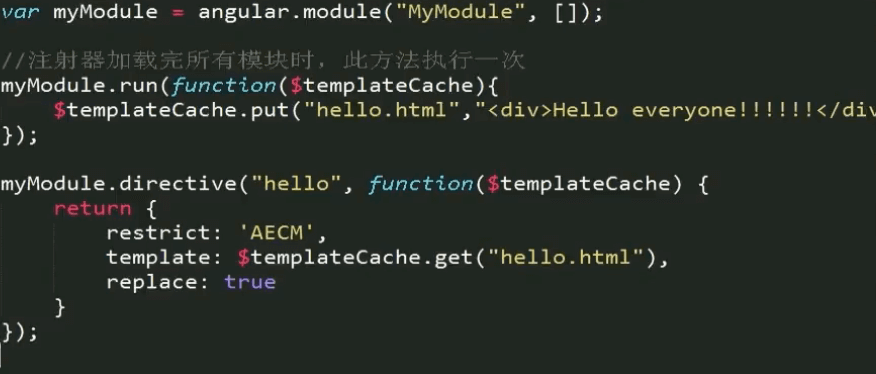

3. replace 与 transclude
	- transclude 允许 指令内部嵌套（非常重要，使指令与指令嵌套的基础）


### 6日

- 啥是环境变量？
 
环境变量（environment variables）一般是指在操作系统中用来指定操作系统运行环境的一些参数，如：临时文件夹位置和系统文件夹位置等。

环境变量是在操作系统中一个具有特定名字的对象，它包含了一个或者多个应用程序所将使用到的信息。例如Windows和DOS操作系统中的path环境变量，当要求系统运行一个程序而没有告诉它程序所在的完整路径时，系统除了在当前目录下面寻找此程序外，还应到path中指定的路径去找。用户通过设置环境变量，来更好的运行进程。

- node-uuid 是啥？

- node n 命令是干嘛用的？

n 是管理node版本的 

[管理 node 版本，选择 nvm 还是 n？](http://web.jobbole.com/84249/)


### 5日

HTTP是一个**无状态协议**。

通俗的说就是，服务器因为每天要接待太多客户了，是个**健忘鬼**，你一挂电话，他就把你的东西全忘光了，把你的东西全丢掉了。你第二次还得再告诉服务器一遍。


## 3月


### 28日

- 测试玩


```javascript

// JavaScript把null、undefined、0、NaN和空字符串''视为false

Boolean(-1)
//true

Boolean(0)
//false

Boolean(null)
//false

Boolean(undefined)
//false

Boolean(NaN)
//false

Boolean("")
//false

Boolean('')
//false

typeof(null)
//"object"

typeof(undefined)
//"undefined"

typeof("")
//"string"

typeof(123)
//"number"

typeof(Date)
//"function"

typeof(window)
//"object"

typeof(elememt)
//"undefined"

typeof(qwe)
//"undefined"

typeof(typeof(qwe))
//"string"

typeof(typeof(123))
//"string"

typeof(typeof(NaN))
//"string"

typeof(NaN)
//"number"

0/0
//NaN

0/9
//0

123/0
//Infinity

1/0
//Infinity
```

### 27日

- dotdotdot.js  多行文本溢出解决方案。

```javascript
dot = require('../plugins/jquery.dotdotdot.min');
$('.info-item-desc,.image-list-title,.image-list-desc').dotdotdot({wrap: 'letter'});
```

- 浏览器通知
	- 原生

    ```javascript
    if(window.Notification && Notification.permission !== "denied") {
        Notification.requestPermission(function(status) {
            var n = new Notification('通知标题', { body: '这里是通知内容！' }); 
        });
    }
    ```
	- 插件 [iNotify.js](http://blog.csdn.net/zhanglong_longlong/article/details/52539302)
        - npm

        ```shell
        npm install title-notify
        ```
        - bower

        ```shell
        bower install inotify
        ```

        - **init**

        ```javascript
        var iNotify = new iNotify().init()
        //推荐下面写法
        var iNotify = new iNotify({
            message: '有消息了。',//标题
            effect: 'flash', // flash | scroll 闪烁还是滚动
            //可选播放声音
            audio:{
                //可以使用数组传多种格式的声音文件
                file: ['msg.mp4','msg.mp3','msg.wav']
                //下面也是可以的哦
                //file: 'msg.mp4'
            },
            //标题闪烁，或者滚动速度
            interval: 1000,
            //可选，默认绿底白字的  Favicon
            updateFavicon:{
                // favicon 字体颜色
                textColor: "#fff",
                //背景颜色，设置背景颜色透明，将值设置为“transparent”
                backgroundColor: "#2F9A00" 
            },
            //可选chrome浏览器通知，默认不填写就是下面的内容
            notification:{
                title:"通知！",//设置标题
                icon:"",//设置图标 icon 默认为 Favicon
                body:'您来了一条新消息'//设置消息内容
            }
        })
        ```


### 24日


- Windows 下的 cmd 中查看当前位置下的文件 用 dir  命令。

- const 声明创建一个只读的常量。这不意味着常量指向的值不可变，而是变量标识符的值只能赋值一次。

    ```javascript
    // 注意: 常量在声明的时候可以使用大小写，但通常情况下会使用全部大写英文。 

    // 定义常量MY_FAV并赋值7
    const MY_FAV = 7;

    // 在 Firefox 和 Chrome 这会失败但不会报错(在 Safari这个赋值会成功)
    MY_FAV = 20;

    // 输出 7
    console.log("my favorite number is: " + MY_FAV);

    // 尝试重新声明会报错 
    const MY_FAV = 20;

    //  MY_FAV 保留给上面的常量，这个操作会失败
    var MY_FAV = 20; 

    // MY_FAV 依旧为7
    console.log("my favorite number is " + MY_FAV);

    // 下面是一个语法错误
    const A = 1; A = 2;

    // 常量要求一个初始值
    const FOO; // SyntaxError: missing = in const declaration

    // 常量可以定义成对象
    const MY_OBJECT = {"key": "value"};

    // 重写对象和上面一样会失败
    MY_OBJECT = {"OTHER_KEY": "value"};

    // 对象属性并不在保护的范围内，下面这个声明会成功执行
    MY_OBJECT.key = "otherValue";
    ```

- npm就是Node的软件包管理器
	- 在项目根目录执行 npm init 命令可以帮你创建 package.json 。注意**项目名不能包含大写字母**
	- 如果用 npm 安装模块的过程中报域名错误的话，请清空缓存 > npm cache clean 或重启计算机即可

- 特别注意：package.json是一个普通json文件，所以不能添加任何注释


- npm安装 gulp 时警告:npm WARN deprecated minimatch@2.0.10: Please update to minimatch 3.0.2 or higher to
	- 解决办法： (update不行)   直接重装 ：

```
npm install -g npm@3
```


### 23日

Gulp

- 全局安装

```shell
npm install --global gulp
```

- 作为项目的开发依赖（devDependencies）安装

```shell
npm install --save-dev gulp
```


### 22日

IPXX防护等级概念

- 防尘部分：0-6共7级
- 防水部分：0-8共9级

	例如： 
	- Xperia Z2的防护等级IP58  
	- 三星Galaxy S5的防护等级IP67


chrome 离线版下载

- 最新稳定版：http...网址...**?standalone=1**
- 最新测试版：http...网址...**?standalone=1&extra=betachannel**
- 最新开发版：http...网址...**?standalone=1&extra=devchannel**


- JavaScript


    1. 字符串

        - 如果字符串内部既包含'又包含"怎么办？可以用转义字符\来标识，比如：

        ```javascript
        'I\'m \"OK\"!';
        ```

        - ASCII字符可以以\x##形式的十六进制表示

        ```javascript
        '\x41'; // 完全等同于 'A'
        ```

        - 还可以用\u####表示一个Unicode字符

        ```javascript
        '\u4e2d\u6587'; // 完全等同于 '中文'
        ```

        - 由于多行字符串用\n写起来比较费事，所以最新的ES6标准新增了一种多行字符串的表示方法，用反引号 ` ... ` 表示


        ```javascript
        `这是一个
        多行
        字符串`;
        ```

        - 如果有很多变量需要连接，用+号就比较麻烦。ES6新增了一种模板字符串，它会自动替换字符串中的变量

        ```javascript
        var name = '小明';
        var age = 20;
        var message = `你好, ${name}, 你今年${age}岁了!`;
        alert(message);
        ```

        - **需要特别注意的是**: 字符串是不可变的，如果对字符串的某个索引赋值，不会有任何错误，但是，也没有任何效果

        ```javascript
        var s = 'Test';
        s[0] = 'X';
        alert(s); // s仍然为'Test'
        ```

    2. 数组

        - 请注意，直接给Array的length赋一个新的值会导致Array大小的变化

        ```javascript
        var arr = [1, 2, 3];
        arr.length; // 3
        arr.length = 6;
        arr; // arr变为[1, 2, 3, undefined, undefined, undefined]
        arr.length = 2;
        arr; // arr变为[1, 2]
        ```

        - 请注意，如果通过索引赋值时，索引超过了范围，同样会引起Array大小的变化

        ```javascript
        var arr = [1, 2, 3];
        arr[5] = 'x';
        arr; // arr变为[1, 2, 3, undefined, undefined, 'x']
        ```

        - indexOf()来搜索一个指定的元素的位置：

        ```javascript
        var arr = [10, 20, '30', 'xyz'];
        arr.indexOf(10); // 元素10的索引为0
        arr.indexOf(20); // 元素20的索引为1
        arr.indexOf(30); // 元素30没有找到，返回-1
        arr.indexOf('30'); // 元素'30'的索引为2
        ```

        - slice()就是对应String的substring()版本，它截取Array的部分元素，然后返回一个新的Array
            - slice()的起止参数包括开始索引，不包括结束索引
            - 如果不给slice()传递任何参数，它就会从头到尾截取所有元素。利用这一点，我们可以很容易地复制一个Array

        ```javascript
        var arr = ['A', 'B', 'C', 'D', 'E', 'F', 'G'];
        arr.slice(0, 3); // 从索引0开始，到索引3结束，但不包括索引3: ['A', 'B', 'C']
        arr.slice(3); // 从索引3开始到结束: ['D', 'E', 'F', 'G']
        var aCopy = arr.slice();
        aCopy; // ['A', 'B', 'C', 'D', 'E', 'F', 'G']
        aCopy === arr; // false
        ```

        > 写一个判断数组是否相等的方法:

        ```javascript
        var cmpare = function(arr1,arr2){
            if(arr1.length === arr2.length){
                for(var i = 0;i<arr1.length;i ++){
                    if(arr1[i] === arr2[i]){
                        if(i === (arr1.length - 1)){
                            return true;
                        }
                    }else{
                        return false;
                    }
                }
            }else{
                return false;
            }
        }
        ```


        - push() 向 Array 的末尾添加若干元素，pop() 则把 Array 的最后一个元素删除掉。如果要往 Array 的头部添加若干元素，使用 unshift() 方法，shift() 方法则把 Array 的第一个元素删掉。
        - 添加时的返回值是数组的新长度，删除时的返回值被删除的元素。
        - 空数组继续 pop/shift 不会报错，而是返回 undefined 。
        - reverse()把整个Array的元素给掉个个，也就是反转
        - sort()可以对当前Array进行排序，它会直接修改当前Array的元素位置，直接调用时，按照默认顺序排序
        - splice()方法是修改Array的“万能方法”，它可以从指定的索引开始删除若干元素，然后再从该位置添加若干元素,返回删除的元素

        ```javascript
        var arr = ['Microsoft', 'Apple', 'Yahoo', 'AOL', 'Excite', 'Oracle'];
        // 从索引2开始删除3个元素,然后再添加两个元素:
        arr.splice(2, 3, 'Google', 'Facebook'); // 返回删除的元素 ['Yahoo', 'AOL', 'Excite']
        arr; // ['Microsoft', 'Apple', 'Google', 'Facebook', 'Oracle']
        // 只删除,不添加:
        arr.splice(2, 2); // ['Google', 'Facebook']
        arr; // ['Microsoft', 'Apple', 'Oracle']
        // 只添加,不删除:
        arr.splice(2, 0, 'Google', 'Facebook'); // 返回[],因为没有删除任何元素
        arr; // ['Microsoft', 'Apple', 'Google', 'Facebook', 'Oracle']
        ```

        - concat()方法把当前的Array和另一个Array连接起来，并返回一个新的Array

        ```javascript
        var arr = ['A', 'B', 'C'];
        var added = arr.concat([1, 2, 3]);
        added; // ['A', 'B', 'C', 1, 2, 3]
        arr; // ['A', 'B', 'C']
        ```

        - join()方法是一个非常实用的方法，它把当前Array的每个元素都用指定的字符串连接起来，然后返回连接后的字符串

    3. 对象

        - 最后一个键值对不需要在末尾加,，如果加了，有的浏览器（如低版本的IE）将报错

        - 访问属性是通过.操作符完成的，但这要求属性名必须是一个有效的变量名。如果属性名包含特殊字符，就必须用''括起来

        ```javascript
        var xiaohong = {
            name: '小红',
            'middle-school': 'No.1 Middle School'
        };
        xiaohong['middle-school']; // 'No.1 Middle School'
        xiaohong['name']; // '小红'
        xiaohong.name; // '小红'
        ```

        > 这个例子中，xiaohong 的属性名 middle-school 不是一个有效的变量，就需要用''括起来。访问这个属性也无法使用.操作符，必须用['xxx']来访问（我们在编写JavaScript代码的时候，属性名尽量使用标准的变量名，这样就可以直接通过object.prop的形式访问一个属性了）

        - JavaScript规定，访问不存在的属性不报错，而是返回undefined

        - JavaScript的对象是动态类型，你可以自由地给一个对象添加或删除属性

        ```javascript
        var xiaoming = {
            name: '小明'
        };
        xiaoming.age; // undefined
        xiaoming.age = 18; // 新增一个age属性
        xiaoming.age; // 18
        delete xiaoming.age; // 删除age属性
        xiaoming.age; // undefined
        delete xiaoming['name']; // 删除name属性
        xiaoming.name; // undefined
        delete xiaoming.school; // 删除一个不存在的school属性也不会报错
        ```

        - 如果我们要检测xiaoming是否拥有某一属性，可以用in操作符：

        ```javascript
        var xiaoming = {
            name: '小明',
            birth: 1990,
            school: 'No.1 Middle School',
            height: 1.70,
            weight: 65,
            score: null
        };
        'name' in xiaoming; // true
        'grade' in xiaoming; // false
        ```

        > 不过要小心，如果in判断一个属性存在，这个属性不一定是xiaoming的，它可能是xiaoming继承得到的：

        ```javascript
        'toString' in xiaoming; // true
        ```

        - 因为toString定义在object对象中，而所有对象最终都会在原型链上指向object，所以xiaoming也拥有toString属性。

        要判断一个属性是否是xiaoming自身拥有的，而不是继承得到的，可以用 **hasOwnProperty()** 方法：

        ```javascript
        var xiaoming = {
            name: '小明'
        };
        xiaoming.hasOwnProperty('name'); // true
        xiaoming.hasOwnProperty('toString'); // false
        ```


    4. 判断

        - 如果语句块只包含一条语句，那么可以省略{}

        ```javascript
        var age = 20;
        if (age >= 18)
            alert('adult');
        else
            alert('teenager');
        ```

        - 省略{}的危险之处在于，如果后来想添加一些语句，却忘了写{}，就改变了if...else...的语义，所以我们建议永远都要写上{}

        - 如果if的条件判断语句结果不是true或 false 怎么办？例如 

        ```javascript
        var s = '123';
        if (s.length) { // 条件计算结果为3
            //
        }
        ```
        > JavaScript把null、undefined、0、NaN和空字符串''视为false，其他值一概视为true，因此上述代码条件判断的结果是true


    5. 循环
        
        - for循环的3个条件都是可以省略的，如果没有退出循环的判断条件，就必须使用break语句退出循环，否则就是死循环

        ```javascript
        var x = 0;
        for (;;) { // 将无限循环下去
            if (x > 100) {
                break; // 通过if判断来退出循环
            }
            x ++;
        }
        ```
        - for循环的一个变体是for ... in循环，它可以把一个**对象**的所有**属性**依次循环出来
        > 请注意，for ... in对Array的循环得到的是String而不是Number

        - while循环只有一个判断条件，条件满足，就不断循环，条件不满足时则退出循环。


### 21日

- **AngularJS 四大核心特性**
	- MVC
	- 模块化和依赖注入
	- 双向数据绑定
	- 指令

- Angular 的“遥控器”是Controller。
- **路由**
	- 路由的本质是由地址栏url的不同，为我们展示不同的视图。（这个过程没有和服务器交互）。
	- 只有两个方法： when 和 otherwise
	- URL 中的 # 号是防止浏览器向服务器提交请求的。
	- 我们就可以将不同的视图交给不同的控制器去处理，这样视图之间的职能就分的很清晰。
- angular 自己的 router 是不支持深层次的路由的，可以使用[angular-ui](angular-ui.hithub.io),ui-router 提供了可以深度路由的方式。(导入了ui-router之后就不需要angular自己的router)
- **前端路由**的基本原理
	- 哈希 # 
	- HTML5 中新的 history API
	- 路由的核心是给应用定义“状态”
	- 使用路由机制会影响到应用的整体编码方式（需要预先定义好状态）
	- 要考虑兼容性和“优雅降级”


---
JavaScript

- {...} 是代码块  不需要分号
- 让JavaScript引擎自动加分号 **（意思就是你懒得加分号）** 在某些情况下会改变程序的语义，导致运行结果与期望不一致

- ECMAScript 标准定义了 6 种数据类型:

```
Number
String
Boolean
Null
Undefined
Object
```

- NaN 和 Infinity（无限大）是 Number 类型

```javascript
NaN === NaN; // false
```

唯一能判断NaN的方法是通过isNaN()函数 ：	

```javascript
isNaN(NaN); // true
```

- 要注意浮点数的相等比较：

```javascript
1 / 3 === (1 - 2 / 3); // false
```

这不是JavaScript的设计缺陷。浮点数在运算过程中会产生误差，因为计算机无法精确表示无限循环小数。要比较两个浮点数是否相等，只能计算它们之差的绝对值，看是否小于某个阈值：

```javascript
Math.abs(1 / 3 - (1 - 2 / 3)) < 0.0000001; // true
```

### 20日

- Stero 是立体声
- Mono 是单声道。

MarkDown 插入图片的语法：

```

```


- AngularJS 中的 MVC 是借助 $scope 实现的。
- $rootScope 是控制器之间的桥梁。
- **神奇的 $scope**
	1. $scope 是一个POJO(Plain Old JavaScript Object)
	2. $scope 提供了一些工具方法 $watch()/$apply()   (用来实时监测对象属性的变化的)
	3. $scope 是表达式的执行环境（或者叫作用域）
	4. $scope 是一个树形结构，**与DOM标签平行**
	5. 子 $scope 对象会继承父 $scope 上的**属性和方法**
	6. 每个 Angular 应用只有一个根 $scope 对象（$rootscope，一般位于ng-app上）
	7. $scope 可以传播事件，类似DOM事件，可以向上也可以向下。
	8. $scope 不仅是 MVC 的基础，也是后面实现实现双向数据绑定的基础。 
	9. 可以用 angular.element($0).scope() 进行调试。（可以获得当前元素上的$scope）
	
- **$scope 的生命周期**
	1. Creation （创建）
	2. Watcher registration （注册监控）
	3. Model mutation （监测模型变化）
	4. Mutation observation （观察模型有没有脏）
	5. Scope destruction （销毁scope）

- 监察？   extJS?

### 18日

- grunt 的插件 安装

```shell
npm install grunt-contrib-uglify --save-dev
npm install grunt-contrib-qunit --save-dev
npm install grunt-contrib-concat --save-dev
npm install grunt-contrib-jshint --save-dev
npm install grunt-contrib-watch --save-dev
```

- npm 会把非全局安装的工具 安装到当前目录下的 node_modules 目录下

- 10款工具：

	- Bower           依赖管理工具
	- Sublime         编辑器
	- Protractor      专为Angular定制的测试工具 基于WebDriverJS
	- NodeJS          node
	- http-server     快速创建web服务器
	- Grunt           自动化工具
	- Karma           用来跑测试用例的容器
	- Jasmine         提供了一套语法用来编写测试用例
	- Git             版本控制
	- Chrome          浏览器

- MVC只是手段，终极目标是模块化和复用

- Controller:

- 不要复用Controller；
- 不要在 Controller 中操作DOM；
- 不要在 Controller 中做数据格式化，ng有很好的表单控件
- 不要在 Controller 中做过滤操作。ng有$filter。
- 一般来说，Controller是不会互相调用的。控件之间的交互式通过事件进行的。

### 14日

- npm 换源：

```shell
npm config set registry https://registry.npm.taobao.org
//配置后可通过下面方式来验证是否成功
npm config get registry
```
