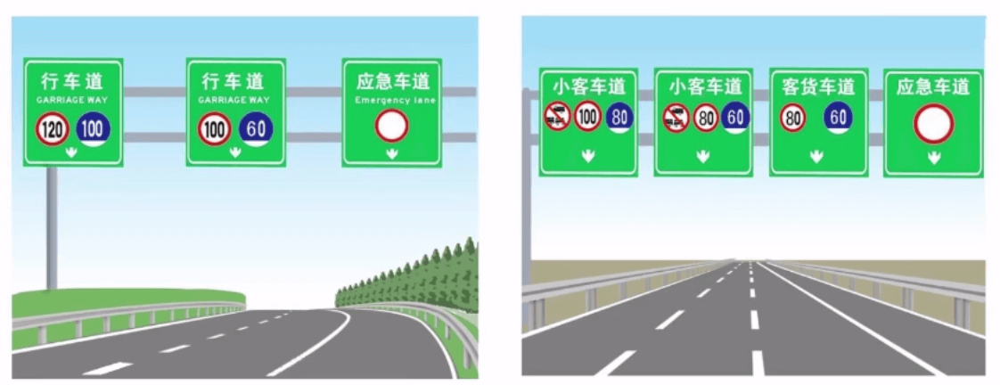

# 交规学习

## 第一课

## 第二课

### 换证
- 期满前提前90天，身份证+驾驶证+身体证明
- 6年 -> 10年 -> 长期（条件：没有记满12分）
- 户籍所在地变更要想迁入地车管所申请换证，
- 居住地换证
- 要填写申请表
- 信息变化，损毁无法辨认，要在30日内，车管所
- 身体条件60日有效
- 70周岁要一年一检

### 补证
- 身份证、遗失/损毁的书面证明
- 补发后原证作废
- 补发后还用旧的 罚款 20~200
- 如果证被扣，用欺骗手段补领，交管部门收回原驾驶证，罚款200~500

### 实习期
- 初领 12个月
- 要在车后挂实习标
- 没挂 罚款20~200
- 实习期不能驾驶营运车，任务车，载有危险品的车，以及牵引挂车
- 上高速要有同级或高级驾驶证3年以上的人陪同（不能单独上高速）
- 违反以上规定：罚20~200

### 违法计分制度
- 周期12个月，12分
- 牡丹交通信息卡（必须得领），从0起计
- 周期内没够12分，且罚款全交的，计分清除
- 周期内没够12分，且罚款没交的，积分转到下一个周期
- 到了12分，会被扣
- 扣了之后，要在15天内参加7天的学习，考试，合格清分还证，不合格接着学习接着考
- 不学习，不考试，。。。。？？？？？
- 两次12分，累计24分，要重考驾驶技能考试
- 5个计分段 12、6、3、2、1
- 12分：
    - 驾驶不符合准驾车型
    - 酒驾
    - 事故逃逸尚不构成犯罪的
    - 没挂牌
    - 遮挡车牌
    - 伪造车牌、行驶证、驾驶证
    - 使用其他车牌、行驶证
    - 在高速上倒车、逆行、穿越中央分隔带掉头
    - 超速50%以上
- 6分：
    - 驾照被扣还开车
    - 违反信号灯
    - 超速20不到50
    - 载客车超载人数 20%以上
    - 超载货物 30% 以上、或违规载客
    - 高速车道内停车
    - 高速或城市快速路上违法占用应急车道
    - 低能见度，不按规定行驶
    - 隐瞒欺骗补领驾驶证
    - 连续驾车超过4小时未休息，或者休息时间少于20分钟
    - 不按规定避让校车的
- 3分：
    - 载客车超载不到20%
    - 超速不到20%
    - 载物超载不到30%
    - 在高速上低于最低速度
    - 开不让上高速的车上高速
    - 在高速或者城市快车道上不按规定车道行驶
    - 过人行道时，不减速、停车、避让行人的
    - 违反禁令标志、禁止标线指示
    - 不按规定超车让行，或者逆向行驶
    - 违反规定牵引挂车
    - 路上故障停车，不按规定打灯和设置警告标志的
    - 不按规定定期检车的
- 2分：
    - 交叉路口不按规定行车或停车
    - 开车打电话等妨碍安全行驶的行为的
    - 在高速、城市快车道上 不系安全带的
    - 前方机动车停车排队，或者缓慢行驶的时候，借道超车
    - 占用对面车道，穿插等候车辆
- 1分：
    - 不按规定用灯
    - 不按规定会车
    - 载货长宽高超过规定
    - 上路的车没放置检验合格标、保险标
    - 上路的车没带行驶证、驾驶证的

### 驾驶证审验
- 换证时要审验
- 大客车、牵引车、城市公交、中客车、大货车以外的，发生事故造成人员死亡，担同等以上责任未被吊销驾照的，应在记分周期结束后30日内到交管部门接受审验，应申报身体条件情况
    - 这种情况审验时应当参加不少于3小时的道路交通安全法规、文明驾驶、应急处置等知识学习，并接受交通事故案例警示教育。
- 审验内容：
    - 道路交通安全违法行为、事故处理情况
    - 身体条件
    - 积分情况，以及满12分后参加学习考试情况
- 没处理完事故、身体问题、未按规定学习考试的、不予通过审验
- 审验地点：核发地或核发地以外
- 警示：没审验还开车的处罚款200~2000？？？？？
- 有原因不能审验的，可以申请延期办理离
- 延期不能超3年，延期期间不能开车

### 注销
- 死亡
- 主动注销
- 丧失民事行为能力
- 身体原因
- 有气质型心脏病、、、、、、妨碍安全驾驶疾病的
- 被查有毒驾的，长期服用药瓶成瘾
- 逾期1年内没换
- 70岁以上，1年内，没有提交身体证明
- 60岁以上，持有轨电车、无轨电车的；70岁以上，持低速载货车、三轮汽车、论事自行机械车的
- 驾驶证被吊销或者驾驶许可被撤销的
- 提示： 
    - 身体变化不适合开车但仍开车的，罚200~500；
    - 实习期内计满12分的，注销

## 第三课

## 第四课 跟车与限制超车
同车道与前车保持足以制动的安全距离

### 超车
- **开左转**向灯（目的提示后方）
- **切换远近光灯**（夜间）或**鸣喇叭**提示
- 确认有充足的安全距离后，从前车的**左侧超越**
- 与被超车拉开必要的安全距离（通过右后视镜观察被超车的速度和距离，回头二次确认是否是安全距离）后，开**右转向灯，驶回原车道**
- 被超的车辆也要在安全的情况下才可以让超
- **不能超车的情形**
    - 铁路道口
    - 交叉路口
    - 窄桥
    - 弯道
    - 陡坡
    - 隧道
    - 人行横道
    - 市区交通流量大的路段
    - 等没有超车条件的路段
- 在慢速车道要超车的时候，可以借用快速车道行驶，但**不能超越正在转弯、掉头、超车的前车**。（也就是前车开左转向灯之后就不要超车了）
- 遇到前方同方向同车道的**执行任务的警车、消防车、救护车、工程救险车时**，不能超车
- 与对面来车**有会车可能的**也不能超车
- 没有中心线，或者同方向只有一条车道的时候，遇到后车发出的超车信号时，条件许可的情况下，降速、靠右让路

### 会车
- 会车是机动车在车行道相向交错形式的过程
- 没有中心线，遇到相对方向来车时减速靠右，并与行人、其他车辆保持必要的安全距离
- 有障碍的路段与对面来车时，**有障碍物的一方让无障碍物的一方**，有障碍的一方已经驶入是，有障碍的一方先行
- 狭窄的破路，上坡的先行；下坡的一方已经行至中途，上坡的一方未上坡时，下坡的可以先行
- 没有中心线的狭窄山路，不考山体一方先行
- 夜间会车，距离对面来车150m外改用近光灯
- 窄路、窄桥与非机动车会车时，使用近光灯
- 夜间行车对灯光使用要求很严格
    1. 会车不能使用远光
    2. 前后车近距离行驶不能用远光
- 机动车进出或穿越道路时，应该让在道路上正常行驶的车辆、行人先行。在没有主路、辅路的道路上，进出主路的机动车应该让在主路上行驶的和出主路的机动车先行（**辅路让主路，路外让路内**）
- **道路养护车、工程车**不影响过往车辆行驶的前提下，行驶路线不受交通标志、标线的限制，**车辆和人员应注意避让**

### 掉头与倒车
- 掉头
    1. 禁止左转，禁止掉头的地方都是不能掉头的
    2. 铁路道口、人行横道、桥梁、急弯、陡坡、隧道、或容易发生危险的路段，不得掉头
    3. 没有准许掉头标志或者没有禁止掉头或者没有禁止左转弯标志、标线的地点可以掉头，但是不得妨碍正常行驶的其他车辆和行人的通行
- 如果掉头过程中引发交通事故，掉头一方全责
- 倒车
    - 察明后方情况，确然安全后倒车，视线不好的情况下应有人引导
    - 铁路道口、交叉路口、单行路、桥梁、急弯、陡坡或者隧道中不得倒车
    - 倒车使用的速度应当是低速
    - 引导倒车的人要在车的左后或右后方，保持安全距离

## 第五课 避让行人
- 没有信号灯的路口让行人先行，没有方向指示信号灯饿路口转弯时要让直行的车辆先行。
- 行人参与交通饿特点：**行走随意性大、方向多变**、易于围观
- 机动车过人行道时应当减速，遇行人过人行道时应当停车让行人
- 遇到没有信号灯的道路时，遇行人横过道路，应当避让
- 机动车与行人发生交通事故，机动车乙方没有过错的，承担不超过 10% 的赔偿责任
- 两种让行情况：
    - 减速让行
    - 停车让行（要注意盲区的问题）

### 铁路道口及渡口
- 有人看守铁路道口，无人看守铁路道口
- 铁路道口信号灯**只有红灯**，红灯亮 或者 两个红灯交替闪的时候 都是禁止通行，红灯灭，（**前方道路畅通**）可以通行
- 没有停止线的车要停在距离路口 50m 以外
- 没有信号灯也没有管理人员的铁路道口，要停车观察确认安全后，慢速通过，时速不能超 30km/h ，低速匀速行驶，中途切忌换挡，以免造成发动机熄火
- **一看、二慢、三通过**
- 渡口： 低速匀速行驶，服从渡口管理人指挥，按指定地点依次待渡

### 缓行、拥堵路段通行

- 交叉路口阻塞时，依次停在路口外等候，不得进入路口。前方车停车排队或者缓慢行驶的时候，应依次排队通行，不得从前方车两侧穿越或者超越行驶
- 车道数量减少：**依次交替行驶**
- 前方道路拥堵，我们在路口前、绿灯，还是不能向前，因为可能停在人行横道或者黄色禁停网格线上，**要等前方道路疏通后，且信号灯为绿灯方可继续行驶**
- 绿灯控制的路口，可以直行，可以左转，也可以右转，前提是避让被放行的直行车及行人和非机动车

> 路口内，路口外  容易错

## 第六课 机动车限速、牵引故障机动车、高速行驶规定
<!-- 郝学勇 老师 -->

### 第一小节 机动车限速通行
- 道路：
    - 城市道路：城市规划区内的公共通道，一般划设人行道。车行道和交通隔离设施等。包括城市快速路、城市主干道、城市次干道、城市支线、胡同里巷等。
    - 公路：连接城市之间，城乡之间，乡村与乡村之间的 按国家技术标准修建的，有公路主管部门验收认可的道路。包括高速公里、一级公路、二级公路、三级公路、四级公路，但不含田间或农村自然形成的小道
- 限速：不得超过限速标志的最高速度，不得低于限速标志的最低速度。
- **警示**：
    - **超速 50% 的，罚款 200~200 ，吊销驾驶证**
- **无限速标志**的：
    - **没有中心线的** 
        - **城市道路** 限速每小时**30**公里
        - **公路** 限速每小时**40**公里
    - **同方向只有一条车道的**
        - **城市道路** 限速每小时**50**公里
        - **公路** 限速每小时**70**公里
    - **同方向有两条以上车道的**
        - **城市道路** 限速每小时**70**公里
        - **封闭机动车专用道路（像北京的2、3、4、5、6环） 和 公路** 限速每小时**80**公里
    - 低速载货汽车、三轮汽车、拖拉机、电瓶车、轮式专用机械车、正式三轮摩托车、轻便摩托车，限速每小时30公里
    - 附载作业人员的货运汽车、全挂拖斗车，运载危险化学品的货运汽车。二轮摩托车、侧三轮摩托车和铰接式客车、电车
        - 城市道路 限速每小时50公里
        - 闭机动车专用道路 和 公路 限速每小时60公里
    - **以下情形 限速每小时30公里**（电瓶车、拖拉机、轻便摩托车、轮式专用机械车限速每小时15公里）
        1. 进出非机动车道、通过铁路道口、急弯路、窄路、窄桥时；
        2. 掉头、转弯、下陡坡时；
        3. 遇雾、雨、雪、沙尘、冰雹，**能见度在50m以内**时；
        4. 冰雪、泥泞的道路上行驶时
            - 车练的制动距离与速度的关系
                1. 干燥道路 60km/h ，制动距离为 44m
                2. 泥泞道路 60km/h ，制动距离为 70.84m
                3. 结冰道路 60km/h ，制动距离为 141.6m
        5. 牵引发生故障的机动车时
- 居民区限速规定：在居民区，小区院内，要低速行驶，注意避让行人，有限速标志时安限速标志速度行驶。没有限速标志的，一定要低速行驶
- 雨天经过积水路面，行径两侧有行人的积水路面时，要减速慢行
- 不能龟速行驶
- 1迈 约等于 1.6093km/h
- 车速快会产生以下问题：
    1. 视力下降，判断不准，容易注意前方忽视了周围，长时间高速行驶，驾驶人容易疲劳
    2. 反应距离延长，60km/h 反应距离为 17m ， 120km/h 反应距离为 39m
    3. 制动距离延长，速度增加一倍，制动距离增加四倍，转弯离型力增大，容易翻车
    4. 加重事故后果： 发生碰撞的车速 50km/h 相当于从3层楼跌落到地面；100km/h 相当于 12层

### 第二小结 牵引故障机动车

- 被牵引的车除驾驶员外不能载人，不得牵引挂车
- 被牵引的车宽度不能超过牵引车（后边的要比前边的窄）
- **软连接**牵引安全距离4~10m
- **制动失效**的被牵引车一定要使用**硬连接装置**
- 牵引和被牵引的车都应该**开启危险报警闪光灯**
- 转向或者照明、信号装置失效的股行车，应使用专用清障车拖曳
- 汽车吊车、轮式专用机械车不得牵引车辆
- 摩托车不能牵引其他车，也不能被其他车牵引

### 第三小节 高速公路的特别规定
- 行人、非机动车、拖拉机、轮式专用机械车，铰接式客车，全挂拖斗车及其他设计最高时速低于70公里的机动车，不得进入高速
- 实习期上高速要有一位3年以上驾龄，准驾车型大于等于实习期驾驶员的驾驶员陪同

1. 驶出驶入高速公路
    - 进入后应尽快提速到 60km/h 以上
    - 驶入：从匝道进入加速车道前要开左转向灯，在加速车道加速，不妨碍主路车辆正常行驶的情况下，平稳驶入高速公路主路，关闭左转向灯
    - 驶出：提前开右转向灯，不妨碍主路车辆正常行驶的情况下，驶入减速车道，降低车速后驶入匝道（不能待车辆走到匝道口处，从车行道直接减速进入，会妨碍主路车辆正常行驶）
2. 分道限速规定（最高120，最低60）
    - 有限速标志、标线的按限速标志、标线的速度行驶
    - 没有限速标志、标线的路段按法定时速行驶
        - 小型载客汽车不得超120
        - 其他机动车不得超100
        - 摩托车不得超80
    - 同方向两条车道：左侧车道不能低于100，右侧车道不能低于60
    - 同方向三条车道的：左侧车道不能低于110，中间车道不能低于90，右侧车道不能低于60（**每条车道最高限速是统一的：120**）
    - 还有的路段每条车道都标明了限速，要按标志的限速去行驶
        - 
3. 跟车距离
    - 车速超过 100km/h 时，应与前车保持 100m 以上的距离
    - 车速低于 100km/h 时，可以适当缩短，最小不得少于 50m 
4. 低能见度的车速与车距控制：机动车在高速路上行驶，遇到有雾、雨、雪、沙尘、冰雹等低能见度或者路面结冰、积雪时，应当遵守下列规定
    1. **能见度小于200m** 开启**雾灯、近光灯、示廓灯和前后位灯**，车速不能超过 **60km/h** ，与同车道前车保持 **100m** 以上的距离；
    2. **能见度小于100m** 开启**雾灯、近光灯、示廓灯和前后位灯和危险报警闪光灯**，车速不能超过 **40km/h** ，与同车道前车保持 **50m** 以上的距离；
    3. **能见度小于50m** 开启**雾灯、近光灯、示廓灯和前后位灯和危险报警闪光灯**，车速不能超过 **20km/h** ，并**从最近的出口尽快驶离高速公路**；
    4. 遇到以上情形时，高速公路管理部门应当通过**显示屏**等方式发布速度限制、保持车距等提示信息。
    5. 表格方便记忆

能见度小于|车速不能超|限车距离or措施
:-|:-|:-
200m|60km/h|大于100m
100m|40km/h|大于50m
50m|20km/h|从最近出口驶离高速公路
5. 故障处理：
    1. 在高速上出故障时，**警告标志应设置在来车方向 150m 以外**，车上人员迅速转移到**右侧路肩上或应急车道内，并迅速报警**。注意：最安全的是车上人员迅速转移至车辆右前方护栏外的安全地带（走这150m，建议在护栏外走150m，确认安全后再进高速路内放置，然后迅速离开高速路路面，等待救援）。
    2. 应当由救援车、清障车拖曳、牵引。**其他单位或个人不能在高速路上对故障车进行救援**
 
> 疑问： 遇到警告标示的车该怎么做？

### 第四小节 高速公路驾驶禁止行为
- 行人、非机动车、拖拉机、轮式专用机械车，铰接式客车，全挂拖斗车及其他设计最高时速低于70公里的机动车，不得进入高速
- 驾驶机动车在高速公路上行驶，不得有下列行为：
    1. 倒车、逆行、穿越中央隔离带掉头或者在行车道内停车；
    2. 在匝道、加速车道或者减速车道上超车；
    3. 骑、轧车行道分界线或者在路肩上行驶（路肩和应急车道所指位置是同一位置，道路边线外部空间够一条车道的宽度，就是应急车道，否则叫路肩。不管叫啥，都不能随意占用）
    4. 非紧急情况在应急车道行驶或停车；
    5. 试车或学习驾驶机动车；
    6. 在高速公路上行驶的载货汽车，车厢内不得载人。

## 第七课 驾驶行为要求与违法行为处罚
<!-- 龙更 老师 -->
驾驶人出现相关违法行为，轻则收到行政处罚，重则受到刑事处罚

### 第一小节 驾驶人行为要求： 驾驶人对所驾车辆的安全责任
- 驾驶人上路前要检查机动车的状况，不能驾驶不符合安全标准的机动车上路

### 第二小节 上路行驶要求

- 驾驶机动车上路应该悬挂机动车号牌，放置检验和和标志、保险标志，并随车携带机动车行驶证和机动车驾驶证。
- 机动车号牌应按规定悬挂并保持清晰、完整，不得故意遮挡、污损。上路行驶号牌要求前后两面正面安装。如果故意遮挡、污损号牌，将处罚款200元，并记12分

### 第三小节 驾驶机动车禁止行为

- 饮酒、服用国家管制精神药品或者麻醉药品，患有妨碍安全驾驶机动车疾病、过度疲劳，影响安全驾驶的不得驾驶机动车。
- 酒后驾车：指驾驶人员凡是饮用白酒、啤酒、果酒、汽酒、等含有酒精的饮料，在酒精作用期间驾车的为**酒后驾车**。100毫升血液中酒精含量**大于等于 20mg ，小于 80mg** 的驾驶行为是**饮酒驾驶**；**大于 80mg 的是醉酒驾车**。
    - 酒心巧克力、南方的一种小吃叫醪糟(láozāo)、藿香正气水都有一定量的酒精。所以吧饮酒驾驶的起点设为 20mg/100ml。
    - 酒后驾车五大危害：
        1. 酒精麻醉，触觉能力降低，无法正常控制油门刹车及方向盘
        2. 判断力和操作能力降低，对声光反应时间延长，无法判断正确的距离和速度；
        3. 饮酒后视力暂时受损，视像不稳，辩色力下降，不能正确发现和领会交通信号、标志和标线。饮酒后时也会大大减小，视像模糊，眼睛只盯着前方目标，对视野边缘的危险隐患难以发现；
        4. 酒精刺激下，人有时会心理变态，过高估计自己，对周遭劝告常不予理睬，往往做出力不从心的事儿；
        5. 饮酒后易困倦疲劳，甚至进入睡眠的状态。
    - 作为驾驶人：**开车不饮酒，饮酒不开车。**
- 驾驶人禁止行为：
    1. 车门、车厢没有关好时行车。
    2. 在机动车驾驶室的前后窗范围内悬挂、放置妨碍安全驾驶的物品。
    3. 拨打接听手持电话、观看电视等妨碍安全驾驶的行为（罚200，记2分）（吸烟影响安全驾驶，不要与司机嬉笑打闹，不要穿高跟鞋、拖鞋，马达一响，集中思想，车轮一动，安全为重）
    4. 下坡时熄火或者空档滑行（疑问：为啥？）
        - 下坡道熄火时，车辆不能使用发动机制动
        - 对于采用真空助力刹车系统的车辆而言，下坡时的熄火会使刹车系统失效
        - 对于采用了助力转向系统的车辆而言，下坡时熄火会使转向盘变重，难以控制
    5. 向道路上抛撒物品
    6. 连续驾驶机动车超过4小时不停车休息或者休息时间少于20分钟（疲劳驾驶）
    7. 在禁止鸣喇叭的区域或者路段鸣喇叭。

### 第四小节 机动车载人载物规定
- 载人不能超过核定人数，禁止载货车载客。
- 货运及订车需要附载作业人员的，应当设置保护作业人员的安全措施。
- 摩托车后座不得乘坐未满12周岁的未成年人，轻便摩托车不得载人。
- 驾驶人、乘坐人员应当按规定使用安全带。
- 机动车载物不得超过机动车行驶证上核定的载货量，严禁超载；
- 载物的长、宽、高不得违反装载要求；
- 装载长度。宽度不得超出车厢。
- 客运机动车不得违反规定载货。
- 载客汽车除车身外部的行李架和内置的行李箱外，不得载货。

### 第五小节 特种车辆
特种车辆：警车、救护车、消防车、工程救险车。
它们在执行任务时都有一个共同特点，保护人们的生命财产安全。必须争分夺秒。
- 执行紧急任务的特种车辆，在确保全的前提下，不受行驶路线、行驶方向、行驶速度和交通信号灯的限制。其他车辆和行人应当让行。
- 特种车辆非执行紧急任务时不得使用警报器、标志灯具，也不享有道路的优先通行权
- 校车：
    - 校车在同房只有一条机动车道的道路上停靠时，后放车辆应当停车等待，不能超越。
    - 校车在同房有两条以上机动车道的道路上停靠时，校车停靠车道后方和相邻机动车道上的机动车应当停车等待，其他机动车道上的机动车应当浸塑通过。校车后方停车等待的机动车不能鸣喇叭或者使用灯光催促校车。

## 第八课 交通事故的处理、法律责任、机动车的管理
<!-- 蒋旭 老师 -->

### 第一小节 交通事故处理
- 发生事故时，应**立即停车，保护现场**
- 造成人身伤亡的，驾驶人应立即**抢救受伤人员**，并迅速**报告**执勤交警或公安机关交通管理部门
- 因抢救受伤人员**变动现场**的，应当**标明位置**。（疑问：怎么标？）
- 发生事故妨碍交通又难移动的，应开**危险报警闪光灯**，并在车后**50~100m**外（**高速路上是 150m 外**）设置警告标志，确保安全的情况下，立即组织车上人员**疏散**到路外安全地点，避免发生次生事故。
- 三种处理方法：
    1. **自行协商处理**：机与机，机与非机发生**未造成人身伤亡**的交通事故，当事人对事实和成因**无争论**的，可以**自行协商**处理损害赔偿事宜。车辆**可以移动的**，当事人你应当将车辆在确保安全的原则下**对现场拍照或者标划事故车辆现场位置**后，立即撤离现场，将车辆移至不妨碍交通的地点，再进行协商。
        - 证据留存：拍照要拍下车辆的位置，和撞击点的特写，尽可能清晰的记录下现场的一些重要的位置；可以查验对方的车牌、驾驶证，交换有效的联系方式，将车辆移开到安全的地点进行责任认定和赔偿协商
        - 如果双方拒不撤离现场，并且造成了交通拥堵，交警应责令当事人撤离现场；造成拥堵饿 罚200；驾驶人有其他道路交通安全违法行为的，依法一并处罚。
        - 达成协议的：填写道路交通事故损害赔偿协议书（一式两份），共同签名。内容包括事故发生的时间、地点、天气、当事人姓名、机动车驾驶证号、联系方式、机动车种类和号牌、保险凭证号、事故形态、碰撞部位、赔偿责任等内容。
    2. 一般程序处理（需要交警），我们需要及时报警
    3. 简易程序处理（需要交警），我们需要及时报警
- 需要报警处理的情形：
    1. 造成人员死亡、受伤的；
    2. 发生财产损失事故，当事人对事实或成因有争议的，以及虽无争议，但协商损害赔偿未达成协议的；
    3. 机动车无号牌、无检验合格标志、无保险标志的
    4. 载运爆炸物品、易燃易爆化学品及毒害性、放射性、腐蚀性、传染病病原体等危险物品车辆的；
    5. 碰撞建筑物、公共设施或者其他设施的；
    6. 驾驶人无效机动车驾驶证的；
    7. 驾驶人有饮酒、服用国家管制精神药品或者麻醉药品嫌疑的；
    8. 当事人不能自己移动车辆的。
- 发生财产损失的事故，具有以上第二到五项情形之一，车辆可以移动的，当事人在报警后确保安全的原则下，对现场拍照或者标划事故车辆现场位置，将车辆移至不妨碍交通的地点等候处理

### 第二小节 交通违法行为处罚
- 违反《中华人民共和国道路交通安全法》都属于**违法行为**
- 因违法行为造成交通事故并产生严重后果，触犯《刑法》的，当事人需要承担**刑事责任**

#### 刑事处罚
1. 交通肇事罪：
    - 违反道路交通管理法规，发生重大交通事故，致人**重伤**、**死亡**或者**使公私财产遭受重大损失**，处3年以下有期徒刑或拘役；
    - 肇事者**逃逸**或有其他恶劣情节的，处3年以上7年以下有期徒刑；
    - 因**逃逸至人死亡**的，处7年以上有期徒刑。
    - 《中华人民共和国道路交通安全法》及实施条例规定的肇事逃逸的其他法律责任：
        1. 发生交通事故当事人逃逸的，逃逸人承担全部责任。有证据证明对方当事儿你也有过错的可以减轻责任。方式认股以破坏、伪造现场、毁灭证据的、承担全部责任。
        2. 造成交通事故后逃逸，尚不构成犯罪的，油公安机关加管部门处200~2000罚款，可以并处15日以下拘留。
        3. 重大事故犯罪的，追究刑事责任，交管部门吊销驾驶证。事故逃逸的，交管部门吊销驾驶证，并终生不得重新取得驾驶证。
2. 危险驾驶罪：
    - 追逐竞驶、情节恶劣或**醉酒驾驶**的，**处拘役并处罚金**。构成犯罪的，依照处罚较重的规定定罪处罚。
3. 伪造、变造、买卖驾驶证罪：
    - 伪造、变造、买卖居民身份证、护照、社会保障卡、驾驶证等依法可以用于身份证明的证件的，处**3年以下**有期徒刑、**拘役、管制或剥夺政治权利**，并处**罚金**；
    - 情节**严重**的处**3年以上7年以下**有期徒刑，并处**罚金**。
    - **使用**伪造、变造、买卖居民身份证、护照、社会保障卡、驾驶证等依法可以用于身份证明的证件，情节严重的，**处拘役或者管制，并处或者单处罚金**。有前款行为，同事构成其他犯罪的，找处罚较重的规定定罪处罚。

### 第三小节 行政处罚
交管部门及交警依据事实对交通违法行为予以处罚。多道路交通安全违法行为的处罚种类包括：**警告、罚款、暂扣或者吊销机动车驾驶证、拘留**。
C1、C2、C3 的处罚
序号|道路交通安全违法行为|处罚
:-:|:-|:-
1|违反道路交通安全法律、法规关于道路通信规定|处警告或者20~200罚款
2|**饮酒后驾驶**机动车|暂扣6个月驾驶证，罚款1000~2000
3|因酒后驾驶被罚，**再次酒后驾驶**|10日以下拘留，罚款1000~2000，吊销驾驶证
4|**醉酒驾驶**|醒酒，吊销驾照，追究刑事责任；5年不得重新取得驾驶证
5|**饮酒或醉酒发生重大交通事故，构成犯罪**|追究刑事责任，吊销驾驶证，终生不得取得驾驶证
6|违反停车规定的|指出违法行为，口头警告，令其立即驶离
7|违反停车规定不在现场或在现场却拒绝立即驶离，妨碍其他车辆行人通行|20~200罚款，并可将车拖至不妨碍交通的地点或者交管部门指定的地点
8|没挂牌、没放检验合格标、保险标，或者没带行驶证、驾驶证|扣车，通知当事人补办相应的手续，并警告或罚款20~200
9|遮挡、污损或不按规定挂牌|警告或者罚20~200
10|伪造、变造或使用伪造、变造的登记书、号牌、行驶证、驾驶证|收缴、扣车，15日以下拘留，罚2000~5000，构成犯罪的追究刑事责任
11|伪造、变造或使用伪造、变造的检验合格标、保险标|收缴、扣车，10日以下拘留，罚1000~3000，构成犯罪的追究刑事责任
12|使用其他车辆的登记书、号牌、行驶证、驾驶证、检验合格标、保险标|收缴、扣车，10日以下拘留，罚2000~3000，构成犯罪的追究刑事责任
13|非法安装警报器、标志灯具|由公安机关交管部门强制拆除，收缴，罚200~2000
14|车辆所有人、管理人没投保第三者强制保险|扣车到投保，并按投保最低限额应缴纳保费的2倍罚款
15|没取得驾驶证或者驾驶证被扣驾驶机动车|罚200~2000，可以并处15日以下拘留
16|将机动车交给没取得驾驶证或者驾驶证被扣的人驾驶|罚200~2000，可以并处吊销驾驶证
17|造成事故逃逸不构成犯罪|罚200~2000，可以并处15日以下拘留
18|超速50%|罚200~2000，可以并处吊销驾驶证
19|强迫驾驶人违法，造成事故，不构成犯罪的|罚200~2000，可以并处15日以下拘留
20|违反交通管制强行通行，不听劝|罚200~2000，可以并处15日以下拘留
21|故意损毁、移动、涂改交通设施，不构成犯罪的|罚200~2000，可以并处15日以下拘留
22|非法拦截、扣车，不听劝造成严重堵塞或重大财产损失|罚200~2000，可以并处15日以下拘留
23|开拼装车或者达到报废的车|收缴强制报废
24|**对开拼装车或者达到报废的车的驾驶人**|**罚200~2000，吊销驾驶证**（重要考点）
25|出售达报废标准的车|没收违法所得，处销售金额等额的罚款，收缴车，强制报废
26|违法交通法发生事故，构成犯罪的|追究刑事责任，吊销驾驶证
27|造成事故逃逸|吊销驾驶证，终生不得取得驾驶证

### 第四小节 行政强制措施
违反交通法时，交管部门机器交警可以采取强制措施：
- 扣车
- 扣驾驶证
- 迁移机动车
- 检验驾驶人体内酒精、国家管制精神药品、麻醉药含量
- 收缴物品
- 以及法律、法规规定的其他强制措施

1. 扣车：
    1. 没挂牌、没放检验合格标、保险标，没带驾驶证、行驶证
    2. 伪造、变造或使用伪造、变造的机动车登记书、号牌、行驶证、检验合格标、保险标、驾驶证 或 用其他车量的这些东西
    3. 没有投保事故责任强制保险的
    4. 客运车或机动车超载的
    5. 机动车又被盗抢嫌疑的；
    6. 有拼装或报废嫌疑的
    7. 未申领《剧毒化学品公路运输通行证》通过公路运输剧毒化学品的；
2. 扣驾驶证：
    1. 饮酒后驾驶
    2. 将机动车交给没取得驾驶证或者驾驶证被扣的人驾驶
    3. 超速50%
    4. 开拼装车或者达到报废的车
    5. 一个记分周期累积记分到12分的
3. 拖移动机动车：违反停车规定不在现场或在现场却拒绝立即驶离，妨碍其他车辆行人通行，交管部门及其交警可以将车拖至不妨碍交通的地点或者交管部门指定的地点
4. 检验驾驶人体内酒精、国家管制精神药品、麻醉药含量
    1. 对酒精呼气测试结果有异议的
    2. 涉嫌饮酒、醉酒驾驶发生事故的
    3. 涉嫌服用国家管制精神药品、麻醉药后驾驶车辆的
    4. 拒绝配合就近呼气测试等方法测试的
5. 收缴物品：非法安装警报器、标志灯具的，由公安机关交管部门强制拆除，收缴，并依法处罚

#### 交通违法记录清除
技术设备录入的违法行为信息，有下列情形并核实的，应当予以消除：
1. 警车消防车救护车工程救险车执行紧急任务的
2. 机动车被盗期间发生的
3. 有证据证明救助危难或者紧急避险造成的
4. 现场已被交警处理的
5. 因交通信号指示不一致造成的；
6. 不符合如下要求的：作为依据的交通技术监控设备手机的违法行为记录资料，应当清晰。准确的反应机动车类型、号牌、外观等特征以及违法时间、地点、事实；
7. 记录的机动车号牌信息错误的
8. 因使用伪造、变造或者其他机动车号牌发生违法行为造成核发机动车被记录的；
9. 其他应当消除的情形。

### 第五小节 机动车登记、检验与保险
- 国家对机动车实行**登记制度**。经交管部门登记后方可上路行驶。未登记的车上路应当取得临时通行牌证。
- 驾驶人应严格遵守**安全技术检验**和**交通事故责任强制保险**相关规定
#### 登记制度：
1. 注册登记：机动车所有人初次申领机动车号牌、行驶证的，应当向住所地的公安机关交通管理部门申请注册登记。申请机动车注册登记，应当交验机动车，并提交机动车所有人的身份证明、购车发票等机动车来历证明、机动车整车出厂合格证明或者进口机动车进口凭匹、车辆购置税完税证明或者免税凭证和机动车第三者责任强制保险凭证，此外，还有法律、行政法规规定应当在机动车注册登记时提交的其他证明、凭证。不符合国务院规定的免检车型还应当提交机动车安全技术检验合格证明。
2. 变更登记：以下情况需要申请变更登记
    1. 改变机动车车身颜色的；
    2. 更换发动机的；
    3. 更换车身或者车架的；
    4. 因质量有问题，制造厂更换整车的；
    5. 营运机动车改为非营运机动车或者非营运机动车改为营运机动车的；
    6. 机动车所有人的住所迁出或者迁入公安机关交通管理部门管辖区域的。
    > 注意：**安装前后防撞装置，不用变更登记**  
    > 申请机动车变更登记，应当提交机动车所有人的身份证明、机动车登记证书、机动车行驶证，属于第（1）项、第（4 ）项、第（5 ）项情形之一的，还应当交验机动车；属于第（2 ）项、第（3 ）项情形之一的，还应当交验机动车，同时提交机动车安全技术检验合格证明。  
    > 机动车所有人的住所在公安机关交通管理部门管辖区域内迁移、机动车所有人的姓名（单位名称）或者联系方式变更的，应当向**登记**该机动车的公安机关交通管理部门备案。

1. 转移登记：车辆所有权发生转移时
    - **不能转移登记的**：该车尚有交通违法行为未处理完毕的；该车处于抵押、质押期间，不得办理转移登记。
2. 抵押登记
3. 注销登记：
    - 达到强制报废标准的，交管部门应到在报废期满的2个月前通知机动车所有人办理注销登记。
    - 机动车所有人将机动车交给机动车回收企业，回售企业把登记证书、号牌、行驶证，叫给交管部门注销。
    - 所有人预期不办注销登记的，交管部门应当公告该机动车登记证书、号牌、行驶证作废。
    - 因机动车失生情注销登记的，所有人应想交管部门提供身份证明，交回机动车登记证书
##### 登记证书、号牌、驾驶证灭失损毁的处理办法
- **机动车登记证书**灭失、丢失或者损毁的，机动车所有人应当向**登记地车辆管理所**申请补领、换领。申请时,机动车所有人应当填写申请表并提交身份证明，属于补领机动车登记证书的，还应当交验机动车。
- **机动车号牌、行驶证**灭失、丢失或者损毁的，机动车所有人应当向登记地车辆管理所申请补领、换领。申请时，机动车所有人应当填写申请表并提交身份证明。

#### 机动车安全技术检验
机动车应当从注册登记之日起，按照下列期限进行安全技术检验：
1. 载货汽车10年以内每年检验1次；超过10年的，每6个月检验1次；
2. 小型、微型非营运载客汽车6年以内每2年检验1次；超过6年的，每年检验1次；超过15年的，每6个月检验1次。

- 小型、微型非营运载客汽车检验要求：2014年，公安部、国家质量监督检验检疫总局印发《关于加强和改进机动车检验工作的意见》，规定自2014年9月1日起，试行6年以内的非营运轿车和其他小型、微型载客汽车免检制度。对注册登记6年以内的非营运轿车和其他小型微型载客汽车（面包车、7座及7座以上车辆除外），每2年需要定期检验时，机动车所有人提供交通事故强制责任保险凭证、车船税纳税或者免征证明后，可以直接向公安机关交通管理部门申请领取检验标志，无需到检验机构进行安全技术检验。申请前，机动车所有人应当将涉及该车的道路交通安全违法行为和交通事故处理完毕。但车辆如果发生过造成人员伤亡的交通事故的，仍应按原规定的周期进行检验。

#### 机动车责任强制保险

- 机动车交通事故责任强制保险，是指由保险公司对被保险机动车发生道路交通事故造成本车人员、被保险人以外的受害人的人身伤亡、财产损失，在责任限额内予以赔偿的强制性责任保险。
- 机动车所有人或者管理人，应当依照规定投保机动车交通事故责任强制保险。
- 对未参加机动车交通事故责任强制保险的机动车，机动车管理部门不予登记，机动车安全技术检验机构不予检验。
- 被保险人应当在被保险机动车上放置保险标志
- **处罚**：没放保险标志的，扣车，通知当事人提供手续或者补办，可以警告或者罚20~200
- 没发生事故的，会降低保费直到最低标准，发生事故的会提高保费，多次发生事故的，保险公司应当加大提高保险费率的幅度。在事故中被保人没有过错的，不提高其费率。
- 保险公司不承担赔偿的情形
    1. 驾驶人未取得驾驶资格或醉酒的；
    2. 被保机动车被盗抢期间肇事的；
    3. 被保人故意制造交通事故的。 

## 第九课 交通信号灯
<!-- 董荣利 老师 -->
- 交通信号是法定信息，违反了交通信号就是违法
- 道路交通信号包含：**交通信号灯**，**交通标志**、**交通标线**和**交通警察指的挥**
- 信号灯包含：
    1. 机动车信号灯
    2. 车道信号灯
    3. 方向指示信号灯
    4. 闪光警告信号灯
    5. 道口信号灯
    6. 掉头信号灯
    7. 非机动车信号灯
    8. 左转非机动车信号灯
    9. 人行横道信号灯
其中后三个用于指示非机动车和行人通行；其余信号灯用于指示机动车通行，但在未设置非机动车信号灯和人行横道信号灯的路口，非机动车和行人应当按照机动车信号灯的指示通行。

### 机动车信号灯
- 由红灯、黄灯、绿灯组成
- 红灯：**禁止通行** ， 车辆不得越过停止线；右转车在不妨碍被放行的车辆行人通行的情况下，可以通行。
- 黄灯：**警示** ，已近越过停止线的车辆可以继续通行；没有约过停止线的车辆需停车等待，不得进入路口，更不得加速抢行
- 绿灯：**准许通行** ，但转弯的车辆不得妨碍被放行的直行车辆、行人的通行

### 车道信号灯
车道信号灯设置在需要单独只会车道的上方，只对该车道行驶的车辆起指挥作用。

- 在设置了车道信号灯的路上必须选择绿灯亮的车道行驶；
- 绿色箭头灯亮，准许本车道车辆按指示方向通行；
- 红色交叉信号灯或红色箭头灯亮时，禁止本车道车辆通行

### 方向指示信号灯
是指挥机动车行驶方向专用的指示信号，一般安装在交通流量大，需要引导交通流的交叉路口

- 向左、向上、向右 分别表示 左转、直行、右转
- 绿色箭头灯亮，表示准许车辆按箭头所指方向通行；
- 红色箭头灯亮，表示禁止车辆按箭头所指方向通行；
- 黄色箭头灯亮，表示对箭头所指方起黄灯作用；

### 闪光警告信号灯
- 是持**续闪烁的黄灯**，提示车辆、行人，注意瞭望，确认安全后通过
- 一般设置在危险路段以及车流量少的路口，以提醒车辆、行人注意，确保安全再通行
- **只具有警示左右，不负责指挥**

### 道口信号灯
- 铁道与路面交叉道口有两个红灯交替闪烁或者一个红灯亮时，表示火车要通过了
- 此时禁止车辆行人通行，车辆不得越过停止线。红灯熄灭时，允许通行，**但不得加速通过道口**。

### 掉头信号灯

- 绿灯亮时准许车辆调头，掉头时不得妨碍正常行驶的其他车辆或者行人通行。
- 红灯亮，禁止掉头

## 第十课 交通标志
<!-- 刘旭光 老师 -->

### 第四节 指路标志
- 指引道路信息，为驾驶人传递道路方向、地点、距离等信息
- 一般道路：蓝底、白图形、白边框、蓝色衬边
- 高速路和城市快速路：绿底、白图形、白边框、绿色衬边

#### 一般道路标志
- 形状为长方形和正方形，个别除外。
- **考题中经常出错的**：
    - 国道编号：红底白字 如： G105
    - 省道编号：黄底黑字 如： S203
    - 县道编号：白底黑字 如： X203
    - 乡道编号：白底黑字 如： Y203
- 地点识别：比如 急救站、飞机场、多个重要场所，为道路是勇者提供各种重要场所的识别和指向
- 道路管理分界：顺义道班 平谷道班
- 行政区域分界：北京界
- 著名地点： 昆仑山口 海拔2247m
- 室内停车场：P上有个屋顶形状的尖尖
- 错车道：知识前方设有避让来车的处所
- 应急避难设施（场所）：一个人跑
- 此路不通：白竖杠、红横杠
- 隧道出口距离预告：上边画了一个隧道，下边写了 2500m（ **容易出错，并不是代表隧道长度 2500m** ）
- 线型诱导标：坐上到右下就是右侧通行，反过来是左侧通行，向前的箭头是两侧通行（常考）

#### 高速路和城市快速路
- 命名编号：这里边的G2 代表的就不是国家公路了，代表的是国家高速
- 地点距离
- 城市区域多个出口时的地点距离
- 路名
- 出口编号：出口113、左出口48
- 下一出口预告
- 左侧出口预告
- 右侧出口预告（这两组图要小心，看准箭头的指引方向）
- 里程牌
- 百米牌
- 车距确认
- 出口标志及出口地点方向（和出口预告有啥区别？）
- 高速公路或城市快速路的起点（两条竖线 上搭了一条长板凳）
- 高速公路或城市快速路的终点距离（两条竖线 上搭了一条长板凳 加一个红色的斜线，还有表示距离的数字）
- 高速公路或城市快速路的终点（两条竖线 上搭了一条长板凳 加一个比较长的红色的斜线）
- 终点提示：终点200m 减速慢行（黄底黑字）
- 特殊天气建议速度：云、公路、速度数值
- 救援电话：救援1212、救援112
- 紧急电话：绿底、白框中有个黑色的电话（指示高速公路紧急电话的位置）（**频繁出错**）
- 电话位置指示
- 加油站
- 紧急停车带：绿底、白框中有个黑色路，右侧突出（ **重点，容易混淆** ）
- 道路交通信息：就是电台，有 xxxHZ
- 计重收费
- 停车领卡
- ETC车道：黄色箭头表示ETC的车道
- 预告及收费站
- 设有ETC车道的收费站
- 方向指示： 东、南、西、北 等
- 服务区预告
- 停车区预告
- 停车场预告（07:18）
- 停车场（**以上三个要区分，容易出错**）
- 爬坡车道
- 超限检测站
  
### 第五小节 旅游区标志
- 方便旅游者识别通往旅游区的方向和距离，了解旅游项目的类别
- 棕底、白字（图形）、白边框、棕色衬边
- 形状为矩形

- 旅游区距离
- 旅游区方向（这两个容易出错）
- 旅游区符号：
    - 问讯处
    - 高尔夫球
    - 潜水
    - 有用
    - 换船
    - 冬季游览区
    - 滑雪
    - 滑冰
    - 徒步
    - 索道
    - 野营地
    - 营火
    - 游戏场
    - 骑马
    - 钓鱼

### 第六小节 作业区标志
- 通告交通阻断、绕行情况
- 警告标志：橙底、黑图形
- 指路标志：原有标志上增加橙色绕行箭头或者橙底、黑图形
- 前方作业，应根据标志提示行驶

### 第七小节 告示标志
- 驾驶时禁用手机
- 严谨酒后驾车
- 严禁乱扔弃物
- 急弯减速
- 急弯下坡减速
- 系安全带
- 大型车靠右

### 第八小节 辅助标志
- 对主标志辅助说明
- 白底、黑字（图形）、黑边框、白色衬边
- 形状为矩形

- 时间范围
- 行驶方向
- 除公共汽车外
- 二环路区域内
- 机动车
- 200m
- 货车
- 向前200m
- 向左100m
- 向左或向右各 50m
- 向右100m
- 货车拖拉机
- 限制某种车型 向左 100m 时间为 7:30 - 18:30 
- 海关
- 事故
- 塌方
- 学校
- 教练路线
- 考试路线
- 校车停靠站点

### 第九小节 容易混淆的交通标志辨识
- 两侧变窄（三角形，由宽变窄） - 窄桥（三角形，由宽变窄，再变宽）
- 过水路面、漫水路或漫水桥（车头向前）   -  渡口（车头向左）
- 傍山险路  -  注意落石（有下落的石头）
- 有人看守铁路道口（铁路的图形）  -  无人看守铁路道口（火车的图形）
- 停车让行

## 第十一课 交通标线

## 第十二课 车辆安全装置
<!-- 王涛 老师 -->

# 科目二

## 直角拐弯
1. 靠车道右边，或右箭头直行
2. 打左转向灯，到直角顶端时关灯
3. 到达直角的横线延长线到达方向盘中间时，迅速左打满。即可过弯

## 倒车入库
右倒库
1.直行，到达黄线和机盖处某焦点
2.迅速右打满，找车正，调整方向盘后直行
3.到达左侧黄色横线到达车窗下沿的一半位置停车
4.挂倒档，倒车，当黄色横线距离左后视镜下沿三个手指(哈哈是5个手指)，迅速右打满
5.继续倒车，观察右后视镜，注意离合压速，当车身距离黄色直角线有一条黄线的距离时，迅速回正
6.观察右后视镜，黄色直角点消失后，迅速右打满
7.继续倒车，观察左后视镜，车身与左边光线平行，回正方向盘，没有对齐可做调整
8.倒车至左侧后视镜车门上的白色防擦条，刚好与后方的横向黄线远端不能超出黄线，立即停车。

左倒库
1.直行，到达黄线和机盖处某焦点
2.迅速左打满，找车正，调整方向盘后直行
3.到达左侧黄色横线到达车窗下沿的一半位置停车
4.挂倒档，倒车，当黄色横线距离左后视镜下沿三个手指(哈哈是5个手指)，迅速左打满
5.继续倒车，观察左后视镜，注意离合压速，当车身距离黄色直角线有两条黄线的距离时，迅速回正
6.观察右后视镜，黄色直角点消失后，迅速左打满
7.继续倒车，观察左后视镜，车身与左边光线平行，回正方向盘，没有对齐可做调整
8.倒车至左侧后视镜车门上的白色防撞条，刚好与后方的横向黄线远端不能超出黄线，立即停车。